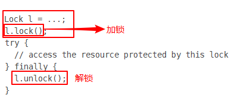
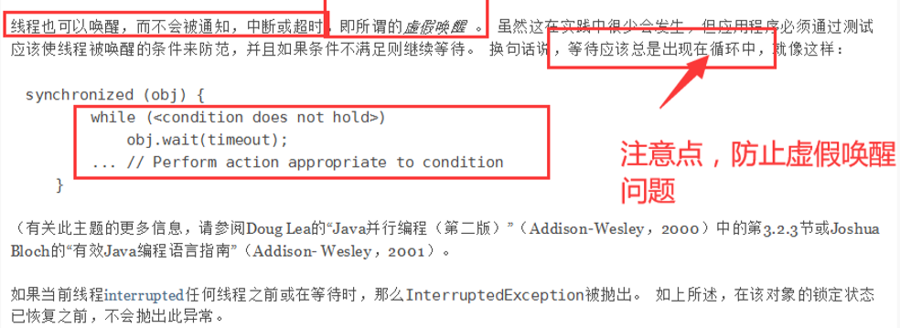

# JUC并发编程 

## 1、线程和进程

**线程**与进程相似，但线程是一个比进程更小的执行单位（是进程划分成的更小的运行单位）。与进程不同的是同类的多个线程共享同一块内存空间和一组系统资源，所以系统在产生一个线程，或是在各个线程之间作切换工作时，负担要比进程小得多，也正因为如此，线程也被称为**轻量级进程**。

**进程**在其执行的过程中可以产生多个线程。

**区别**：

- 进程是程序的一次执行过程，是系统运行程序的基本单位，因此**进程是动态的**。系统运行一个程序即是一个进程从创建，运行到消亡的过程。
- 一个进程就是一个执行中的程序，它在计算机中一个指令接着一个指令地执行着，同时，每个进程还占有某些系统资源如 CPU 时间，内存空间，文件，输入输出设备的使用权等等。换句话说，当程序在执行时，将会被操作系统载入内存中。 
- 线程和进程大的不同在于基本上**各进程是独立的，而各线程则不一定**，因为==同一进程中的线程极有可能会相互影响==。
- 从另一角度来说，进程属于操作系统的范畴，主要是同一段时间内，可以同时执行一个以上的程序，而线程则是在同一程序内几乎同时执行一个以上的程序段。


​	简述：线程与进程相似，进程系统运行程序的基本单位，而线程是进程划分成的更小的运行单位。线程和进程大的不同在于基本上**各进程是独立的，而各线程则不一定**，因为==同一进程中的线程极有可能会相互影响==。


**Java 真的可以开启线程吗？** 

答：开不了   原因：

```java
public synchronized void start() {
    /**
     * This method is not invoked for the main method thread or "system"
     * group threads created/set up by the VM. Any new functionality added
     * to this method in the future may have to also be added to the VM.
     *
     * A zero status value corresponds to state "NEW".
     */
    if (threadStatus != 0)
        throw new IllegalThreadStateException();

    /* Notify the group that this thread is about to be started
     * so that it can be added to the group's list of threads
     * and the group's unstarted count can be decremented. */
    group.add(this);

    boolean started = false;
    try {
        start0();
        started = true;
    } finally {
        try {
            if (!started) {
                group.threadStartFailed(this);
            }
        } catch (Throwable ignore) {
            /* do nothing. If start0 threw a Throwable then
              it will be passed up the call stack */
        }
    }
}
// 本地方法，底层的C++ ，Java 无法直接操作硬件 
private native void start0();
```


> 并发、并行

并发编程：并发、并行
并发（多线程操作同一个资源）

- CPU 一核 ，模拟出来多条线程，天下武功，唯快不破，快速交替

并行（多个人一起行走）

- CPU 多核 ，多个线程可以同时执行； 线程池

```java
package com.baven.demo
    
public class Test {
    public static void main(String[] args) {
        // 获取cpu的核数        
        // CPU 密集型，IO密集型 
        System.out.println(Runtime.getRuntime().availableProcessors()); 
    }
}
```

得出，我目前的雷神电脑只有：8线程


> 线程有几个状态

```java
public enum State {    
    // 新生    
    NEW,
    
    // 运行    
    RUNNABLE,
    
    // 阻塞    
    BLOCKED,
    
    // 等待，死死地等    
    WAITING,
    
    // 超时等待    
    TIMED_WAITING,
    
    // 终止    
    TERMINATED; 
}

```


>wait/sleep 区别

**1、来自不同的类** 

wait => Object
sleep => Thread 

在公司中一般都不用，用TimeUtil，在JUC包中

**2、关于锁的释放** 

`sleep()`方法导致了程序暂停执行指定的时间，让出cpu该其他线程，但是他的监控状态依然保持者，当 指定的时间到了又会自动恢复运行状态。在调用sleep()方法的过程中，线程不会释放对象锁.

调用`wait()`方法的时候，线程会放弃对象锁，进入等待此对象的等待锁定池，只有针对此对象调用 notify()方法后本线程才进入对象锁定池准备，获取对象锁进入运行状态。

**3、使用的范围是不同的** 

wait：必须在Synchronize同步代码块中

sleep：任何地方都可以

**4、是否需要捕获异常**
wait   不需要捕获异常 

sleep 必须要捕获异常 


## 2、Lock锁（重点）

> 传统 Synchronized


>Lock 接口



`ReentrantLock`可重入锁（常用）

`FairSync()`：十分公平：可以先来后到 

`NoFairSync()`：十分不公平：可以插队**（默认）**


使用Lock三部曲

```java
// Lock三部曲 
// 1、new ReentrantLock(); 
// 2、lock.lock(); 					// 加锁 
// 3、finally=>  lock.unlock();		// 解锁 
```


> Synchronized  和 Lock 区别

1. Synchronized  内置的Java关键字，  Lock 是一个Java类 
2. Synchronized  无法判断获取锁的状态，Lock  可以判断是否获取到了锁
3. Synchronized  会自动释放锁，lock 必须要手动释放锁！如果不释放锁，死锁
4. Synchronized  线程 1（获得锁，阻塞），线程2（等待，傻傻的等）；Lock锁就不一定会等待
5. Synchronized  可重入锁，不可以中断的，非公平；Lock ，可重入锁，可以判断锁，非公平（可以自己设置）
6. Synchronized  适合锁**少量**的代码同步问题，Lock  适合锁**大量**的同步代码

==面试会问==


> 什么是锁，如何判断锁的是谁？


## 3、生产者和消费者问题 

面试要手写的：单例模式、排序算法、生产者和消费者、死锁


> 生产者和消费者问题 Synchronized   版

例子中，在Synchronized下的判断为if，会出现问题 --虚假唤醒



**解决问题**：将if判断改为while判断


> JUC版的生产者和消费者问题


**任何一个新的技术，绝对不是仅仅只是覆盖了原来的技术，优势和补充！**

> Condition 精准的通知和唤醒线程


