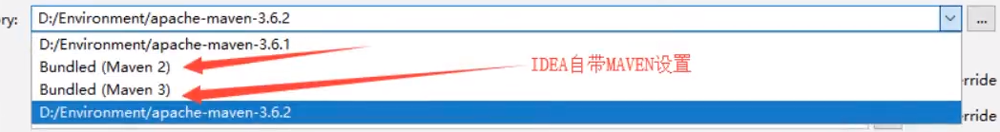

# JavaWeb

Java  Web

## 1、基本概念

### 1.1、前言 

web开发：

- web，网页的意思 ， www.baidu.com

- 静态web

  - html，css
  - 提供给所有有人看的数据始终不会发生变化

- 动态web

  - 淘宝，几乎所有的网站
  - 提供给所有人看到的数据始终会发生变化，每个人在不同的时间，不同的地点看到的信息各不相同
  - 技术线：Servlet/Jsp， Asp，PHP

  在Java中，动态web资源开发的技术统称为JavaWeb

### 1.2、web应用程序

web应用程序：可以提供浏览器访问的程序

- a.html、b.html ····· 多个web资源，这些web资源

- 你们能访问到的任何一个页面或者资源，都存在于这个世界的某一个角落的计算机上。

- URL

- 这个统一的web资源会被放在同一个文件下，web应用程序-->Tomcat：服务器

- 一个web应用由多部分组成（静态web，动态web）

  - html，css，js
  - jsp，servlet
  - Java程序
  - jar包
  - 配置文件（Properties）

  web应用程序编写完毕后，若想提供给外界访问：需要一个服务器来用以管理

### 1.3、静态web

- *.htm, *.html，这些都是网页的后缀，如果服务器上一直存在这些东西，我们就可以直接进行读取。通络：

OPIMRRE]R}H3.png)

- 静态web存在的缺点
  - web页面无法动态更新，所有用户看到都是同一个页面
    - 轮播图，点击特效：伪动态
    - JavaScript[实际开发中，它用的最多]
    - VBScript
  - 它无法和数据库交互（数据无法持久化，用户无法交互）

### 1.4、动态web

页面会动态展示：“Web的页面展示的效果因人而异”


缺点

- 假如服务器的动态web资源出现了错误，我需要重新编写我们的**后台程序**，重新发布
  - 停机发布

优点

- web页面可以动态更新，所有用户看到都是同一个页面
- 它可以与数据库交互（数据持久化：注册，商品信息，用户信息···）


## 2、web服务器

### 2.1、技术讲解

**ASP：**

- 微软：国内最早流行的就是ASP
- 在HTML中嵌入了VB的脚本，ASP + COM
- 在ASP开发中，基本一个页面都有几千行的业务代码，页面及其混乱
- 维护成本高
- C#
- IIS


**PHP：**

- PHP开发速度很快，功能很强大，跨平台，代码很简单（70%）
- 无法承载大访问量的情况（局限性）


**JSP/Servlet：**

B/S：浏览器和服务器

C/S：客户端和服务端

- sun公司主推的B/S架构
- 基于Java语言的（所有的大公司，或者一些开源的组件，都是用Java写的）
- 可以承载三高问题带来的影响
- 语法像ASP，ASP-->JSP，加强市场竞争力

...


### 2.2、web服务器

服务器是一种被动的操作，用来处理用户的一些请求的给用户一些响应信息


**IIS**

微软的；ASP...,windows中自带的

**Tomcat**


面向百度编程；

Tomcat是Apache 软件基金会（Apache Software Foundation）的Jakarta 项目中的一个核心项目，最新的Servlet 和JSP 规范总是能在Tomcat 中得到体现，因为Tomcat 技术先进、性能稳定，而且**免费**，因而深受Java 爱好者的喜爱并得到了部分软件开发商的认可，成为目前比较流行的Web 应用服务器。

Tomcat 服务器是一个免费的开放源代码的Web 应用服务器，属于轻量级应用[服务器](https://baike.baidu.com/item/服务器)，在中小型系统和并发访问用户不是很多的场合下被普遍使用，是开发和调试JSP 程序的首选。对于一个初学者来说，它是最佳的选择

Tomcat 实际上运行JSP 页面和Servlet。目前Tomcat最新版本为**10.0.0-M4。**

....

**工作3-5年之后，可以尝试手写Tomcat服务器**

下载Tomcat：

1. 安装or 解压
2. 了解配置文件及目录结构
3. 这个东西的作用


## 3、Tomcat

### 3.1、安装Tomcat

Tomcat官网： https://tomcat.apache.org/


下载完，进行文件解压即可使用


### 3.2、Tomcat启动和配置

文件夹作用


**启动。关闭Tomcat**


**访问测试：**http://localhost:8080/

可能遇到的问题：

1. Java环境变量没有配置
2. 闪退问题：需要配置兼容性
3. 乱码问题：配置文件中设置

### 3.3、配置


可以配置启动的端口号

Tomcat的默认端口号为：8080

myslq：3306

http：80

https：443

```xml
<Connector port="8081" protocol="HTTP/1.1"
           connectionTimeout="20000"
           redirectPort="8443" />
```

可以配置主机的名称

- 默认的主机名为：localhost ->127.0.0.1
- 默认的网站应用存放的位置为：webapps

```xml
<Host name="www.bufeng.com" appBase="webapps"
      unpackWARs="true" autoDeploy="true">
</Host>
```

**高难度面试题：**

请你谈一谈网站是如何进行访问的

1. 输入一个域名，然后回车

2. 检查本机的：C:\Windows\System32\drivers\etc\hosts配置文件下有没有这个域名映射

   1. 有：直接返回对应的IP地址

      ```java
      127.0.0.1    www.bufeng.com
      ```

   2. 没有：去DNS服务器找，找到的话就返回，找不到就返回找不到

      

   4. 可以配置一下环境变量（可选性）

### 3.4、发布一个web网站

不会就像模仿

- 将自己写的网站，放大服务器（Tomcat）中指定的web应用的文件夹（webapps）下，就可以访问了网站应该有的结构

  ```java
  --webapps : Tomcat服务器的web目录
      -Root
      -bufengstudy ： 网站的目录名
      	- WEB-INF
      		-classes ： java程序
      		-lib：web应用所依赖的jar包
      		-web.xml ： 网站配置文件
      	-index.html 默认的首页
      	- static
      		-css
      			-style.css
      		-js
      		-img
      	-.....
  ```

  

   

HTTP协议：面试

Maven：构建工具

- Maven安装包

Servlet入门

- HelloWorld！
- Servlet配置
- 原理


## 4、HTTP

### 4.1、什么是HTTP

HTTP（超文本传输协议）是一个简单的请求-响应协议，它通常运行在TCP之上。

- 文本：html，字符串，。。。
- 超文本：图片，音乐，视频，定位，地图。。。
- 80

Https：安全的

- 443

### 4.2、两个时代

- http1.0
  - HTTP/1.0：客户端可以与web服务器连接后，只能获得一个web资源，再断开连接
- http2.0
  - HTTP/1.1：客户端可以与web服务器连接后，可以获得多个web资源。

### 4.3、HTTP请求

- 客户端---发请求（Request）---服务器

百度：

```java
Request URL:https://www.baidu.com/   请求地址
Request Method:GET   get方法/post方法
Status COde:200 OK   状态码：200
Remote(远程) Address:14.215.177.39:443 
```

```java
Accept: text/html
Accept-Encoding: gzip, deflate, br
Accept-Language: zh-CN,zh;q=0.9   语言
Cache-Control: max-age=0
Connection: keep-alive
```

#### 1、请求行

- 请求行中的请求方式：GET
- 请求方式：Get/Post，HEAD，DELETE，PUT，TRACT...
  - get：请求能够携带的参数比较小，大小有限制，会在浏览器的URL地址栏显示数据内容，不安全，但高效
  - post：请求能够携带的参数没有限制，大小没有限制，不会在浏览器的URL地址栏显示数据内容，安全，但不高效

#### 2、消息头

```java
Accep：告诉浏览器，他所支持的数据类型
Accept-Encoding：支持哪种编写格式  GBK UTF-8 GB2312 ISO8859-1
Accept-Language：告诉浏览器，它的语言环境
Cache-Control：缓存控制
Connection：告诉浏览器，请求完成是断开还是保持连接
HOST：主机.../.
```


### 4.4、HTTP响应

- 服务器---响应---客户端

百度：

```java
Cache-Control: private       缓存控制
Connection: keep-alive		 连接
Content-Encoding: gzip       编码
Content-Type: text/html 	 类型
```

#### 1、响应体

```java
Accep：告诉浏览器，他所支持的数据类型
Accept-Encoding：支持哪种编写格式  GBK UTF-8 GB2312 ISO8859-1
Accept-Language：告诉浏览器，它的语言环境
Cache-Control：缓存控制
Connection：告诉浏览器，请求完成是断开还是保持连接
HOST：主机.../.
Refresh：告诉客户端，多久刷新一次
Location：让网页重新定位    
```

#### 2、响应状态码

200：请求响应成功

3**：请求重定向

- 重定向：你重新到我给你的新位子去

4**：找不到资源   404

- 资源不存在

5**：服务器代码错误  500    502：网关错误


**常见面试题：**

当你的浏览器中地址栏输入地址并回车的一瞬间到页面能够展示回来，经历了什么？


## 5、Maven

**为什么要学习这个技术？**

1. 在Javaweb开发中，需要使用大量的jar包，我们手动去导入

2. 如何能够让一个东西自动帮导入和配置这个jar包。

   由此，Maven诞生了！


#### 5.1、Maven项目架构管理工具

目前用来就是方便导入jar包的

Maven的可信思想：**约定大于配置**

- 有约束，不要去违反

Maven会规定好你该如何去编写我们的Java代码，必须按照这个规范来

#### 5.2、下载安装Maven

官网：https://maven.apache.org/


下载完成后，解压即可：

友情建议：电脑上的所有环境都放在一个文件夹下，方便管理


#### 5.3、配置环境变量

在我们的系统环境变量中

配置如下配置：

- M2_HOME   maven目录下的bin目录
- MAVEN_HOME    maven的目录
- 在系统的path中配置   %MAVEN_HOME%\bin

   

  测试Maven是否安装成功，保证必须配置完毕


#### 5.4、阿里云镜像

- 镜像：mirrors
  
  - 作用：加速我们的下载
  
- 国内建议使用阿里云的镜像

   打开maven目录下的conf中的setting.xml文件查找mirrors添加以下

   ```xml
   <mirror>
    <id>nexus-aliyun</id>
    <mirrorOf>*,!jeecg,!jeecg-snapshots</mirrorOf>
 <name>Nexus aliyun</name>
    <url>http://maven.aliyun.com/nexus/content/groups/public/</url>
   </mirror>
   ```

#### 5.5、本地仓库

在本地的仓库，也有远程仓库；

在maven包内，新建一个maven-repo文件夹

以下**地址为这个包的地址**

**建立一个本地仓库：**localRepository

打开maven目录下的conf中的setting.xml文件查找localrepository添加以下

```xml
<localRepository>D:\Software\environments\apache-maven-3.6.3\maven-repo</localRepository>
```


#### 5.6、在IDEA中使用Maven

1. 启动IDEA

2. 创建一个MavenWeb项目

   勾选模板的Maven

   

   

   

   

   

3. 等待项目初始化完毕

   

   

4. 观察maven仓库中多了什么东西？

5. IDEA中的Maven设置

   注意：IDEA项目创建成功后，看一眼Maven的配置

   

6. 到这里，Maven在IDEA中的配置和使用就OK了


#### 5.7、创建一个普通的Maven项目

   不勾选模板


 这个只有在Web应用系才会有


#### 5.8、标记文件夹功能


**与上作用相同，二选一**


#### 5.9、在IDEA中配置Tomcat


解决警告问题

必须要的配置：**为什么会有这个问题：我们访问一个网站，需要指定一个文件夹名字；**


启动Tomcat


#### 5.10、pom文件

pom.xml 是Maven的核心配置文件


maven由于他的约定大于配置，我们之后可能遇到我们写的配置文件，无法被到处或者生效的问题

解决方案：在

```xml
<!-- 在build中配置resources，来防止我们资源到处失败的问题-->
<build>
    <resources>
        <resource>
            <directory>src/main/resources</directory>
            <includes>
                <include>**/*.properties</include>
                <include>**/*.xml</include>
            </includes>
            <filtering>true</filtering>
        </resource>
        <resource>
            <directory>src/main/java</directory>
            <includes>
                <include>**/*.properties</include>
                <include>**/*.xml</include>
            </includes>
            <filtering>true</filtering>
        </resource>
    </resources>
</build>
```

#### 5.11、IDEA操作


#### 5.12、解决遇到的问题

1. Maven3.6.2

   解决方法：降级为3.6.1

   

2. 每次打开IDEA，版本会被maven被动调到1.5版本java

   解决方法：在maven的setting中200行左右添加

   ```xml
   <profile>
       <id>jdk-1.8</id>
       <activation>
           <activeByDefault>true</activeByDefault>
           <jdk>1.8</jdk>
       </activation>
       <properties>
           <maven.compiler.source>1.8</maven.compiler.source>
           <maven.compiler.target>1.8</maven.compiler.target>
           <maven.compiler.compilerVersion>1.8</maven.compiler.compilerVersion>
       </properties>
   </profile>
   ```

3. Tomcat闪退

4. IDEA中每次都要重复配置Maven

5. Maven项目中Tomcat无法配置

   


