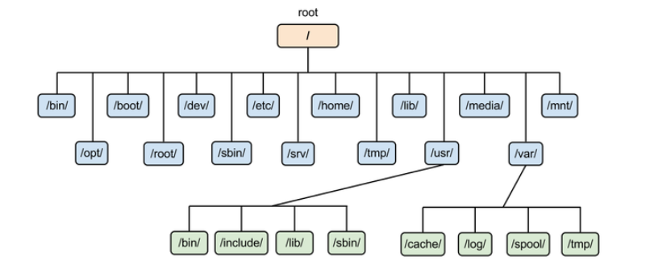
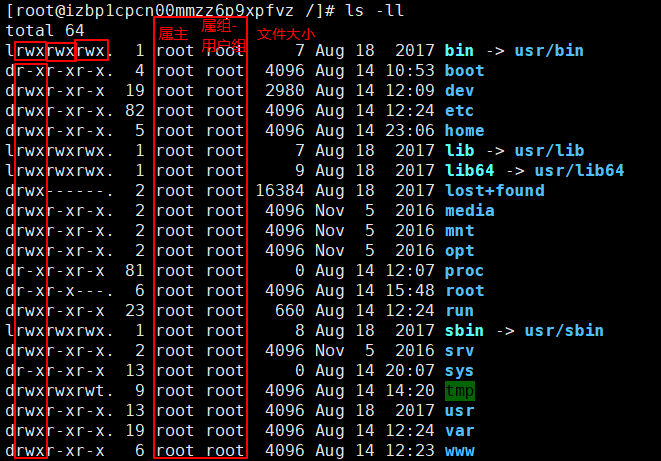
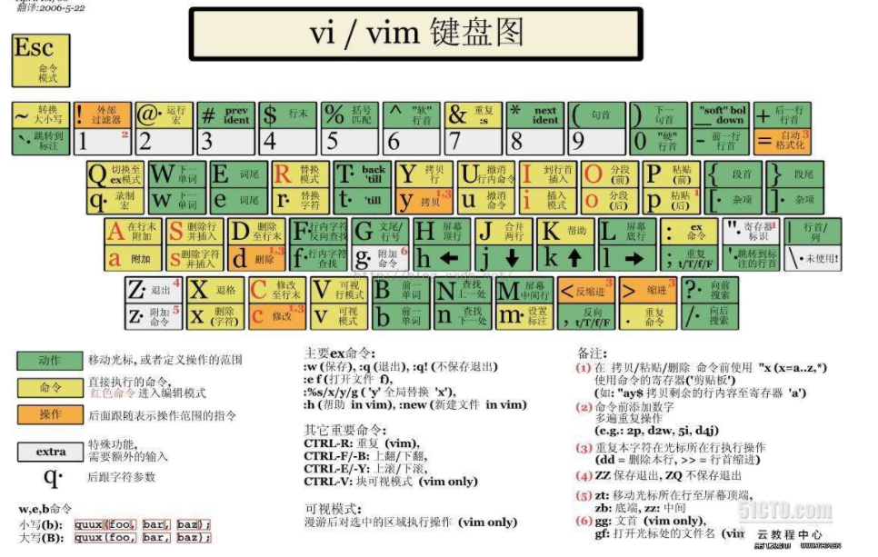
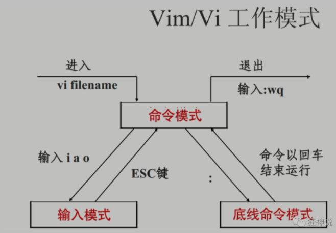
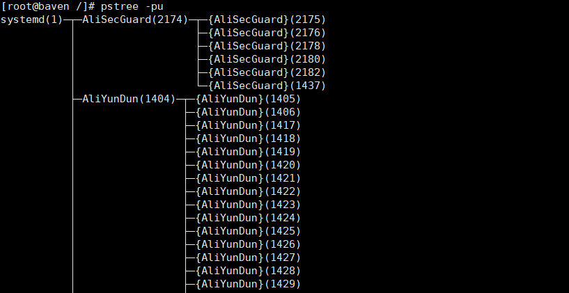
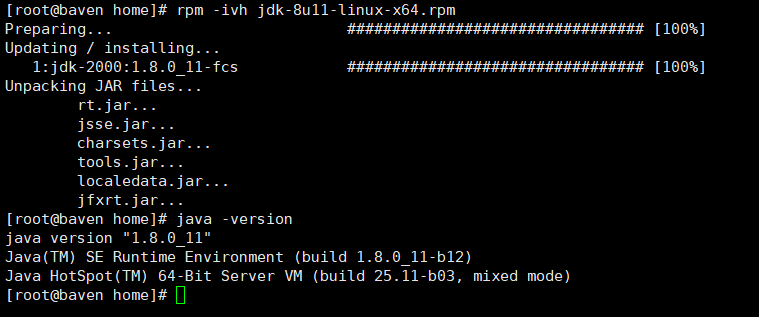

# Linux

阿里云服务器

vnc密码：6618aA	实例密码：1132126618aqAQ

在xshell中用户名登入是：root


宝塔面板

外网面板地址: http://116.62.172.184:8888/0f0b360a
内网面板地址: http://172.31.171.152:8888/0f0b360a
username: xg22prmj
password: 647069c1


## 走进Linux系统

输入没有返回错误就代表操作成功。没有消息就是好消息。

> 开机登入

开机会启动许多程序。它们在windows叫做“服务”（service），在Linux就叫做“守护进程”（daemon）。

开机成功后，他会显示一个文本登入界面，这个界面就是我们经常看到的登入界面，在这个登入界面中会提示用户输入用户名，而用户输入的用户将作为参数传给login程序来验证用户的身份，密码是不显示的，输完回车即可。

一般来说，用户的登入方式有三种：

- 命令行登入
- ssh登入
- 图形界面登入

最高权限账户为root，可以操作一切


>关机

在linux领域内大多用在服务器上，很少遇到关机的操作。毕竟服务器上跑一个服务是永无止境的，除非特殊情况下，不得已才会关机。

关机指令为：shutdown；

```bash
sync				# 将数据由内存同步到硬盘中（关机前确保数据不丢失使用）

shutdown			# 是最常用也是最安全的关机和重启命令，它会在关机之前调用fsck检查磁盘，其中-h和-r是最常用的参数：
	-h：			   # 停止系统服务并关机
	-r：  		   # 停止系统服务后重启

例子：
shutdown -h now 	# 立即关机
shutdown -h 10:53 	# 到10:53关机，如果该时间小于当前时间，则到隔天
shutdown -h +10 	# 10分钟后自动关机
shutdown -r now 	# 立即重启
shutdown -r +30 'The System Will Reboot in 30 Mins' # 30分钟后重启并并发送通知给其它在线用户
shutdown -c 		# 取消重启或关机

reboot 				# 表示立即重启，效果等同于shutdown -r now

poweroff			# 表示立即关机，效果等同于shutdown -h now，在多用户模式下(Run Level 3）不建议使用。

halt 				# 不理会目前系统状况下，进行硬件关机，一般不建议使用。相同shutdown -h now 和 poweroff
```

总结：不管是重启系统还是关闭系统，首先要运行 **sync** 命令，把内存中的数据写到磁盘中。


> 系统目录结构

1、一切皆文件

2、根目录 / ，所有的文件都挂载在这个根目录下

登入系统后，在当前命令窗口下输入命令：

```bash
ls /    # 查看当前目录下的文件
```

会看到此结果：


树状目录结构：



**以下是对这些目录的解释：**

- /root，存放root用户的相关文件

- /home，==存放普通用户的相关文件==

- /bin，存放常用命令的目录，如vi，su

- /sbin，要具有一定权限才可以使用命令

- /mnt，默认挂载光驱和软驱的目录

- /etc，==存放配置的相关文件==
- /lib，这个目录存放着系统最基本的动态连接共享库，其作用类似于windows里的DLL文件。（不要动）

- /var，存放经常变化的文件，如网络连接的sock文件 、日志

- /boot，存放引导系统启动的相关文件（不要动）
- /lost+found，这个目录一般情况下是空的，当系统非法关机后，这里就存放了一些文件（存放突然关机的一些文件）

- /usr，==安装一个软件的默认目录，相当于windows下的program files==
- /usr/bin，系统用户使用的应用程序。
- /usr/sbin，超级用户使用的比较高级的管理程序和系统守护程序。
- /usr/src，内核源代码默认的放置目录

- /proc，这个目录是一个虚拟的目录，它是系统内存的映射，访问这个目录来获取系统信息（不用管）

- srv ，service缩写。该目录存放一些服务启动之后需要提取的数据

- /sys，这是linux2.6内核的一个很大的变化，该目录下安装了2.6内核中新出现的一个文件系统

- /tmp，==这个目录是用来存放一些临时文件的==（用完即丢的文件）

- /del，类似于windows的设备管理器，把所有的硬件用文件的形式存储

- /media，系统提供该目录是为了让用户临时挂载别的文件系统的，我们可以将外部的存储挂载在/mnt/上，然后进入该目录就可以查看里面的内容了。

- /opt，==这是给主机额外安装软件所摆放，如安装oracle数据库就可放到该目录下默认为空。==

- /selinux，是一种安全子系统，它能控制程序只能访问特定文件。

- ==/www，存放服务器网站相关的资源，环境，网站的项目==（在服务器才有）

  


## 常用的基本命令

### 目录管理

> 绝对路径和相对路径

我们知道Linux的目录结构为树状结构，最顶级的目录为根目录 /。

其他目录通过挂载可以将它们添加到树中，通过解除挂载可以移除它们。

在开始本教程前我们需要先知道什么是绝对路径与相对路径。

**绝对路径：**

路径的写法，由根目录 / 写起，例如：/usr/share/doc 这个目录。

**相对路径：**

路径的写法，不是由 / 写起，例如由 /usr/share/doc 要到 /usr/share/man 底下时，可以写成：cd ../man 这就是相对路径的写法

 ./ ：当前目录

cd .. ：返回上一级


> 处理目录的常用命令

接下来我们就来看几个常见的处理目录的命令吧：

- ls: 列出目录
- cd：切换目录
- pwd：显示目前的目录
- mkdir：创建一个新的目录
- rmdir：删除一个空的目录
- cp: 复制文件或目录
- rm: 移除文件或目录
- mv: 移动文件与目录，或修改文件与目录的名称

你可以使用 *man [命令]* 来查看各个命令的使用文档，如 ：man cp。


> ls （列出目录）

在Linux系统当中， ls 命令可能是最常被运行的。

语法：

```bash
[root@www ~]# ls [-aAdfFhilnrRSt] 目录名称
```

选项与参数：

- -a ：全部的文件，连同隐藏文件( 开头为 . 的文件) 一起列出来(常用)
- -l ：长数据串列出，包含文件的属性与权限等等数据；(常用)

所有Linux可以组合使用

将目录下的所有文件列出来(含属性与隐藏档)

```bash
[root@www ~]# ls -al ~
```


> cd （切换目录）

cd是Change Directory的缩写，这是用来变换工作目录的命令。

语法：

```bash
cd [相对路径或绝对路径]
```

测试：

```bash
# 切换到用户目录下
[root@kuangshen /]# cd home  

# 使用 mkdir 命令创建 kuangstudy 目录
[root@kuangshen home]# mkdir kuangstudy

# 进入 kuangstudy 目录
[root@kuangshen home]# cd kuangstudy

# 回到上一级
[root@kuangshen kuangstudy]# cd ..

# 回到根目录
[root@kuangshen kuangstudy]# cd /

# 表示回到自己的家目录，亦即是 /root 这个目录
[root@kuangshen kuangstudy]# cd ~
```

接下来大家多操作几次应该就可以很好的理解 cd 命令的。


> pwd ( 显示目前所在的目录 )

pwd 是 **Print Working Directory** 的缩写，也就是显示目前所在目录的命令。

```bash
[root@kuangshen kuangstudy]#pwd [-P]
```

选项与参数：**-P** ：显示出确实的路径，而非使用连接(link) 路径。

测试：

```bash
# 单纯显示出目前的工作目录
[root@kuangshen ~]# pwd
/root

# 如果是链接，要显示真实地址，可以使用 -P参数
[root@kuangshen /]# cd bin
[root@kuangshen bin]# pwd -P
/usr/bin
```


> mkdir （创建新目录）

如果想要创建新的目录的话，那么就使用mkdir (make directory)吧。

```bash
mkdir [-mp] 目录名称
```

选项与参数：

- -m ：配置文件的权限喔！直接配置，不需要看默认权限 (umask) 的脸色～
- -p ：帮助你直接将所需要的目录(包含上一级目录)递归创建起来！

测试：

```bash
# 进入我们用户目录下
[root@kuangshen /]# cd /home

# 创建一个 test 文件夹
[root@kuangshen home]# mkdir test

# 创建多层级目录
[root@kuangshen home]# mkdir test1/test2/test3/test4
mkdir: cannot create directory ‘test1/test2/test3/test4’:
No such file or directory  # <== 没办法直接创建此目录啊！

# 加了这个 -p 的选项，可以自行帮你创建多层目录！
[root@kuangshen home]# mkdir -p test1/test2/test3/test4

# 创建权限为 rwx--x--x 的目录。
[root@kuangshen home]# mkdir -m 711 test2
[root@kuangshen home]# ls -l
drwxr-xr-x 2 root root  4096 Mar 12 21:55 test
drwxr-xr-x 3 root root  4096 Mar 12 21:56 test1
drwx--x--x 2 root root  4096 Mar 12 21:58 test2
```


> rmdir ( 删除空的目录 )

语法：

```bash
rmdir [-p] 目录名称
```

选项与参数：**-p ：**连同上一级『空的』目录也一起删除

测试：

```bash
# 看看有多少目录存在？
[root@kuangshen home]# ls -l
drwxr-xr-x 2 root root  4096 Mar 12 21:55 test
drwxr-xr-x 3 root root  4096 Mar 12 21:56 test1
drwx--x--x 2 root root  4096 Mar 12 21:58 test2

# 可直接删除掉，没问题
[root@kuangshen home]# rmdir test

# 因为尚有内容，所以无法删除！
[root@kuangshen home]# rmdir test1
rmdir: failed to remove ‘test1’: Directory not empty

# 利用 -p 这个选项，立刻就可以将 test1/test2/test3/test4 依次删除。
[root@kuangshen home]# rmdir -p test1/test2/test3/test4
```

注意：这个 rmdir 仅能删除空的目录，你可以使用 rm 命令来删除非空目录


> cp ( 复制文件或目录 )

语法：

```bash
[root@www ~]# cp [-adfilprsu] 来源档(source) 目标档(destination)
[root@www ~]# cp [options] source1 source2 source3 .... directory
```

选项与参数：

- **-a：**相当於 -pdr 的意思，至於 pdr 请参考下列说明；(常用)
- **-p：**连同文件的属性一起复制过去，而非使用默认属性(备份常用)；
- **-d：**若来源档为连结档的属性(link file)，则复制连结档属性而非文件本身；
- **-r：**递归持续复制，用於目录的复制行为；(常用)
- **-f：**为强制(force)的意思，若目标文件已经存在且无法开启，则移除后再尝试一次；
- **-i：**若目标档(destination)已经存在时，在覆盖时会先询问动作的进行(常用)
- **-l：**进行硬式连结(hard link)的连结档创建，而非复制文件本身。
- **-s：**复制成为符号连结档 (symbolic link)，亦即『捷径』文件；
- **-u：**若 destination 比 source 旧才升级 destination ！

测试：

```bash
# 找一个有文件的目录，我这里找到 root目录
[root@kuangshen home]# cd /root
[root@kuangshen ~]# ls
install.sh
[root@kuangshen ~]# cd /home

# 复制 root目录下的install.sh 到 home目录下
[root@kuangshen home]# cp /root/install.sh /home
[root@kuangshen home]# ls
install.sh

# 再次复制，加上-i参数，增加覆盖询问？
[root@kuangshen home]# cp -i /root/install.sh /home
cp: overwrite ‘/home/install.sh’? y # n不覆盖，y为覆盖
```


> rm ( 移除文件或目录 )

语法：

```bash
rm [-fir] 文件或目录
```

选项与参数：

- -f ：就是 force 的意思，忽略不存在的文件，不会出现警告信息；也就是强制删除
- -i ：互动模式，在删除前会询问使用者是否动作
- -r ：递归删除啊！最常用在目录的删除了！这是非常危险的选项！！！

测试：

```bash
# 将刚刚在 cp 的实例中创建的 install.sh删除掉！
[root@kuangshen home]# rm -i install.sh
rm: remove regular file ‘install.sh’? y
# 如果加上 -i 的选项就会主动询问喔，避免你删除到错误的档名！

# 尽量不要在服务器上使用 rm -rf /
```


> mv  ( 移动文件与目录，或修改名称 )

语法：

```bash
[root@www ~]# mv [-fiu] source destination
[root@www ~]# mv [options] source1 source2 source3 .... directory
```

选项与参数：

- -f ：force 强制的意思，如果目标文件已经存在，不会询问而直接覆盖；
- -i ：若目标文件 (destination) 已经存在时，就会询问是否覆盖！
- -u ：若目标文件已经存在，且 source 比较新，才会升级 (update)

测试：

```bash
# 复制一个文件到当前目录
[root@kuangshen home]# cp /root/install.sh /home

# 创建一个文件夹 test
[root@kuangshen home]# mkdir test

# 将复制过来的文件移动到我们创建的目录，并查看
[root@kuangshen home]# mv install.sh test
[root@kuangshen home]# ls
test
[root@kuangshen home]# cd test
[root@kuangshen test]# ls
install.sh

# 将文件夹重命名，然后再次查看！
[root@kuangshen test]# cd ..
[root@kuangshen home]# mv test mvtest
[root@kuangshen home]# ls
mvtest
```


### 基本属性

> 看懂文件属性

Linux系统是一种典型的多用户系统，不同的用户处于不同的地位，拥有不同的权限。为了保护系统的安全性，Linux系统对不同的用户访问同一文件（包括目录文件）的权限做了不同的规定。

在Linux中我们可以使用`ll`或者`ls –l`命令来显示一个文件的属性以及文件所属的用户和组，如：



实例中，boot文件的第一个属性用"d"表示。"d"在Linux中代表该文件是一个目录文件。

在Linux中第一个字符代表这个文件是目录、文件或链接文件等等：

- 当为[ **d** ]则是目录
- 当为[ **-** ]则是文件；
- 若是[ **l** ]则表示为链接文档 ( link file )；
- 若是[ **b** ]则表示为装置文件里面的可供储存的接口设备 ( 可随机存取装置 )；
- 若是[ **c** ]则表示为装置文件里面的串行端口设备，例如键盘、鼠标 ( 一次性读取装置 )。

接下来的字符中，以三个为一组，且均为『rwx』 的三个参数的组合。

其中，[ r ]代表可读(read)、[ w ]代表可写(write)、[ x ]代表可执行(execute)。

要注意的是，这三个权限的位置不会改变，如果没有权限，就会出现减号[ - ]而已。

每个文件的属性由左边第一部分的10个字符来确定（如下图）：


从左至右用0-9这些数字来表示。

第0位确定文件类型，第1-3位确定属主（该文件的所有者）拥有该文件的权限。第4-6位确定属组（所有者的同组用户）拥有该文件的权限，第7-9位确定其他用户拥有该文件的权限。

其中：

第1、4、7位表示读权限，如果用"r"字符表示，则有读权限，如果用"-"字符表示，则没有读权限；

第2、5、8位表示写权限，如果用"w"字符表示，则有写权限，如果用"-"字符表示没有写权限；

第3、6、9位表示可执行权限，如果用"x"字符表示，则有执行权限，如果用"-"字符表示，则没有执行权限。

对于文件来说，它都有一个特定的所有者，也就是对该文件具有所有权的用户。

同时，在Linux系统中，用户是按组分类的，一个用户属于一个或多个组。

文件所有者以外的用户又可以分为文件所有者的同组用户和其他用户。

因此，Linux系统按文件所有者、文件所有者同组用户和其他用户来规定了不同的文件访问权限。

在以上实例中，boot 文件是一个目录文件，属主和属组都为 root。


> 修改文件属性

**1、chgrp：更改文件属组**

```
chgrp [-R] 属组名 文件名
```

-R：递归更改文件属组，就是在更改某个目录文件的属组时，如果加上-R的参数，那么该目录下的所有文件的属组都会更改。

**2、chown：更改文件属主，也可以同时更改文件属组**

```
chown [–R] 属主名 文件名
chown [-R] 属主名：属组名 文件名
```

**3、==chmod：更改文件9个属性（必须要掌握）==**

```
chmod [-R] xyz 文件或目录
```

Linux文件属性有两种设置方法，一种是数字（常用的数字），一种是符号。

Linux文件的基本权限就有九个，分别是owner/group/others三种身份各有自己的read/write/execute权限。

先复习一下刚刚上面提到的数据：文件的权限字符为：『-rwxrwxrwx』， 这九个权限是三个三个一组的！其中，我们可以使用数字来代表各个权限，各权限的分数对照表如下：

```
r:4     w:2         x:1
```

每种身份(owner/group/others)各自的三个权限(r/w/x)分数是需要累加的，例如当权限为：[-rwxrwx---] 分数则是：

- owner = rwx = 4+2+1 = 7
- group = rwx = 4+2+1 = 7
- others= --- = 0+0+0 = 0

```
chmod 770 filename
```


### 文件内容查看

> 概述

Linux系统中使用以下命令来查看文件的内容：

- cat      由第一行开始显示文件内容

- tac      从最后一行开始显示，可以看出 tac 是 cat 的倒着写！

  

- nl        显示的时候，顺道输出行号！（常用）

  

- more  一页一页的显示文件内容，带（空格代表翻页，enter代表向下看一行，:f 行号）
- ==less     与more 类似，但是比 more 更好的是，他可以往前翻页！（上下键翻页，退出q命令，查找字符串 `/要查找的字符串`向下查询，向上查询用`？要查找的字符串n`，n代表寻找下一个，N上一个）==
- head  只看头几行 通过 -n 参数来控制显示几行  `head -n 20 文件名`
- tail     只看尾巴几行，相同head

你可以使用 *man [命令]*来查看各个命令的使用文档，如 ：man cp。

网络配置目录：`cd/etc/sysconfig/network-scripts`

ifconfig：查看网络配置


> cat 由第一行开始显示文件内容

语法：

```
cat [-AbEnTv]
```

选项与参数：

- -A ：相当於 -vET 的整合选项，可列出一些特殊字符而不是空白而已；
- -b ：列出行号，仅针对非空白行做行号显示，空白行不标行号！
- -E ：将结尾的断行字节 $ 显示出来；
- -n ：列印出行号，连同空白行也会有行号，与 -b 的选项不同；
- -T ：将 [tab] 按键以 ^I 显示出来；
- -v ：列出一些看不出来的特殊字符

测试：

```bash
# 查看网络配置: 文件地址 /etc/sysconfig/network-scripts/
[root@kuangshen ~]# cat /etc/sysconfig/network-scripts/ifcfg-eth0
DEVICE=eth0
BOOTPROTO=dhcp
ONBOOT=yes
```


> tac

tac与cat命令刚好相反，文件内容从最后一行开始显示，可以看出 tac 是 cat 的倒着写！如：

```bash
[root@kuangshen ~]# tac /etc/sysconfig/network-scripts/ifcfg-eth0
ONBOOT=yes
BOOTPROTO=dhcp
DEVICE=eth0
```


> nl  显示行号

语法：

```bash
nl [-bnw] 文件
```

选项与参数：

- -b ：指定行号指定的方式，主要有两种：-b a ：表示不论是否为空行，也同样列出行号(类似 cat -n)；-b t ：如果有空行，空的那一行不要列出行号(默认值)；
- -n ：列出行号表示的方法，主要有三种：-n ln ：行号在荧幕的最左方显示；-n rn ：行号在自己栏位的最右方显示，且不加 0 ；-n rz ：行号在自己栏位的最右方显示，且加 0 ；
- -w ：行号栏位的占用的位数。

测试：

```bash
[root@kuangshen ~]# nl /etc/sysconfig/network-scripts/ifcfg-eth0
1DEVICE=eth0
2BOOTPROTO=dhcp
3ONBOOT=yes
```


> more  一页一页翻动

在 more 这个程序的运行过程中，你有几个按键可以按的：

- 空白键 (space)：代表向下翻一页；
- Enter   ：代表向下翻『一行』；
- /字串   ：代表在这个显示的内容当中，向下搜寻『字串』这个关键字；
- :f    ：立刻显示出档名以及目前显示的行数；
- q    ：代表立刻离开 more ，不再显示该文件内容。
- b 或 [ctrl]-b ：代表往回翻页，不过这动作只对文件有用，对管线无用。

```bash
[root@kuangshen etc]# more /etc/csh.login
....(中间省略)....
--More--(28%) # 重点在这一行喔！你的光标也会在这里等待你的命令
```


> less  一页一页翻动，以下实例输出/etc/man.config文件的内容：

less运行时可以输入的命令有：

- 空白键  ：向下翻动一页；
- [pagedown]：向下翻动一页；
- [pageup] ：向上翻动一页；
- /字串  ：向下搜寻『字串』的功能；
- ?字串  ：向上搜寻『字串』的功能；
- n   ：重复前一个搜寻 (与 / 或 ? 有关！)
- N   ：反向的重复前一个搜寻 (与 / 或 ? 有关！)
- q   ：离开 less 这个程序；

```bash
[root@kuangshen etc]# more /etc/csh.login
....(中间省略)....
:   # 这里可以等待你输入命令！
```


> head  取出文件前面几行

语法：

```bash
head [-n number] 文件
```

选项与参数：**-n** 后面接数字，代表显示几行的意思！

默认的情况中，显示前面 10 行！若要显示前 20 行，就得要这样：

```bash
[root@kuangshen etc]# head -n 20 /etc/csh.login
```


> tail  取出文件后面几行

语法：

```bash
tail [-n number] 文件
```

选项与参数：

- -n ：后面接数字，代表显示几行的意思

默认的情况中，显示最后 10 行！若要显示最后 20 行，就得要这样：

```bash
[root@kuangshen etc]# tail -n 20 /etc/csh.login
```


> 拓展：Linux 链接概念（了解即可）

Linux 链接分两种，一种被称为硬链接（Hard Link），另一种被称为符号链接（Symbolic Link）。

情况下，**ln** 命令产生硬链接。

**硬连接**

硬连接指通过索引节点来进行连接。在 Linux 的文件系统中，保存在磁盘分区中的文件不管是什么类型都给它分配一个编号，称为索引节点号(Inode Index)。在 Linux 中，多个文件名指向同一索引节点是存在的。比如：A 是 B 的硬链接（A 和 B 都是文件名），则 A 的目录项中的 inode 节点号与 B 的目录项中的 inode 节点号相同，即一个 inode 节点对应两个不同的文件名，两个文件名指向同一个文件，A 和 B 对文件系统来说是完全平等的。删除其中任何一个都不会影响另外一个的访问。

硬连接的作用是允许一个文件拥有多个有效路径名，这样用户就可以建立硬连接到重要文件，以防止“误删”的功能。其原因如上所述，因为对应该目录的索引节点有一个以上的连接。只删除一个连接并不影响索引节点本身和其它的连接，只有当最后一个连接被删除后，文件的数据块及目录的连接才会被释放。也就是说，文件真正删除的条件是与之相关的所有硬连接文件均被删除。

**软连接**

另外一种连接称之为符号连接（Symbolic Link），也叫软连接。软链接文件有类似于 Windows 的快捷方式。它实际上是一个特殊的文件。在符号连接中，文件实际上是一个文本文件，其中包含的有另一文件的位置信息。比如：A 是 B 的软链接（A 和 B 都是文件名），A 的目录项中的 inode 节点号与 B 的目录项中的 inode 节点号不相同，A 和 B 指向的是两个不同的 inode，继而指向两块不同的数据块。但是 A 的数据块中存放的只是 B 的路径名（可以根据这个找到 B 的目录项）。A 和 B 之间是“主从”关系，如果 B 被删除了，A 仍然存在（因为两个是不同的文件），但指向的是一个无效的链接。

**测试：**

```bash
[root@kuangshen /]# cd /home
[root@kuangshen home]# touch f1 # 创建一个测试文件f1
[root@kuangshen home]# ls
f1
[root@kuangshen home]# ln f1 f2     # 创建f1的一个硬连接文件f2
[root@kuangshen home]# ln -s f1 f3   # 创建f1的一个符号连接文件f3
[root@kuangshen home]# ls -li       # -i参数显示文件的inode节点信息
397247 -rw-r--r-- 2 root root     0 Mar 13 00:50 f1
397247 -rw-r--r-- 2 root root     0 Mar 13 00:50 f2
397248 lrwxrwxrwx 1 root root     2 Mar 13 00:50 f3 -> f1
```

从上面的结果中可以看出，硬连接文件 f2 与原文件 f1 的 inode 节点相同，均为 397247，然而符号连接文件的 inode 节点不同。

```bash
# echo 字符串输出 >> f1 输出到 f1文件
[root@kuangshen home]# echo "I am f1 file" >>f1
[root@kuangshen home]# cat f1
I am f1 file
[root@kuangshen home]# cat f2
I am f1 file
[root@kuangshen home]# cat f3
I am f1 file
[root@kuangshen home]# rm -f f1
[root@kuangshen home]# cat f2
I am f1 file
[root@kuangshen home]# cat f3
cat: f3: No such file or directory
```

通过上面的测试可以看出：当删除原始文件 f1 后，硬连接 f2 不受影响，但是符号连接 f1 文件无效；

依此您可以做一些相关的测试，可以得到以下全部结论：

- 删除符号连接f3,对f1,f2无影响；
- 删除硬连接f2，对f1,f3也无影响；
- 删除原文件f1，对硬连接f2没有影响，导致符号连接f3失效；
- 同时删除原文件f1,硬连接f2，整个文件会真正的被删除。


### Vim编辑器

> 什么是Vim编辑器

Vim是从 vi 发展出来的一个文本编辑器。代码补完、编译及错误跳转等方便编程的功能特别丰富，在程序员中被广泛使用。

简单的来说， vi 是老式的字处理器，不过功能已经很齐全了，但是还是有可以进步的地方。

vim 则可以说是程序开发者的一项很好用的工具。

所有的 Unix Like 系统都会内建 vi 文书编辑器，其他的文书编辑器则不一定会存在。

连 vim 的官方网站 (http://www.vim.org) 自己也说 vim 是一个程序开发工具而不是文字处理软件。



> 三种使用模式

基本上 vi/vim 共分为三种模式，分别是**命令模式（Command mode）**，**输入模式（Insert mode）**和**底线命令模式（Last line mode）**。这三种模式的作用分别是：

**==命令模式：==**

用户刚刚启动 vi/vim，便进入了命令模式。

此状态下敲击键盘动作会被Vim识别为命令，而非输入字符。比如我们此时按下i，并不会输入一个字符，i被当作了一个命令。

以下是常用的几个命令：

- **i** 切换到输入模式，以输入字符。
- **x** 删除当前光标所在处的字符。
- **:** 切换到底线命令模式，以在最底一行输入命令。如果是编辑模式，需要先退出编辑模式（ESC）

若想要编辑文本：启动Vim，进入了命令模式，按下i，切换到输入模式。

命令模式只有一些最基本的命令，因此仍要依靠底线命令模式输入更多命令。

**==输入模式：==**

在命令模式下按下i就进入了输入模式。

在输入模式中，可以使用以下按键：

- **字符按键以及Shift组合**，输入字符
- **ENTER**，回车键，换行
- **BACK SPACE**，退格键，删除光标前一个字符
- **DEL**，删除键，删除光标后一个字符
- **方向键**，在文本中移动光标
- **HOME**/**END**，移动光标到行首/行尾
- **Page Up**/**Page Down**，上/下翻页
- **Insert**，切换光标为输入/替换模式，光标将变成竖线/下划线
- **ESC**，退出输入模式，切换到命令模式

**==底线命令模式==**

在命令模式下按下:（英文冒号）就进入了底线命令模式。

底线命令模式可以输入单个或多个字符的命令，可用的命令非常多。

在底线命令模式中，基本的命令有（已经省略了冒号）：

- q 退出程序
- w 保存文件

一起使用wq

按ESC键可随时退出底线命令模式。

简单的说，我们可以将这三个模式想成底下的图标来表示：



> 上手体验一下，在home目录下测试

如果你想要使用 vi 来建立一个名为 kuangstudy.txt 的文件时，你可以这样做：

```bash
[root@kuangshen home]# vim kuangstudy.txt
```

然后就会进入文件


**按下 i 进入输入模式(也称为编辑模式)，开始编辑文字**

在一般模式之中，只要按下 i, o, a 等字符就可以进入输入模式了！

在编辑模式当中，你可以发现在左下角状态栏中会出现 –INSERT- 的字样，那就是可以输入任意字符的提示。

这个时候，键盘上除了 **Esc** 这个按键之外，其他的按键都可以视作为一般的输入按钮了，所以你可以进行任何的编辑。


**按下 ESC 按钮回到一般模式**

好了，假设我已经按照上面的样式给他编辑完毕了，那么应该要如何退出呢？是的！没错！就是给他按下 **Esc** 这个按钮即可！马上你就会发现画面左下角的 – INSERT – 不见了！

在一般模式中按下 **:wq** 储存后离开 vim！

成功创建了一个 kuangstudy.txt 的文件。


> Vim 按键说明

除了上面简易范例的 i, Esc, :wq 之外，其实 vim 还有非常多的按键可以使用。

**第一部分：一般模式可用的光标移动、复制粘贴、搜索替换等**

| 移动光标的方法     |                                                              |
| :----------------- | ------------------------------------------------------------ |
| h 或 向左箭头键(←) | 光标向左移动一个字符                                         |
| j 或 向下箭头键(↓) | 光标向下移动一个字符                                         |
| k 或 向上箭头键(↑) | 光标向上移动一个字符                                         |
| l 或 向右箭头键(→) | 光标向右移动一个字符                                         |
| [Ctrl] + [f]       | 屏幕『向下』移动一页，相当于 [Page Down]按键 (常用)          |
| [Ctrl] + [b]       | 屏幕『向上』移动一页，相当于 [Page Up] 按键 (常用)           |
| [Ctrl] + [d]       | 屏幕『向下』移动半页                                         |
| [Ctrl] + [u]       | 屏幕『向上』移动半页                                         |
| +                  | 光标移动到非空格符的下一行                                   |
| -                  | 光标移动到非空格符的上一行                                   |
| n< space>          | 那个 n 表示『数字』，例如 20 。按下数字后再按空格键，光标会向右移动这一行的 n 个字符。 |
| 0 或功能键[Home]   | 这是数字『 0 』：移动到这一行的最前面字符处 (常用)           |
| $ 或功能键[End]    | 移动到这一行的最后面字符处(常用)                             |
| H                  | 光标移动到这个屏幕的最上方那一行的第一个字符                 |
| M                  | 光标移动到这个屏幕的中央那一行的第一个字符                   |
| L                  | 光标移动到这个屏幕的最下方那一行的第一个字符                 |
| G                  | 移动到这个档案的最后一行(常用)                               |
| nG                 | n 为数字。移动到这个档案的第 n 行。例如 20G 则会移动到这个档案的第 20 行(可配合 :set nu) |
| gg                 | 移动到这个档案的第一行，相当于 1G 啊！(常用)                 |
| n< Enter>          | n 为数字。光标向下移动 n 行(常用)                            |


| 搜索替换 |                                                              |
| :------- | ------------------------------------------------------------ |
| /word    | 向光标之下寻找一个名称为 word 的字符串。例如要在档案内搜寻 vbird 这个字符串，就输入 /vbird 即可！(常用) |
| ?word    | 向光标之上寻找一个字符串名称为 word 的字符串。               |
| n        | 这个 n 是英文按键。代表重复前一个搜寻的动作。举例来说， 如果刚刚我们执行 /vbird 去向下搜寻 vbird 这个字符串，则按下 n 后，会向下继续搜寻下一个名称为 vbird 的字符串。如果是执行 ?vbird 的话，那么按下 n 则会向上继续搜寻名称为 vbird 的字符串！ |
| N        | 这个 N 是英文按键。与 n 刚好相反，为『反向』进行前一个搜寻动作。例如 /vbird 后，按下 N 则表示『向上』搜寻 vbird 。 |


| 删除、复制与粘贴 |                                                              |
| :--------------- | ------------------------------------------------------------ |
| x, X             | 在一行字当中，x 为向后删除一个字符 (相当于 [del] 按键)， X 为向前删除一个字符(相当于 [backspace] 亦即是退格键) (常用) |
| nx               | n 为数字，连续向后删除 n 个字符。举例来说，我要连续删除 10 个字符， 『10x』。 |
| dd               | 删除游标所在的那一整行(常用)                                 |
| ndd              | n 为数字。删除光标所在的向下 n 行，例如 20dd 则是删除 20 行 (常用) |
| d1G              | 删除光标所在到第一行的所有数据                               |
| dG               | 删除光标所在到最后一行的所有数据                             |
| d$               | 删除游标所在处，到该行的最后一个字符                         |
| d0               | 那个是数字的 0 ，删除游标所在处，到该行的最前面一个字符      |
| yy               | 复制游标所在的那一行(常用)                                   |
| nyy              | n 为数字。复制光标所在的向下 n 行，例如 20yy 则是复制 20 行(常用) |
| y1G              | 复制游标所在行到第一行的所有数据                             |
| yG               | 复制游标所在行到最后一行的所有数据                           |
| y0               | 复制光标所在的那个字符到该行行首的所有数据                   |
| y$               | 复制光标所在的那个字符到该行行尾的所有数据                   |
| p, P             | p 为将已复制的数据在光标下一行贴上，P 则为贴在游标上一行！举例来说，我目前光标在第 20 行，且已经复制了 10 行数据。则按下 p 后， 那 10 行数据会贴在原本的 20 行之后，亦即由 21 行开始贴。但如果是按下 P 呢？那么原本的第 20 行会被推到变成 30 行。(常用) |
| J                | 将光标所在行与下一行的数据结合成同一行                       |
| c                | 重复删除多个数据，例如向下删除 10 行，[ 10cj ]               |
| u                | 复原前一个动作。(常用)                                       |
| [Ctrl]+r         | 重做上一个动作。(常用)                                       |


**第二部分：一般模式切换到编辑模式的可用的按钮说明**

| 进入输入或取代的编辑模式 |                                                              |
| :----------------------- | ------------------------------------------------------------ |
| i, I                     | 进入输入模式(Insert mode)：i 为『从目前光标所在处输入』， I 为『在目前所在行的第一个非空格符处开始输入』。(常用) |
| a, A                     | 进入输入模式(Insert mode)：a 为『从目前光标所在的下一个字符处开始输入』， A 为『从光标所在行的最后一个字符处开始输入』。(常用) |
| o, O                     | 进入输入模式(Insert mode)：这是英文字母 o 的大小写。o 为『在目前光标所在的下一行处输入新的一行』；O 为在目前光标所在处的上一行输入新的一行！(常用) |
| r, R                     | 进入取代模式(Replace mode)：r 只会取代光标所在的那一个字符一次；R会一直取代光标所在的文字，直到按下 ESC 为止；(常用) |
| [Esc]                    | 退出编辑模式，回到一般模式中(常用)                           |


**第三部分：一般模式切换到指令行模式的可用的按钮说明**

| 指令行的储存、离开等指令                                     |                                                              |
| :----------------------------------------------------------- | ------------------------------------------------------------ |
| :w                                                           | 将编辑的数据写入硬盘档案中(常用)                             |
| :w!                                                          | 若文件属性为『只读』时，强制写入该档案。不过，到底能不能写入， 还是跟你对该档案的档案权限有关啊！ |
| :q                                                           | 离开 vi (常用)                                               |
| :q!                                                          | 若曾修改过档案，又不想储存，使用 ! 为强制离开不储存档案。    |
| 注意一下啊，那个惊叹号 (!) 在 vi 当中，常常具有『强制』的意思～ |                                                              |
| :wq                                                          | 储存后离开，若为 :wq! 则为强制储存后离开 (常用)              |
| ZZ                                                           | 这是大写的 Z 喔！若档案没有更动，则不储存离开，若档案已经被更动过，则储存后离开！ |
| :w [filename]                                                | 将编辑的数据储存成另一个档案（类似另存新档）                 |
| :r [filename]                                                | 在编辑的数据中，读入另一个档案的数据。亦即将 『filename』 这个档案内容加到游标所在行后面 |
| :n1,n2 w [filename]                                          | 将 n1 到 n2 的内容储存成 filename 这个档案。                 |
| :! command                                                   | 暂时离开 vi 到指令行模式下执行 command 的显示结果！例如 『:! ls /home』即可在 vi 当中看 /home 底下以 ls 输出的档案信息！ |
| :set nu                                                      | 显示行号，设定之后，会在每一行的前缀显示该行的行号           |
| :set nonu                                                    | 与 set nu 相反，为取消行号！                                 |


### 账号管理

> 简介

Linux系统是一个多用户多任务的分时操作系统，任何一个要使用系统资源的用户，都必须首先向系统管理员申请一个账号，然后以这个账号的身份进入系统。

用户的账号一方面可以帮助系统管理员对使用系统的用户进行跟踪，并控制他们对系统资源的访问；另一方面也可以帮助用户组织文件，并为用户提供安全性保护。

每个用户账号都拥有一个唯一的用户名和各自的口令。

用户在登录时键入正确的用户名和口令后，就能够进入系统和自己的主目录。

实现用户账号的管理，要完成的工作主要有如下几个方面：

- 用户账号的添加、删除与修改。
- 用户口令的管理。
- 用户组的管理。


> 用户账号的管理

用户账号的管理工作主要涉及到用户账号的添加、修改和删除。

添加用户账号就是在系统中创建一个新账号，然后为新账号分配用户号、用户组、主目录和登录Shell等资源。


> 添加账号 useradd

```
useradd 选项 用户名
```

参数说明：

- 选项 :

- - -c comment 指定一段注释性描述。
  - -d 目录 指定用户主目录，如果此目录不存在，则同时使用-m选项，可以创建主目录。
  - -g 用户组 指定用户所属的用户组。
  - -G 用户组，用户组 指定用户所属的附加组。
  - ==-m==　使用者目录如不存在则自动建立。
  - -s Shell文件 指定用户的登录Shell。
  - -u 用户号 指定用户的用户号，如果同时有-o选项，则可以重复使用其他用户的标识号。

- 用户名 :

- - 指定新账号的登录名。

测试：

```bash
# 此命令创建了一个用户kuangshen，其中-m选项用来为登录名kuangshen产生一个主目录 /home/kuangshen
[root@kuangshen home]# useradd -m kuangshen
```

增加用户账号就是在/etc/passwd文件中为新用户增加一条记录，同时更新其他系统文件如/etc/shadow, /etc/group等。


> 删除帐号

如果一个用户的账号不再使用，可以从系统中删除。

删除用户账号就是要将/etc/passwd等系统文件中的该用户记录删除，必要时还删除用户的主目录。

删除一个已有的用户账号使用userdel命令，其格式如下：

```
userdel 选项 用户名
```

常用的选项是 **-r**，它的作用是把用户的主目录一起删除。

```bash
[root@kuangshen home]# userdel -r kuangshen
```

此命令删除用户kuangshen在系统文件中（主要是/etc/passwd, /etc/shadow, /etc/group等）的记录，同时删除用户的主目录。


> Linux下如何切换用户

1.切换用户的命令为：su username 【username是你的用户名哦】

2.从普通用户切换到root用户，还可以使用命令：sudo su

3.在终端输入exit或logout或使用快捷方式ctrl+d，可以退回到原来用户，其实ctrl+d也是执行的exit命令

4.在切换用户时，如果想在切换用户之后使用新用户的工作环境，可以在su和username之间加-，例如：【su - root】

$表示普通用户

\#表示超级用户，也就是root用户

hostname查看主机名

修改 hostname baven 然后重新连接即可


> 修改帐号

修改用户账号就是根据实际情况更改用户的有关属性，如用户号、主目录、用户组、登录Shell等。

修改已有用户的信息使用usermod命令，其格式如下：

```
usermod 选项 用户名
```

常用的选项包括-c, -d, -m, -g, -G, -s, -u以及-o等，这些选项的意义与useradd命令中的选项一样，可以为用户指定新的资源值。

例如：

```bash
# usermod -s /bin/ksh -d /home/z –g developer kuangshen
```

此命令将用户kuangshen的登录Shell修改为ksh，主目录改为/home/z，用户组改为developer。

修改完毕之后查看配置文件即可


> 用户口令的管理

用户管理的一项重要内容是用户口令的管理。用户账号刚创建时没有口令，但是被系统锁定，无法使用，必须为其指定口令后才可以使用，即使是指定空口令。

指定和修改用户口令的Shell命令是passwd。超级用户可以为自己和其他用户指定口令，普通用户只能用它修改自己的口令。

命令的格式为：

```
passwd 选项 用户名
```

可使用的选项：

- -l 锁定口令，即禁用账号。
- -u 口令解锁。
- -d 使账号无口令。
- -f 强迫用户下次登录时修改口令。

如果默认用户名，则修改当前用户的口令。

例如，假设当前用户是kuangshen，则下面的命令修改该用户自己的口令：

```bash
$ passwd
Old password:******
New password:*******
Re-enter new password:*******
```

如果是超级用户，可以用下列形式指定任何用户的口令：

```bash
# passwd kuangshen
New password:*******
Re-enter new password:*******
```

普通用户修改自己的口令时，passwd命令会先询问原口令，验证后再要求用户输入两遍新口令，如果两次输入的口令一致，则将这个口令指定给用户；而超级用户为用户指定口令时，就不需要知道原口令。

为了系统安全起见，用户应该选择比较复杂的口令，例如最好使用8位长的口令，口令中包含有大写、小写字母和数字，并且应该与姓名、生日等不相同。

为用户指定空口令时，执行下列形式的命令：没有密码可不能登入

```bash
# passwd -d kuangshen
```

此命令将用户 kuangshen的口令删除，这样用户 kuangshen下一次登录时，系统就不再允许该用户登录了。

passwd 命令还可以用 -l(lock) 选项锁定某一用户，使其不能登录，例如：

```bash
# passwd -l kuangshen
```


### 用户组管理

每个用户都有一个用户组，系统可以对一个用户组中的所有用户进行集中管理。不同Linux 系统对用户组的规定有所不同，如Linux下的用户属于与它同名的用户组，这个用户组在创建用户时同时创建。

用户组的管理涉及用户组的添加、删除和修改。组的增加、删除和修改实际上就是对/etc/group文件的更新。


> 增加一个新的用户组使用groupadd命令

```bash
groupadd 选项 用户组
```

可以使用的选项有：

- -g GID 指定新用户组的组标识号（GID）。
- -o 一般与-g选项同时使用，表示新用户组的GID可以与系统已有用户组的GID相同。

实例1：

```bash
# groupadd group1
```

此命令向系统中增加了一个新组group1，新组的组标识号是在当前已有的最大组标识号的基础上加1。

查看 `cat /etc/group`即可看见刚才所创建的用户组

实例2：

```bash
# groupadd -g 101 group2
```

此命令向系统中增加了一个新组group2，同时指定新组的组标识号是101。


> 如果要删除一个已有的用户组，使用groupdel命令

```
groupdel 用户组
```

例如：

```bash
# groupdel group1
```

此命令从系统中删除组group1。


> 修改用户组的属性使用groupmod命令

```
groupmod 选项 用户组
```

常用的选项有：

- -g GID 为用户组指定新的组标识号。
- -o 与-g选项同时使用，用户组的新GID可以与系统已有用户组的GID相同。
- -n新用户组 将用户组的名字改为新名字

```bash
# 此命令将组group2的组标识号修改为102。
groupmod -g 102 group2

# 将组group2的标识号改为10000，组名修改为group3。
groupmod –g 10000 -n group3 group2
```


> 切换组

如果一个用户同时属于多个用户组，那么用户可以在用户组之间切换，以便具有其他用户组的权限。

用户可以在登录后，使用命令newgrp切换到其他用户组，这个命令的参数就是目的用户组。例如：

```bash
$ newgrp root
```

这条命令将当前用户切换到root用户组，前提条件是root用户组确实是该用户的主组或附加组。


> /etc/passwd

完成用户管理的工作有许多种方法，但是每一种方法实际上都是对有关的系统文件进行修改。

与用户和用户组相关的信息都存放在一些系统文件中，这些文件包括/etc/passwd, /etc/shadow, /etc/group等。

下面分别介绍这些文件的内容。

**/etc/passwd文件是用户管理工作涉及的最重要的一个文件。**

Linux系统中的每个用户都在/etc/passwd文件中有一个对应的记录行，它记录了这个用户的一些基本属性。

这个文件对所有用户都是可读的。它的内容类似下面的例子：

```bash
＃ cat /etc/passwd

root:x:0:0:Superuser:/:
daemon:x:1:1:System daemons:/etc:
bin:x:2:2:Owner of system commands:/bin:
sys:x:3:3:Owner of system files:/usr/sys:
adm:x:4:4:System accounting:/usr/adm:
uucp:x:5:5:UUCP administrator:/usr/lib/uucp:
auth:x:7:21:Authentication administrator:/tcb/files/auth:
cron:x:9:16:Cron daemon:/usr/spool/cron:
listen:x:37:4:Network daemon:/usr/net/nls:
lp:x:71:18:Printer administrator:/usr/spool/lp:
```

从上面的例子我们可以看到，/etc/passwd中一行记录对应着一个用户，每行记录又被冒号(:)分隔为7个字段，其格式和具体含义如下：

```bash
用户名:口令（登入密码，我们不可见）:用户标识号:组标识号:注释性描述:主目录:登录Shell
```

1. "用户名"是代表用户账号的字符串。

   通常长度不超过8个字符，并且由大小写字母和/或数字组成。登录名中不能有冒号(:)，因为冒号在这里是分隔符。

   为了兼容起见，登录名中最好不要包含点字符(.)，并且不使用连字符(-)和加号(+)打头。

2. “口令”一些系统中，存放着加密后的用户口令字。

   虽然这个字段存放的只是用户口令的加密串，不是明文，但是由于/etc/passwd文件对所有用户都可读，所以这仍是一个安全隐患。因此，现在许多Linux 系统（如SVR4）都使用了shadow技术，把真正的加密后的用户口令字存放到/etc/shadow文件中，而在/etc/passwd文件的口令字段中只存放一个特殊的字符，例如“x”或者“*”。

3. “用户标识号”是一个整数，系统内部用它来标识用户。

   一般情况下它与用户名是一一对应的。如果几个用户名对应的用户标识号是一样的，系统内部将把它们视为同一个用户，但是它们可以有不同的口令、不同的主目录以及不同的登录Shell等。

   通常用户标识号的取值范围是0～65 535。0是超级用户root的标识号，1～99由系统保留，作为管理账号，普通用户的标识号从100开始。在Linux系统中，这个界限是500。

4. “组标识号”字段记录的是用户所属的用户组。

   它对应着/etc/group文件中的一条记录。

5. “注释性描述”字段记录着用户的一些个人情况。

   例如用户的真实姓名、电话、地址等，这个字段并没有什么实际的用途。在不同的Linux 系统中，这个字段的格式并没有统一。在许多Linux系统中，这个字段存放的是一段任意的注释性描述文字，用作finger命令的输出。

6. “主目录”，也就是用户的起始工作目录。

   它是用户在登录到系统之后所处的目录。在大多数系统中，各用户的主目录都被组织在同一个特定的目录下，而用户主目录的名称就是该用户的登录名。各用户对自己的主目录有读、写、执行（搜索）权限，其他用户对此目录的访问权限则根据具体情况设置。

7. 用户登录后，要启动一个进程，负责将用户的操作传给内核，这个进程是用户登录到系统后运行的命令解释器或某个特定的程序，即Shell。

   Shell是用户与Linux系统之间的接口。Linux的Shell有许多种，每种都有不同的特点。常用的有sh(Bourne Shell), csh(C Shell), ksh(Korn Shell), tcsh(TENEX/TOPS-20 type C Shell), bash(Bourne Again Shell)等。

   系统管理员可以根据系统情况和用户习惯为用户指定某个Shell。如果不指定Shell，那么系统使用sh为默认的登录Shell，即这个字段的值为/bin/sh。

   用户的登录Shell也可以指定为某个特定的程序（此程序不是一个命令解释器）。

   利用这一特点，我们可以限制用户只能运行指定的应用程序，在该应用程序运行结束后，用户就自动退出了系统。有些Linux 系统要求只有那些在系统中登记了的程序才能出现在这个字段中。

8. 系统中有一类用户称为伪用户（pseudo users）。

   这些用户在/etc/passwd文件中也占有一条记录，但是不能登录，因为它们的登录Shell为空。它们的存在主要是方便系统管理，满足相应的系统进程对文件属主的要求。


常见的伪用户如下所示：

```
伪 用 户 含 义
bin 拥有可执行的用户命令文件
sys 拥有系统文件
adm 拥有帐户文件
uucp UUCP使用
lp lp或lpd子系统使用
nobody NFS使用
```


> /etc/shadow

**1、除了上面列出的伪用户外，还有许多标准的伪用户，例如：audit, cron, mail, usenet等，它们也都各自为相关的进程和文件所需要。**

由于/etc/passwd文件是所有用户都可读的，如果用户的密码太简单或规律比较明显的话，一台普通的计算机就能够很容易地将它破解，因此对安全性要求较高的Linux系统都把加密后的口令字分离出来，单独存放在一个文件中，这个文件是/etc/shadow文件。有超级用户才拥有该文件读权限，这就保证了用户密码的安全性。

**2、/etc/shadow中的记录行与/etc/passwd中的一一对应，它由pwconv命令根据/etc/passwd中的数据自动产生**

它的文件格式与/etc/passwd类似，由若干个字段组成，字段之间用":"隔开。这些字段是：

```
登录名:加密口令:最后一次修改时间:最小时间间隔:最大时间间隔:警告时间:不活动时间:失效时间:标志
```

1. "登录名"是与/etc/passwd文件中的登录名相一致的用户账号
2. "口令"字段存放的是加密后的用户口令字，长度为13个字符。如果为空，则对应用户没有口令，登录时不需要口令；如果含有不属于集合 { ./0-9A-Za-z }中的字符，则对应的用户不能登录。
3. "最后一次修改时间"表示的是从某个时刻起，到用户最后一次修改口令时的天数。时间起点对不同的系统可能不一样。例如在SCO Linux 中，这个时间起点是1970年1月1日。
4. "最小时间间隔"指的是两次修改口令之间所需的最小天数。
5. "最大时间间隔"指的是口令保持有效的最大天数。
6. "警告时间"字段表示的是从系统开始警告用户到用户密码正式失效之间的天数。
7. "不活动时间"表示的是用户没有登录活动但账号仍能保持有效的最大天数。
8. "失效时间"字段给出的是一个绝对的天数，如果使用了这个字段，那么就给出相应账号的生存期。期满后，该账号就不再是一个合法的账号，也就不能再用来登录了。


> /etc/group

用户组的所有信息都存放在/etc/group文件中。

将用户分组是Linux 系统中对用户进行管理及控制访问权限的一种手段。

每个用户都属于某个用户组；一个组中可以有多个用户，一个用户也可以属于不同的组。

当一个用户同时是多个组中的成员时，在/etc/passwd文件中记录的是用户所属的主组，也就是登录时所属的默认组，而其他组称为附加组。

用户要访问属于附加组的文件时，必须首先使用newgrp命令使自己成为所要访问的组中的成员。

用户组的所有信息都存放在/etc/group文件中。此文件的格式也类似于/etc/passwd文件，由冒号(:)隔开若干个字段，这些字段有：

```
组名:口令:组标识号:组内用户列表
```

1. "组名"是用户组的名称，由字母或数字构成。与/etc/passwd中的登录名一样，组名不应重复。

2. "口令"字段存放的是用户组加密后的口令字。一般Linux 系统的用户组都没有口令，即这个字段一般为空，或者是*。

3. "组标识号"与用户标识号类似，也是一个整数，被系统内部用来标识组。

4. "组内用户列表"是属于这个组的所有用户的列表/b]，不同用户之间用逗号(,)分隔。这个用户组可能是用户的主组，也可能是附加组。

   


### 磁盘管理

> 概述

Linux磁盘管理好坏直接关系到整个系统的性能问题。

Linux磁盘管理常用命令为 df、du。

- df ：列出文件系统的整体磁盘使用量
- du：检查磁盘空间使用量


> df

df命令参数功能：检查文件系统的磁盘空间占用情况。可以利用该命令来获取硬盘被占用了多少空间，目前还剩下多少空间等信息。

语法：

```
df [-ahikHTm] [目录或文件名]
```

选项与参数：

- -a ：列出所有的文件系统，包括系统特有的 /proc 等文件系统；
- -k ：以 KBytes 的容量显示各文件系统；
- -m ：以 MBytes 的容量显示各文件系统；
- -h ：以人们较易阅读的 GBytes, MBytes, KBytes 等格式自行显示；
- -H ：以 M=1000K 取代 M=1024K 的进位方式；
- -T ：显示文件系统类型, 连同该 partition 的 filesystem 名称 (例如 ext3) 也列出；
- -i ：不用硬盘容量，而以 inode 的数量来显示

测试：

```bash
# 将系统内所有的文件系统列出来！
# 在 Linux 底下如果 df 没有加任何选项
# 那么默认会将系统内所有的 (不含特殊内存内的文件系统与 swap) 都以 1 Kbytes 的容量来列出来！
[root@kuangshen /]# df
Filesystem     1K-blocks   Used Available Use% Mounted on
devtmpfs          889100       0    889100   0% /dev
tmpfs             899460     704    898756   1% /dev/shm
tmpfs             899460     496    898964   1% /run
tmpfs             899460       0    899460   0% /sys/fs/cgroup
/dev/vda1       41152812 6586736  32662368  17% /
tmpfs             179896       0    179896   0% /run/user/0
# 将容量结果以易读的容量格式显示出来
[root@kuangshen /]# df -h
Filesystem     Size Used Avail Use% Mounted on
devtmpfs       869M     0 869M   0% /dev
tmpfs           879M 708K 878M   1% /dev/shm
tmpfs           879M 496K 878M   1% /run
tmpfs           879M     0 879M   0% /sys/fs/cgroup
/dev/vda1       40G  6.3G   32G  17% /
tmpfs           176M     0 176M   0% /run/user/0
# 将系统内的所有特殊文件格式及名称都列出来
[root@kuangshen /]# df -aT
Filesystem     Type       1K-blocks   Used Available Use% Mounted on
sysfs         sysfs               0       0         0    - /sys
proc           proc                0       0         0    - /proc
devtmpfs       devtmpfs       889100       0    889100   0% /dev
securityfs     securityfs          0       0         0    - /sys/kernel/security
tmpfs         tmpfs          899460     708    898752   1% /dev/shm
devpts         devpts              0       0         0    - /dev/pts
tmpfs         tmpfs          899460     496    898964   1% /run
tmpfs         tmpfs          899460       0    899460   0% /sys/fs/cgroup
cgroup         cgroup              0       0         0    - /sys/fs/cgroup/systemd
pstore         pstore              0       0         0    - /sys/fs/pstore
cgroup         cgroup              0       0         0    - /sys/fs/cgroup/freezer
cgroup         cgroup              0       0         0    - /sys/fs/cgroup/cpuset
cgroup         cgroup              0       0         0    - /sys/fs/cgroup/hugetlb
cgroup         cgroup              0       0         0    - /sys/fs/cgroup/blkio
cgroup         cgroup              0       0         0    - /sys/fs/cgroup/net_cls,net_prio
cgroup         cgroup              0       0         0    - /sys/fs/cgroup/memory
cgroup         cgroup              0       0         0    - /sys/fs/cgroup/pids
cgroup         cgroup              0       0         0    - /sys/fs/cgroup/cpu,cpuacct
cgroup         cgroup              0       0         0    - /sys/fs/cgroup/devices
cgroup         cgroup              0       0         0    - /sys/fs/cgroup/perf_event
configfs       configfs            0       0         0    - /sys/kernel/config
/dev/vda1     ext4         41152812 6586748  32662356  17% /
systemd-1      -                   -       -         -    - /proc/sys/fs/binfmt_misc
mqueue         mqueue              0       0         0    - /dev/mqueue
debugfs       debugfs             0       0         0    - /sys/kernel/debug
hugetlbfs     hugetlbfs           0       0         0    - /dev/hugepages
tmpfs         tmpfs          179896       0    179896   0% /run/user/0
binfmt_misc   binfmt_misc         0       0         0    - /proc/sys/fs/binfmt_misc
```

```bash
# 将 /etc 底下的可用的磁盘容量以易读的容量格式显示

[root@kuangshen /]# df -h /etc
Filesystem     Size Used Avail Use% Mounted on
/dev/vda1       40G  6.3G   32G  17% /
```


> du

Linux du命令也是查看使用空间的，但是与df命令不同的是Linux du命令是对文件和目录磁盘使用的空间的查看，还是和df命令有一些区别的，这里介绍Linux du命令。

语法：

```
du [-ahskm] 文件或目录名称
```

选项与参数：

- -a ：列出所有的文件与目录容量，因为默认仅统计目录底下的文件量而已。
- -h ：以人们较易读的容量格式 (G/M) 显示；
- -s ：列出总量而已，而不列出每个各别的目录占用容量；
- -S ：不包括子目录下的总计，与 -s 有点差别。
- -k ：以 KBytes 列出容量显示；
- -m ：以 MBytes 列出容量显示；

测试：

```bash
# 只列出当前目录下的所有文件夹容量（包括隐藏文件夹）:
# 直接输入 du 没有加任何选项时，则 du 会分析当前所在目录的文件与目录所占用的硬盘空间。
[root@kuangshen home]# du
16./redis
8./www/.oracle_jre_usage  # 包括隐藏文件的目录
24./www
48.                        # 这个目录(.)所占用的总量
# 将文件的容量也列出来
[root@kuangshen home]# du -a
4./redis/.bash_profile
4./redis/.bash_logout    
....中间省略....
4./kuangstudy.txt # 有文件的列表了
48.
# 检查根目录底下每个目录所占用的容量
[root@kuangshen home]# du -sm /*
0/bin
146/boot
.....中间省略....
0/proc
.....中间省略....
1/tmp
3026/usr  # 系统初期最大就是他了啦！
513/var
2666/www
```

通配符 * 来代表每个目录。

与 df 不一样的是，du 这个命令其实会直接到文件系统内去搜寻所有的文件数据。


> 磁盘挂载与卸除

根文件系统之外的其他文件要想能够被访问，都必须通过“关联”至根文件系统上的某个目录来实现，此关联操作即为“挂载”，此目录即为“挂载点”,解除此关联关系的过程称之为“卸载”

Linux 的磁盘挂载使用mount命令，卸载使用umount命令。

磁盘挂载语法：

```
mount [-t 文件系统] [-L Label名] [-o 额外选项] [-n] 装置文件名 挂载点
```

测试：

```bash
# 将 /dev/hdc6 挂载到 /mnt/hdc6 上面！
[root@www ~]# mkdir /mnt/hdc6
[root@www ~]# mount /dev/hdc6 /mnt/hdc6
[root@www ~]# df
Filesystem           1K-blocks     Used Available Use% Mounted on
/dev/hdc6              1976312     42072   1833836   3% /mnt/hdc6
```

磁盘卸载命令 umount 语法：

```
umount [-fn] 装置文件名或挂载点
```

选项与参数：

- -f ：强制卸除！可用在类似网络文件系统 (NFS) 无法读取到的情况下；
- -n ：不升级 /etc/mtab 情况下卸除。

卸载/dev/hdc6

```bash
[root@www ~]# umount /dev/hdc6
```


### 进程管理

> 命令

**ps** 查看当前系统中正在执行的各种进程的信息

ps -xx：

- -a 显示当前终端运行的所有的进程信息
- -u 以用户的信息显示进程
- -x 显示后台运行的参数

```bash
# ps -aux 查看所有的进程
ps -aux|grep mysql # 查看mysql相关的进程
ps -aux|grep java
# |  在Linux这个叫做 管道符    A|B
#grep 查看文件中符合条件的自负床
```


**ps -ef**：可以查看到父进程的信息

```bash 
ps -ef|grep mysql   # 看父进程我们一般可以通过目录树结构来查看

pstree		#也可以用这个，这个看的非常清楚
	-p 显示父id
	-u 显示用户组
```




**结束进程**：杀掉进程，等价于window结束任务

```bash
kill -9 进程的id
```

但是，我们平时写的java代码死循环了，可以通过结束进程，杀进程


## 环境安装

安装软件一般有三种方式：

- rpm（jdk：在线发布一个SpringBoot项目）
- 解压（tomcat，启动并通过外网访问，发布网站）
- yum在先安装（docker：直接安装运行跑起来docker就可以）

### JDK安装

Linux jdk rpm：http://www.oracle.com/technetwork/java/javase/downloads/index.html

确保正确

```bash
# 安装java rpm
[root@kuangshen kuangshen]# rpm -ivh jdk-8u221-linux-x64.rpm

# 安装完成后配置环境变量 文件：/etc/profile
JAVA_HOME=/usr/java/jdk1.8.0_221-amd64
CLASSPATH=%JAVA_HOME%/lib:%JAVA_HOME%/jre/lib
PATH=$PATH:$JAVA_HOME/bin:$JAVA_HOME/jre/bin
export PATH CLASSPATH JAVA_HOME
# 保存退出

# 让新增的环境变量生效！
source /etc/profile

# 测试 java -version
[root@kuangshen java]# java -version
java version "1.8.0_221"
Java(TM) SE Runtime Environment (build 1.8.0_221-b11)
Java HotSpot(TM) 64-Bit Server VM (build 25.221-b11, mixed mode)
```



注意：==rmp可以不用配置环境变量==


> 卸载JDK

```bash
[root@kuangshen ~]# rpm -qa|grep jdk
jdk1.8.0_121-1.8.0_121-fcs.x86_64
# 卸载 -e --nodeps 强制删除
[root@kuangshen ~]# rpm -e --nodeps jdk1.8.0_121-1.8.0_121-fcs.x86_64
[root@kuangshen ~]# java -version
-bash: /usr/bin/java: No such file or directory  # OK
```


> 配置环境变量

配置环境变量：`/etc/profile`

```bash
JAVA_HOME=/usr/java/jdk1.8.0_11
LASSPATH=%JAVA_HOME%/lib;%JAVA_HOME%/jre/lib
PATH=$JAVA_HOME/bin:$JAVA_HOME/jre/bin
exprot PATH CLASSPATH JAVA_HOME
```

解压的需要配置环境变量，rpm的可以不用

让这个配置文件生效：`source /etc/profile`


### Tomcat安装（解压安装）

ssm打包为ssm war包就需要放到Timcat中运行

1、安装好了Java环境后我们可以测试下Tomcat！准备好Tomcat的安装包！

2、将文件移动到/usr/tomcat/下，并解压！

```bash
[root@kuangshen kuangshen]# mv apache-tomcat-9.0.22.tar.gz /usr
[root@kuangshen kuangshen]# cd /usr
[root@kuangshen usr]# ls
apache-tomcat-9.0.22.tar.gz
[root@kuangshen usr]# tar -zxvf apache-tomcat-9.0.22.tar.gz   # 解压
```

如果是zip格式的使用` unzip + 文件名 即可解压`，注意文件名是全称

3、运行Tomcat，进入bin目录，和我们以前在Windows下看的都是一样的

```bash
# 执行：startup.sh -->启动tomcat
# 执行：shutdown.sh -->关闭tomcat
./startup.sh
./shutdown.sh
```

进入到tomcat的bin文件目录执行以上


4、确保Linux的防火墙端口是开启的，如果是阿里云，需要保证阿里云的安全组是开放的！

```bash
# 查看firewall服务状态
systemctl status firewalld

# 开启、重启、关闭、firewalld.service服务
# 开启
service firewalld start
# 重启
service firewalld restart
# 关闭
service firewalld stop

# 查看防火墙规则
firewall-cmd --list-all    # 查看全部信息
firewall-cmd --list-ports  # 只看端口信息

# 开启端口
开端口命令：firewall-cmd --zone=public --add-port=80/tcp --permanent
重启防火墙：systemctl restart firewalld.service

命令含义：
--zone #作用域
--add-port=80/tcp  #添加端口，格式为：端口/通讯协议
--permanent   #永久生效，没有此参数重启后失效
```


### 安装Docker（yum安装）

> 基于 CentOS 7 安装

1. 官网安装参考手册：https://docs.docker.com/install/linux/docker-ce/centos/

2. 确定你是CentOS7及以上版本

   ```bash
   [root@192 Desktop]# cat /etc/redhat-release
   CentOS Linux release 7.2.1511 (Core)
   ```

3. yum安装gcc相关（需要确保 虚拟机可以上外网 ）

   ```bash
   yum -y install gcc
   yum -y install gcc-c++
   ```

4. 卸载旧版本

   ```bash
   yum -y remove docker docker-common docker-selinux docker-engine
   # 官网版本
   yum remove docker \
             docker-client \
             docker-client-latest \
             docker-common \
             docker-latest \
             docker-latest-logrotate \
             docker-logrotate \
             docker-engine
   ```

5. 安装需要的软件包

   ```bash
   yum install -y yum-utils device-mapper-persistent-data lvm2
   ```

6. 设置stable镜像仓库

   ```bash
   # 错误
   yum-config-manager --add-repo https://download.docker.com/linux/centos/docker-ce.repo
   ## 报错
   [Errno 14] curl#35 - TCP connection reset by peer
   [Errno 12] curl#35 - Timeout
   
   # 正确推荐使用国内的
   yum-config-manager --add-repo http://mirrors.aliyun.com/docker-ce/linux/centos/docker-ce.repo
   ```

7. 更新yum软件包索引

   ```bash
   yum makecache fast
   ```

8. 安装Docker CE

   ```bash
   yum -y install docker-ce docker-ce-cli containerd.io
   ```

9. 启动docker

   ```bash
   systemctl start docker
   ```

10. 测试

    ```bash
    docker version
    
    docker run hello-world
    
    docker images
    ```

    


