# Mybatis-20.5.16

环境：

- JDK1.8
- Mysql5.7
- maven 3.6.1
- IDEA

回顾

- JDBC
- Mysql
- Java基础
- Maven
- Junit 单元测试
- 

SSM框架：配置文件。最好的方式：看官网文档；


### 练习

- [x] 1. 先搭建好基础的Mybatis
- [x] 2. 完成增删改查操作
- [ ] 3. 使用map进行用户插入，和用户更新
- [ ] 4. 使用两种方法进行模糊查询
- [ ] 5. 对核心配置文件进行优化  属性外部配置
- [ ] 6. 实体类类别名
- [ ] 7. 用两种方式解决属性名和字段名不一致的问题
- [ ] 8. 添加两种日志
- [ ] 9. 对查询结果进行分页处理（两种方式）
- [ ] 10. 通过注解进行开发

- [ ] 11. 添加Lombok
- [ ] 12. 用student，teacher表进行多对一，一对多练习【重点】
- [ ] 13. 创建Blog表，进行动态sql练习
- [ ] 14. 动态练习，if, choose, where, set
- [ ] 15. 复习缓存机制

## 1、简介

### 1.1、什么是Mybatis


- MyBatis 是一款优秀的**持久层框架**
- 它支持自定义 SQL、存储过程以及高级映射。
- MyBatis 免除了几乎所有的 JDBC 代码以及设置参数和获取结果集的工作。
- MyBatis 可以通过简单的 XML 或注解来配置和映射原始类型、接口和 Java POJO（Plain Old Java Objects，普通老式 Java 对象）为数据库中的记录。
- MyBatis 本是[apache](https://baike.baidu.com/item/apache/6265)的一个开源项目[iBatis](https://baike.baidu.com/item/iBatis), 2010年这个项目由apache software foundation 迁移到了google code，并且改名为MyBatis 。
-  2013年11月迁移到Github。


如何获得Mybatis？

- maven仓库

~~~xml
<!-- https://mvnrepository.com/artifact/org.mybatis/mybatis -->
<dependency>
    <groupId>org.mybatis</groupId>
    <artifactId>mybatis</artifactId>
    <version>3.5.2</version>
</dependency>
~~~


- Github：https://github.com/mybatis/mybatis-3/releases
- 中文文档：https://github.com/tuguangquan/mybatis


### 1.2 持久化

数据持久化

- 持久化就是将程序的数据在持久状态和瞬时状态转化的过程
- 内存：**断电即失**
- 数据库(JDBC)，io文件持久化。
- 生活中：冷藏、罐头。

**为什么需要持久化？**

有一些对象，不能让他丢掉。

- 内存太贵了


### 1.3 持久层

Dao层，Service层，Controller层...

- 完成持久化工作的代码块
- 层的界限十分明显


### 1.4为什么需要Mybatis

- 帮助程序员将数据存入到数据库中。

- 方便

- 传统的JDBC代码太复杂了。简化。框架。自动化。

- 不同Mybatis也可以。更容易上手。**技术没有高低之分**

- 优点：

  - 简单易学。
  - 灵活
  - sql和代码的分离，提高了可维护性。
  - 提供映射标签，支持对象与数据库的orm字段关系映射
  - 提供对象关系映射标签，支持对象关系组建维护
  - 提供xml标签，支持编写动态sql。

  

  **最重要的一点：使用的人多！**

  Spring   SpringMVC  SpringBoot


## 2、第一个Mybatis程序

思路：搭建环境 --> 导入Mybatis --> 编写代码 -->测试


### 2.1、搭建环境

搭建数据库

~~~java
CREATE DATABASE `mybatis`;

USE `mybatis`;

CREATE TABLE `user`(
  `id` INT(20) NOT NULL PRIMARY KEY,
  `name` VARCHAR(30) DEFAULT NULL,
  `pwd` varchar(30) DEFAULT NULL
)ENGINE=INNOOB DEFAULT CHARSET=UTF8;

INSERT INTO `user`(`id`,`name`,`pwd`) VALUES
(1,'张三','13456')
(2,'李四','54321')
(3,'王五'，'4321')
~~~

新建项目

1. 新建一个普通的maven项目

2. 删除src目录

3. 导入maven依赖

```xml
<!--导入依赖-->
<dependencies>
    <!--mysql驱动-->
    <dependency>
        <groupId>mysql</groupId>
        <artifactId>mysql-connector-java</artifactId>
        <version>5.1.6</version>
    </dependency>
    <!--mybatis-->
    <!-- https://mvnrepository.com/artifact/org.mybatis/mybatis -->
    <dependency>
        <groupId>org.mybatis</groupId>
        <artifactId>mybatis</artifactId>
        <version>3.5.2</version>
    </dependency>
    <!--Junit-->
    <dependency>
        <groupId>junit</groupId>
        <artifactId>junit</artifactId>
        <version>4.10</version>
    </dependency>
</dependencies>
```


### 2.2、创建一个模块

- 编写mybatis的核心配置文件

  ~~~xml
  <?xml version="1.0" encoding="UTF-8" ?>
  <!DOCTYPE configuration
    PUBLIC "-//mybatis.org//DTD Config 3.0//EN"
    "http://mybatis.org/dtd/mybatis-3-config.dtd">
  <configuration>
    <environments default="development">
      <environment id="development">
        <transactionManager type="JDBC"/>
        <dataSource type="POOLED">
          <property name="driver" value="${driver}"/>
          <property name="url" value="${url}"/>
          <property name="username" value="${username}"/>
          <property name="password" value="${password}"/>
        </dataSource>
      </environment>
    </environments>
    <mappers>
      <mapper resource="org/mybatis/example/BlogMapper.xml"/>
    </mappers>
  </configuration>
  ~~~

- 编写mybatis的工具类 

  ```java
  // sqlSessionFactory -->sqlSession
  public class MybatisUtils {
  
      private static SqlSessionFactory sqlSessionFactory;
  
      static{
          try {
              // 使用Mybatis 第一获取sqlSessionFactory对象
              String resource = "mybatis-config.xml";
              InputStream inputStream = Resources.getResourceAsStream(resource);
              SqlSessionFactory sqlSessionFactory = new SqlSessionFactoryBuilder().build(inputStream);
          } catch (IOException e) {
              e.printStackTrace();
          }
      }
      // 既然有了 SqlSessionFactory，顾名思义，我们可以从中获得 SqlSession 的实例。SqlSession 提供了在数据库执行 SQL 命令所需的所有方法。
      // 你可以通过 SqlSession 实例来直接执行已映射的 SQL 语句。
      public static SqlSession getSqlSession(){
          return sqlSessionFactory.openSession();
      }
  }
  ```


### 2.3、编写代码

- 实体类

```java
public class User {
    private int id;
    private String name;
    private String pwd;

    public User() {
    }

    public User(int id, String name, String pwd) {
        this.id = id;
        this.name = name;
        this.pwd = pwd;
    }

    public int getId() {
        return id;
    }

    public void setId(int id) {
        this.id = id;
    }

    public String getName() {
        return name;
    }

    public void setName(String name) {
        this.name = name;
    }

    public String getPwd() {
        return pwd;
    }

    public void setPwd(String pwd) {
        this.pwd = pwd;
    }

    @Override
    public String toString() {
        return "User{" +
                "id=" + id +
                ", name='" + name + '\'' +
                ", pwd='" + pwd + '\'' +
                '}';
    }
}
```

- Dao接口

  ```java
  public interface UserDao {
      List<User> getUserList();
  }
  ```

- 接口实现类由原来的UserDaoImpl转变为一个Mapper配置文件

```java
<?xml version="1.0" encoding="UTF-8" ?>
<!DOCTYPE mapper
        PUBLIC "-//mybatis.org//DTD Mapper 3.0//EN"
        "http://mybatis.org/dtd/mybatis-3-mapper.dtd">
<!--namespace=绑定一个对应的Dao/Mapper接口-->
<mapper namespace="com.baven.dao.UserDao">
    <select id="getUserList" resultType="com.baven.pojo.User">
        select * from mybatis.user
    </select>
</mapper>
```

### 2.4、测试

注意点：

org.apache.ibatis.binding.BindingException: Type class cn.edu.ccut.po.Login is not known to the MapperRegistry.

**MapperRegistry是什么？**

核心配置文件中注册mappers

- junit测试

  ```java
  public class UserDaoTest {
  
      @Test
      public void test(){
          // 第一步：获得SqlSession对象
          SqlSession sqlSession = MybatisUtils.getSqlSession();
          // 方式一：getMapper
          UserDao userDao = sqlSession.getMapper(UserDao.class);
          List<User> userList = userDao.getUserList();
  
          for (User user : userList){
              System.out.println(user);
          }
  
          // 关闭SqlSession
          sqlSession.close();
      }
  }
  ```

### **maven问题**

Exception in thread "main" java.lang.ExceptionInInitializerError

```xml
<!--在build中配置resources，来防止我们资源导出失败问题-->
<build>
    <resources>
        <resource>
            <directory>src/main/resources</directory>
            <includes>
                <include>**/*.properties</include>
                <include>**/*.xml</include>
            </includes>
            <filtering>true</filtering>
        </resource>
        <resource>
            <directory>src/main/java</directory>
            <includes>
                <include>**/*.properties</include>
                <include>**/*.xml</include>
            </includes>
            <filtering>true</filtering>
        </resource>
    </resources>
</build>
```

加了这个如果还出问题的话，将

1. Mapper.xml中的注释中文去除  

2. 修改config中的url最后匹配mysql8以上版本的语句，添加 用这个：

   ```xml
   ?userUnicode=ture&amp;characterEncoding=UTF-8&amp;useSSL=true
   ```


**注意：这里的过滤器不能添加给SpringBoot的maven中，**

**否则会**`java.lang.IllegalStateException: Failed to load ApplicationContext`


可能会遇到的问题：

1. 配置文件没有注册
2. 绑定接口错误
3. 方法名不对
4. 返回类型不对
5. Maven导出资源问题


## 3、CRUD

### 1、namespace

namespace中的包名和Dao/mapper接口的包一致！

### 2、select

选择，查询语句

- id：就是队形的namespace的方法名
- resultType：Sql语句执行的返回值
- parameterType：参数类型


1. 编写接口

   ```java
   // 根据ID查询用户
   User getUserById(int id);
   ```

2. 编写对应的mapper中的sql语句

   ```xml
   <select id="getUserById" parameterType="int" resultType="com.kuang.pojo.User">
       select * from mybatis.user where id = #{id}
       <!--还可以select * from t_user where id=#{id} and name=#{name}-->
   </select> 
   ```

   

3. 测试

   ```java
   @Test
   public void getUserById() {
       SqlSession sqlSession = MybatisUtils.getSqlSession();
       
       UserMapper mapper = sqlSession.getMapper(UserMapper.class);
       
       User user = mapper.getUserById(1);
       System.out.println(user);
       
       sqlSession.close();
   }
   ```

### 3、Insert

```xml
<insert id="addUser" parameterTyper="com.baven.pojo.User">
	insert into mybatis.user (id, name, pwd) values (#{id}, #{name}, #{pwd});
</insert>
```

### 4、update

```xml
<update id="updateUser" parameterType="com.baven.pojo.user">
	update mybatis.user set name=#{name},pwd=#{pwd} where id = #{id};
</update>
```

### 5、delete

```xml
<delete id="deleteUser" parameterType="int">
	delete from mybatis.user where id = #{id};
</delete>
```


注意点：

- 增删改查需要**提交**事物


### 6、判断数据是否存在在数据库

```xml
<select id="judeOrgAjax" resultType="java.lang.Integer">
    select count(name) from tb002 where name = #{name} limit 1;
</select>
```


### 7、分析错误

- 标签不要匹配错
- resource绑定mapper，需要使用路径
- 程序配置文件必须符合规范
- NullPointerException，没有注册到资源
- 输出的xml文件中存在中文乱码问题
- maven资源没有导出问题 


### 8、万能的Map

假设，我们的实体类，或者数据库的标，字段或者参数过多，我们应当考虑使用Map

虽然不正规，但是很方便

```java
int addUser(Map<String,Object> map);
```

```xml
<insert id="addUser2" parameterType="map">
        insert into t_user (id, username, password) value (#{id}, #{name}, #{pwd});
    </insert>
```

```java
Map<String, Object> map = new HashMap<String, Object>();
map.put("id", 5);
map.put("name", "许圆");
map.put("pwd", "112332");

int flag = userMapper.addUser2(map);
```

 

Map传递参数，直接在sql中取出key即可 	 `parameterType="map"`

对象传递参数，直接在sql中取对象的属性即可 	`paramterType="Object"` 

只有一个基本类型参数的情况下，可以直接在sql中取到

### 9、模糊查询

模糊查询怎么些？两种方式

1. Java代码执行的时候，传递通配符% %

   ```java
   List<User> userList = mapper.getUserLike("%许%");
   ```

2. 在sql拼接中使用通配符

   ```xml
   select * from t_user where name like "%"#{value}"%"
   ```


## 4、配置解析

### 1、核心配置文件

- mybatis-config.xml
- MyBatis 的配置文件包含的东西会影响MyBatis行为的设置和属性信息。

```xml
properties（属性）
settings（设置）
typeAliases（类型别名）
typeHandlers（类型处理器）
objectFactory（对象工厂）
plugins（插件）
environments（环境配置）
environment（环境变量）
transactionManager（事务管理器）
dataSource（数据源）
databaseIdProvider（数据库厂商标识）
mappers（映射器）
```

### 2、环境配置（environments）

MyBatis 可以配置成适应多种环境

**不过要记住：尽管可以配置多个环境，但每个 SqlSessionFactory 实例只能选择一种环境。**

学会使用配置多套运行环境

MyBatis默认的事务管理器就是JDBC，连接池：POOLED

### 3、属性（properties）

我们可以通过properties属性来实现引用配置文件

这些属性可以在外部进行配置，并可以进行动态替换。你既可以在典型的 Java 属性文件中配置这些属性，也可以在 properties 元素的子元素中设置。 【db.properties】


在resources中编写一个配置文件

db.properties

```properties
driver=com.mysql.cj.jdbc.Driver
url=jdbc:mysql://localhost:3306/mybatistest?serverTimeZone=UTC&useUnicode=ture&characterEncoding=UTF-8
username=root
password=123456
```

在核心配置文件中引入

注意：`<properties>`按照要求是在第一个

```xml
<properties resource="db.properties"/>
```

```xml
<properties resource="db.properties">
	<property name="username" value="root"/>
    <property name="password" value="123456"/>
</properties>
```

就可以使用EL

```xml
<environment id="development">
    <transactionManager type="JDBC"/>
    <dataSource type="POOLED">
        <property name="driver" value="${driver}"/>
        <property name="url" value="${url}"/>
        <property name="username" value="${username}"/>
        <property name="password" value="${password}"/>
    </dataSource>
</environment>
```

- 可以直接引入外部文件
- 可以在其中增加一些属性配置
- 如果两个文件有用一个字段，优先使用外部配置文件的 


### 4、类型别名（typeAliases）

- 类型别名可为 Java 类型设置一个缩写名字。

- 存在的意义仅在于用来降低冗余的全限定类名书写。

  ```xml
  <!--可以给实体类起别名-->
  <typeAliases>
  	<typeAlias type="com.baven.pojo.User" alias="User"/>
  </typeAliases>
  ```

  也可以指定一个包名，MyBatis 会在包名下面搜索需要的 Java Bean

  扫描实体类的包，它的默认别名就为这个类的 类名，建议首字母小写！

  ```xml
  <!--可以给实体类起别名-->
  <typeAliases>
  	<package name="com.baven.pojo"/>
  </typeAliases>
  ```

  

  在实体类比较少的时候，使用第一种方式。

  如果实体类十分多，建议使用第二种。

  第一种可以DIY别名，第二种则‘不行’。如果非要改别名，可以在实体类中用注解 @Alias()

  ```java
  @Alias("user")
  public class User{}
  ```

  

### 5、设置（settings）

这3个是 MyBatis 中极为重要的调整设置，它们会改变 MyBatis 的运行时行为。

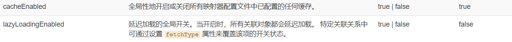

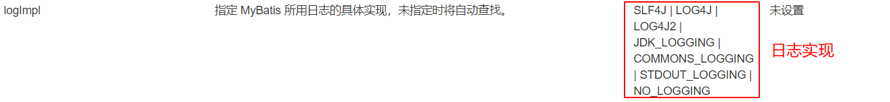

### 6、其他配置

- objectFactory（对象工厂）
- plugins（插件）
- environments（环境配置）
  - mybatis-generator-core
  - mybatis-plus
  - 通用mapper


### 7、映射器（mappers）

MapperRegistry：注册绑定我们的Mapper文件

方式一：

```xml
<mappers>
    <mapper resource="com/baven/mapper/UserMapper.xml"/>
</mappers>
```

方式二：使用class文件绑定

```.xml
<mappers>
    <mapper class="com.baven.mapper.UserMapper"/>
</mappers>
```

注意点：

- 接口和他的Mapper配置文件必须同名
- 接口和他的Mapper配置文件必须在同一个包下


方式三：使用扫描包进行注入绑定

```xml
<mappers>
    <package name="com.baven.mapper"/> 	
</mappers>
```

注意点：

- 接口和他的Mapper配置文件必须同名
- 接口和他的Mapper配置文件必须在同一个包下


 练习时间：

- 将数据库配置文件外部引入
- 实体类别名
- 保证UserMapper 接口和 UserMapper.xml改为一致，并且放在同一个包下


### 8、生命周期和作用域

生命周期和作用域是至关重要的，因为错误的使用会导致非常严重的**并发问题**。

**SqlSessionFactoryBuilder：**

- 一旦创建了 SqlSessionFactory，就不再需要它了。
- 所以充当局部变量

**SqlSessionFactory：**

- 说白了就是可以想象为：数据库连接池
- SqlSessionFactory一旦被创建就应该应用的运行期间一直存在，**没有任何理由丢弃它或重新创建另一个实例。**
- 因此 SqlSessionFactory 的最佳作用域是应用作用域。
- 最简单的就是使用单例模式或者静态单例模式。

**SqlSession：**

- 连接到连接池的一个请求

- SqlSession 的实例不是线程安全的，因此是不能被共享的，所以它的最佳的作用域是请求或方法作用域。

- 用完之后需要赶紧关闭，否则资源占用 

- 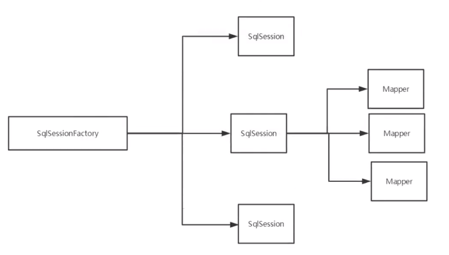

  这里面的每一个Mapper，就代表一个具体的业务


## 5、解决属性名和字段名不一致的问题

### 1、问题

数据库中的字段

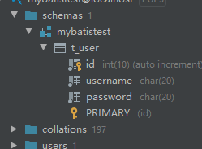

新建一个项目，拷贝之前的，测试实体类字段不一致的情况

```java
public class User{
    private int id;
    private String username;
    // 与数据库不一致
    private String pwd;
}
```

则运行结果出现问题

```java
User{id=1, username='许麦麦', pwd='null'}
```

原因如下

```java
select * from t_user where id = #{id}
// 类型处理器  属性字段名不一致
select id,username,username from t_user where id = {id}
```

解决方法：

- 起别名

```java
select id,username as name,password as pwd from t_user where id = {id}
```

也可以用resultMap

### 2、resultMap

结果集映射

```java
id 	username 	password
id 	username 	pwd
```

```xml
<!--结果集映射-->
<resultMap id="UserMap" type="user">
    <!--column数据库中的字段，property实体类中的属性-->
    <result column="id" property="id"/>
    <result column="username" property="userName"/>
    <result column="password" property="pwd"/>
</resultMap>

<select id="getUserById" resultMap="UserMap">
    select * from t_user where id = #{id};
</select>
```

没有不一致的属性是可以不用写上去的

- `resultMap`元素是MyBatis中最重要最强大的元素
- ResultMap 的设计思想是，对于简单的语句根本不需要配置显示的结果映射，而对于复杂一点的语句只需要复述它们的关系就行了。
- `resultMap`最优秀的地方在于，虽然你已经对它相当了解了，但是根本就不需要显示的用到他们。
- 当然，能这么简单就好了


**注解使用**

@Select("select * from t_user;")

解决字段不一致

在以上下添加@Results({@Result(id=true, column="id", property="id"),@Result(column="sex",property="gender"),})

注意：主键一定要写

## 6、日志

### 6.1、日志工厂

如果一个数据库操作，出现了异常，我们需要排错。日志就是最好的助手

以往：sout、debug

现在：日志工厂


需要复制：logImpl 容易出错

- SLF4J
- LOG4J 【掌握】
- LOG4J2
- JDK_LOGGING
- COMMONS_LOGGING
- STDOUT_LOGGING  【掌握】
- NO_LOGGING

在MyBaits中具体使用那个一日志实现，在设置中设定

**STDOUT_LOGGING标准日志输出**

在核心配置文件中配置

```java
<settings>
    <!--标准的日志工厂实现-->
    <setting name="logImpl" value="STDOUT_LOGGING"/>
</settings>
```

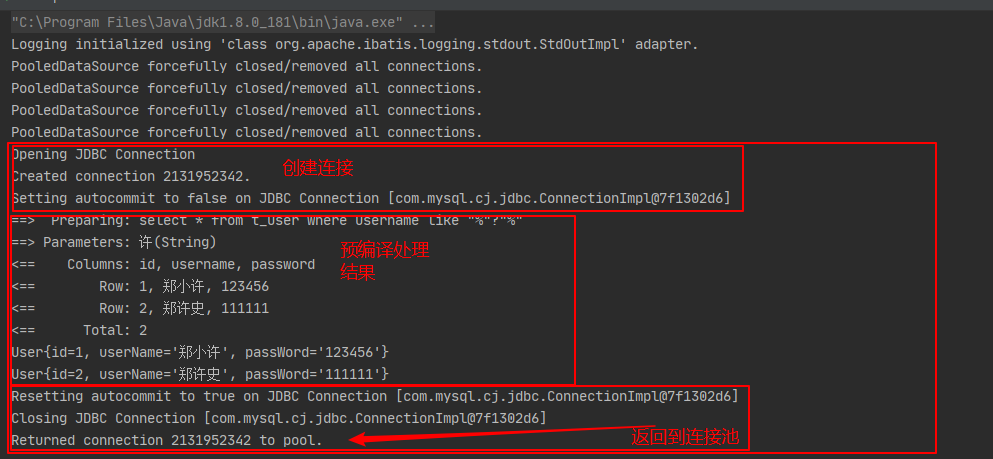


### 6.2、**Log4j**

什么是Log4j?

- Log4j是Apache的一个开源项目，通过使用Log4j，我们可以控制日志信息输送的目的地是控制台、文件、GUI组件
- 我们可以控制每一条日志的输出格式
- 通过定义每一条日志信息的级别，我们能够更加细致地控制日志的生成过程
- 这些可以通过一个[配置文件](https://baike.baidu.com/item/配置文件/286550)来灵活地进行配置，而不需要修改应用的代码。

1. 先导入log4j的包

   ```xml
   <dependency>
       <groupId>log4j</groupId>
       <artifactId>log4j</artifactId>
       <version>1.2.17</version>
   </dependency>
   ```

2. log4j.properties

   ```properties
   #将等级为DEBUG的日志信息输出到console和file这两个目的地，console和file的定义在下面的代码
   log4j.rootLogger=DEBUG,console,file
   
   #控制台输出的相关设置
   log4j.appender.console = org.apache.log4j.ConsoleAppender
   log4j.appender.console.Target = System.out
   log4j.appender.console.Threshold=DEBUG
   log4j.appender.console.layout = org.apache.log4j.PatternLayout
   log4j.appender.console.layout.ConversionPattern=【%c】-%m%n
   
   #文件输出的相关设置
   log4j.appender.file = org.apache.log4j.RollingFileAppender
   log4j.appender.file.File=./log/baven.log
   log4j.appender.file.MaxFileSize=10mb
   log4j.appender.file.Threshold=DEBUG
   log4j.appender.file.layout=org.apache.log4j.PatternLayout
   log4j.appender.file.layout.ConversionPattern=【%p】【%d{yy-MM-dd}】【%c】%m%n
   
   #日志输出级别
   log4j.logger.org.mybatis=DEBUG
   log4j.logger.java.sql=DEBUG
   log4j.logger.java.sql.Statement=DEBUG
   log4j.logger.java.sql.ResultSet=DEBUG
   log4j.logger.java.sql.PreparedStatement=DEBUGnder.A1.layout=org.apache.log4j.xml.XMLLayout
   ```

3. 配置log4j为日志的实现

   ```xml
   <settings>
       <setting name="logImpl" value="LOG4J"/>
   </settings>
   ```

4. Log4j的使用，直接测试运行刚才的

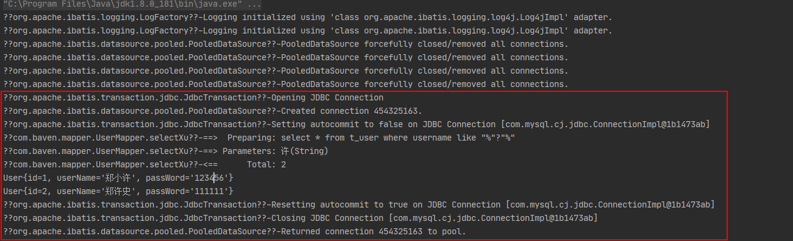

与刚才差不多，但要详细


**简单使用**

1. 在要使用Log4j的类中，导入包`import org.apache.log4j.Logger;`

2. 生成日志对象，参数为当前类的class

   ```java
   static Logger logger = Logger.getLogger(UserMapperTest.class); 
   ```

3. 日志级别

   ```java
   logger.info("info:进入了");
   logger.debug("debug:进入了");
   logger.error("error:进入了")
   ```

   

## 7、分页

**思考：为什么要分页？**

- 减少数据的处理量


### **7.1、使用Limit分页**

```sql
语法：SELECT * from t_user limit startIndex,pageSize;
	# 每一页显示3个，从第0个开始查
	SELECT * from t_user limit 0,3; 
	# 从第4个开始查，到最后一个 	注意：这是以前的用法，-1是个bug，现以被修复 则不能用了
	SELECT * from t_user limit 4,-1; 
	# 一个参数则从0开始，到4
	SELECT * from t_user limit 4;							
```

**注意：后面的数据不用括号括起来**

使用MyBatis实现分页，核心是SQL

1. 接口

   ```java
   List<User> getUserByLimit(Map<String, Object> map);
   ```

2. Mapper.xml

   ```xml
   <select id="getUserByLimit" paramterType="map" resultType="user">
   	select * from t_user limit #{startIndex},#{pageSize}
   </select>
   ```

3. 测试

   ```java
   @Test
   public void getUserByLimit(){
       // 省略固定三条
       Map<String, Object> map = new HashMap<String, Object>();
       map.put("startIndex", 0);
       map.put("pageSize", 3);
       List<User> userList = userMapper.getUserByLimit(map);
   }
   ```

   


### 7.2、RowBounds分页

不在使用SQL实现分页

1. 接口

   ```java
   List<User> getUserByRowBounds();
   ```

2. Mapper.xml

   ```xml
   <select id="getUserByRowBounds" resultType="UserMap">
   	select * from t_user
   </select>
   ```

3. 测试

   ```java
   @Test
   public void getUserByRowBounds(){
       // 省略固定三条
       RowBounds rowBounds = new RowBounds(1, 2);
       List<User> userList = sqlSession.selectList("com.baven.mapper.getUserByRowBounds", null, rowBounds);
       for(User user:userList){
           sout(user);
       }
   }
   ```

   

### 7.3、分页插件

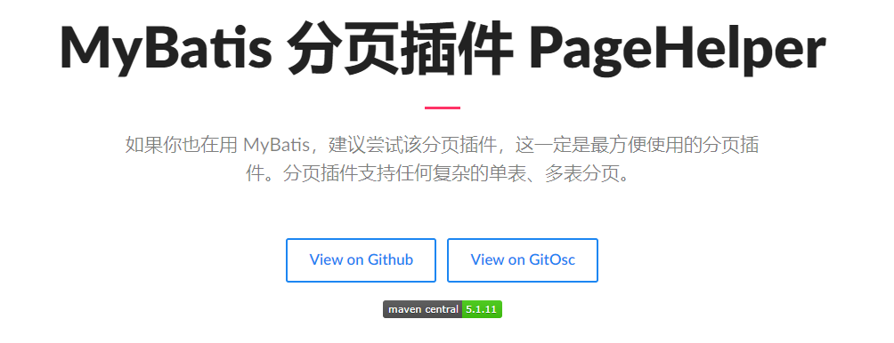

了解即可，万一以后公司的架构师，说要使用，就需要知道什么东西


## 8、使用注解开发

### 8.1、面向接口编程

为什么？

- **根本原因：==解耦==，可拓展，提高服用，分层开发中，上层不用管具体的实现，大家都遵守共同的标准，使得开发变得容易，规范性更好**

### 8.2、使用注解开发

1. 注解在接口上实现

   ```java
   @Select("select * from user")
   List<User> getUsers();
   ```

2. 需要在核心配置文件中绑定接口

   ```xml
   <!--绑定接口-->
   <mappers>
   	<mapper class="com.baven.mapper.UserMapper"/>
   </mappers>
   ```

3. 测试

   


本质：反射机制实现

底层：动态代理


**MyBatis详细的执行流程**

P16集 现在暂时看不懂，日后再来回看 


### 8.2、CRUD

我们可以在工具类创建的时候实现自动提交事务

```java
public static SqlSession getSqlSession(){
    // openSession里有很多重写的方法，以下是开启自动提交
    return sqlSessionFactory.openSession(true);
}
```


编写接口，增加注解

```java
@Select("select * from t_user")
List<User> getUserList();

@Select("select * from t_user where id = #{id}")
User getUserById(int id);

@Insert("insert into t_user (id, username, password) value (id=#{id}, username={userName}, password=#{passWord})")
int addUser(User user);

@Update("update t_user set username=#{userName}, password=#{passWord} where id=#{id}")
int updateUser(User user);

@Delete("delete from t_user where id = #{id}")
int deleteUser(int id);
```

测试类

同之前一样

**注意：一定要绑定接口**

**缺点**：到时候有多个项目的时候，就很难处理

**改善：**还是得用回xml，因为xml的配置文件可以弄多个

```xml
<mappers>
	<mapper resource="com/baven/mapper/*Mapper.xml"/>  // 现在不确定正确，暂时不要用
</mappers>
```


**关于@Param()注解**

- 基本类型的参数或者String类型，需要加上
- 引用类型不需要加
- 如果只有一个基本类型的话，可以忽略，但是建议大家都加上
- 我们在SQL中引用的就是我们这里的@Param()中设定的属性名


**#{}	${}的区别**

#可以防止sql注入，$不可以


## 9、Lombok

```java
Lombok项目是一个Java库，它会自动插入您的编辑器和构建工具中，从而为您的Java增光添彩。
不用再写另一个getter或equals方法，带有一个注释的您的类有一个功能全面的生成器，自动执行记录变量等。
```


使用步骤：

1. 在IDEA中安装Lombok插件

2. 在项目中导入Lombok的jar包

   ```xml
   <dependency>
       <groupId>org.projectlombok</groupId>
       <artifactId>lombok</artifactId>
       <version>1.18.12</version>
   </dependency>
   ```

3. 在实体类中加注解即可

```java
@Getter and @Setter 
@FieldNameConstants  // 字段属性常量
@ToString
@EqualsAndHashCode
@AllArgsConstructor, @RequiredArgsConstructor and @NoArgsConstructor
@Log, @Log4j, @Log4j2, @Slf4j, @XSlf4j, @CommonsLog, @JBossLog, @Flogger, @CustomLog
@Data
@Builder
@SuperBuilder
@Singular
@Delegate
@Value
@Accessors
@Wither
@With
@SneakyThrows
@val
@var
```

说明：

```java
@Data：无参构造、get、set、toString、hashcode、equals
@AllArgsConstructor
@NoArgsConstructor    
```


注意：

- 使用Lombok的话还需要配合安装相应的插件，防止IDE的自动检查报错。
- 会破坏了代码的完整性


## 10、多对一处理

多对一：


- 多个学生，对应一个老师
- 对于学生这边而言，**关联**   --- 多个学生关联一个老师 【多对一】association

- 对于老师而言，**集合**，一个老师有很多学生 【一对多】collection

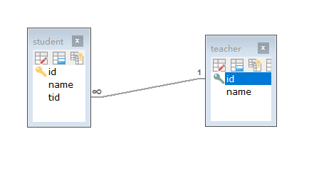

SQL：新建两张表

```sql
CREATE TABLE `teacher` (
`id` INT(10) NOT NULL,
`name` VARCHAR(30) DEFAULT NULL,
PRIMARY KEY (`id`)
) ENGINE=INNODB DEFAULT CHARSET=utf8

INSERT INTO teacher(`id`, `name`) VALUES (1, '秦老师');

CREATE TABLE `student` (
`id` INT(10) NOT NULL,
`name` VARCHAR(30) DEFAULT NULL,
`tid` INT(10) DEFAULT NULL,
PRIMARY KEY (`id`),
KEY `fktid` (`tid`),
CONSTRAINT `fktid` FOREIGN KEY (`tid`) REFERENCES `teacher` (`id`)
) ENGINE=INNODB DEFAULT CHARSET=utf8

INSERT INTO `student` (`id`, `name`, `tid`) VALUES ('1', '小明', '1');
INSERT INTO `student` (`id`, `name`, `tid`) VALUES ('2', '小红', '1');
INSERT INTO `student` (`id`, `name`, `tid`) VALUES ('3', '小张', '1');
INSERT INTO `student` (`id`, `name`, `tid`) VALUES ('4', '小李', '1');
INSERT INTO `student` (`id`, `name`, `tid`) VALUES ('5', '小王', '1');
```


### 测试环境搭建

1. 导入Lombok
2. 新建实体类Teacher，Student
3. 建立Mapper接口
4. 建立Mapper.xml文件
5. 在核心配置文件中绑定注册我们的Mapper接口或者文件 【方式很多，随心选】
6. 测试查询是否成功

**实体类**

```java
@Data
public class Student {
    private int id;
    private String name;
    // 注意这条
    private Teacher teacher;
}
```

```java
@Data
public class Teacher{
    private int id;
    private String name;
}
```

### 按照查询嵌套处理

```xml
<!--
思路：
	1.查询所有的学生信息
 	2.根据查询出来的学生的tid，寻找对应的老师     子查询
-->
<select id="getStudent" resutMap="StudentTeacher">
	select * from student
</select>

<resultMap id="StudentTeacher" type="Student">
	<result property="id" colum="id"/>
    <result property="name" column="name"/>
    <!--复杂的属性，我们需要单独处理 对象：association 集合： collection-->
    <association property="teacher" column="tid" javaType="Teacher" select="getTeacher"/>
</resultMap>

<select id="getTeacher" resultType="Teacher">
	select * from teacher where id=#{id}
</select>
```


### 按照结果嵌套处理

```xml
<!--按照结果嵌套处理-->
<select id="getStudent" resultMap="StudentTeacher">
	select s.id sid, s.name sname, t.name tname
    from student s, teacher t
    where s.tid = t.id;
</select>

<resultMap id="StudentTeacher" type="Student">
	<result property="id" colum="sid"/>
    <result property="name" column="sname"/>
    <association property="teacher" javaType="Teacher">
    	<result property="name" column="tname"/>
    </association>
</resultMap>
```


回顾Mysql多对一查询方式：

- 子查询
- 联表查询


## 11、一对多处理

比如：一个老师拥有多个学生

对于老师而言，就是一对多的关系


### **环境搭建**

与刚才一样

```java
@Data
public class Student {
    private int id;
    private String name;
    private int tid;
}
```

```java
@Data
public class Teacher{
    private int id;
    private String name;
    
    private List<Student> students;
}
```


### **按照结果嵌套处理**

```xml
<select id="getTeacher" resultMap="TeacherStudent">
	select s.id sid, s.name sname, t.name tname, t.id tid
    from student s, teacher t
    where s.tid = t.id and t.id = #{tid}
</select>

<resultMap id="TeacherStudent" type="Teacher">
	<result property="id" column="tid"/>
    <result property="name" column="tname"/>
    <!--复杂的属性，我们需要单独处理 对象：association 集合： collection
		javaType="" 指定属性的类型
		集合中的泛型信息，我们使用ofType获取
	-->
    <collection property="student" ofType="Student">
    	<result property="id" column="sid"/>
        <result property="name" column="sname"/>
        <result property="tid" column="tid"/>
    </collection>
</resultMap>
```

### **按照查询嵌套处理**

```xml
<select id="getTeacher" resultMap="TeacherStudent">
	select * from teacher
</select>

<resultMap id="TeacherStudent" type="Teacher">
	<collection property="students" javaType="ArrayList" ofType="Student" 			                     select="getStudent" column="id">
</resultMap>
    
<select id="getStudent" resulyType="Student">
	select * from student where tid = #{tid}   
</select>
```


### 小结

1. 关联 - association  【多对一】
2. 集合 - collection  【一对多】
3. javaType   &    ofTyp
   - JavaType 用来指定实体类中的属性的类型
   - ofType 用来指定映射到List或者集合中的pojo类型，泛型中的约束类型


注意点：

- 保证SQL的可读性，通俗易懂
- 注意一对多和多对一中，属性名和字段的问题
- 如果问题不好排查错误，可以使用日志，建议使用Log4j


面试高频

- Mysql引擎
- InnoDB底层原理
- 索引
- 索引优化


## 12、动态SQL

**==什么是动态SQL：动态SQL就是指根据不同的条件生成不同的SQL语句==**


动态 SQL 元素可能会感觉似曾相识。在 MyBatis 之前的版本中，需要花时间了解大量的元素。借助功能强大的基于 OGNL 的表达式，MyBatis 3 替换了之前的大部分元素，大大精简了元素种类，现在要学习的元素种类比原来的一半还要少。

- if
- choose (when, otherwise)
- trim (where, set)
- foreach


### 搭建环境

```sql
CREATE TABLE `blog`(
`id` VARCHAR(50) NOT NULL COMMENT '博客id',
`title` VARCHAR(100) NOT NULL COMMENT '博客标题',
`author` VARCHAR(30) NOT NULL COMMENT '博客作者',
`create_time` DATETIME NOT NULL COMMENT '创建时间',
`views` INT(30) NOT NULL COMMENT '浏览量'
)ENGINE=INNODB DEFAULT CHARSET=utf8
```


创建一个基础工程

1. 导包

2. 编写配置文件

   

3. 编写实体类

   ```java
   @Data
   public class Blog {
       private String id;
       private String title;
       private String author;
       private Date createTime;
       private int views;
   }
   ```

4. 编写实体类对应的Mapper接口和Mapper.xml


5. 测试类

```java
@Test
public void addInitB1og() {
    SqlSession sqlSession = MybatisUtils.getSqlSession();
    BlogMapper mapper = sqlSession.getMapper(BlogMapper.class);

    Blog blog = new Blog();

    blog.setId(IDutils.getID());
    blog.setTitle("Mybatis如此简单");
    blog.setAuthor("狂神説");
    blog.setCreateTime(new Date());
    blog.setViews(9999);
    mapper.addInitBlog(blog);

    blog.setId(IDutils.getID());
    blog.setTitle("Java如此简单");
    mapper.addInitBlog(blog);

    blog.setId(IDutils.getID());
    blog.setTitle("Spring如此简单");
    mapper.addInitBlog(blog);

    blog.setId(IDutils.getID());
    blog.setTitle("微服多如此简单");
    mapper.addInitBlog(blog);

    sqlSession.close();
}
```


### IF

```xml
<select id="queryBlogIF" parameterType="map" resultType="blog">
	select * from blog where 1=1  <!--为了sql通顺加上1=1，后面有where标签解决这问题-->
    <if test="title != null">
    	and title = #{titile}
    </if>
    <if test="author != null">
    	and author = #{author}
    </if>
</select>
```

问题：where 后要加1=1，如果不加且if 条件符合条件的sql前有and关键词，那么就会出错

解决：下方where标签

### choose (when, otherwise)

```xml
<select id="queryBlogIF" parameterType="map" resultType="blog">
	select * from blog
    <where>
    	<choose>
            <when test="title != null">
                title = #{titile}
            </when>
            <when test="author != null">
                and author = #{author}
            </when>
            <otherwise>
            	and views = #{views}
            </otherwise>
        </choose>
    </where>
</select>
```

- 当条件when 都没符合条件是，执行otherwies
- 当第一个when符合条件，只执行when
- 当两个when都符合条件，只执行一个最先判断的when，后都不处理

### trim (where, set)

**where**

```xml
<!--根据上方的问题提出where方法-->
<select id="queryBlogIF" parameterType="map" resultType="blog">
	select * from blog
    <where>
    	<if test="title != null">
    		title = #{titile}
    	</if>
    	<if test="author != null">
    		and author = #{author}
    	</if>
    </where>
</select>
```

- 什么都不传的时候，就把where去掉
- 当条件只符合第一个条件时候，正常执行 select * from blog where title = #{titile}

- 当条件只符合第二个条件时候，第二sql的**and**关键词会自动去除。select * from blog where author = #{author}


**set**

更新中的  update user set id=#{id}, name=#{name}, password=#{password} where...

```xml
<update id="updateBlog" parameterType="map">
	update blog 
    <set>
    	<if test="title != null">
        	title = #{title},
        </if>
        <if test="author != null">
        	author = #{author}
        </if>
    </set>
    where id = #{id}
</update>
```

set元素会动态前置SET关键词，同时也会删除无关的逗号


trim用来自定义格式的，覆盖删除些什么when，and|or， set，“，”

```xml
<trim prefix="WHERE" prefixOverrides="AND |OR">
	...
</trim>
```

```xml
<trim prefix="SET" prefixOverrides=",">
	...
</trim>
```


**所谓的动态SQL，本质还是SQL语句，只是我们可以在SQL层面，去执行一个逻辑代码**


### Foreach

要求：读取Blog中的1，2，3数据，不用分页

```sql
select * from user where 1=1 and 

(id=1 or id=2 or id=3)
```

```xml
select * from blog
<when>
    <foreach collection="ids" item="id" open="and (" close=")" separator="or">
        id = #{id}
    </foreach>
</when>
```


### SQL片段

有的时候，我们可能会将一些功能的部分抽取出来，方便复用

1. 使用SQL标签抽取公共的布冯

   ```xml
   <sql id="if-title-author">
   	<if test="title != null">
       	title = #{title}	
       </if>
       <if test="author != null">
       	author = #{author}
       </if>
   </sql>
   ```

2. 在需要的地方使用Include标签引用即可

   ```xml
   <select id="queryBlogIF" parameterType="map" resultType="blog">
   	select * from blog
       <where>
       	<include refid="if-title-author"></include>
       </where>
   </select>
   ```


注意事项：

- 最好基于表单来定义SQL片段
- 片段里不要存在where标签


==动态SQL就是在拼接SQL语句，我们只要保证SQL的正确性，按照SQL的格式，去排列组合就行了==

建议：

- 先在Mysql中写出完整的SQL，再对应的去修改成我们的动态SQL实现通用


## 13、缓存

### 13.1、简介

查询 -> 连接数据库 -> 耗资源

一次查询的结果，给他暂存在一个直接取到的地方  ---> 内存 ： 缓存

这样再次查询相同数据的时候，直接走缓存，就不用走数据库了


1. 什么是缓存？
   - 存在内存中的临时数据
   - 将用户进场查询的数据放在缓存（内存）中，用户在查询数据就不用从磁盘中（关系型数据库数据文件）查询，从缓存中查询，从而提高效率，解决了高并发系统的性能问题。
2. 为什么使用缓存？
   - 减少和数据库的交互次数，减少系统开销，提高系统效率。
3. 什么样的数据能使用缓存？
   - 经常查询并且不经常改变的数据。


### 13.2、Mybatis缓存

- Mybatis包含一个非常强大的查询缓存特性，它可以非常方便的制定和配置缓存。缓存可以极大的提升查询效率
- Mybaits系统中默认定义了两级缓存：**一级缓存**和**二级缓存**
  - 默认情况下，只有一级缓存开启。（SqlSession级别的缓存，也称为本地缓存）
  - 二级缓存需要手动开启和配置，他是基于namespace级别的缓存。
  - 为了提高扩展性，Mybatis定义了缓存接口Cache。我们可以通过实现Cache接口来定义二级缓存


### 13.3、一级缓存

- 一级缓存叫本地缓存：
  - 与数据库同一次会话期间查询到的数据会放在本地缓存中
  - 以后如果需要获取相同的数据，直接缓存中取，没必要再去查询数据库

- 有效期：
  - 就是SqlSession开启到关闭的期间
  - 默认开始，且关不掉

测试步骤：

1. 开启日志
2. 测试一个Session中查询两次相同记录
3. 查看日志输出

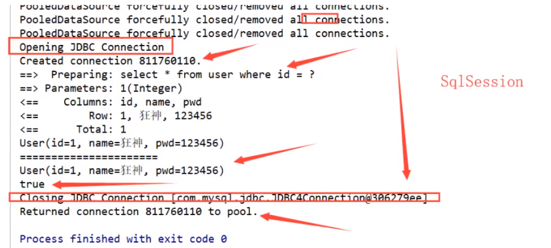

缓存失效的情况：

1. 查询不同的数据

2. 增删改操作，可能会改变原来的数据，所以必定会刷新缓存

   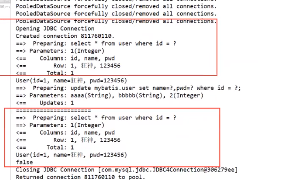

3. 查询不同的Mapper.xml

4. 手动清理缓存

   `SqlSession.clearCache();`


小结：一级缓存默认是开启的，只在一次SqlSesison中有效，也就是拿到连接到关闭这个区间段

一级缓存就是于一个Map

### 13.4、二级缓存

- 二级缓存也叫全局缓存，一级缓存作用域太低了，所以诞生了二级缓存
- 基于namespace级别的缓存，一个名称空间，对应一个二级缓存
- 工作机制
  - 一个会话查询一条数据，这个数据就会放在一个当前会话的以及缓存中
  - 如果当前会话关闭了，这个会话对应的一级缓存就没了；**但是我们想要的是，会话关闭了，一级缓存中的数据被保存到二级缓存中**
  - 新的会话查询信息，就可以二级缓存中获取内容
  - 不同的mapper查出的数据会放在自己对应的缓存（map）中


步骤：

1. 开启全局缓存

   显示开启全局缓存

   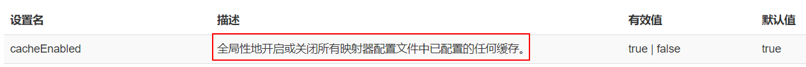

   **cacheEnabled**

2. 在要使用二级缓存的Mapper中开启

   ```xml
   <!--这样开启即可-->
   <cache/>
   ```

   也可以自定义参数

   ```xml
   <!--在当前Mapper.xml中使用二级缓存-->
   <cache
     eviction="FIFO"
     flushInterval="60000"
     size="512"
     readOnly="true"/>
   ```

   > 这个更高级的配置创建了一个 FIFO 缓存，每隔 60 秒刷新，最多可以存储结果对象或列表的 512 个引用，而且返回的对象被认为是只读的，因此对它们进行修改可能会在不同线程中的调用者产生冲突。

3. 测试

   1. 问题：我们需要将实体类序列化，否则就会报错

      ```
      Caused by:java.io.NotSerializableException:com.baven.pojo.User
      ```


小结：

- 只要开启了二级缓存，在用一个Mapper下就有效
- 所有的数据都会先放在一级缓存中
- 只有当会话提交，或者关闭的时候，才会提交到二级缓存中


### 13.5、缓存原理

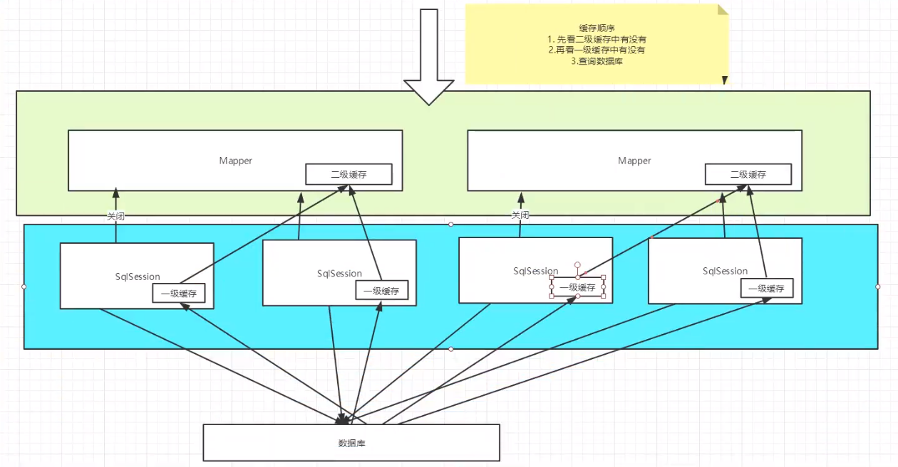

缓冲顺序：

1. 先看二级缓冲中有没有
2. 再看一级缓存中有没有
3. 查询数据库

### 13.6、自定义缓存-ehcache

> Ehcache是一种广泛使用的开源 Java分布式缓冲。主要面向通用缓存


要在程序中使用ehcache，先导包

在写固定的配置文件，详情了解狂神Mybatis P30集


这个缓存效率太低了

现在Redis数据库来做缓存  用K-V存取的

 


