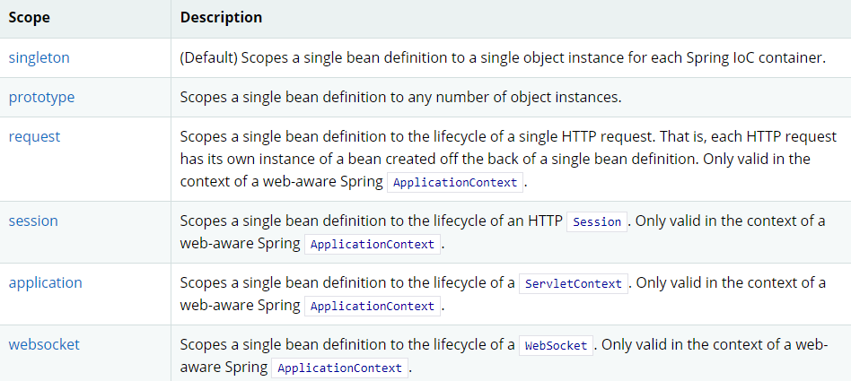
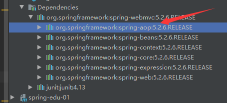
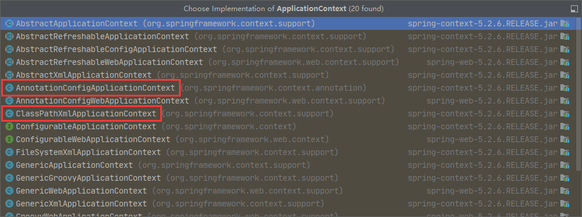
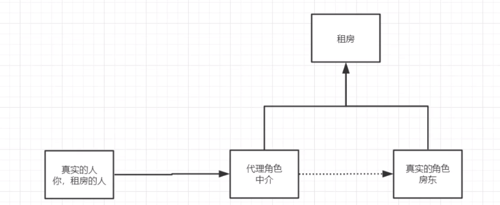
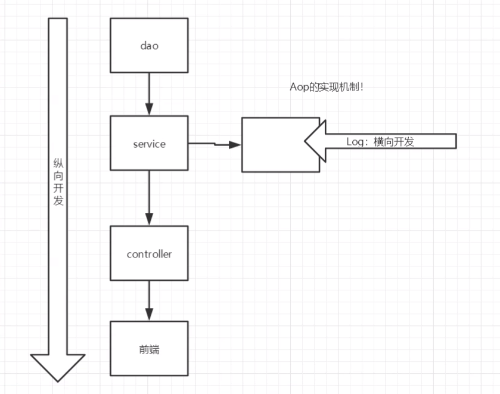
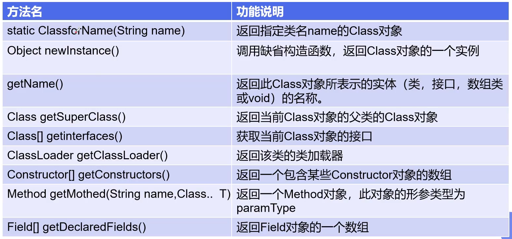

# Spring - 20.5.27

## 练习

- [ ] 在Mybatis的User基础上写出IoC的原型

- [ ] 根据原型修改成Spring管理

- [ ] 创建User类，分别用property和construction加载感受区别

- [ ] 在User上创建复杂类型，并注入数据

  数组、List、Map、Set、Null、properties

- [ ] 用p, c命名空间注入

- [ ] 创建人猫狗类感受用byName、byType进行自动装配，并说出区别

- [ ] 使用注解实现自动装配

- [ ] 使用注解开发

- [ ] 使用Java的方式配置Spring 

- [ ] 复习代理模式

  - 写出简单的代理模式---1.租房客户房东  2.用户增删改查 3.复习注解和放射
  - 将租客改为动态代理

- [ ] 在Spring中用三种方法实现AOP

- [ ] Mybatis-spring

- [ ] 理解事务怎么回事，在spring中添加事务

## 1、关于Spring

### 1.1、简介

**Spring是为了解决企业级应用开发的复杂性而创建的，简化开发。**


- Spring：春天----->给软件行业带来了春天
- 2002年，首次推出了Spring框架的雏形：interface21框架
- 2004年3月24日，Spring框架即以interface21框架为基础，经过重新设计，并不断丰富内涵，在2004年3月24日，发布了1.0正式版。
- **Rod Johnson**，Spring Framework创始人，著名作者。 Rod在悉尼大学不仅获得了计算机学位，同时还获得了音乐学位。更令人吃惊的是在回到软件开发领域之前，他还获得了音乐学的博士学位。
- Spring的理念：是现有的技术更加容易使用，本身是一个大杂烩，整合了现有的技术框架


- SSH：Struct2 + Spring + Hibernate
- SSM：SpringMvc + Spring + Mybatis


官网：https://spring.io/projects/spring-framework

GitHub：https://github.com/spring-projects/spring-framework


### Spring是如何简化Java开发的

为了降低Java开发的复杂性，Spring采用了以下4种关键策略：

1、基于POJO的轻量级和最小侵入性编程，所有东西都是bean；

2、通过IOC，依赖注入（DI）和面向接口实现松耦合；

3、基于切面（AOP）和惯例进行声明式编程；

4、通过切面和模版减少样式代码，RedisTemplate，xxxTemplate；


 ```xml
<!-- https://mvnrepository.com/artifact/org.springframework/spring-webmvc -->
<dependency>
    <groupId>org.springframework</groupId>
    <artifactId>spring-webmvc</artifactId>
    <version>5.2.5.RELEASE</version>
</dependency>
<!--以下跟JDBC Mybatis有关-->
<!-- https://mvnrepository.com/artifact/org.springframework/spring-jdbc -->
<dependency>
    <groupId>org.springframework</groupId>
    <artifactId>spring-jdbc</artifactId>
    <version>5.2.5.RELEASE</version>
</dependency>
 ```


### 1.2、优点

- Spring是一个开源的免费的框架（容器）！
- Spring是一个轻量级的、非入侵式的框架
- 控制反转（IOC），面向切面编程（AOP）
- 支持事务的处理，对框架整合的支持


**总结一句话：Spring就是一个轻量级的控制反转（IOC）和面向切面（AOP）的框架**


### 1.3、组成


### 1.4、拓展 

在Spring的官网有这个介绍：现代化的Java开发！说白了就是基于Spring的开发


- Spring Boot
  - 一个快速开发的脚手架
  - 基于SpringBoot可以快速的开发单个微服务
  - 约定大于配置
- Spring Cloud
  - SpringCloud 是基于SpringBoot实现的


因为现在大多数公司都在使用SpringBoot进行快速开发，学习SpringBoot的前提，需要完全掌握Spring及SpringMVC ，承上启下作用


弊端：发展了太久之后，违背了原来的理念，配置十分繁琐，人称：“配置地狱”


## 2、IOC理论推导

在以前的开发是这样的

1. UserDao 接口

   ```java
   public interface UserDao {
       void getUser();
   }
   ```

2. UserDaoImpl 实现类

   ```java
   public class UserDaoImpl implements UserDao{
       public void getUser() {
           System.out.println("默认获取用户数据");
       }
   }
   ```

3. UserService 业务实现类

   ```java
   public interface UserService {
       void getUser();
   }
   ```

4. UserServiceImpl 业务实现类

   ```java
   public class UserServiceImpl implements UserService{
   
       private UserDao userDao = new UserDaoImpl();
   
       public void getUser() {
           userDao.getUser();
       }
   }
   ```
   
   

在之前的的业务中，用户的需求可能会影响我们原来的代码，我们需要根据用户的需求去修改源代码！如果程序代码量十分大，修改一次的成本代价十分昂贵！


我们使用一个Set接口实现，已经发生了革命性的变化

```java
private UserDao userDao;

// 利用set进行进行动态实现值的注入
public void setUserDao(UserDao userDao) {
    this.userDao = userDao;
}
```


- 之前，程序是主动创建对象，控制权在程序员手上
- 使用set注入后，程序不在具有主动性，而是变成了被动的接收对象


这种思想，从本质上解决了问题，我们程序员不用再去管理对象的创建了。  系统的耦合性大大降低，就可以更加专注的在业务的实现上。这是IOC 的原型！


### IOC本质

**控制反转IOC(Inversion of Control)，是一种设计思想，DI(依赖注入)是实现IOC的一种方法**，也有人认为ID只是IoC的另一种说法。没有IoC的程序中，我们使用面向对象编程，对象的创建与对象之间的依赖关系完全硬编码在程序中，对象的创建有程序自己控制，控制反转后将对象的创建转移给第三方，个人认为所谓控制反转就是：获得依赖对象的方式反转了。


采用XML方式配置Bean的时候，Bean的定义信息是和实现分离的，而采用注解的方式可以把两者合为一体，Bean的定义信息直接以注解的形式定义在实现类中，从而达到了零配置的目的。


**控制反转是一种通过描述（XML或注解）并通过第三方生产或获取特定对象的方式。在Spring中实现控制反转的是IoC容器，其实现方法的是依赖注入（Dependency Injection,DI）**


## 3、HelloSpring

1. **实体类pojo**

   ```java
   public class Hello {
       private String str;
   
       public String getStr() {
           return str;
       }
   
       public void setStr(String str) {
           this.str = str;
       }
   
       @Override
       public String toString() {
           return "Hello{" +
                   "str='" + str + '\'' +
                   '}';
       }
   }
   ```

   

2. **配置文件**

   右键new - XML Configration File - Spring config
   
   ```xml
   <?xml version="1.0" encoding="UTF-8"?>
   <beans xmlns="http://www.springframework.org/schema/beans"
          xmlns:xsi="http://www.w3.org/2001/XMLSchema-instance"
          xsi:schemaLocation="http://www.springframework.org/schema/beans
           https://www.springframework.org/schema/beans/spring-beans.xsd">
   
       <!--使用Spring来创建对象，在Spring中这些都用Bean表示
   
       以前	类型 变量名 = new 类型();
       	Hello hesllo = new Hello();
   
       bean = 对象 = new Hello();
       -->
       <bean id="hello" class="com.baven.pojo.Hello">
           <property name="str" value="Spring"/>
      	</bean>
   
   ```
   
   其中：
   
   id = 变量名    class = new 的对象，用全限定名
   
   property 相当于给对象中的属性设置一个值
   
   - value 是一个具体的值
   - ref 引用Spring容器中创建好的对象
   
   

**3. 测试类**

填写固定的语句获取到ApplicationContext对象：拿到Spring的容器

   `ApplicationContext context = new ClassPathXmlApplicationContext("services.xml", "daos.xml");`

   ```java
public static void main(String[] args) {
    // 获取Spring的上下文对象
    ApplicationContext context = new ClassPathXmlApplicationContext("beans.xml");
    // 我们的对象现在都在Spring中的管理了，我们要使用，直接去里面取出来就可以了
    Hello hello = (Hello) context.getBean("hello");
    System.out.println(hello.toString());
}
   ```

   需要什么，就直接从中get什么


### 思考问题？

- Hello 对象是谁创建的？

  hello 对象是由Spring创建的

- Hello对象的属性是怎么设置的？

  hello 对象的属性是由Spring容器设置的

这个过程就叫控制反转：

控制：谁来控制对象的创建，传统应用程序的对象是由程序本身控制创建的，使用Spring后，对象有Spring创建的。

反转：程序本省不创建对象，而变成被动的接收对象。

依赖注入：就是利用set方法来进行注入的。

IOC是一种编程思想，由主动的编程变成被动的接收。

可以通过new ClassPathXmlApplicationContext去浏览一下底层源码。

**要实现不同的操作，现在只需要在xml配置文件中进行修改，所谓的IoC，一句话概括：对象由Spring来创建，管理，装配**


## 4、IOC创建对象的方式

共四种

1. 使用无参构造创建对象，默认！

2. 假设我们要使用有参构造创建对象。

   ```java
   public User(int id, String name, String pwd){
       this.id = id;
       this.name = name;
       this.pwd = pwd;
   }
   ```

   1. 下标赋值

      ```xml
      <bean id="user" class="com.baven.pojo.User">
      	<constructor-arg index="0" value="1"/>
          <constructor-arg index="1" value="Baven"/>
          <constructor-arg index="2" value="123456"/>
      </bean>
      ```

   2. 参数的类型（不建议使用）

      ```xml
      <bean id="user" class="com.baven.pojo.User">
      	<constructor-arg type="int" value="1"/>
          <constructor-arg type="java.lang.String" value="Baven"/>
          <constructor-arg type="java.lang.String" value="123456"/>
      </bean>
      ```

      注意：

      - 基本类型直接使用，引用类型要用全限定名
      - **以上有错误**，两个参数都是String就会报错

      

   3. 直接通过参数名

      ```xml
      <bean id="user" class="com.baven.pojo.User">
      	<constructor-arg name="id" value="1"/>
          <constructor-arg name="name" value="Baven"/>
          <constructor-arg name="pwd" value="123456"/>
      </bean>
      ```

      

总结：在配置文件加载的时候，容器中管理的对象就已经初始化了


## 5、Spring配置

### 5.1、别名alias

```xml
<!--别名，如果添加了别名，我们也可以使用别名获取到这个对象-->
<alias name="user" alias="userNew"/>
```

### 5.2、Bean的配置

```xml
<bean id="user" class="com.baven.pojo.User" name="u us,user1;u2">
	<property name="name" value="Baven"/>
</bean>
```

- id：bean的唯一标识符，也就是相当于我们学的对象名
- class：bean对象所对应的全限定名：包名 + 类型
- name：也是别名，而且name 可以同时取多个别名，可以用 逗号空格分号 分隔

### 5.3、import

这个import，一般用于团队开发使用，他可以将多个配置文件，导入合并为一个

假设项目中有多个人开发，三人负责不同的类开发，不同的类需要注册在不同的bean中，我们可以利用import将所有人的beans.xml合并为一个总的

- 张三  -beans1.xml
- 李四  -beans2.xml
- 王五  -beans3.xml

合并至applicationContext.xml中

```xml
<import resource="beans1.xml"/>
<import resource="beans2.xml"/>
<import resource="beans3.xml"/>
```

使用的时候，直接使用总的配置就可以了

相同的内容就合并了


## 6、依赖注入

### 6.1、构造器注入

前面已经说了


### 6.2、Set方式注入【重点】

- 依赖注入：Set注入！
  - 依赖：bean对象的创建依赖于容器
  - 注入：bean对象中的所有属性，由容器来注入

- property：进行注入

【环境搭建】

1. 复杂类型

   ```java
   public class Address {
       private String address;
   
       public String getAddress() {
           return address;
       }
   
       public void setAddress(String address) {
           this.address = address;
       }
   
       @Override
       public String toString() {
           return "Address{" +
                   "address='" + address + '\'' +
                   '}';
       }
   }
   ```

2. 测试对象

   ```java
   public class Student {
       private String name;
       private Address address;
   
       private String[] books;
       private List<String> hobbys;
       private Map<String,String> card;
       private Set<String> games;
       private Properties info;
       private String wife;
   }
   ```

3. applicationContext.xml

   ```xml
   <?xml version="1.0" encoding="UTF-8"?>
   <beans xmlns="http://www.springframework.org/schema/beans"
          xmlns:xsi="http://www.w3.org/2001/XMLSchema-instance"
          xsi:schemaLocation="http://www.springframework.org/schema/beans
           https://www.springframework.org/schema/beans/spring-beans.xsd">
   
       <bean id="student" class="com.baven.pojo.Student">
           <!--第一种，普通值注入，value-->
           <property name="name" value="Baven"/>
       </bean>
   </beans>
   ```

4. 测试类

   ```java
   public class MyTest {
       public static void main(String[] args) {
           ApplicationContext context = new ClassPathXmlApplicationContext("beans.xml");
           Student student = (Student) context.getBean("student");
           System.out.println(student.getName());
       }
   }
   ```


完善注入信息

```xml
<?xml version="1.0" encoding="UTF-8"?>
<beans xmlns="http://www.springframework.org/schema/beans"
       xmlns:xsi="http://www.w3.org/2001/XMLSchema-instance"
       xsi:schemaLocation="http://www.springframework.org/schema/beans
        https://www.springframework.org/schema/beans/spring-beans.xsd">

    <bean id="address" class="com.baven.pojo.Address"/>

    <bean id="student" class="com.baven.pojo.Student">
        <!--普通值注入，value-->
        <property name="name" value="Baven"/>

        <!--Bean注入，ref-->
        <property name="address" ref="address"/>

        <!--数组注入，ref-->
        <property name="books">
            <array>
                <value>西游</value>
                <value>红楼</value>
                <value>三国</value>
            </array>
        </property>

        <!--List注入-->
        <property name="hobbys">
            <list>
                <value>听歌</value>
                <value>吃零食</value>
                <value>跳舞</value>
            </list>
        </property>

        <!--Set-->
        <property name="games">
            <set>
                <value>守望</value>
                <value>COC</value>
                <value>守望</value>
            </set>
        </property>
        
        <!--Map-->
        <property name="card">
            <map>
                <entry key="身份证" value="123123123"/>
                <entry key="银行卡" value="123123133"/>
            </map>
        </property>

        <!--null-->
        <property name="wife">
            <null/>
        </property>

        <!--Properties
        key = value
        -->
        <property name="info">
            <props>
                <prop key="driver">20194702</prop>
                <prop key="url">男性</prop>
                <prop key="username">root</prop>
                <prop key="password">123456</prop>
            </props>
        </property>
    </bean>
</beans>
```


### 6.3、拓展方式注入

我们可以使用p命名空间和c命名空间进行注入

注意：c、p不能直接使用，要导入约束

#### P命名空间

是对对象进行**赋值**的简单操作

在配置文件中加入这行，导入头文件约束

`xmlns:p="http://www.springframework.org/schema/p"`

```xml
<?xml version="1.0" encoding="UTF-8"?>
<beans xmlns="http://www.springframework.org/schema/beans"
       xmlns:xsi="http://www.w3.org/2001/XMLSchema-instance"
       
       xmlns:p="http://www.springframework.org/schema/p"
       
       xsi:schemaLocation="http://www.springframework.org/schema/beans http://www.springframework.org/schema/beans/spring-beans.xsd">
    
</beans>
```

加上这行后，就可 以省去<property>标签进行赋值

```xml
<bean id="user" class="com.baven.pojo">
	<property name="name" value="Baven"/>
    <property name="age" value="10"/>
</bean>
<!--现在如下-->
<bean id="user" class="com.baven.pojo" p:name="Baven" p:age="10"/>
```


#### C命名空间

同P，导入同文件约束

`xmlns:c="http://www.springframework.org/schema/c"`

要有有参构造

```xml
<bean id="user" class="com.baven.pojo.User">
	<constructor-arg type="java.lang.String" value="Baven"/>
    <constructor-arg type="int" value="10"/>
</bean>
```

通过构造器注入，节省<constructor-arg>标签

```xml
<bean id="user" class="com.baven.pojo.User" c:name="json" c:age="12"/>
```


测试类：

```java
@Test
public void test2(){
    ApplicationContext context = new ClassPathXmlApplicationContext("userbeans.xml");
    User user = context.getBean("user", User.class);
    System.out.println(user);
}
```


### 6.4、Bean的作用域

现在阶段重点学前两个



在后方添加作用域scope

**1.singleton单例模式（Spring默认机制）**

```xml
<bean id="user2" class="com.baven.pojo.User" p:name="Baven" p:age="10" scope="singleton"/>
```

**2.prototype原型模式：每次从容器中get的时候，都会产生一个新对象**

```xml
<bean id="user2" class="com.baven.pojo.User" c:name="Json" c:age="12" scope="prototype"/>
```

**3.其余的request、session、application这些个只能在web开发中使用到**


## 7、Bean的自动装配

- 自动装配是Spring满足bean依赖一种方式
- Spring会在上下文中自动寻找，并满足


在Spring中有三种自动装配的方式

1. 在xml中显示的配置
2. 在java中显示配置

3. **隐式的自动装配bean**【重要】

   属性autowire


### 7.1、测试

环境搭建：一个人有两个宠物


### 7.2、byName自动装配

byName：会自动在容器上下文中查找，和自己对象set方法后面的值对应的beanid

```xml
<bean id="human" class="com.baven.pojo">
	<property name="cat" ref="cat"/>
    <property name="dog" ref="dog"/>
    <property name="name" value="Baven"/>
</bean>
<!--自动装配后，以下即可-->
<bean id="human" class="com.baven.pojo" autowire="byName">
	<property name="name" value="Baven"/>
</bean>
```

注意：只能取到小写的，大写的取不到 例如Dog，会报空指针异常


### 7.3、byType自动装配

byType：会自动在容器上下文中查找，和自己对象属性类型相同的bean，连id都可以省略

```xml
<bean id="human" class="com.baven.pojo" autowire="byType">
	<property name="name" value="Baven"/>
</bean>
```

注意：需要类型全局唯一


小结：

- byName的时候，需要保证所有bean的id唯一，并且这个bean需要和自动注入的属性的set方法的值一致
- byType的时候，需要保证所有bean的class唯一，并且这个bean需要和自动注入的属性的类型一致


### 7.4、使用注解实现自动装配

jdk1.5支持的注解，Spring2.5支持注解

The introduction of annotation-based configuration raised the question of whether this approach is “**better**” than XML.

要使用注解须知：

1. 导入约束：context约束

2. 配置注解的支持：`<context:annotation-config/>`

   ```xml
   <?xml version="1.0" encoding="UTF-8"?>
   <beans xmlns="http://www.springframework.org/schema/beans"
       xmlns:xsi="http://www.w3.org/2001/XMLSchema-instance"
       xmlns:context="http://www.springframework.org/schema/context"
       xsi:schemaLocation="http://www.springframework.org/schema/beans
           https://www.springframework.org/schema/beans/spring-beans.xsd
           http://www.springframework.org/schema/context
           https://www.springframework.org/schema/context/spring-context.xsd">
   
       <context:annotation-config/>
   
   </beans>
   ```


 **@Autowired**

- 直接在属性上使用即可，也可以在set方法上使用
- 可以省略set方法，前提是这个自动装配的属性在IoC（Spring）容器中存在，且符合类型byType
- **先按类型在按名字**

注意：这并不能省略省略什么语句，最多也就是省略了set方法！

这注解中有了个唯一的属性，默认true

```java
public @interface Autowired {
	/**
	 * Declares whether the annotated dependency is required.
	 * 声明是否需要带注解的依赖项
	 * <p>Defaults to {@code true}.
	 */
	boolean required() default true;
}
```


科普：

> `@Nullable`  字段标记了这个注解，说明这个字段可以为null

```java
// 调用可以为空
public void Test(@Nullable String name){
    .....
}
```


测试类

```java
public class Human {
    // 如果显示定义了Autowired的required属性为false，说明这个对象可以为null，否则不允许为空
    @Autowired(required = false)
    private Cat cat;
    @Autowired
    private Dog dog;
    private String name;
}
```

注意：如果给name自动注入，会报错。因为无法给java基础 或 引用类型String进行自动注入


当然@Autowired还可以跟其他的注解进行配合

- @Qualifier

  在自动转配的环境比较复杂、自动装配无法通过一个注解完成的时候，我们可以使用@Qualifier(value="xxx")去配合@Autowired的使用，指定一个唯一的bean对象注入

  ```xml
  <bean id="dog" class="com.baven.pojo.Dog"/>
  <bean id="dog123" class="com.baven.pojo.Dog"/>
  ```

  ```java
  @Autowired
  @Qualifier(value = "dog123")
  private Dog dog;
  ```

  

除了Spring包中的注解，在Java本省也包含一个类似的自动加载注解@Resource

```java
public class Human {
    @Resource
    private Cat cat;
    @Resource(name = "dog123")
    private Dog dog;
    private String name;
}
```


小结：

 @Autowired 和 @Resource 的区别：

- 都是用来自动装配的，都可以放在属性字段上
- @Autowired 默认byType的方式实现 ，找不到类型，再找名字，两否报错【常用】
- @Resource 默认byName 的方式实现，如果名字找不到，就会通过类型 ，两否报错

**注意**：无法给java基础、引用类型进行自动注入


## 8、使用注解开发

在Spring4之后，要使用注解开发，必须要保证**aop**的包导入了



在使用注解需要导入context约束，增加注解的支持

与**上面注解装配相同**，加上`<context:component-scan base-package="com.baven"/>`

```xml
<?xml version="1.0" encoding="UTF-8"?>
<beans xmlns="http://www.springframework.org/schema/beans"
    xmlns:xsi="http://www.w3.org/2001/XMLSchema-instance"
    xmlns:context="http://www.springframework.org/schema/context"
    xsi:schemaLocation="http://www.springframework.org/schema/beans
        https://www.springframework.org/schema/beans/spring-beans.xsd
        http://www.springframework.org/schema/context
        https://www.springframework.org/schema/context/spring-context.xsd">

    <!--指定要扫描的包，这个包下的注解就会生效-->
    <!--要用注解必须加上下面这行指定注解位置-->
    <context:component-scan base-package="com.baven"/> 
    <context:annotation-config/>

</beans>
```


1. 用注解生成bean

   @Component

   ```java
   // 相当于<bean id="user" class="com.baven.pojo.User"/> 
   @Component
   public class User {
       public String name = "Baven";
   }
   ```

   注意：由此注解生成的bean对象，id为小写的类名

2. 属性如何注入

   @Value("xxx")

   ```java
   @Component
   public class User {
       // 相当于<property name="name" value="Miao">
       @Value("Miao")
       public String name;
   }
   ```

   ```java
   @Component
   public class User {
       public String name;
       // 放在set方法下也是可行的
       @Value("Miao")
       public void setName(String name) {
           this.name = name;
       }
   }
   ```

3. 衍生的注解

   @Component 有几个衍生注解，我们在web开发中，会按照mvc三层架构分层

   - dao 	【@Repository】
   - service   【@Service】
   - controller  【@Controller】

   这四个注解功能都是一样的，**都是代表将某个类注册到Spring中，装配Bean**

4. 自动装配置

 

5. 作用域

   ```java
   @Component
   // 添加作用域
   @Scope("singleton")
   public class User {
   
       public String name;
       @Value("Miao")
       public void setName(String name) {
           this.name = name;
       }
   }
   ```

6. 小结

   xml与注解：

   - xml更加万能，适用于任何场合，维护简单方便
   - 注解 不是自己类是用不了，维护相对复杂

   xml与注解最佳实践：

   - xml用来管理bean

   - 注解只负责完成属性的注入

   - 我们在使用的过程中，只需要注意一个问题：必须让注解生效，就需要开启注解的支持

     ```xml
     <!--指定要扫描的包，这个包下的注解就会生效-->
     <context:component-scan base-package="com.baven"/>
     <context:annotation-config/>
     ```

     

### 注解说明

- **@Autowired**：自动装配通过类型，名字。
  - 如果Autowired不能唯一自动装配上属性，则需要通过**@Qualifier**(value="xxx")确定一个bean对象。
- **@Resource**：自动装配通过名字，类型。
- **@Nullable**：字段标记了这个注解，说明了这个字段可以为null
- **@Component**：组件，放在类上，说明这个类被Spring管理了，就是bean

- **@Scope**("singleton") 作用域，单例


## 9、使用Java的方式配置Spring 

我们现在要完全不使用Spring的xml配置了，全权交给java来做

JavaConfig 是Spring的一个子项目，在Spring 4 之后，它成为了一个核心功能




**实体类**

```java
@Component
public class User {
    private String name;

    public String getName() {
        return name;
    }
    @Value("BBaven")
    public void setName(String name) {
        this.name = name;
    }

    @Override
    public String toString() {
        return "User{" +
                "name='" + name + '\'' +
                '}';
    }
}
```

**配置类**

```java
// 这个会被Spring容器托管，注册到容器中，因为它就是本来就是一个@Component
// @Configuration 代表这是一个配置类，就和我们之前看的applicationContext.xml一样
@Configuration
@ComponentScan("com.baven.pojo")
public class BavenConfig {

    // 注册一个bean，就相当于我们之前写的一个bean标签
    // 这个方法的名字，就相当于bean标签中的id属性
    // 这个方法的返回值，就相当于bean标签中的class属性
    @Bean
    public User getUser(){
        // 就是返回要注入到bean的对象
        return new User();
    }

}
```

**测试类**

```java
public class MyTest {
    public static void main(String[] args) {

        // 如果完全使用了配置类方式去做，我们就只能通过 ApplicationContext 上下文来获取容器，通过配置类的class对象加载
        ApplicationContext context = new AnnotationConfigApplicationContext(BavenConfig.class);

        // 取得是方法名
        User getUser = context.getBean("getUser", User.class);
        System.out.println(getUser.getName());
    }
}
```


这种纯Java的配置方式，在SpringBoot中随处可见


## 10、代理模式

为什么要学习代理模式？因为这就是SpringAOP的底层！  【SpringAOP 和 SpringMVC】

代理模式的分类：

- 静态代理
- 动态代理




### 10.1、静态代理

角色分析：

- 抽象角色：一般会使用接口或者抽象类来解决
- 真实角色：被代理的角色
- 代理角色：代理真实角色，代理真实角色后，我们一般会做一些附属操作
- 客户：访问代理对象的人


代码步骤：

1. 接口

   ```java
   public interface Rent {
       public void rent();
   }
   ```

2. 真实角色

   ```java
   // 房东
   public class Host implements Rent{
       public void rent() {
           System.out.println("房东要出租房子");
       }
   }
   ```

3. 代理角色

   ```java
   public class Proxy implements Rent{
   
       private Rent host;
   
       public Proxy(){
       }
   
       public Proxy(Rent host) {
           this.host = host;
       }
   
       public void rent() {
           sesHouse();
           host.rent();
           free();
           hetong();
       }
       public void sesHouse(){
           System.out.println("中介带你看房子");
       }
       public void free(){
           System.out.println("手中中介费用");
       }
       public void hetong(){
           System.out.println("签租赁合同");
       }
   }
   ```

4. 客户端访问客户端

   ```java
   public class Client {
       public static void main(String[] args) {
           Rent host = new Host();
           // 代理，中介帮房东租房子，但是代理角色一般会有一些附属操作
           Proxy proxy = new Proxy(host);
   
           // 你不用面对房东，直接找中介租房即可 
           proxy.rent();
       }
   }
   ```

   

代理模式的好处：

- 可以是真实角色的操作更加纯粹，不用去关注一些公共业务
- 公共业务就交给代理角色，实现了业务的分工
- 公共业务发生了扩展的时候，方便集中管理

缺点：

- 一个真实角色就会产生一个代理角色；代码量会翻倍，开发效率会变低


### 10.2、加深理解

代码08-proxy-demo02


聊聊AOP




回到狂神之前的视频学习了-注解和反射

#### 注解

1. 内置注解

   - @Override：重写
   - @Deprecated：过期的
   - @SuppressWarning：抑制警告

   

2. 元注解

   元注解的作用就是负责注解其他的注解

   - @Target：描述注解的使用范围
   - @Retention：描述注解的生命周期（SOURCE < CLASS < **RUNTIME**）
   - @Documented：说明该注解将被包含在 javadoc 中
   - @Inherited：说明子类可以继承父类的该注解

   

3. 自定义注解

   用@interface

   ```java
   @interface MyAnnotation{
       // 注解的参数
       String name();
   }
   ```

   - 注解的参数

     在其里面的并**不是方法**

   ```java
   public class Test(){
       @MyAnnotation(name = "Baven")
       public void test(){}
   }
   ```

   若不想赋值可以注解加个默认值为空

   ```java
   @interface MyAnnotation{
       String name() default "";
       int age() default 0;
       int id() default -1; // 为-1，代表不存在
       
       String[] schools() default {"工业大学", "清华大学"};
   }
   ```

   - 如果**只有一个参数建议用value命名**

   ```java
   String vlaue();
   ```

   在使用的时候

   ```java
   @MyAnnotation("name")
   @MyAnnotation("like")
   @MyAnnotation(value = "name")
   // 都可以
   ```

   

#### 反射

Reflection是Java被是被动态语言的关键

加载完类之后，在堆内存的方法区中就产生了一个Class类型的对象（一个类只有一个Class对象），这个对象就包含了完整的类的结构信息。我们可以通过这个对象看到类的结构。这个对象就像一面镜子，透过这个镜子看到类的结构，所以，我们形象的称之为：反射 

`Class c = Class.forName("java.lang.String")`

反射机制提供的功能：

- 在运行时判断任意一个对象的所属的类
- 在运行时构造任意一个类的对象
- 在运行时判断任意一个类所具有的成员变量和方法
- 在运行时获取泛型信息
- 在运行时调用任意一个对象的成员变量和方法
- 在运行时处理注解
- 生成动态代理


优点：

- 可以实现动态创建对象和编译，体现出很大的灵活性

缺点：

- 对性能有影响。


测试类

```java
public static void main(String[] args) throws ClassNotFoundException {
	// 全限定名
    Class c1 = Class.forName("com.baven.demo01.User");
    Class c2 = Class.forName("com.baven.demo01.User");
    Class c3 = Class.forName("com.baven.demo01.User");
    // 这三个的Hashcode都一样
}
```

- 一个类在内存中只有一个Class对象
- 一个类被加载后，类的整个结构都会被封装在Class对象中


其中：

- Class本身也是一个类
- Class对象只能由系统建立对象
- 一个加载的类在JVM中只会有一个Class实例
- 一个Class对象对应的是一个加载到 JVM中的一个.class文件

- 每个类的实例都会记得自己是由哪个Class实例所生成的
- 通过Class可以完整的得到一个类中的所有被加载的结构
- Class类是Reflection的根源，针对任何你想动态加、运行的类，唯有鲜活的相应的Class对象


##### Class类的**常用**方法




**获取**Class类的实例

1. 若已知具体类，通过类的class属性获取，该方法最为安全可靠，程序性能最高

   ```java
   Class c1 = Person.class;
   ```

2. 若已知某个类的实例，调用该实例的getClass()方法获取Class对象

   ```java
   Class c2 = person.getClass();
   ```

3. 若已知类的全类名，且该类在类路径下，可通过Class类的静态方法forName()获取，可能抛出ClassNotFoundException

   ```java
   Class c3 = Class.forName("demo01.Person");
   ```

   

有哪些类型可以获得Class对象

- class：外部类      // Object
- interface：接口        // interface
- []：数组         // 一维[      二维[[
- enum：枚举       // Object
- annotation：注解@interface       // interface
- primitive type：基本类型        // int float doube用哪个是哪个 
- void      // 没有

只要元素类型与维度一样，就是通过一个Class


**类的加载**与ClassLoader的理解

- 加载

  将class文件字节码内容加载到内存中，并将这些静态数据转换成方法区的运行时数据结构，然后生成一个代表这个类的java.lang.Class对象

- 链接

  将Java类的二进制代码合并到 JVM的运行状态之中的过程

  - 验证：确保加载的类信息符合JVM规范
  - 准备：正式为类变量（static）分配内存并设置类变量默认初始值的阶段，这些内存都将在方法区中进行分配
  - 解析：虚拟机常量池的符号引用（常量池）替换为直接引用（地址）的过程

- 初始化

可以看看《码出高效》里的**第四章走进 Jvm**，有详细的讲解 


##### 获取类中的信息的操作代码

```java
public static void main(String[] args) throws ClassNotFoundException, NoSuchFieldException, NoSuchMethodException {
    // 获得Class对象
    Class c1 = Class.forName("com.baven.demo01.User");

    // 以下获得类的名字
    // 获得Class 对象
    System.out.println(c1);
    // 获得包名 + 类名
    System.out.println(c1.getName());
    // 获得类名
    System.out.println(c1.getSimpleName());


    // 以下获得成员属性
    System.out.println("获得属性=========================================");
    // 只能找到public的属性
    System.out.println("c1.getFields");
    Field[] fields = c1.getFields();
    for (Field field : fields) {
        System.out.println(field);
    }
    // 能找到全部的属性
    System.out.println("c1.getDeclaredFields");
    fields = c1.getDeclaredFields();
    for (Field field : fields) {
        System.out.println(field);
    }
    // 获得指定属性的值 可获取私有的
    Field name = c1.getDeclaredField("name");
    System.out.println(name);


    // 获得类的方法
    System.out.println("获得类的方法+++++++++++++++++++++++++++++++++++++++");
    // 获得全部的public，包括继承的
    Method[] methods = c1.getMethods();
    for (Method method : methods) {
        System.out.println("正常的" + method);
    }
    // 获取本类的全部方法
    Method[] declaredMethods = c1.getDeclaredMethods();
    for (Method declaredMethod : declaredMethods) {
        System.out.println("全部的" + declaredMethod);
    }
    // 获得指定的方法
    Method getId = c1.getMethod("getId", null);
    System.out.println(getId);
    Method setId = c1.getMethod("setId", int.class);
    System.out.println(setId);

    // 获得指定的构造器
    System.out.println("获得构造器========================================");
    Constructor[] constructors = c1.getConstructors();
    for (Constructor s : constructors) {
        System.out.println(s);
    }
    Constructor[] constructors1 = c1.getDeclaredConstructors();
    for (Constructor constructor : constructors1) {
        System.out.println("#" + constructor);
    }
    Constructor constructor = c1.getConstructor(String.class, int.class, int.class);
    System.out.println("指定的" + constructor);

}
```


小结：

- 在实际的操作中，获取类的信息的操作代码，并不会经常用到
- 一定要熟悉java.lang.reflect包的作用，反射机制
- 如何获取实行、方法、构造器的名称，修饰符等


##### 运用Class对象动态创建对象执行方法

```java
public static void main(String[] args) throws ClassNotFoundException, IllegalAccessException, InstantiationException, NoSuchMethodException, InvocationTargetException, NoSuchFieldException {
    Class c1 = Class.forName("com.baven.demo01.User");

    // 构造一个对象
    // 本质调用了类的无参构造
    User user = (User) c1.newInstance();
    System.out.println(user);

    // 通过构造器创建对象
    Constructor declaredConstructor = c1.getDeclaredConstructor(String.class, int.class, int.class);
    User baven = (User) declaredConstructor.newInstance("Baven", 1, 10);
    System.out.println(baven);

    // 通过反射调用普通方法
    // 首先通过反射获取一个方法
    Method setName = c1.getDeclaredMethod("setName", String.class);
    // 调用invoke激活方法 第一个参数是要哪个对象的；二参数就是值
    setName.invoke(user, "miao");
    System.out.println(user.getName());


    //通过反射操作属性
    User user1 = (User) c1.newInstance();
    Field name = c1.getDeclaredField("name");
    // 因为属性是私有的，修改会报错
    // name.set(user1, "wang");
    // 不能直接操作私有属性，我们需要关闭程序的安全检测，属性或方法的setAccessible(true)
    // true可访问，false不可访问
    name.setAccessible(true);
    name.set(user1, "wang");
    System.out.println(user1);

}
```

- invoke：调用invoke激活方法 第一个参数是要哪个对象的；二参数就是值 
- setAccessible：程序的安全检测，true可访问，false不可访问

##### 通过反射获取泛型

```java
public class Test02 {

    public void test01(Map<String, Object> map, List<Integer> list){
        System.out.println("test01");
    }

    public Map<Double, Integer> test02(){
        System.out.println("test02");
        return null;
    }

    public static void main(String[] args) throws NoSuchMethodException {
        // 获取方法
        Method test01 = Test02.class.getMethod("test01", Map.class, List.class);
        // 获取泛型参数
        Type[] genericParameterTypes = test01.getGenericParameterTypes();
        for (Type genericParameterType : genericParameterTypes) {
            System.out.println("泛型内参数" + genericParameterType);
            // ParameterizedType判断是否为参数化类型 例如：Collection<String>
            if (genericParameterType instanceof ParameterizedType){
                // 如果是，就可以将他强转，然后调用它的方法获得它的真实参数信息
                Type[] actualTypeArguments = ((ParameterizedType) genericParameterType).getActualTypeArguments();
                for (Type actualTypeArgument : actualTypeArguments) {
                    System.out.println(actualTypeArgument);
                }
            }
        }
        System.out.println("=========================================");
        Method test02 = Test02.class.getMethod("test02", null);
        // 方法二的返回值为Map 通过反射参数getGenericReturnType可获得返回值类型
        Type genericReturnType = test02.getGenericReturnType();

        if (genericReturnType instanceof ParameterizedType){
            // 如果是，就可以将他强转，然后调用它的方法获得它的真实参数信息
            Type[] actualTypeArguments = ((ParameterizedType) genericReturnType).getActualTypeArguments();
            for (Type actualTypeArgument : actualTypeArguments) {
                System.out.println(actualTypeArgument);
            }
        }
    }
```

- ParameterizedType：判断是否为参数化类型 例如：`Collection<String>`
- getGenericReturnType：可获得返回值类型
- getGenericParameterTypes：获得方法参数里的泛型


##### 获取注解信息

- 获得直接的value的值

```java
Class c1 = Class.forName("xxx.xxx.xx");
注解名 小名 = (注解名)c1.getAnnotaion(注解名.class);
String value = 小名.value();
// 可获取直接输入的值
```

- 获得类指定的注解

```java
// 获得指定属性
Filed f = c1.getDeclaredField("name");
注解名 小名 = f.getAnnotation(注解名.class);
System.out.println(小名.参数名1());
System.out.println(小名.参数名2());
System.out.println(小名.参数名3());
```


### 10.3、动态代理

- 动态代理和静态代理角色一样
- 动态代理的代理类是动态生成的，不是我们写好的
- 动态代理分为两大类：基于接口的动态代理，基于类的动态代理
  - 基于接口---JDK 动态代理 【目前使用这个】
  - 基于类：cglib
  - java字节码：JAVAssist


需要了解两个类：Proxy：代理，InvocationHandler：由代理实例的*调用处理程序实现的接口*


**InvocationHandler 调用处理程序**

每一个代理角色都会关联它

每个**代理实例**（代理类）都有一个关联的**调用处理程序**。当在**代理实例**上调用方法时，方法调用将**被编码**并分派其**调用处理程序**的invoke方法。

InvocationHandler接口只有一个方法：`invoke(Object proxy, Method method, Object[] args)`

- proxy - 调用该方法的代理类
- method - **所述方法对应**调用代理实例上的**接口方法的实例**。是一个反射对象
- args - 包含的方法调用传递代理实例的参数值的对象的阵列，或null如果接口方法没有参数。


**Proxy**

创建动态代理类的静态方法，它也是由这些方法创建的所有动态代理类的超类。

静态方法：

- `getInvocationHandler(Object proxy)`

  调用处理程序，返回一个代理

- `newProxyInstance(ClassLoader loader, Class<?>[] interfaces, invocationHandeler h)`

  生成一个代理对象   -- 在方法中使用

  - loader - 类加载器来定义代理类
  - interfaces - 代理角色和真实角色共同的接口
  - h - 谁实现调用 填谁，一般是本身


**处理程序**

```java
// 用这个类，自动生成代理类
public class ProxyInvocationHandler implements InvocationHandler {

    //被代理的接口
    private Rent rent;

    public void setRent(Rent rent) {
        this.rent = rent;
    }

    // 生成得到代理类
    public Object getProxy(){
        return Proxy.newProxyInstance(this.getClass().getClassLoader(),
                rent.getClass().getInterfaces(), this);
    }

    // 处理代理类，并返回结果
    public Object invoke(Object proxy, Method method, Object[] args) throws Throwable {
        seeHouse();
        // 动态代理的本质，就是使用反射机制实现
        Object result = method.invoke(rent, args);
        free();
        return result;
    }

    public void seeHouse(){
        System.out.println("中介看房子");
    }
    public void free(){
        System.out.println("中介收中介费");
    }
}
```

可以将这个修改成公用的工具类


测试

```java
public class Client {
    public static void main(String[] args) {
        // 真实角色
        Host host = new Host();

        //代理角色：现在没有代理类。只有处理程序
        ProxyInvocationHandler pih = new ProxyInvocationHandler();
        // 通过调用程序处理角色来处理我们要调用的接口对象
        pih.setRent(host);

        // 动态生成的
        Rent proxy = (Rent) pih.getProxy();
        proxy.rent();

    }
}
```


动态代理的好处：

- 可以是真实角色的操作更加纯粹，不用去关注一些公共业务
- 公共业务就交给代理角色，实现了业务的分工
- 公共业务发生了扩展的时候，方便集中管理
- 一个动态代理类的是一个接口，一般就是对应的一类业务
- 一个动态代理类可以代理多个类，只要实现了同一个接口即可


## 11、AOP

### 11.1、什么是AOP

AOP为(Aspect Oriented Programming)的缩写，是面向切面编程，通过预编译方式和运行期动态代理实现程序功能的统一维护的一种技术。AOP是OOP的延续，是软件开发中的一个热点，也是Spring框架中的一个重要内容，是函数式编程的一种衍生范型。利用AOP可以对业务扩及的各个部分进行隔离，从而是的业务逻辑各部分之间的耦合度降低，提高程序的可重用性，同时提高了开发的效率。


### 11.2、AOP在Spring中的作用

==提供声明式事务；允许用户自定义切面==

- 横切关注点：跨越应用程序多个模块的方法或功能。即是，与我们业务逻辑无关的，但是我们需要关注部分，就是横切关注点。如日志，安全，缓存，事务等等。。。
- 切面（Aspect）：横切关注点被模块化的特殊对象。即，它是一个类。  例：Log
- 通知（Advice）：切面必须要完成工作。即，它是类中的一个方法。              Log中的方法


- 目标（Target）：被通知对象。
- 代理（Proxy）：向目标对象应用通知之后创建对象。


- 切入点（PointCut）：切面通知 执行的“地点”的定义。
- 连接点（JointPoint）：与切入点匹配的执行点。


SpringAOP中，通过Advice定义横切逻辑，Spring中支持5种类型的Advice：

|   通知类型   |        连接点        |                    实现接口                     |
| :----------: | :------------------: | :---------------------------------------------: |
|   前置通知   |        方法前        |   org.springframework.aop.MethodBeforeAdvice    |
|   后置通知   |        方法后        |  org.springframework.aop.AfterReturningAdvice   |
|   环绕通知   |       方法前后       |   org.aopalliance.intercept.MethodInterceptor   |
| 异常抛出通知 |     方法抛出异常     |      org.springframework.aop.ThrowsAdvice       |
|   引介通知   | 类中增加新的方法属性 | org.springframework.aop.IntroductionInterceptor |


### 11.3、使用Spring实现Aop

导包

```xml
<!-- https://mvnrepository.com/artifact/org.aspectj/aspectjweaver -->
<dependency>
    <groupId>org.aspectj</groupId>
    <artifactId>aspectjweaver</artifactId>
    <version>1.9.5</version>
</dependency>
```


**方式一：使用Spring的API 接口**	【主要是Spring API接口实现】 

例如：用log

想在方法前后调用各调用不同的方法，实现前置通知、后置通知，分别各实现对应的接口

```java
public class Log implements MethodBeforeAdvice {
    // method：要执行的目标对象的方法
    // args：参数
    // target：目标对象
    public void before(Method method, Object[] args, Object target) throws Throwable {
        System.out.println(target.getClass().getName() + "的" + method.getName() + "被执行了");
    }
}
```

```java
public class AfterLog implements AfterReturningAdvice {

    // returnValue：返回值
    public void afterReturning(Object returnValue, Method method, Object[] args, Object target) throws Throwable {
        System.out.println("执行了" + method.getName() + "返回结果为：" + returnValue);
    }
}
```

同动态代理的处理程序


配置文件三步骤：

- 配置aop 	--`<aop:config>`
- 执行切入点   --`<aop:pointcut>`
  - 其中有==execution==表达式
    1. **execution()**；表达式的主体
    2. 第一个 ***** 号：表示返回值类型，***** 号表示所有类型。即，需要横切的业务类
    3. 包名：表示需要拦截的包名，后面的两个点“**..**”，表示当前包及子包
    4. 第二个 ***** 号：表示类名，***** 号表示所有的类
    5.  **.*(..)** ：最后这个星号表示，“ *****”号表示所有的方法，后面括弧里面表示方法的参数，两个句点表示任何参数
- 执行环绕增加  --`<aop:advisor>`

```xml
<bean id="userServiceImpl" class="com.baven.servic.UserServiceImpl"/>
<bean id="log" class="com.baven.log.Log"/>
<bean id="afterLog" class="com.baven.log.AfterLog"/>
<!--方式一：使用原生Spring API接口-->
<!--配置aop：需要导入aop的约束-->
<aop:config>
    <!--切入点：在那个地方执行  expression：表达式，execution(要执行的位置 * * * * *)固定的 -->
    <aop:pointcut id="pointcut" expression="execution(* com.baven.servic.UserServiceImpl.*(..))"/>

    <!--执行环绕增加-->
    <aop:advisor advice-ref="log" pointcut-ref="pointcut"/>
    <aop:advisor advice-ref="afterLog" pointcut-ref="pointcut"/>
</aop:config>
```


**方式二：用自定义类来实现AOP**	【主要是切面定义】

自定义类

```java
public class DiyPointCut {
    public void before(){
        System.out.println("===========方法执行前===========");
    }
    public void after(){
        System.out.println("===========方法执行后===========");
    }
}
```

配置文件--导入头文件约束

```xml
<bean id="diy" class="com.baven.diy.DiyPointCut"/>
<aop:config>
    <!--自定义切面，ref 要引用的类-->
    <aop:aspect ref="diy">
        <!--切入点-->
        <aop:pointcut id="point" expression="execution(* com.baven.servic.UserServiceImpl.*(..))"/>
        <!--通知-->
        <aop:before method="before" pointcut-ref="point"/>
        <aop:after method="after" pointcut-ref="point"/>
    </aop:aspect>
</aop:config>
```


**方法三：使用注解实现**

```java
@Aspect // 标注这个类是一个切面
public class AnnotationPointCut {

    @Before("execution(* com.baven.servic.UserServiceImpl.*(..))")
    public void before(){
        System.out.println("=========方法执行前==========");
    }
    @After("execution(* com.baven.servic.UserServiceImpl.*(..))")
    public void after(){
        System.out.println("=========方法执行后==========");
    }
    // 在环绕增强中，我们可以给定一个参数，代表我们可获取处理切入的点
    @Around("execution(* com.baven.servic.UserServiceImpl.*(..))")
    public void around(ProceedingJoinPoint jp) throws Throwable {
        System.out.println("环绕前");
        
        // 执行方法
         Object proceed = jp.proceed();

        System.out.println("环绕后");
    }
}
```

```xml
<bean id="diy" class="com.baven.diy.AnnotationPointCut"/>
<!--开启注解支持    JDK(默认proxy-target-class="false")  cglib(proxy-target-class="true")   -->
<aop:aspectj-autoproxy proxy-target-class="false"/>
```

以上执行顺序

```
环绕前
=========方法执行前==========
执行方法
环绕后
=========方法执行后==========
```


## 12、整合Mybatis

步骤：

1. 导入相关jar包

   - junit
   - mybatis
   - mysql数据库
   - spring相关的
   - aop织入aspectjweaver
   - spring-jdbc 【Spring操作数据库的话，还需要一个spring-jdbc】
   - mybatis-spring【new】
     - 注意：Mybatis用3.5+版本、Spring框架用5.0+版本 ，那这个就要2.0+版本；否则1.3版本

2. 编写配置文件

3. 测试

   

### 12.Mybatis-spring

#### 方式一：

1. spring-dao.xml

   DruidDataSource

   ```xml
   <?xml version="1.0" encoding="UTF-8"?>
   <beans xmlns="http://www.springframework.org/schema/beans"
          xmlns:xsi="http://www.w3.org/2001/XMLSchema-instance"
          xsi:schemaLocation="http://www.springframework.org/schema/beans http://www.springframework.org/schema/beans/spring-beans.xsd">
   
       <!--DataSource:使用spring的数据源替换mybatis的配置    c3p0:全自动 dbcp:半自动 druid:大部分公司用
       我们这里使用spring提供的jdbc：org.springframework.jdbc.datasource.DriverManagerDataSource
       -->
    //   com.alibaba.druid.pool.DruidDataSource
       <bean id="datasource" class="org.springframework.jdbc.datasource.DriverManagerDataSource">
           <property name="driverClassName" value="com.mysql.jdbc.Driver"/>
           <property name="url" value="jdbc:mysql://localhost:3306/mybatistest?serverTimezone=UTC&amp;useUnicode=true&amp;characterEncoding=UTF-8"/>
           <property name="username" value="root"/>
           <property name="password" value="123456"/>
       </bean>
   
       <!--sqlSessionFactory-->
       <bean id="sqlSessionFactory" class="org.mybatis.spring.SqlSessionFactoryBean">
           <property name="dataSource" ref="datasource"/>
           <!--也可以绑定mybatis的核心配置文件和mapper.xml-->
           <property name="configLocation" value="classpath:mybatis-config.xml"/>
           <property name="mapperLocations" value="classpath:com/baven/dao/UserMapper.xml"/>
       </bean>
   
       <!--sqlSessionTemplate：就是我们使用的sqlSession
       通过源码，我们可以看到创建sqlSession bean对象需要用构造方法，
       因为源码里没有set方法让他默认构造。
       -->
       <bean id="sqlSession" class="org.mybatis.spring.SqlSessionTemplate">
           <constructor-arg index="0" ref="sqlSessionFactory"/>
       </bean>
   
       <bean id="userMapper" class="com.baven.dao.UserMapperImpl">
           <property name="sqlSession" ref="sqlSession"/>
       </bean>
   </beans>
   ```

   - 通过以上操作可以减少mybatis的核心配置文件的内容，或者取代。

   - 内容中：
     - DataSource：使用spring的数据源替换mybatis的环境配置，编写数据源设置
     - SqlSessionFactoryBean：代替原来的`SqlSessionFactoryBuilder().build(in);`
     - SqlSessionTemplate：XxxTemplate 模板。代替原来的`sqlSessionFactory.openSession();`来创建SqlSession
       - 注意：通过源码，我们可以看到创建sqlSession bean对象需要用**构造方法**，因为源码里没有set方法让他默认构造。
   - 用Spring管理后，需要将接口实现。在交给Spring创建bean对象

2. 实现接口类

   ```java
   public class UserMapperImpl implements UserMapper{
   
       // 在原来，我们的所有操作，都使用sqlSession来执行。现在都使用SqlSessionTemplate;
       private SqlSessionTemplate sqlSession;
   
       public void setSqlSession(SqlSessionTemplate sqlSession) {
           this.sqlSession = sqlSession;
       }
   
       public List<User> getUser() {
           UserMapper mapper = sqlSession.getMapper(UserMapper.class);
           return mapper.getUser();
       }
   }
   ```

3. 测试类

   ```java
   public class MyTest {
       @Test
       public void getUser(){
           ApplicationContext context = new ClassPathXmlApplicationContext("spring-dao.xml");
           UserMapperImpl userMapper = context.getBean("userMapper", UserMapperImpl.class);
   
           List<User> users = userMapper.getUser();
           for (User user : users) {
               System.out.println(user);
           }
       }
   }
   ```

   

- 可优化：

  spring-dao.xml是固定的，applicationContext.xml可写一些会变动的。所以可以将spring-dao导入到application中。


总结：多加练习，去熟悉中间的关系，这并不难。


#### 方式二：

与上面相同，在实现接口类中继承**SqlSessionDaoSupport**，这使精简了中间的一个步骤，省略了中间获取SqlSession步骤，可直接通过`getSession()`获得sqlSession。

接口实现类

```java
public class UserMapperImpl extends SqlSessionDaoSupport implements UserMapper{

    public List<User> getUser() {
        // 直接获得
        SqlSession sqlSession = getSqlSession();
        UserMapper mapper = sqlSession.getMapper(UserMapper.class);
        return mapper.getUser();
    }
}
```

当然还可以更加简洁

```java
public List<User> getUser() {
    return getSqlSession().getMapper(UserMapper.class).getUser();
}
```


在spring配置，需要一个sqlSessionFactory

```xml
<bean id="userMapper" class="com.baven.dao.UserMapperImpl">
	<property name="sqlSessionFactory" ref="sqlSessionFactory"/>
</bean>
```


总结：方式一理解了，这个就更加的简单了。


## 13、声明式事务

### 1、回顾事务

- 把一组业务当成一个业务来做；要么都成功，要么都失败
- 事务在项目开发中，十分的重要，涉及到数据的一致性，不能马虎
- 确保完整性和一致性


事务的ACID原则：【面试会问】
事务特性

- Atomicity-原执行
- Comsistency-一致性
- Isolation-隔离性
  - 多个业务可用操作同一个资源，防止数据损坏
- Durability-持久性
  - 事务一旦提交，无论系统发生了什么问题，结果都不会在被影响，被持久化的写道存储器中


**测试**

狂神举了个例子，正常的在一个业务中（方法中）执行查增删，在删的时候除了错误。按道理我们需要事务回滚，但是并没有，却增加了一名用户进去。


### 2、Spring中的事务管理

总共就添加3个配置

首先注意添加头文件约束

- 声明式事务：AOP
- 编程式事务：需要在代码中，进行事务的管理


1. 要开启Spring的事务处理功能，需要在Spring的配置文件中创建一个`DataSourceTransactionManager`对象

```xml
<bean id="transactionManager" class="org.springframework.jdbc.datasource.DataSourceTransactionManager">
    <constructor-arg ref="datasource"/>
    <!--或者property注入-->
    <property name="dataSource" ref="dataSource"/>
</bean>
```

2. 配置事务的类

```xml
<!--结合AOP实现事务的织入-->
<tx:advice id="txAdvice" transaction-manager="transactionManager">
    <!--需要给哪些方法配置事务-->
    <!--配置事务的传播特性： propagation传播-->
    <tx:attributes>
        <tx:method name="add" propagation="REQUIRED"/>
        <tx:method name="delete" propagation="REQUIRED"/>
        <tx:method name="update" propagation="REQUIRED"/>
        <tx:method name="query" read-only="true"/>
        <!--以下是所有方法-->
        <tx:method name="*" propagation="REQUIRED"/>
    </tx:attributes>
</tx:advice>
```

配置事务的传播特性：【面试会问】

- **REQUIRED：**支持当前事务，如果当前没有事务，就新建一个事务。这是最常见的选择，也是Spring默认。
- **SUPPORTS：**支持当前事务，如果当前没有事务，就以非事务方式执行。
- **MANDATORY：**支持当前事务，如果当前没有事务，就抛出异常。
- **REQUIRES_NEW：**新建事务，如果当前存在事务，把当前事务挂起。
- **NOT_SUPPORTED：**支持当前事务，如果当前存在事务，就把当前事务挂起。
- **NEVER：**支持当前事务，如果当前存在事务，则抛出异常
- **NESTED：**支持当前事务，如果当前存在事务，则执行一个嵌套事务，如果当前没有事务，就新建一个事务。


3. 配置事务切入

```xml
<!--配置事务切入-->
<aop:config>
    <aop:pointcut id="txPointCut" expression="execution(* com.baven.mapper.*.* (..))"/>
    <aop:advisor advice-ref="txAdvice" pointcut-ref="txPointCut"/>
</aop:config>
```


以上大部分是固定的，工作时候需要的时候，也只需要修改包的位子

 