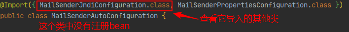

# Spring Boot

## 练习

1. 完成第一个Hello, SpringBoot

2. 进行yaml配置
   
   - User通过yaml注入值，了解properties赋值方法
   
3. 给User增加 JSR303

4. 进行多环境的切换
   
   - 复习配置环境的加载顺序
   
5. 通过两种方式获取静态资源jquery
   
   - 了解第二种方式其优先级
   
6. 在网上找到一份免费的后端页面模板修改成自己熟悉的

7. 对首页和图标进行定制

8. 添加 thymeleaf 模板引擎

9. 扩展（全面接管）SpringMVC
   
   - 练习addViewControllers
   
10. 通过yaml连接数据库
    - 通过JDBCTemplate实现CRUD（知道怎么处理的就行）
    - 将数据源换成Druid
    
11. 整合Mybatis

12. 实现页面之间的多层跳转，为接下来的安全准备

13. 分别用两种方式实现网页安全，（认证，授权，权限控制，注销，记住我，制定登入页）

14. 增加Swagger监控流程

15. 完成异步、定时、邮件任务

    

## 1、简介

### 1.1、什么是SpringBoot

Java企业级应用->J2EE->spring->springboot的过程。


Spring Boot 基于 Spring 开发，Spirng Boot 本身并不提供 Spring 框架的核心特性以及扩展功能，只是用于快速、敏捷地开发新一代基于 Spring 框架的应用程序。也就是说，它并不是用来替代 Spring 的解决方案，而是和 Spring 框架紧密结合用于提升 Spring 开发者体验的工具。Spring Boot 以**约定大于配置的核心思想**，默认帮我们进行了很多设置，多数 Spring Boot 应用只需要很少的 Spring 配置。同时它集成了大量常用的第三方库配置（例如 Redis、MongoDB、Jpa、RabbitMQ、Quartz 等等），Spring Boot 应用中这些第三方库几乎可以零配置的开箱即用。

简单来说就是SpringBoot其实不是什么新的框架，它默认配置了很多框架的使用方式，就像maven整合了所有的jar包，spring boot整合了所有的框架 。

Spring Boot 出生名门，从一开始就站在一个比较高的起点，又经过这几年的发展，生态足够完善，Spring Boot 已经当之无愧成为 Java 领域最热门的技术。


**Spring Boot的主要优点：**

- 为所有Spring开发者更快的入门
- **开箱即用**，提供各种默认配置来简化项目配置
- 内嵌式容器简化Web项目
- 没有冗余代码生成和XML配置的要求


狂神笔记：https://dwz.cn/P1N121RT


## 2、第一个程序Hello SpringBoot

### 2.1、创建基础项目说明

Spring官方提供了非常方便的工具让我们快速构建应用

Spring Initializr：https://start.spring.io/s

**项目创建方式一：**使用Spring Initializr 的 Web页面创建项目

1、打开  https://start.spring.io/

2、填写项目信息

3、点击”Generate Project“按钮生成项目；下载此项目

4、解压项目包，并用IDEA以Maven项目导入，一路下一步即可，直到项目导入完毕。

5、如果是第一次使用，可能速度会比较慢，包比较多、需要耐心等待一切就绪。


**项目创建方式二：**使用 IDEA 直接创建项目

1、创建一个新项目

2、选择spring initalizr ， 可以看到默认就是去官网的快速构建工具那里实现

3、填写项目信息

4、选择初始化的组件（初学勾选 Web 即可）

5、填写项目路径

6、等待项目构建成功


**项目结构分析：**

通过上面步骤完成了基础项目的创建。就会自动生成以下文件。

1、程序的主启动类

2、一个 application.properties 配置文件

3、一个 测试类

4、一个 pom.xml


> **pom.xml分析**

Spring Boot项目的依赖：

```xml
<!-- 父依赖 -->
<parent>
    <groupId>org.springframework.boot</groupId>
    <artifactId>spring-boot-starter-parent</artifactId>
    <version>2.2.5.RELEASE</version>
    <relativePath/>
</parent>

<dependencies>
    <!-- web场景启动器 -->
    <dependency>
        <groupId>org.springframework.boot</groupId>
        <artifactId>spring-boot-starter-web</artifactId>
    </dependency>
    <!-- springboot单元测试 -->
    <dependency>
        <groupId>org.springframework.boot</groupId>
        <artifactId>spring-boot-starter-test</artifactId>
        <scope>test</scope>
        <!-- 剔除依赖 -->
        <exclusions>
            <exclusion>
                <groupId>org.junit.vintage</groupId>
                <artifactId>junit-vintage-engine</artifactId>
            </exclusion>
        </exclusions>
    </dependency>
</dependencies>

<build>
    <plugins>
        <!-- 打包插件 -->
        <plugin>
            <groupId>org.springframework.boot</groupId>
            <artifactId>spring-boot-maven-plugin</artifactId>
        </plugin>
    </plugins>
</build>
```


> **编写一个http接口**

1. 在主程序的同级目录下，新建一个controller包，一定要在同级目录下，否则识别不到

2. 在包中新建一个HelloController类

   ```java
   @RestController
   public class HelloController {
   
       @RequestMapping("/hello")
       public String hello() {
           return "Hello World";
       }
       
   }
   ```

3. 编写完毕后，从主程序启动项目，浏览器发起请求，看页面返回；控制台输出了 Tomcat 访问的端口号！


> **将项目打成jar包，点击 maven的 package**


如果遇到以上错误，可以配置打包时 跳过项目运行测试用例

```xml
<!--
    在工作中,很多情况下我们打包是不想执行测试用例的
    可能是测试用例不完事,或是测试用例会影响数据库数据
    跳过测试用例执
    -->
<plugin>
    <groupId>org.apache.maven.plugins</groupId>
    <artifactId>maven-surefire-plugin</artifactId>
    <configuration>
        <!--跳过项目运行测试用例-->
        <skipTests>true</skipTests>
    </configuration>
</plugin>
```

如果打包成功，则会在target目录下生成一个 jar 包

打成了jar包后，就可以在任何地方运行


## 3、运行原理初探

### pom.xml

**父依赖**

其中它主要是依赖一个父项目，主要是管理项目的资源过滤及插件

```xml
<parent>
    <groupId>org.springframework.boot</groupId>
    <artifactId>spring-boot-starter-parent</artifactId>
    <version>2.2.5.RELEASE</version>
    <relativePath/> <!-- lookup parent from repository -->
</parent>
```

点进去，发现还有一个父依赖

```xml
<parent>
    <groupId>org.springframework.boot</groupId>
    <artifactId>spring-boot-dependencies</artifactId>
    <version>2.2.5.RELEASE</version>
    <relativePath>../../spring-boot-dependencies</relativePath>
</parent>
```

这才是真正管理SpringBoot应用里面所有依赖版本的地方，SpringBoot的版本控制中心；


**小结：**以后我们导入依赖默认是不需要写版本；但是如果导入的包没有在依赖中管理着就需要手动配置版本了


### 启动器 spring-boot-starter

```xml
<dependency>
    <groupId>org.springframework.boot</groupId>
    <artifactId>spring-boot-starter-web</artifactId>
</dependency>
```

**springboot-boot-starter-xxx**：就是spring-boot的场景启动器

**spring-boot-starter-web**：帮我们导入了web模块正常运行所依赖的组件；

SpringBoot将所有的功能场景都抽取出来，做成一个个的starter （启动器），只需要在项目中引入这些starter即可，所有相关的依赖都会导入进来 ， 我们要用什么功能就导入什么样的场景启动器即可 ；我们未来也可以自己自定义 starter；


### **主启动类**

**默认的主启动类**

```java
// @SpringBootApplication 来标注一个主程序类
// 说明这是一个Spring Boot应用
@SpringBootApplication
public class SpringbootApplication {

   public static void main(String[] args) {
     //以为是启动了一个方法，没想到启动了一个服务
      SpringApplication.run(SpringbootApplication.class, args);
   }

}
```

看起来简单，但并不简单


### @SpringBootApplication

标注在某个类上说明这个类是SpringBoot的主配置类 


进入这个注解：可以看到还有很多

```java
@SpringBootConfiguration
@EnableAutoConfiguration
@ComponentScan(
    excludeFilters = {@Filter(
    type = FilterType.CUSTOM,
    classes = {TypeExcludeFilter.class}
), @Filter(
    type = FilterType.CUSTOM,
    classes = {AutoConfigurationExcludeFilter.class}
)}
)
public @interface SpringBootApplication {
    // ......
}
```

点开`@SpringBootConfiguration`

```java
@Configuration
public @interface SpringBootConfiguration {}
```

@Configuration，说明这是一个配置类 ，配置类就是对应Spring的xml 配置文件

再点开`@Configuration`

```java
@Component
public @interface Configuration {}
```

看到@Component 这就说明，启动类本身也是Spring中的一个组件而已，负责启动应用


点开`@EnableAutoConfiguration`

```java
@Inherited
@AutoConfigurationPackage
@Import({AutoConfigurationImportSelector.class})
public @interface EnableAutoConfiguration {}
```


```java
@Import({Registrar.class})
public @interface AutoConfigurationPackage {
}
```

`@import`：Spring底层注解@import ， 给容器中导入一个组件

`Registrar.class`：将主启动类的所在包及包下面所有子包里面的所有组件扫描到Spring容器 


```java
// SpringBoot的配置类 ，标注在某个类上 ， 表示这是一个SpringBoot的配置类
@SpringBootConfiguration
		@@Configuration
				@Component

// 开启自动配置功能
@EnableAutoConfiguration


```


## 4、yaml 配置文件

SpringBoot使用一个全局的配置文件 ， 配置文件名称是固定的

- application.properties
  - 语法结构 ：key=value

- application.yml
  - 语法结构 ：key：空格 value


**配置文件的作用 ：**修改SpringBoot自动配置的默认值，因为SpringBoot在底层都给我们自动配置好了；


properties：

```properties
server.port=8081
```

yaml：

```yaml
server:
  port: 8081
```

xml：

```xml
<server>
	<port>8081</port>
</server>
```


同一个名称的配置文件存在优先级

properties > yaml > yml


### yaml基础语法

说明：语法要求严格！

1、空格不能省略

2、**以缩进来控制层级关系**，只要是左边对齐的一列数据都是同一个层级的。

3、属性和值的大小写都是十分敏感的。


```yaml
#对象、Map格式
k: 
    v1:
    v2:
    
# 对象
student:
    name: qinjiang
    age: 3
    
# 行内写法
student: {name: qinjiang,age: 3}

# 数组（List、set）
pets:
 - cat
 - dog
 - pig
 
# 行内写法
pets: [cat,dog,pig]
```


### 注入配置文件

yaml文件更强大的地方在于，他可以给我们的实体类直接注入匹配值！


1. 给Person类注入属性

```java
@Component //注册bean到容器中
public class Person {
    private String name;
    private Integer age;
    private Boolean happy;
    private Date birth;
    private Map<String,Object> maps;
    private List<Object> lists;
    private Dog dog;
    
    //有参无参构造、get、set方法、toString()方法...  
}
```

2. yaml

```yaml
person:
  name: qinjiang
  age: 3
  happy: false
  birth: 2000/01/01
  maps: {k1: v1,k2: v2}
  lists:
   - code
   - girl
   - music
  dog:
    name: 旺财
    age: 1
```

3. 这是的Person类需要添加注解`@ConfigurationProperties(prefix = "person")`

```java
@Component //注册bean
@ConfigurationProperties(prefix = "person")
public class Person {
    private String name;
    private Integer age;
    private Boolean happy;
    private Date birth;
    private Map<String,Object> maps;
    private List<Object> lists;
    private Dog dog;
}
```

```
@ConfigurationProperties作用：将配置文件中配置的每一个属性的值，映射到这个组件中；告诉SpringBoot将本类中的所有属性和配置文件中相关的配置进行绑定参数 prefix = “person” : 将配置文件中的person下面的所有属性一一对应
```

4. 添加完注解后，IDEA会提示 --springboot配置注解处理器没有找到，让我们看文档，我们可以查看文档，找到一个依赖！

```xml
<!-- 导入配置文件处理器，配置文件进行绑定就会有提示，需要重启 -->
<dependency>
  <groupId>org.springframework.boot</groupId>
  <artifactId>spring-boot-configuration-processor</artifactId>
  <optional>true</optional>
</dependency>
```

5. 确认以上配置都OK之后，我们去测试类中测试一下：

```java
@SpringBootTest
class DemoApplicationTests {

    @Autowired
    Person person; //将person自动注入进来

    @Test
    public void contextLoads() {
        System.out.println(person); //打印person信息
    }

}
```


### 配置文件占位符

配置文件还可以编写占位符生成随机数

```yaml
person:
    name: qinjiang${random.uuid} # 随机uuid
    age: ${random.int}  # 随机int
    happy: false
    birth: 2000/01/01
    maps: {k1: v1,k2: v2}
    lists:
      - code
      - girl
      - music
    dog:
      name: ${person.hello:other}_旺财
      age: 1
```


### 回顾properties配置，

**加载指定的配置文件  -SpEL  (SpringEL)** 

**`@PropertySource ：`**加载指定的配置文件；

**`@configurationProperties`**：默认从全局配置文件中获取值；


1、我们去在resources目录下新建一个**person.properties**文件

```properties
name=baven
```

2、然后在我们的代码中指定加载person.properties文件

```java
@PropertySource(value = "classpath:person.properties")
@Component // 注册bean
public class Person {

    @Value("${name}")
    private String name;

    get,set,toString...  
}
```


**另一种**

1. 创建实体类

   ```java
   @Component // 注册bean
   public class User {
       private String name;
       private int age;
       private String sex;
   }
   ```

2. 编辑配置文件 user.properties

   ```properties
   user1.name=kuangshen
   user1.age=18
   user1.sex=男
   ```

3. 我们在User类上使用@Value来进行注入！

   ```java
   @Component // 注册bean
   @PropertySource(value = "classpath:user.properties")
   public class User {
       //直接使用@value
       @Value("${user.name}") // 从配置文件中取值
       private String name;EL
       @Value("#{9*2}")  // #{SpEL} SpringEL表达式
       private int age;
       @Value("男")  // 字面量
       private String sex;
   }
   ```

4. SpringBoot测试

   ```java
   
   @SpringBootTest
   class DemoApplicationTests {
   
       @Autowired
       User user;
   
       @Test
       public void contextLoads() {
           System.out.println(user);
       }
   
   }
   ```

   


### 对比小结


结论：

配置yml和配置properties都可以获取到值 ， 强烈推荐 yml

如果我们在某个业务中，只需要获取配置文件中的某个值，可以使用一下 @value

如果说，我们专门编写了一个JavaBean来和配置文件进行一一映射，就直接@configurationProperties，不要犹豫！


### JSR303数据校验

- 如果使用不了需要在Maven中添加 Validation-api

- 新版本需要validaiton启动器

  ```xml
  <dependency>
  	<groupId>org.springframework.boot</groupId>
  	<artifactId>spring-boot-starter-validation</artifactId>
  </dependency>
  ```

Springboot中可以用@validated来校验数据，如果数据异常则会统一抛出异常，方便异常中心统一处理。

这个是spring-context包下的注解，所以应该也能在spring的项目中做

例如：写个注解让我们的name只能支持Email格式

```java
@Component // 注册bean
@ConfigurationProperties(prefix = "person")
@Validated  // 数据校验
public class Person {

    @Email(message="邮箱格式错误") // name必须是邮箱格式
    private String name;
}
```

这时yaml中存的数据是`Baven`，那么运行结果 ：default message [邮箱格式错误]

所以，**使用数据校验，可以保证数据的正确性。**


> 常用参数

```java
@NotNull(message="名字不能为空")
private String userName;
@Max(value=120,message="年龄最大不能查过120")
private int age;
@Email(message="邮箱格式错误")
private String email;

// 空检查
@Null       //验证对象是否为null
@NotNull    //验证对象是否不为null, 无法查检长度为0的字符串
@NotBlank   //检查约束字符串是不是Null还有被Trim的长度是否大于0,只对字符串,且会去掉前后空格.
@NotEmpty   //检查约束元素是否为NULL或者是EMPTY.
    
//Booelan检查
@AssertTrue     //验证 Boolean 对象是否为 true  
@AssertFalse    //验证 Boolean 对象是否为 false  
    
//长度检查
@Size(min=, max=) //验证对象（Array,Collection,Map,String）长度是否在给定的范围之内  
@Length(min=, max=) //2string is between min and max included.

//日期检查
@Past       //验证 Date 和 Calendar 对象是否在当前时间之前  
@Future     //验证 Date 和 Calendar 对象是否在当前时间之后  
@Pattern    //验证 String 对象是否符合正则表达式的规则

//.......等等
//除此以外，我们还可以自定义一些数据校验规则
```

最主要的要记住`@Pattern`正则表达式


## 5、多环境配置

profile是Spring对不同环境提供不同配置功能的支持，可以通过激活不同的环境版本，实现快速切换环境。

### 多配置文件

在主配置文件编写的时候，文件名可以是 application-{profile}.properties/yml , 用来指定多个环境版。

**例如：**

> 在properties中

`application-test.properties` 代表测试环境配置

`application-dev.properties` 代表开发环境配置

SpringBoot默认使用application.properties主配置文件，并不会直接启动这些配置文件。

所以在默认的`application.properties`下，通过一个配置来选择需要激活的环境：

```properties
#比如在配置文件中指定使用dev环境，我们可以通过设置不同的端口号进行测试；
#我们启动SpringBoot，就可以看到已经切换到dev下的配置了；
spring.profiles.active=dev
```


> 在yaml中

和properties配置文件中一样，但是使用yml去实现不需要创建多个配置文件，所以更加方便。

```yaml
server:
  port: 8081
#选择要激活那个环境块
spring:
  profiles:
    active: prod

---
server:
  port: 8083
spring:
  profiles: dev  #配置环境的名称

---
server:
  port: 8084
spring:
  profiles: prod  #配置环境的名称
```


**注意：**如果yml和properties同时都配置了端口，并且没有激活其他环境 ， 默认会使用properties配置文件的


### 配置文件加载顺序

--优先级

外部加载配置文件的方式十分多，我们选择最常用的即可，在开发的资源文件中进行配置


在官方文档中可知

从中可了解到

```
1：项目路径下的config文件夹配置文件
2：项目路径下配置文件
3：资源路径下的config文件夹配置文件
4：资源路径下配置文件
```

优先级由高到底，高优先级的配置会覆盖低优先级的配置


## 6、自动配置原理

视频12再回顾


## 7、SrpingBoot Web开发

### 静态资源

**静态资源映射规则：**

SpringBoot中，SpringMVC的web配置都在 `WebMvcAutoConfiguration` 这个配置类里面,

在 `WebMvcAutoConfigurationAdapter` 中有很多配置方法，

其中有一个方法：`addResourceHandlers` 添加资源处理

```java
@Override
public void addResourceHandlers(ResourceHandlerRegistry registry) {
    if (!this.resourceProperties.isAddMappings()) {
        // 已禁用默认资源处理
        logger.debug("Default resource handling disabled");
        return;
    }
    // 缓存控制
    Duration cachePeriod = this.resourceProperties.getCache().getPeriod();
    CacheControl cacheControl = this.resourceProperties.getCache().getCachecontrol().toHttpCacheControl();
    // webjars 配置
    if (!registry.hasMappingForPattern("/webjars/**")) {
        customizeResourceHandlerRegistration(registry.addResourceHandler("/webjars/**")
                                             .addResourceLocations("classpath:/META-INF/resources/webjars/")
                                             .setCachePeriod(getSeconds(cachePeriod)).setCacheControl(cacheControl));
    }
    // 静态资源配置
    String staticPathPattern = this.mvcProperties.getStaticPathPattern();
    if (!registry.hasMappingForPattern(staticPathPattern)) {
        customizeResourceHandlerRegistration(registry.addResourceHandler(staticPathPattern)
                                       .addResourceLocations(getResourceLocations(this.resourceProperties.getStaticLocations()))
                                             .setCachePeriod(getSeconds(cachePeriod)).setCacheControl(cacheControl));
    }
}
```

从中可得知：比如所有的 /webjars/** ， 都需要去 classpath:/META-INF/resources/webjars/ 找对应的资源。


> 那么什么是`webjars`？

Webjars本质就是以jar包的方式引入我们的静态资源 ， 我们以前要导入一个静态资源文件，直接导入即可。

使用SpringBoot需要使用Webjars，使用网站下的webjars：

网站：https://www.webjars.org 

要使用jQuery，我们只要要引入jQuery对应版本的pom依赖即可。

```xml
<dependency>
    <groupId>org.webjars</groupId>
    <artifactId>jquery</artifactId>
    <version>3.4.1</version>
</dependency>
```

- 导入完毕，便可在webjars的目录结构里访问到`jquery.js`文件。
- 访问：只要是静态资源，SpringBoot就会去对应的路径寻找资源，如：浏览器访问：http://localhost:8080/webjars/jquery/3.4.1/jquery.js

**（但是这种方式用的很少了，不推荐使用）**


> 第二种静态资源映射规则

——导入自己的静态资源

通过 `staticPathPattern` 发现第二种映射规则 ：/** , 访问当前的项目任意资源，它会去找 resourceProperties 这个类，

查看源码：

```java
    // 进入方法
    public String[] getStaticLocations() {
        return this.staticLocations;
    }
    // 找到对应的值
    private String[] staticLocations = CLASSPATH_RESOURCE_LOCATIONS;
    // 找到路径
    private static final String[] CLASSPATH_RESOURCE_LOCATIONS = { 
        "classpath:/META-INF/resources/",
        "classpath:/resources/", 
        "classpath:/static/", 
        "classpath:/public/" 
    };
```

ResourceProperties 可以设置和我们静态资源有关的参数；这里面指向了它会去寻找资源的文件夹，即上面数组的内容。

从中可以知道，以下四个目录存放的静态资源可以被识别：

```java
    "classpath:/META-INF/resources/"
    "classpath:/resources/"
    "classpath:/static/"
    "classpath:/public/"
```

访问 http://localhost:8080/1.js , 它就会去这些文件夹中寻找对应的静态资源文件。

优先级：resources > static (默认) > public


### 首页和图标定制

**页面：**在扩展MVC中配置视图控制

- 通过源码可知，默认的首页就是`index.html`文件
- 访问  http://localhost:8080/ ，就会找静态资源文件夹下的 index.html

- 在templates目录下的所有页面，只能通过controller来跳转，像WEB-INF	

**图标：**首先关闭默认图标

- 在properties里关闭`spring.mvc.favicon.enabled=false`
- 之后把`favicon.ico`图标放在静态资源目录里
- 之后就会自动生成


### Thymeleaf模板引擎

`xmlns:th="http://www.thymeleaf.org"`


> SpringBoot这个项目首先是以jar的方式，不是war，且我们用的还是嵌入式的Tomcat，所以**现在默认是不支持jsp的**。
>
> 不用jsp，又直接用纯静态页面的方式，会开发者会带来非常大的麻烦。

所以**SpringBoot推荐你可以来使用模板引擎：**

模板引擎：

- 其实jsp就是一个模板引擎，用的比较多的还有freemarker，包括SpringBoot给我们推荐的Thymeleaf。

- 模板引擎有非常多，但再多的模板引擎，思想都是一样的，图解：


- 不同模板引擎之间，他们可能这个语法有点不一样。


#### 引入Thymeleaf

对于springboot来说，什么事情不都是一个start的事情嘛，我们去在项目中引入一下。

有三个网址：

- Thymeleaf 官网：https://www.thymeleaf.org/
- Thymeleaf 在Github 的主页：https://github.com/thymeleaf/thymeleaf
- Spring官方文档：找到我们对应的版本

找到对应的pom依赖：

```xml
<!--thymeleaf-->
<dependency>
    <groupId>org.springframework.boot</groupId>
    <artifactId>spring-boot-starter-thymeleaf</artifactId>
</dependency>
```


#### 分析Thymeleaf

> 按照SpringBoot的自动配置原理看一下我们这个Thymeleaf的自动配置规则，在按照那个规则进行使用。

找到 Thymeleaf 的自动配置类：`ThymeleafProperties`

```java
@ConfigurationProperties(prefix = "spring.thymeleaf")
public class ThymeleafProperties {
    private static final Charset DEFAULT_ENCODING;
    public static final String DEFAULT_PREFIX = "classpath:/templates/";
    public static final String DEFAULT_SUFFIX = ".html";
    private boolean checkTemplate = true;
    private boolean checkTemplateLocation = true;
    private String prefix = "classpath:/templates/";
    private String suffix = ".html";
    private String mode = "HTML";
    private Charset encoding;
}
```

- 其中看到默认的前缀和后缀。
- 只需要把html页面放在类路径下的templates下，thymeleaf就可以帮我们自动渲染了。
- 使用thymeleaf什么都不需要配置，只需要将他放在指定的文件夹下即可。


可进行简单的测试，页面跳转到`test.html`上。


#### Thymeleaf语法

学习语法，参考官网文档最为准确，找到对应的版本

Thymeleaf 官网：https://www.thymeleaf.org/ ， 简单看一下官网，下载Thymeleaf的官方文档。


**做个最简单的练习 ：我们需要查出一些数据，在页面中展示**

1. 要在html中使用thymeleaf，需要在html文件中导入命名空间的约束 `xmlns:th="http://www.thymeleaf.org"`

   ```html
   <!DOCTYPE html>
   <html lang="en" xmlns:th="http://www.thymeleaf.org">
   <head>
       <meta charset="UTF-8">
       ......
   ```

2. 在请求测试中，增加数据传输

   ```java
   @RequestMapping("/t1")
   public String test1(Model model){
       
       model.addAttribute("msg","Hello,Thymeleaf");
       return "test";
       
   }
   ```

3. 编写页面

   ```html
   <!DOCTYPE html>
   <html lang="en" xmlns:th="http://www.thymeleaf.org">
   <head>
       <meta charset="UTF-8">
       <title>狂神说</title>
   </head>
   <body>
   <h1>测试页面</h1>
   
   <!--th:text就是将div中的内容设置为它指定的值，和之前学习的Vue一样-->
   <div th:text="${msg}"></div>
   </body>
   </html>
   ```

4. 启动测试，便有结果


**认真系列**

1. 有哪些表达式呢

   ```
   
   Selection Variable Expressions: *{...}：选择表达式：和${}在功能上是一样；
   Message Expressions: #{...}：获取国际化内容
   Link URL Expressions: @{...}：定义URL；
   Fragment Expressions: ~{...}：片段引用表达式
   
   Literals（字面量）
   Text literals: 'one text' , 'Another one!' ,…
   Number literals: 0 , 34 , 3.0 , 12.3 ,…
   Boolean literals: true , false
   Null literal: null
   Literal tokens: one , sometext , main ,…
   
   Text operations:（文本操作）
   String concatenation: +
   Literal substitutions: |The name is ${name}|
   
   Arithmetic operations:（数学运算）
   Binary operators: + , - , * , / , %
   Minus sign (unary operator): -
   
   Boolean operations:（布尔运算）
   Binary operators: and , or
   Boolean negation (unary operator): ! , not
   
   Comparisons and equality:（比较运算）
   Comparators: > , < , >= , <= ( gt , lt , ge , le )
   Equality operators: == , != ( eq , ne )
   
   Conditional operators:条件运算（三元运算符）
   If-then: (if) ? (then)
   If-then-else: (if) ? (then) : (else)
   Default: (value) ?: (defaultvalue)
   
   Special tokens:
   No-Operation: _
   ```

2. 可以使用任意的 th:attr 来替换Html中原生属性的值

   


练习测试：

1. 编写controller，存放数据

   ```java
   @RequestMapping("/t2")
   public String test2(Map<String,Object> map){
   
       map.put("msg","<h1>Hello</h1>");
       map.put("users", Arrays.asList("qinjiang","kuangshen"));
       
       return "test";
   }
   ```

2. 测试页面取出数据

   ```html
   <!DOCTYPE html>
   <html lang="en" xmlns:th="http://www.thymeleaf.org">
   <head>
       <meta charset="UTF-8">
       <title>狂神说</title>
   </head>
   <body>
   <h1>测试页面</h1>
   
   <div th:text="${msg}"></div>
   <!--不转义-->
   <div th:utext="${msg}"></div>
   
   <!--遍历数据-->
   <!--th:each每次遍历都会生成当前这个标签：官网#9-->
   <h4 th:each="user :${users}" th:text="${user}"></h4>
   
   <h4>
       <!--行内写法：官网#12-->
       <span th:each="user:${users}">[[${user}]]</span>
   </h4>
   
   </body>
   </html>
   ```

   

**要熟练使用官方文档**


### MVC自动配置原理

> 官网阅读

在进行项目编写前，还需要知道SpringBoot对SpringMVC做了哪些配置，包括如何扩展，如何定制。

- 途径一：源码分析

- 途径二：官方文档地址 ：https://docs.spring.io/spring-boot/docs/2.2.5.RELEASE/reference/htmlsingle/#boot-features-spring-mvc-auto-configuration

```
Spring MVC Auto-configuration
// Spring Boot为Spring MVC提供了自动配置，它可以很好地与大多数应用程序一起工作。
Spring Boot provides auto-configuration for Spring MVC that works well with most applications.
// 自动配置在Spring默认设置的基础上添加了以下功能：
The auto-configuration adds the following features on top of Spring’s defaults:
// 包含视图解析器
Inclusion of ContentNegotiatingViewResolver and BeanNameViewResolver beans.
// 支持静态资源文件夹的路径，以及webjars
Support for serving static resources, including support for WebJars 
// 自动注册了Converter：
// 转换器，这就是我们网页提交数据到后台自动封装成为对象的东西，比如把"1"字符串自动转换为int类型
// Formatter：【格式化器，比如页面给我们了一个2019-8-10，它会给我们自动格式化为Date对象】
Automatic registration of Converter, GenericConverter, and Formatter beans.
// HttpMessageConverters
// SpringMVC用来转换Http请求和响应的的，比如我们要把一个User对象转换为JSON字符串，可以去看官网文档解释；
Support for HttpMessageConverters (covered later in this document).
// 定义错误代码生成规则的
Automatic registration of MessageCodesResolver (covered later in this document).
// 首页定制
Static index.html support.
// 图标定制
Custom Favicon support (covered later in this document).
// 初始化数据绑定器：帮我们把请求数据绑定到JavaBean中！
Automatic use of a ConfigurableWebBindingInitializer bean (covered later in this document).

/*
如果您希望保留Spring Boot MVC功能，并且希望添加其他MVC配置（拦截器、格式化程序、视图控制器和其他功能），则可以添加自己
的@configuration类，类型为webmvcconfiguer，但不添加@EnableWebMvc。如果希望提供
RequestMappingHandlerMapping、RequestMappingHandlerAdapter或ExceptionHandlerExceptionResolver的自定义
实例，则可以声明WebMVCregistrationAdapter实例来提供此类组件。
*/
If you want to keep Spring Boot MVC features and you want to add additional MVC configuration 
(interceptors, formatters, view controllers, and other features), you can add your own 
@Configuration class of type WebMvcConfigurer but without @EnableWebMvc. If you wish to provide 
custom instances of RequestMappingHandlerMapping, RequestMappingHandlerAdapter, or 
ExceptionHandlerExceptionResolver, you can declare a WebMvcRegistrationsAdapter instance to provide such components.

// 如果您想完全控制Spring MVC，可以添加自己的@Configuration，并用@EnableWebMvc进行注释。
If you want to take complete control of Spring MVC, you can add your own @Configuration annotated with @EnableWebMvc.
```

以上是它告诉我们SpringBoot已经帮我们自动配置好了SpringMVC，但是配置了那些东西呢？


> **ContentNegotiatingViewResolver 内容协商视图解析器** 

- 自动配置了ViewResolver，就是之前学的 SpringMVC 中的视图解析器。

- 即根据方法的返回值取得视图对象（View），然后由视图对象决定如何渲染（转发，重定向）。

- 找到 `WebMvcAutoConfiguration` 源码， 然后搜索 `ContentNegotiatingViewResolver`。在其中找到下方法：

  ```java
  @Bean
  @ConditionalOnBean(ViewResolver.class)
  @ConditionalOnMissingBean(name = "viewResolver", value = ContentNegotiatingViewResolver.class)
  public ContentNegotiatingViewResolver viewResolver(BeanFactory beanFactory) {
      ContentNegotiatingViewResolver resolver = new ContentNegotiatingViewResolver();
      resolver.setContentNegotiationManager(beanFactory.getBean(ContentNegotiationManager.class));
      // ContentNegotiatingViewResolver使用所有其他视图解析器来定位视图，因此它应该具有较高的优先级
      resolver.setOrder(Ordered.HIGHEST_PRECEDENCE);
      return resolver;
  }
  ```

  可以点进这类再看看，找到对应的解析视图的代码

  ```java
  @Nullable // 注解说明：@Nullable 即参数可为null
  public View resolveViewName(String viewName, Locale locale) throws Exception {
      RequestAttributes attrs = RequestContextHolder.getRequestAttributes();
      Assert.state(attrs instanceof ServletRequestAttributes, "No current ServletRequestAttributes");
      List<MediaType> requestedMediaTypes = this.getMediaTypes(((ServletRequestAttributes)attrs).getRequest());
      if (requestedMediaTypes != null) {
          // 获取候选的视图对象
          List<View> candidateViews = this.getCandidateViews(viewName, locale, requestedMediaTypes);
          // 选择一个最适合的视图对象，然后把这个对象返回
          View bestView = this.getBestView(candidateViews, requestedMediaTypes, attrs);
          if (bestView != null) {
              return bestView;
          }
      }
      // .....
  }
  ```

再去研究下他的组合逻辑，看到有个属性viewResolvers，看看它是在哪里进行赋值的

```java
protected void initServletContext(ServletContext servletContext) {
    // 这里它是从beanFactory工具中获取容器中的所有视图解析器
    // ViewRescolver.class 把所有的视图解析器来组合的
    Collection<ViewResolver> matchingBeans = BeanFactoryUtils.beansOfTypeIncludingAncestors(this.obtainApplicationContext(), ViewResolver.class).values();
    ViewResolver viewResolver;
    if (this.viewResolvers == null) {
        this.viewResolvers = new ArrayList(matchingBeans.size());
    }
    // ...............
}
```


**自己实现一个视图解析器**

1. 自己写一个

   ```java
   @Bean //放到bean中
   public ViewResolver myViewResolver(){
       return new MyViewResolver();
   }
   
   // 写一个静态内部类，视图解析器就需要实现ViewResolver接口
   // 也就是说，实现ViewResolver接口，那么这个类就是视图解析器
   private static class MyViewResolver implements ViewResolver{
       @Override
       public View resolveViewName(String s, Locale locale) throws Exception {
           return null;
       }
   }
   ```

2. 在DispatcherServlet中的`doDIspatch`方法添加一个断点进行调试，因为所有的请求都会走到这个方法中。

3. 启动项目，随便访问一个页面，查看Debug信息，找到this

   

   找到视图解析器，就可看到自定义的在这里

   

（图要换成自己的，顺便练手以下）

小结：如果想要使用自己定制化的东西，我们只需要给容器中添加这个组件就好了！剩下的事情SpringBoot就会帮我们做了


## 8、整合JDBC-Mybatis

### SpringData简介

对于数据访问层，无论是 SQL(关系型数据库) 还是 NOSQL(非关系型数据库)，Spring Boot 底层都是采用 Spring Data 的方式进行统一处理。

Sping Data 官网：https://spring.io/projects/spring-data


### 连接数据库

1. 在创建新项目的时候，需要添加相应的模块

   

2. 完成创建后，发现springboot帮我们自动导入了如下启动器：

   ```xml
   <dependency>
       <groupId>org.springframework.boot</groupId>
       <artifactId>spring-boot-starter-jdbc</artifactId>
   </dependency>
   <dependency>
       <groupId>mysql</groupId>
       <artifactId>mysql-connector-java</artifactId>
       <scope>runtime</scope>
   </dependency>
   ```

3. 编写yaml配置文件连接数据库：

   ```yaml
   spring:
     datasource:
       data-username: root
       data-password: 123456
       url: jdbc:mysql://localhost:3303/mybatistest?serverTimezone=UTC&useUnicode=true&characterEncoding=utf-8
       driver-class-name: com.mysql.jdbc.Driver
   ```

4. 配置完成后，即可直接使用，应为Springboot已经默认帮我们进行自动配置，去测试类中测试

   ```java
   @SpringBootTest
   class SpringbootDataJdbcApplicationTests {
   
       //DI注入数据源
       @Autowired
       DataSource dataSource;
   
       @Test
       public void contextLoads() throws SQLException {
           //看一下默认数据源
           System.out.println(dataSource.getClass());
           //获得连接
           Connection connection =   dataSource.getConnection();
           System.out.println(connection);
           //关闭连接
           connection.close();
       }
   }
   ```

   结果：可以看到SpringBoot默认给我们配置的数据源为：Hikari

   可通过全局搜索，找到数据源的所有自动配置：DataSourceAutoConfiguration

   ```java
   @Import(
       {Hikari.class, Tomcat.class, Dbcp2.class, Generic.class, DataSourceJmxConfiguration.class}
   )
   protected static class PooledDataSourceConfiguration {
       protected PooledDataSourceConfiguration() {
       }
   }
   ```

   这里导入的类都在 DataSourceConfiguration 配置类下，可以看出 Spring Boot 2.2.5 默认使用HikariDataSource 数据源，而以前版本，如 Spring Boot 1.5 默认使用 org.apache.tomcat.jdbc.pool.DataSource 作为数据源；


### JDBCTemplate

1、有了数据源(com.zaxxer.hikari.HikariDataSource)，然后可以拿到数据库连接(java.sql.Connection)，有了连接，就可以使用原生的 JDBC 语句来操作数据库；

2、即使不使用第三方第数据库操作框架，如 MyBatis等，Spring 本身也对原生的JDBC 做了轻量级的封装，即JdbcTemplate。

3、数据库操作的所有 CRUD 方法都在 JdbcTemplate 中。

4、Spring Boot 不仅提供了默认的数据源，同时默认已经配置好了 JdbcTemplate 放在了容器中，程序员只需自己注入即可使用

5、JdbcTemplate 的自动配置是依赖 org.springframework.boot.autoconfigure.jdbc 包下的 JdbcTemplateConfiguration 类


> **JdbcTemplate主要提供以下几类方法：**

- execute方法：可以用于执行任何SQL语句，一般用于执行DDL语句；
- update方法及batchUpdate方法：update方法用于执行新增、修改、删除等语句；batchUpdate方法用于执行批处理相关语句；
- query方法及queryForXXX方法：用于执行查询相关语句；
- call方法：用于执行存储过程、函数相关语句。

> 测试

编写一个Controller，注入JDBCTemplate，编写测试方法进行访问

```java
@RestController
@RequestMapping("/jdbc")
public class JdbcController {

    /**
     * Spring Boot 默认提供了数据源，默认提供了 org.springframework.jdbc.core.JdbcTemplate
     * JdbcTemplate 中会自己注入数据源，用于简化 JDBC操作
     * 还能避免一些常见的错误,使用起来也不用再自己来关闭数据库连接
     */
    @Autowired
    JdbcTemplate jdbcTemplate;

    //List 中的1个 Map 对应数据库的 1行数据
    //Map 中的 key 对应数据库的字段名，value 对应数据库的字段值
    @GetMapping("/list")
    public List<Map<String, Object>> userList(){
        String sql = "select * from t_user";
        List<Map<String, Object>> maps = jdbcTemplate.queryForList(sql);
        return maps;
    }
    
    //新增用户
    @GetMapping("/add")
    public String addUser(){
        //插入语句，注意时间问题
        String sql = "insert into t_user(username, password,age,sex,birth)" +
                " values ('狂神说','24736743@qq.com',1,101,'"+ new Date().toLocaleString() +"')";
        jdbcTemplate.update(sql);
        //查询
        return "addOk";
    }

    //修改用户信息
    @GetMapping("/update/{id}")
    public String updateUser(@PathVariable("id") int id){
        //插入语句
        String sql = "update employee set last_name=?,email=? where id="+id;
        //数据
        Object[] objects = new Object[2];
        objects[0] = "秦疆";
        objects[1] = "24736743@sina.com";
        jdbcTemplate.update(sql,objects);
        //查询
        return "updateOk";
    }

    //删除用户
    @GetMapping("/delete/{id}")
    public String delUser(@PathVariable("id") int id){
        //插入语句
        String sql = "delete from employee where id=?";
        jdbcTemplate.update(sql,id);
        //查询
        return "deleteOk";
    }
    
}
```


## 9、整合Druid

> 简介

1. Druid 是阿里巴巴开源平台上一个数据库连接池实现，结合了 C3P0、DBCP 等 DB 池的优点，同时加入了日志监控。

2. Druid 可以很好的监控 DB 池连接和 SQL 的执行情况，天生就是针对监控而生的 DB 连接池。

3. Druid已经在阿里巴巴部署了超过600个应用，经过一年多生产环境大规模部署的严苛考验。

4. Spring Boot 2.0 以上默认使用 Hikari 数据源，可以说 Hikari 与 Driud 都是当前 Java Web 上最优秀的数据源，我们来重点介绍 Spring Boot 如何集成 Druid 数据源，如何实现数据库监控。

Github地址：https://github.com/alibaba/druid/


**com.alibaba.druid.pool.DruidDataSource 基本配置参数如下：**


### 配置数据源

1. 添加上Druid数据源依赖

   ```xml
   <!-- https://mvnrepository.com/artifact/com.alibaba/druid -->
   <dependency>
       <groupId>com.alibaba</groupId>
       <artifactId>druid</artifactId>
       <version>1.1.21</version>
   </dependency>
   ```

2. 在之前配置好的yaml中切换数据源

   ```yaml
   spring:
     datasource:
       username: root
       password: 123456
       url: jdbc:mysql://localhost:3306/springboot?serverTimezone=UTC&useUnicode=true&characterEncoding=utf-8
       driver-class-name: com.mysql.cj.jdbc.Driver
       type: com.alibaba.druid.pool.DruidDataSource # 自定义数据源，切换至Druid
   ```

3. 在测试类中注入DateSource，运行便可查看切换是否成功

   ```java
   @SpringBootTest
   class SpringbootDataJdbcApplicationTests {
   
       //DI注入数据源
       @Autowired
       DataSource dataSource;
   
       @Test
       public void contextLoads() throws SQLException {
   ```

4. 切换成功便可在yaml中继续设置数据源连接初始化大小、最大连接数、等待时间、最小连接数 等设置项；详细可以查看源码

   ```yaml
   spring:
     datasource:
       username: root
       password: 123456
       url: jdbc:mysql://localhost:3306/mybayistest?serverTimezone=UTC&useUnicode=true&characterEncoding=utf-8
       driver-class-name: com.mysql.cj.jdbc.Driver
       type: com.alibaba.druid.pool.DruidDataSource
   
       #Spring Boot 默认是不注入这些属性值的，需要自己绑定
       #druid 数据源专有配置
       initialSize: 5
       minIdle: 5
       maxActive: 20
       maxWait: 60000
       timeBetweenEvictionRunsMillis: 60000
       minEvictableIdleTimeMillis: 300000
       validationQuery: SELECT 1 FROM DUAL 
       testWhileIdle: true
       testOnBorrow: false
       testOnReturn: false
       poolPreparedStatements: true
   
       #配置监控统计拦截的filters，stat:监控统计、log4j：日志记录、wall：防御sql注入
       #如果允许时报错  java.lang.ClassNotFoundException: org.apache.log4j.Priority
       #则导入 log4j 依赖即可，Maven 地址：https://mvnrepository.com/artifact/log4j/log4j
       filters: stat,wall,log4j
       maxPoolPreparedStatementPerConnectionSize: 20
       useGlobalDataSourceStat: true
       connectionProperties: druid.stat.mergeSql=true;druid.stat.slowSqlMillis=500
   ```

   这些配置需要填写，否则在web监测中就无法查看到sql。且要添加log4j包。

5. 导入Log4j的依赖

   ```xml
   <!-- https://mvnrepository.com/artifact/log4j/log4j -->
   <dependency>
       <groupId>log4j</groupId>
       <artifactId>log4j</artifactId>
       <version>1.2.17</version>
   </dependency>
   ```

6. 现在需要程序员自己为 DruidDataSource 绑定全局配置文件中的参数，再添加到容器中，而不再使用 Spring Boot 的自动生成了；我们需要 自己添加 DruidDataSource 组件到容器中，并绑定属性；

   ```java
   @Configuration
   public class DruidConfig {
   
       /*
          将自定义的 Druid数据源添加到容器中，不再让SpringBoot自动创建
          绑定全局配置文件中的 druid 数据源属性到 com.alibaba.druid.pool.DruidDataSource从而让它们生效
          @ConfigurationProperties(prefix = "spring.datasource")：作用就是将 全局配置文件中
          前缀为 spring.datasource的属性值注入到 com.alibaba.druid.pool.DruidDataSource 的同名参数中
        */
       @ConfigurationProperties(prefix = "spring.datasource")
       @Bean
       public DataSource druidDataSource() {
           return new DruidDataSource();
       }
       
   }
   ```

7. 去测试类进行测试

   ```java
   @SpringBootTest
   class SpringbootDataJdbcApplicationTests {
   
       @Autowired
       DataSource dataSource;
   
       @Test
       public void contextLoads() throws SQLException {
           //看一下默认数据源
           System.out.println(dataSource.getClass());
           //获得连接
           Connection connection = dataSource.getConnection();
           System.out.println(connection);
   
           DruidDataSource druidDataSource = (DruidDataSource) dataSource;
           System.out.println("druidDataSource 数据源最大连接数：" + druidDataSource.getMaxActive());
           System.out.println("druidDataSource 数据源初始化连接数：" + druidDataSource.getInitialSize());
   
           //关闭连接
           connection.close();
       }
   }
   ```

   


### 配置Druid数据源监控

Druid 数据源具有监控的功能，并提供了一个 web 界面方便用户查看，类似安装 路由器 时，人家也提供了一个默认的 web 页面。

（暂记 能配置的参数都在  ResourceServlet 里 ）

1. 需要设置 Druid 的后台管理页面，比如登录账号、密码等，配置后台管理；

   ```java
   //配置 Druid 监控管理后台的Servlet；
   //内置 Servlet 容器时没有web.xml文件，所以使用 Spring Boot 的注册 Servlet 方式
   @Bean
   public ServletRegistrationBean statViewServlet() {
       ServletRegistrationBean bean = new ServletRegistrationBean(new StatViewServlet(), "/druid/*");
   
       // 这些参数可以在 com.alibaba.druid.support.http.StatViewServlet 
       // 的父类 com.alibaba.druid.support.http.ResourceServlet 中找到
       Map<String, String> initParams = new HashMap<>();
       initParams.put("loginUsername", "admin"); //后台管理界面的登录账号
       initParams.put("loginPassword", "123456"); //后台管理界面的登录密码
   
       //后台允许谁可以访问
       //initParams.put("allow", "localhost")：表示只有本机可以访问
       //initParams.put("allow", "")：为空或者为null时，表示允许所有访问
       initParams.put("allow", "");
       //deny：Druid 后台拒绝谁访问
       //initParams.put("kuangshen", "192.168.1.20");表示禁止此ip访问
   
       //设置初始化参数
       bean.setInitParameters(initParams);
       return bean;
   }
   ```

   注意：

   - 遇到的问题：在 `new StatViewServlet()`时，出现了错误，无法被创建出来。
   - 解决：点进源码查看时，发现关于servlet的包全部都报红了，所以在maven pom 中导入了servlet，就可以创建了。
     - 注意：导入的servlet包要3.0+，要不会没有`ServletRegistration`和`MultipartConfigElement`

   

2. 配置完毕后，我们可以选择访问 ：http://localhost:8080/druid/login.html

3. 输入刚才配置的用户名和密码即可登入到druid监控页面


### 配置 Druid web 监控 filter 过滤器

```java
//配置 Druid 监控 之  web 监控的 filter
//WebStatFilter：用于配置Web和Druid数据源之间的管理关联监控统计
@Bean
public FilterRegistrationBean webStatFilter() {
    FilterRegistrationBean bean = new FilterRegistrationBean();
    bean.setFilter(new WebStatFilter());

    //exclusions：设置哪些请求进行过滤排除掉，从而不进行统计
    Map<String, String> initParams = new HashMap<>();
    initParams.put("exclusions", "*.js,*.css,/druid/*,/jdbc/*");
    bean.setInitParameters(initParams);

    //"/*" 表示过滤所有请求
    bean.setUrlPatterns(Arrays.asList("/*"));
    return bean;
}
```


## 10、整合Mybatis

官方文档：http://mybatis.org/spring-boot-starter/mybatis-spring-boot-autoconfigure/

Maven仓库地址：https://mvnrepository.com/artifact/org.mybatis.spring.boot/mybatis-spring-boot-starter/2.1.1


1. 导入Mybatis所需依赖

   ```xml
   <dependency>
       <groupId>org.mybatis.spring.boot</groupId>
       <artifactId>mybatis-spring-boot-starter</artifactId>
       <version>2.1.1</version>
   </dependency>
   ```

2. 配置数据源连接信息（可用上方的Druid的配置）

3. 在测试类测试是否连接成功，`dataSource.getClass()`和`.getConnection()`

4. 创建实体类，导入Lombok

   ```java
   @Data
   @AllArgsConstructor
   @NoArgsConstructor
   public class User {
   
       private Integer id;
       private String username;
       private String password;
   
   }
   ```

5. 创建mapper目录以及对应的 Mapper 接口

   ```java
   @Mapper
   @Repository
   public interface UserMapper {
   
       List<User> queryUserList();
   
       User queryUserById(int id);
   
       int addUser(User user);
   
       int updateUser(User user);
   
       int deleteUser(int id);
   
   }
   ```

6. 应的Mapper映射文件

   在resource下创建mybatis包-mapper包-UserMapper.xml

   ```xml
   <?xml version="1.0" encoding="UTF-8" ?>
   <!DOCTYPE mapper
           PUBLIC "-//mybatis.org//DTD Mapper 3.0//EN"
           "http://mybatis.org/dtd/mybatis-3-mapper.dtd">
   <mapper namespace="com.baven.mapper.UserMapper">
       <insert id="addUser" ></insert>
       <update id="updateUser"></update>
       <delete id="deleteUser">
           delete from t_user where id = #{id};
       </delete>
   
       <select id="queryUserList" resultType="com.baven.pojo.User">
           select * from t_user;
       </select>
       <select id="queryUserById" resultType="com.baven.pojo.User">
           select * from t_user where id = #{id};
       </select>
   
   </mapper>
   ```

7. 创建Service层

8. maven配置资源过滤问题，在build中添加

   ```xml
   <resources>
       <resource>
           <directory>src/main/java</directory>
           <includes>
               <include>**/*.xml</include>
           </includes>
           <filtering>true</filtering>
       </resource>
   </resources>
   ```

9. 编写Controller进行测试

   ```java
   @RestController
   public class UserController {
   
       @Autowired
       private UserMapper userMapper;
   
       @GetMapping("/queryUserList")
       public List<User> queryUserList(){
           List<User> userList = userMapper.queryUserList();
           return userList;
       }
   
   }
   ```

   

## 11、SpringSecurity

### 简介

Spring Security 是针对Spring项目的安全框架，也是Spring Boot底层安全模块默认的技术选型，他可以实现强大的Web安全控制，对于安全控制，我们仅需要引入 `spring-boot-starter-security` 模块，进行少量的配置，即可实现强大的安全管理


其中几个类需要记忆：

- WebSecurityConfigurerAdapter：自定义Security策略
- AuthenticationManagerBuilder：自定义认证策略
- @EnableWebSecurity：开启WebSecurity模式


Spring Security的两个主要目标是 “认证” 和 “授权”（访问控制）。

**“认证”（Authentication）**

身份验证是关于验证您的凭据，如用户名/用户ID和密码，以验证您的身份。

身份验证通常通过用户名和密码完成，有时与身份验证因素结合使用。

 **“授权” （Authorization）**

授权发生在系统成功验证您的身份后，最终会授予您访问资源（如信息，文件，数据库，资金，位置，几乎任何内容）的完全权限。

这个概念是通用的，而不是只在Spring Security 中存在。


### 认证和授权

项目中，目前的测试类是谁都可以访问的，使用SpringSecurity可增加认证和授权的功能。

1. 引入 Spring Security 模块

   ```xml
   <dependency>
      <groupId>org.springframework.boot</groupId>
      <artifactId>spring-boot-starter-security</artifactId>
   </dependency>
   ```

2. 编写 Spring Security 配置类

   可参考官网文档：https://spring.io/projects/spring-security 

   查看我们自己项目中的版本，找到对应的帮助文档：

   https://docs.spring.io/spring-security/site/docs/5.3.0.RELEASE/reference/html5  #servlet-applications 8.16.4

3. 在项目中创建config包，编写基础配置类

   ```java
   package com.baven.config;
   
   import org.springframework.security.config.annotation.web.builders.HttpSecurity;
   import org.springframework.security.config.annotation.web.configuration.EnableWebSecurity;
   import org.springframework.security.config.annotation.web.configuration.WebSecurityConfigurerAdapter;
   
   @EnableWebSecurity // 开启WebSecurity模式
   public class SecurityConfig extends WebSecurityConfigurerAdapter {
   
      @Override
      protected void configure(HttpSecurity http) throws Exception {
          
     }
   }
   ```

   继承、重写、注解

4. 在重写的方法中，定制请求的授权规则

   ```java
   @Override
   protected void configure(HttpSecurity http) throws Exception {
      // 定制请求的授权规则
      // 首页所有人可以访问
      http.authorizeRequests().antMatchers("/").permitAll()
     .antMatchers("/level1/**").hasRole("vip1")
     .antMatchers("/level2/**").hasRole("vip2")
     .antMatchers("/level3/**").hasRole("vip3");
   }
   ```

   注意：“/level1/**” 请求路径中也要同样

5. 进行测试，发现除了首页，其他的页面都进不去。原因：因为目前没有角色登入，请求需要登入的角色拥有相应的权限才可以进入。

6. 在configure()方法中加入以下配置，开启自动配置的登录功能，即未登入跳转到登入页面

   ```java
   从源码的备注中可知
   // 开启自动配置的登录功能
   // /login 请求来到登录页
   // /login?error 重定向到这里表示登录失败
   http.formLogin();
   ```

7. 此时在进行测试，发现，在没有登入的情况，会跳转到登入页面。

8. 我们可以定义认证规则，重写`configure(AuthenticationManagerBuilder auth)`方法

   ```java
   //定义认证规则
   @Override
   protected void configure(AuthenticationManagerBuilder auth) throws Exception {
      
      //在内存中定义，也可以在jdbc中去拿....
      auth.inMemoryAuthentication()
             .withUser("kuangshen").password("123456").roles("vip2","vip3")
             .and()
             .withUser("root").password("123456").roles("vip1","vip2","vip3")
             .and()
             .withUser("guest").password("123456").roles("vip1","vip2");
   }
   ```

9. 测试，报错`There is no PasswordEncoder mapped for the id “null”`

   

10. 原因，我们要将前端传过来的密码进行某种方式加密，否则就无法登录，修改代码

    ```java
    //定义认证规则
    @Override
    protected void configure(AuthenticationManagerBuilder auth) throws Exception {
       //在内存中定义，也可以在jdbc中去拿....
       //Spring security 5.0中新增了多种加密方式，也改变了密码的格式。
       //要想我们的项目还能够正常登陆，需要修改一下configure中的代码。我们要将前端传过来的密码进行某种方式加密
       //spring security 官方推荐的是使用bcrypt加密方式。
       
       auth.inMemoryAuthentication().passwordEncoder(new BCryptPasswordEncoder())
              .withUser("kuangshen").password(new BCryptPasswordEncoder().encode("123456")).roles("vip2","vip3")
              .and()
              .withUser("root").password(new BCryptPasswordEncoder().encode("123456")).roles("vip1","vip2","vip3")
              .and()
              .withUser("guest").password(new BCryptPasswordEncoder().encode("123456")).roles("vip1","vip2");
    }
    ```

    在以上的基础增加`passwordEncoder(new BCryptPasswordEncoder())`

11. 再次测试，成功登入，每个角色有各自对应的权限


### 权限控制和注销

1. 开启自动配置的注销的功能

   ```java
   //定制请求的授权规则
   @Override
   protected void configure(HttpSecurity http) throws Exception {
      //....
      //开启自动配置的注销的功能
         // /logout 注销请求
      http.logout();
   }
   ```

2. 我们在前端，增加一个注销的按钮，index.html 导航栏中，无需在Controller中些“logout”的请求

   ```html
   <a th:href="@{/logout}">注销</a>
   ```
   
3. 测试发现，登录成功后点击注销，发现注销完毕会跳转到登录页面

4. 若想注销成功后，依旧可以跳转到首页，该怎么处理呢？

   ```java
   // .logoutSuccessUrl("/"); 注销成功来到首页
   http.logout().logoutSuccessUrl("/");
   ```

   测试，便可实现。

5. 权限控制通过狂神的公众号了解即可。

   需要导入Maven依赖

   ```xml
   <!-- https://mvnrepository.com/artifact/org.thymeleaf.extras/thymeleaf-extras-springsecurity4 -->
   <dependency>
      <groupId>org.thymeleaf.extras</groupId>
      <artifactId>thymeleaf-extras-springsecurity5</artifactId>
      <version>3.0.4.RELEASE</version>
   </dependency>
   ```

   


### 记住我

在每个登入的网页页面中都会有一个记住我的附选按钮

1. 开启记住我功能

   ```java
   //定制请求的授权规则
   @Override
   protected void configure(HttpSecurity http) throws Exception {
   //。。。。。。。。。。。
      //记住我
      http.rememberMe();
   }
   ```

2. 再次启动项目测试，发现在登录页中多了一个记住我功能，登录之后将浏览器关闭，然后在重新打开浏览器访问，发现用户依旧存在，不用再次登入

   

   **思考**：如何实现的呢？其实非常简单

   通过浏览器的cookie可以得知

   


3. 当点击注销的时候，可发现Spring Security帮我们自动删除了这cookie


### 定制登录页

目前测试的登入页面都是Spring Security 默认的，以下步骤完成使用自己的Login界面

1. 在刚才的登录页配置后面指定 loginpage

   ```java
   http.formLogin().loginPage("/toLogin");
   ```

2. 前端也需要指向我们自己定义的 login请求

   ```html
   <a class="item" th:href="@{/toLogin}">
      <i class="address card icon"></i> 登录
   </a>
   ```

3. 登录时，需要将这些信息发送到哪里，我们也需要配置，login.html 配置提交请求及方式，方式必须为post:

4. 请求提交上来，还需要验证处理，怎么做呢？可以查看formLogin()方法的源码，配置接收登录的用户名和密码的参数

   ```java
   http.formLogin()
     .usernameParameter("username")
     .passwordParameter("password")
     .loginPage("/toLogin")
     .loginProcessingUrl("/login"); // 登陆表单提交请求
   ```

5. 在登录页增加记住我的多选框

   ```html
   <input type="checkbox" name="remember"> 记住我
   ```

6. 后端验证处理

   ```java
   //定制记住我的参数！
   http.rememberMe().rememberMeParameter("remember");
   ```

7. 测试成功。


## 12、Shiro

### 简介

#### 1、什么是Shiro？

- Apache Shiro 是一个Java的安全（权限）框架。
- Shiro 可以非常容易的开发出足够好的应用，其不仅可以用在JavaSE 环境，也可以用在JavaEE环境
- Shiro可以完成，认证、授权、加密、会话管理、Web继承，缓存等。
- 下载地址：http://shiro.apache.org/


#### 2、有哪一些功能？

- Authentication：认证

- Authorization：授权

- Cryptography：加密

- Session Manager：会话管理
- Web Support：Web支持，可以非常容易的集成到Web环境
- Caching：缓存
- Concurrency：Shiro支持多线程应用的并发验证
- Testing：提供测试支持
- Run As：允许一个用户假装为另一个用户的身份进行访问
- Remember Me：记住我，常见功能


#### 3、Shiro架构（外部）

从外部看，即从应用程序角度来观察如可使用shiro完成工作：


三个核心组件：**Subject, SecurityManager 和 Realms**.

> Subject：即“当前操作用户”。但是，在Shiro中，Subject这一概念并不仅仅指人，也可以是第三方进程、后台帐户（Daemon Account）或其他类似事物。它仅仅意味着“当前跟软件交互的东西”。

- Subject代表了当前用户的安全操作，SecurityManager则管理所有用户的安全操作。
- SecurityManager：安全管理器, vv它是Shiro框架的核心，典型的Facade模式，Shiro通过SecurityManager来管理内部组件实例，并通过它来提供安全管理的各种服务（相当于SpringMVC的DispatcherServlet角色）。
- Realm： Realm充当了Shiro与应用安全数据间的“桥梁”或者“连接器”。也就是说，当对用户执行认证（登录）和授权（访问控制）验证时，Shiro会从应用配置的Realm中查找用户及其权限信息。
  从这个意义上讲，Realm实质上是一个安全相关的DAO：它封装了数据源的连接细节，并在需要时将相关数据提供给Shiro。当配置Shiro时，你必须至少指定一个Realm，用于认证和（或）授权。配置多个Realm是可以的，但是至少需要一个。

Shiro内置了可以连接大量安全数据源（又名目录）的Realm，如LDAP、关系数据库（JDBC）、类似INI的文本配置资源以及属性文件等。如果缺省的Realm不能满足需求，你还可以插入代表自定义数据源的自己的Realm实现。


#### 4、Shiro架构（内部）


与上图是差不多的，subject、SecurityManager、Realm


### HelloWorld

#### 1、快速实践

查看官方文档：http://shiro.apache.org/tutorial.html

官方的quickstart：https://github.com/apache/shiro/tree/master/samples/quickstart


Quickstart

导包

```xml
<dependency>
    <groupId>org.apache.shiro</groupId>
    <artifactId>shiro-core</artifactId>
    <version>1.4.1</version>
</dependency>
<!-- configure logging -->
<dependency>
    <groupId>org.slf4j</groupId>
    <artifactId>jcl-over-slf4j</artifactId>
    <version>2.0.0-alpha1</version>
</dependency>
<dependency>
    <groupId>org.slf4j</groupId>
    <artifactId>slf4j-log4j12</artifactId>
    <version>2.0.0-alpha1</version>
</dependency>
<dependency>
    <groupId>log4j</groupId>
    <artifactId>log4j</artifactId>
    <version>1.2.17</version>
</dependency>
```


1. 获得Subject

   ```java
   Subject currentUser = SecurityUtils.getSubject();
   ```

2. 通过Subject获得Session

   ```java
   Session session = currentUser.getSession();
   ```

3. 判断当前用户是否被认证

   ```java
   currentUser.isAuthenticated()
   ```

4. 获得当前用户的认证

   ```java
   currentUser.getPrincipal()
   ```

5. 判断用户是否拥有这个角色，如果有就····

   ```java
   if(currentUser.hasRole("schwartz"))
   ```

6. 获得当前用户的权限

   ```java
   currentUser.isPermitted()
   ```

7. 注销

   ```java
   currentUser.logout();
   ```

   

### 在SpringBoot 中集成

1. 首先创建新项目shiro-springboot

2. 导入依赖

   ```xml
   <dependency>
       <groupId>org.apache.shiro</groupId>
       <artifactId>shiro-spring</artifactId>
       <version>1.5.3</version>
   </dependency>
   ```

3. 测试程序能正常运行Tomcat进行页面跳转

   

4. 编写Shiro的配置文件

   ```java
   @Configuration
   public class ShiroConfig {
   }
   ```

   - 其中我们需要配置的就是shiro的外部架构Subject、SecurityManager、Realm

     ```java
     @Configuration
     public class ShiroConfig {
         
         // ShiroFilterFactoryBean 第三步,因为需要SecurityManager
         
         // DefaultWebSecurityManager 第二步，因为这个类需要Realm
         
         // Create Realm Object  第一步
     }
     ```

   1. 第一步创建UserRealm，继承AuthorizingRealm，重写方法

      ```java
      public class UserRealm extends AuthorizingRealm {
      
          // 授权
          @Override
          protected AuthorizationInfo doGetAuthorizationInfo(PrincipalCollection principalCollection) {
              System.out.println("执行了==> 授权doGetAuthorizationInfo");
              return null;
          }
      
          // 认证
          @Override
          protected AuthenticationInfo doGetAuthenticationInfo(AuthenticationToken authenticationToken) throws AuthenticationException {
              System.out.println("执行了==> 认证doGetAuthenticationInfo");
              return null;
          }
      }
      ```

   2. 完成创建后，在Shiro配置文件中注入Bean

      ```java
      // Create Realm Object  第一步
      @Bean
      public UserRealm userRealm(){
          return new UserRealm();
      }
      ```

   3. 这么一来第二步所需要的Realm创建好了，开始第二步配置

      ```java
      // DefaultWebSecurityManager 第二步，因为这个类需要Realm
      @Bean
      public DefaultWebSecurityManager defaultWebSecurityManager(@Qualifier("userRealm") UserRealm userRealm){
          DefaultWebSecurityManager securityManager = new DefaultWebSecurityManager();
      
          // 关联UserRealm
          securityManager.setRealm(userRealm);
      
          return securityManager;
      }
      ```

      问：如何获取Realm？

      在Spring的xml配置文件中，获取bean对象可直接通过`ref`获取

      但java注解中，是在方法括号里添加类，`@Qualifier("指定Bean对象")`

   4. 配置第三步

      ```java
      // ShiroFilterFactoryBean 第三步
      @Bean
      public ShiroFilterFactoryBean getShiroFilterFactoryBean(@Qualifier("defaultWebSecurityManager") DefaultWebSecurityManager defaultWebSecurityManager){
          ShiroFilterFactoryBean bean = new ShiroFilterFactoryBean();
          // 设置安全管理器
          bean.setSecurityManager(defaultWebSecurityManager);
      
          return bean;
      }
      ```

   

5. **添加Shiro内置过滤器**

   - 需要注意的配置

   ```java
   /*
      anon：无需认证就可以访问
      authc：必须认证了才能访问
      user：必须拥有`记住我`功能才能用
      perms：拥有对有个资源的权限才能访问
      role：拥有某个角色权限才能访问
   */
   ```

   - 接着在FactoryBean中配置拦截器

     ```java
     // ShiroFilterFactoryBean 第三步
     @Bean
     public ShiroFilterFactoryBean getShiroFilterFactoryBean(@Qualifier("defaultWebSecurityManager") DefaultWebSecurityManager defaultWebSecurityManager){
         ...
             
         Map<String, String> filterMap = new HashMap<>();
     
         // 第三行还支持通配符
         filterMap.put("/user/add", "anon");
         filterMap.put("/user/update", "authc");
         filterMap.put("/user/*", "authc");
     	
         // 需要传入Map
         bean.setFilterChainDefinitionMap(filterMap);
     
         // 设置登入页面请求，如果不设置就405
         bean.setLoginUrl("/toLogin");
     
        ...
     }
     ```

6. 进行拦截器的测试。

   

7. **实现用户认证**

   - 在Controller中添加登入操作

     ```java
     @RequestMapping("/login")
     public String Login(String username, String password, Model model){
         // 获取当前用户
         Subject subject = SecurityUtils.getSubject();
         // 封装用户的登入数据
         UsernamePasswordToken token = new UsernamePasswordToken(username, password);
         // 执行登入方法，如果没有异常就说明ok
         try {
             subject.login(token);
             return "mian";
         } catch (UnknownAccountException e) {         // 用户名不存在
             model.addAttribute("msg", "用户名不存在");
             return "login";
         } catch (IncorrectCredentialsException e){    // 密码不存在
             model.addAttribute("msg", "密码错误");
             return "login";
         }
     }
     ```

     - 然后在登入页面接收msg `<p th:text="${msg}" style="color: red"></p>` 提示错误

     - 测试，可以看到在我们在进行登入时，后台执行了认证方法（图错了，是认证方法）

       

   - 这样我们在认证方法中进行用户认证

     ```java
     // 认证
     @Override
     protected AuthenticationInfo doGetAuthenticationInfo(AuthenticationToken token) throws AuthenticationException {
         System.out.println("执行了==》 认证doGetAuthenticationInfo");
     
         // 用户名，密码  数据库获取
         String username = "root";
         String password = "123456";
     
         // 从认证的token中和以获取到用户的登入信息
         UsernamePasswordToken userToken = (UsernamePasswordToken) token;
     
         if (!userToken.getUsername().equals(username)){
             return null; // 会抛出异常，就是在Controller中的用户名不存在异常
         }
     
         // 密码认证由Shiro做，不让我做
         return new SimpleAuthenticationInfo("", password, "");
     }
     ```

     - 暂时没有连接数据库所以先模拟

   - 这样就完成了用户登入的认证

   

8. **使用Druid连接数据库**

   - 与整合Mybatis一样进行数据库连接测试，mybatistest下的t_login。

   - 将UserService注入Realm配置文件中

     ```java
     @Autowired
     UserService userService;
     
     // 认证
     @Override
     protected AuthenticationInfo doGetAuthenticationInfo(AuthenticationToken token) throws AuthenticationException {
         System.out.println("执行了==》 认证doGetAuthorizationInfo");
     
         // 从认证的token中和以获取到用户的登入信息
         UsernamePasswordToken userToken = (UsernamePasswordToken) token;
         // 连接真实数据库
         User user = userService.queryUserByName(userToken.getUsername());
         if (user == null){  // 不存在用户
             return null;    // 会抛出异常，就是在Controller中的用户名不存在异常
         }
     
         // 密码认证由Shiro做，不让我做
         return new SimpleAuthenticationInfo("", user.getPassword(), "");
     }
     ```

   - 在进行页面登入操作，数据便是从数据库中获取

     

9. **请求授权实现**

   - 在数据库中，要有相关权限的数据

   - 给页面设置权限

     ```java
     // ShiroFilterFactoryBean 第三步
     @Bean
     public ShiroFilterFactoryBean getShiroFilterFactoryBean(@Qualifier("defaultWebSecurityManager") DefaultWebSecurityManager defaultWebSecurityManager){
         ShiroFilterFactoryBean bean = new ShiroFilterFactoryBean();
         // 设置安全管理器
         bean.setSecurityManager(defaultWebSecurityManager);
     
         Map<String, String> filterMap = new HashMap<>();
     
         // 授权， 正常的情况会跳转到未授权页面
         filterMap.put("/user/add", "perms[user:add]");  // 必须是一个用户且带有一个请求
         filterMap.put("/user/update", "perms[user:update]");
     
         filterMap.put("/user/*", "authc");
         bean.setFilterChainDefinitionMap(filterMap);
     
         // 设置登入请求
         bean.setLoginUrl("/toLogin");
         // 设置未授权页面
         bean.setUnauthorizedUrl("/noauth");
     
         return bean;
     }
     ```

     - 没有权限的用户访问页面，会跳转到未授权页面提示

     - 自定义未授权页面`bean.setUnauthorizedUrl("/noauth");`

     - 相对应的在Controller中添加

       ```java
       @RequestMapping("/noauth")
       @ResponseBody
       public String unauthorized(){
           return "未经授权无法访问此页面";
       }
       ```

       暂时用字符串代替

   - 在Realm中授权

     ```java
     // 授权
     @Override
     protected AuthorizationInfo doGetAuthorizationInfo(PrincipalCollection principalCollection) {
         System.out.println("执行了==》 授权doGetAuthorizationInfo");
     
         SimpleAuthorizationInfo info = new SimpleAuthorizationInfo();
         // 所有用户都user:add权限，因为授权都会经过这个方法
         // info.addStringPermission("user:add");
     
         // 获取当前登入的这个对象
         Subject subject = SecurityUtils.getSubject();
         // 获取User对象
         User currentUser = (User) subject.getPrincipal();
     
         // 设置当前用户的权限
         info.addStringPermission(currentUser.getPerms());
     
         return info;
     }
     ```

     - 其中User对象的获取是从认证中返回的`SimpleAuthenticationInfo`的参数设置获取的。

       `return new SimpleAuthenticationInfo(user, user.getPassword(), "");`

       第一个参数是principal，添加了user，这样在授权时就能获取到user了

       

10. 整合Thymeleaf

    - 导入包

      ```xml
      <dependency>
          <groupId>com.github.theborakompanioni</groupId>
          <artifactId>thymeleaf-extras-shiro</artifactId>
          <version>2.0.0</version>
      </dependency>
      ```

    - 加入头文件约束`xmlns:shiro="http://www.thymeleaf.org/thymeleaf-extras-shiro"`

      就不详细写了

      ```html
      <div shiro:hasPermission="user:add">
          <a th:href="@{/user/add}">add</a>
      </div>
      
      <div shiro:hasPermission="user:update">
          <a th:href="@{/user/update}">update</a>
      </div>
      ```

      

##    13、Swagger

> 简介

**前后端分离**

- 前端 -> 前端控制层、视图层
- 后端 -> 后端控制层、服务层、数据访问层
- 前后端通过API进行交互
- 前后端相对独立且松耦合

**产生的问题**

- 前后端集成，前端或者后端无法做到“及时协商，尽早解决”，最终导致问题集中爆发

**解决方案**

- 首先定义schema [ 计划的提纲 ]，并实时跟踪最新的API，降低集成风险

**Swagger**

- 号称世界上最流行的API框架
- Restful Api 文档在线自动生成器 => **API 文档 与API 定义同步更新**
- 直接运行，在线测试API
- 支持多种语言 （如：Java，PHP等）
- 官网：https://swagger.io/


### SpringBoot集成Swagger

**SpringBoot集成Swagger** => **springfox**，两个jar包

- **Springfox-swagger2**
- swagger-springmvc

**使用Swagger**

要求：jdk 1.8 + 否则swagger2无法运行

步骤：

1. 新建一个SpringBoot-web项目

2. 添加Maven依赖

   ```xml
   <!-- https://mvnrepository.com/artifact/io.springfox/springfox-swagger2 -->
   <dependency>
       <groupId>io.springfox</groupId>
       <artifactId>springfox-swagger2</artifactId>
       <version>2.9.2</version>
   </dependency>
   <!-- https://mvnrepository.com/artifact/io.springfox/springfox-swagger-ui -->
   <dependency>
       <groupId>io.springfox</groupId>
       <artifactId>springfox-swagger-ui</artifactId>
       <version>2.9.2</version>
   </dependency>
   ```

3. 编写HelloController，测试确保运行成功

4. 要使用Swagger，我们需要编写一个配置类-SwaggerConfig来配置 Swagger

   ```java
   @Configuration 		// 配置类
   @EnableSwagger2		// 开启Swagger2的自动配置
   public class SwaggerConfig {  
   }
   ```

5. 访问测试 ：http://localhost:8080/swagger-ui.html ，即可看到swagger的界面


### 配置Swagger

1. Swagger实例Bean是Docket，所以通过配置Docket实例来配置Swaggger。

   ```java
   @Bean //配置docket以配置Swagger具体参数
   public Docket docket() {
      return new Docket(DocumentationType.SWAGGER_2);
   }
   ```

2. 可以通过apiInfo()属性配置文档信息

   ```java
   //配置文档信息
   private ApiInfo apiInfo() {
      Contact contact = new Contact("联系人名字", "http://xxx.xxx.com/联系人访问链接", "联系人邮箱");
      return new ApiInfo(
              "Swagger学习", // 标题
              "学习演示如何配置Swagger", // 描述
              "v1.0", // 版本
              "http://terms.service.url/组织链接", // 组织链接
              contact, // 联系人信息
              "Apach 2.0 许可", // 许可
              "许可链接", // 许可连接
              new ArrayList<>()// 扩展
     );
   }
   
   ```

3. Docket 实例关联上 apiInfo()

   ```java
   @Bean
   public Docket docket() {
      return new Docket(DocumentationType.SWAGGER_2).apiInfo(apiInfo());
   }
   ```

4. 重启项目，访问测试 http://localhost:8080/swagger-ui.html


### 配置扫描接口

1. 构建Docket时通过select()方法配置怎么扫描接口。

   ```java
   @Bean
   public Docket docket() {
      return new Docket(DocumentationType.SWAGGER_2)
         .apiInfo(apiInfo())
         .select()// 通过.select()方法，去配置扫描接口,RequestHandlerSelectors配置如何扫描接口
         .apis(RequestHandlerSelectors.basePackage("com.baven.controller"))
         .build();
   }
   ```

   注意：select.apis.build他们是一套的，所以不能在中间使用其他的方法 

2. 重启项目测试，由于我们配置根据包的路径扫描接口`apis(RequestHandlerSelectors.basePackage("com.baven.controller"))`，所以只能看到一个类

   - 其中除了`basePackage`外还有其他的方法可以扫描接口

     ```java
     any() // 扫描所有，项目中的所有接口都会被扫描到
     none() // 不扫描接口
     // 通过方法上的注解扫描，如withMethodAnnotation(GetMapping.class)只扫描get请求
     withMethodAnnotation(final Class<? extends Annotation> annotation)
     // 通过类上的注解扫描，如.withClassAnnotation(Controller.class)只扫描有controller注解的类中的接口
     withClassAnnotation(final Class<? extends Annotation> annotation)
     basePackage(final String basePackage) // 根据包路径扫描接口
     ```

3. 配置接口扫描过滤`paths`

   ```java
   @Bean
   public Docket docket() {
      return new Docket(DocumentationType.SWAGGER_2)
         .apiInfo(apiInfo())
         .select()// 通过.select()方法，去配置扫描接口,RequestHandlerSelectors配置如何扫描接口
         .apis(RequestHandlerSelectors.basePackage("com.kuang.swagger.controller"))
          // 配置如何通过path过滤,即这里只扫描请求以/baven开头的接口
         .paths(PathSelectors.ant("/baven/**"))
         .build();
   }
   ```

   - 这里的可选值还有

     ```java
     any() // 任何请求都扫描
     none() // 任何请求都不扫描
     regex(final String pathRegex) // 通过正则表达式控制
     ant(final String antPattern) // 通过ant()控制
     ```


### 配置Swagger开关

1. 通过`enable()`方法配置是否启用swagger，如果是false，swagger将不能在浏览器中访问

   ```java
   @Bean
   public Docket docket() {
      return new Docket(DocumentationType.SWAGGER_2)
         .apiInfo(apiInfo())
         .enable(false) //配置是否启用Swagger，如果是false，在浏览器将无法访问
   }
   ```

2. 如何动态配置当项目处于test 或 dev环境时显示swagger，处于prod时不显示？

   ```java
   @Bean
   public Docket docket(Environment environment) {
      // 设置要显示swagger的环境 可在"dev" 或 "test"下运行
      Profiles of = Profiles.of("dev", "test");
      // 判断当前是否处于该环境
      // 通过 enable() 接收此参数判断是否要显示
      boolean flag = environment.acceptsProfiles(of);
      
      return new Docket(DocumentationType.SWAGGER_2)
         .apiInfo(apiInfo())
         .enable(flag) //配置是否启用Swagger，如果是false，在浏览器将无法访问
   }
   ```
   
   注：Environment 是springframework包下的


### 配置API分组

1. 如果没有配置分组，默认是default。通过`groupName()`方法即可配置分组

   ```java
   @Bean
   public Docket docket(Environment environment) {
      return new Docket(DocumentationType.SWAGGER_2).apiInfo(apiInfo())
         .groupName("hello") // 配置分组
          // 省略配置....
   }
   ```

2. 重启测试，便可看到改变

3. 配置多个分组，只需要配置多个docket即可

   ```java
   @Bean
   public Docket docket1(){
      return new Docket(DocumentationType.SWAGGER_2).groupName("group1");
   }
   @Bean
   public Docket docket2(){
      return new Docket(DocumentationType.SWAGGER_2).groupName("group2");
   }
   @Bean
   public Docket docket3(){
      return new Docket(DocumentationType.SWAGGER_2).groupName("group3");
   }
   ```

在企业开发中，每个人都有不同的分工，分组就是代表每个人


### 实体配置

1. 新建一个实体类

   ```java
   @ApiModel("用户实体")
   public class User {
      @ApiModelProperty("用户名")
      public String username;
      @ApiModelProperty("密码")
      public String password;
   }
   ```

   注：那些注解只是在Swagger中为实体类增加的注释而已

   

2. 只要这个实体在**请求接口**的返回值上（即使是泛型），都能映射到实体项中t

   ```java
   @GetMapping("/getUser")
   public User getUser(){
      return new User();
   }
   ```

3. 重启可在Models中查看到实体类User

   

注：并不是因为@ApiModel这个注解让实体显示在这里了，而是只要出现在接口方法的返回值上的实体都会显示在这里，而@ApiModel和@ApiModelProperty这两个注解只是为实体添加注释的。

@ApiModel为类添加注释

@ApiModelProperty为类属性添加注释

@ApiOperation在Controller中的方法注释


| Swagger注解                                            | 简单说明                                             |
| ------------------------------------------------------ | ---------------------------------------------------- |
| @Api(tags = "xxx模块说明")                             | 作用在模块类上                                       |
| @ApiOperation("xxx接口说明")                           | 作用在接口方法上                                     |
| @ApiModel("xxxPOJO说明")                               | 作用在模型类上：如VO、BO                             |
| @ApiModelProperty(value = "xxx属性说明",hidden = true) | 作用在类方法和属性上，hidden设置为true可以隐藏该属性 |
| @ApiParam("xxx参数说明")                               | 作用在参数、方法和字段上，类似@ApiModelProperty      |

例：

```java
@ApiOperation("Baven的接口")
@PostMapping("/baven")
@ResponseBody
public String kuang(@ApiParam("这个名字会被返回")String username){
   return username;
}
```

这样的话，可以给一些比较难理解的属性或者接口，增加一些配置信息，让人更容易阅读


## 14、异步、定时、邮件任务

### 异步任务

异步处理还是非常常用的，比如我们在网站上发送邮件，后台会去发送邮件，此时前台会造成响应不动，直到邮件发送完毕，响应才会成功，所以我们一般会采用多线程的方式去处理这些任务。


编写方法，假装正在处理数据，使用线程设置一些延时，模拟同步等待的情况

1. 创建一个service包

2. 创建一个类AsyncService

   ```java
   @Service
   public class AsyncService {
   
      public void hello(){
          try {
              Thread.sleep(3000);
         } catch (InterruptedException e) {
              e.printStackTrace();
         }
          System.out.println("业务进行中....");
     }
   }
   ```

3. 编写controller包

4. 编写AsyncController类

   ```java
   @RestController
   public class AsyncController {
   
      @Autowired
      AsyncService asyncService;
   
      @GetMapping("/hello")
      public String hello(){
          asyncService.hello();
          return "success";
     }
   }
   ```


5. 访问http://localhost:8080/hello进行测试，3秒后出现success，这是同步等待的情况。

   问题：如果想让用户直接得到消息，就在后台使用多线程的方式进行处理即可，但是每次都需要自己手动去编写多线程的实现的话，太麻烦了，我们只需要用一个简单的办法，在我们的方法上加一个简单的注解即可

   

6. 给hello方法添加@Async注解

   ```java
   //告诉Spring这是一个异步方法
   @Async
   public void hello(){
      try {
          Thread.sleep(3000);
     } catch (InterruptedException e) {
          e.printStackTrace();
     }
      System.out.println("业务进行中....");
   }
   ```

   SpringBoot就会自己开一个线程池，进行调用，但是要让这个注解生效，我们还需要在主程序上添加一个注解@EnableAsync ，开启异步注解功能

   ```java
   @EnableAsync //开启异步注解功能
   @SpringBootApplication
   public class SpringbootTaskApplication {
   
      public static void main(String[] args) {
          SpringApplication.run(SpringbootTaskApplication.class, args);
     }
   
   }
   ```

7. 重启测试，网页瞬间响应，后台代码依旧执行


### 邮件任务

重点在3、4步骤

邮件发送，在我们的日常开发中，也非常的多，Springboot也帮我们做了支持

- 邮件发送需要引入spring-boot-start-mail
- SpringBoot 自动配置MailSenderAutoConfiguration
- 定义MailProperties内容，配置在application.yml中
- 自动装配JavaMailSender
- 测试邮件发送


测试：

1. 引入pom依赖

   ```xml
   <dependency>
      <groupId>org.springframework.boot</groupId>
      <artifactId>spring-boot-starter-mail</artifactId>
   </dependency>
   ```

   看它引入的依赖，可以看到 jakarta.mail    （上下两包要导入）

   ```xml
   <dependency>
      <groupId>com.sun.mail</groupId>
      <artifactId>jakarta.mail</artifactId>
      <version>1.6.4</version>
      <scope>compile</scope>
   </dependency>
   ```

2. 查看自动配置类：MailSenderAutoConfiguration

   

   点进`MailSenderJndiConfiguration`，存在bean对象

   

   然后我们去看下配置文件

   ```java
   @ConfigurationProperties(
      prefix = "spring.mail"
   )
   public class MailProperties {
      private static final Charset DEFAULT_CHARSET;
      private String host;
      private Integer port;
      private String username;
      private String password;
      private String protocol = "smtp";
      private Charset defaultEncoding;
      private Map<String, String> properties;
      private String jndiName;
   }
   ```

3. 配置文件

   ```properties
   spring.mail.username=1176085412@qq.com
   spring.mail.password=你的qq授权码
   spring.mail.host=smtp.qq.com
   # qq需要配置ssl
   spring.mail.properties.mail.smtp.ssl.enable=true
   ```

   获取授权码：在QQ邮箱中的设置->账户->开启pop3和smtp服务

4. Spring单元测试

   ```java
   @Autowired
   JavaMailSenderImpl mailSender;
   
   @Test
   public void contextLoads() {
      // 邮件设置1：一个简单的邮件
      SimpleMailMessage message = new SimpleMailMessage();
      message.setSubject("通知-明天来狂神这听课");
      // Text是内容，Subject是标题
      message.setText("今晚7:30开会");
   
      message.setTo("24736743@qq.com");
      message.setFrom("24736743@qq.com");
      mailSender.send(message);
   }
   
   @Test
   public void contextLoads2() throws MessagingException {
      // 邮件设置2：一个复杂的邮件
      MimeMessage mimeMessage = mailSender.createMimeMessage();
      MimeMessageHelper helper = new MimeMessageHelper(mimeMessage, true);
   
      helper.setSubject("通知-明天来狂神这听课");
      helper.setText("<b style='color:red'>今天 7:30来开会</b>",true);
   
      // 发送附件
      helper.addAttachment("1.jpg",new File(""));
      helper.addAttachment("2.jpg",new File(""));
   
      helper.setTo("24736743@qq.com");
      helper.setFrom("24736743@qq.com");
   
      mailSender.send(mimeMessage);
   }
   ```

   
   使用Thymeleaf进行前后端结合即可开发自己网站邮件收发功能了


### 定时任务

项目开发中经常需要执行一些定时任务，比如需要在每天凌晨的时候，分析一次前一天的日志信息，Spring为我们提供了异步执行任务调度的方式，提供了两个接口。

- TaskExecutor接口
- TaskScheduler接口

两个注解：

- @EnableScheduling 
- @Scheduled

| 字段 | 允许值                      | 允许的特殊字符 |
| ---- | --------------------------- | -------------- |
| 秒   | 0 - 59                      | , - * /        |
| 分   | 0 - 59                      | , - * /        |
| 小时 | 0 - 23                      | , - * /        |
| 日期 | sun1 - 31                   | , - * / L W C  |
| 月份 | 1 - 12                      | , - * /        |
| 星期 | 0 - 7 或 SUN - SAT 0,7是SUN | , - * / L W C  |

| 特殊字符 | 代表含义                   |
| -------- | -------------------------- |
| ,        | 枚举                       |
| -        | 区间                       |
| *        | 任意                       |
| /        | 步长                       |
| ?        | 日/星期冲突匹配            |
| L        | 最后                       |
| W        | 工作日                     |
| C        | 和calendar练习后计算过的值 |
| #        | 星期，4#2，第2个星期三     |

**测试步骤：**

1. 创建一个ScheduledService

   让里面的方法拥有定时功能

   ```java
   @Service
   public class ScheduledService {
      
      // 秒   分   时     日   月   周几
      // 0 * * * * MON-FRI
      // 注意cron表达式的用法；
      @Scheduled(cron = "0 * * * * 0-7")
      public void hello(){
          System.out.println("hello方法被执行了");
     }
   }
   ```


2. 这里写完定时任务之后，需要在主程序上增加@EnableScheduling 开启定时任务功能

   ```java
   @EnableAsync 		// 开启异步注解功能
   @EnableScheduling 	// 开启基于注解的定时任务
   @SpringBootApplication
   public class SpringbootTaskApplication {
   
      public static void main(String[] args) {
          SpringApplication.run(SpringbootTaskApplication.class, args);
     }
   
   }
   ```

3. 详细了解corn表达式，进入http://www.bejson.com/othertools/cron/

4. 常用的表达式

   ```
   （1） 0/2 * * * * ?   		表示每2秒 执行任务
   （1） 0 0/2 * * * ?   		表示每2分钟 执行任务
   （1） 0 0 2 1 * ?   			表示在每月的1日的凌晨2点调整任务
   （2） 0 15 10 ? * MON-FRI   	表示周一到周五每天上午10:15执行作业
   （3） 0 15 10 ? 6L 2002-2006   表示2002-2006年的每个月的最后一个星期五上午10:15执行作
   （4） 0 0 10,14,16 * * ?   	每天上午10点，下午2点，4点
   （5） 0 0/30 9-17 * * ?   	朝九晚五工作时间内每半小时
   （6） 0 0 12 ? * WED   		表示每个星期三中午12点
   （7） 0 0 12 * * ?   			每天中午12点触发
   （8） 0 15 10 ? * *   		每天上午10:15触发
   （9） 0 15 10 * * ?     		每天上午10:15触发
   （10）0 15 10 * * ?   		每天上午10:15触发
   （11）0 15 10 * * ? 2005   	2005年的每天上午10:15触发
   （12）0 * 14 * * ?     		在每天下午2点到下午2:59期间的每1分钟触发
   （13）0 0/5 14 * * ?   		在每天下午2点到下午2:55期间的每5分钟触发
   （14）0 0/5 14,18 * * ?     	在每天下午2点到2:55期间和下午6点到6:55期间的每5分钟触发
   （15）0 0-5 14 * * ?   		在每天下午2点到下午2:05期间的每1分钟触发
   （16）0 10,44 14 ? 3 WED   	每年三月的星期三的下午2:10和2:44触发
   （17）0 15 10 ? * MON-FRI   	周一至周五的上午10:15触发
   （18）0 15 10 15 * ?   		每月15日上午10:15触发
   （19）0 15 10 L * ?   		每月最后一日的上午10:15触发
   （20）0 15 10 ? * 6L   		每月的最后一个星期五上午10:15触发
   （21）0 15 10 ? * 6L 2002-2005   2002年至2005年的每月的最后一个星期五上午10:15触发
   （22）0 15 10 ? * 6#3   		每月的第三个星期五上午10:15触发
   ```

   


## 15、ZooKeeper + Dubbo + SpringBoot

> 分布式接口

在《分布式系统原理与范型》一书中有如下定义：“分布式系统是若干独立计算机的集合，这些计算机对于用户来说就像单个相关系统”

打开方式：

- 管理员cmd  java -jar dubbo-admin-0.0.1-SNAPSHOT.jar

- zookeeper的一同打开运行/bin/zkServer.cmd

注意：

- 实体类必须序列化
- 消费方要用接口接收

### Dubbo

Apache Dubbo 是一款高性能、轻量级的开源Java RPC框架，它提供了三大核心能力：面向接口的远程方法调用，智能容错和负载均衡，以及服务自动注册和发现。

专注于RPC


什么是RPC？

- RPC【Remote Procedure Call】是指远程过程调用，是一种进程间通信方式，他是一种技术的思想，而不是规范。
- 它允许程序调用另一个地址空间（通常是共享网络的另一台机器上）的过程或函数，而不用程序员显式编码这个远程调用的细节。


Dubbo 基本概念


- **服务提供者**（Provider）：暴露服务的服务提供方，服务提供者在启动时，向注册中心注册自己提供的服务。

- **服务消费者**（Consumer）：调用远程服务的服务消费方，服务消费者在启动时，向注册中心订阅自己所需的服务，服务消费者，从提供者地址列表中，基于软负载均衡算法，选一台提供者进行调用，如果调用失败，再选另一台调用。

- **注册中心**（Registry）：注册中心返回服务提供者地址列表给消费者，如果有变更，注册中心将基于长连接推送变更数据给消费者

- **监控中心**（Monitor）：服务消费者和提供者，在内存中累计调用次数和调用时间，定时每分钟发送一次统计数据到监控中心


在Dubbo官方文档中，推荐我们使用Zookeeper注册中心


**在window下安装Dubbo-admin**

1. 下载dubbo-admin

   地址 ：https://github.com/apache/dubbo-admin/tree/master

2. 解压进入目录

   修改 dubbo-admin\src\main\resources \application.properties 指定zookeeper地址

   ```properties
   server.port=7001
   spring.velocity.cache=false
   spring.velocity.charset=UTF-8
   spring.velocity.layout-url=/templates/default.vm
   spring.messages.fallback-to-system-locale=false
   spring.messages.basename=i18n/message
   spring.root.password=root
   spring.guest.password=guest
   
   dubbo.registry.address=zookeeper://127.0.0.1:2181
   ```

3. 在项目目录下打包dubbo-admin

   以管理员打开cmd，在dubbo-admin-master下打包

   `mvn clean package -Dmaven.test.skip=true`

   初次打包较慢

4. 执行 dubbo-admin\target 下的dubbo-admin-0.0.1-SNAPSHOT.jar

   - 管理员cmd  java -jar dubbo-admin-0.0.1-SNAPSHOT.jar

   - zookeeper的一同打开运行/bin/zkServer.cmd

   访问一下 http://localhost:7001/ ， 这时候需要输入登录账户和密码，默认的root - root

   

安装完成


zookeeper：注册中心

dubbo-admin：是一个监控管理后台，查看我们注册了那些服务，那些服务被使用消费了（可以不要）

Dubbo：jar包


### Zookeeper

- window下安装ZooKeeper：http://mirror.bit.edu.cn/apache/zookeeper/zookeeper-3.4.14/
- 运行/bin/zkServer.cmd ，**初次运行会报错且闪退**，没有zoo.cfg配置文件；

解决方案：

- 编辑zkServer.cmd文件末尾添加pause 。这样运行出错就不会退出，会提示错误信息，方便找到原因。

  


- 修改zoo.cfg配置文件

  将conf文件夹下面的zoo_sample.cfg复制一份改名为zoo.cfg即可。

- 注意几个重要位置：

  - dataDir=./  临时数据存储的目录（可写相对路径）

  - clientPort=2181  zookeeper的端口号

  

1. 再次启动ZooKeeper

2. 打开zkCli.cmd测试

   - ls /    --列出zookeeper根下保存的所有节点

     ```
     [zk: 127.0.0.1:2181(CONNECTED) 4] ls /
     [zookeeper]
     ```

     create –e /baven 123：创建一个baven节点，值为123

     

     get /baven : 获取/Baven节点的值

     

     在查看节点

     

     


### **集合：**SpringBoot + Dubbo + ZooKeeper

1. 启动zookeeper 

2. IDEA创建一个空项目

3. 创建一个模块，实现服务提供者：provider-server ，选择web依赖即可

4. 项目创建完毕，我们写一个服务，比如卖票的服务 

   编写接口

   ```java
   package com.kuang.provider.service;
   
   public interface TicketService {
      public String getTicket();
   }
   ```

   实现类

   ```java
   public class TicketServiceImpl implements TicketService {
      @Override
      public String getTicket() {
          return "《狂神说Java》";
     }
   }
   ```

5. 再创建一个模块，实现服务消费者：consumer-server ， 选择web依赖即可

   注意：新创建模块时，idea的包要注意，否则会覆盖

6. 项目创建完毕，我们写一个服务，比如用户的服务

   编写service

   ```java
   public class UserService {
       // 想获取provider中的票，所以需要在注册中心获取
   }
   ```


问题：如何**使用不同项目中买票的服务**？


> 服务提供则

1. 将服务提供者注册到注册中心，我们需要整合Dubbo和zookeeper，所以需要导包我们从dubbo官网进入github，看下方的帮助文档，找到dubbo-springboot，找到依赖包

   ```xml
   <!-- Dubbo Spring Boot Starter -->
   <dependency>
      <groupId>org.apache.dubbo</groupId>
      <artifactId>dubbo-spring-boot-starter</artifactId>
      <version>2.7.3</version>
   </dependency>
   ```

   zookeeper的包我们去maven仓库下载，zkclient

   ```xml
   <!-- https://mvnrepository.com/artifact/com.github.sgroschupf/zkclient -->
   <dependency>
      <groupId>com.github.sgroschupf</groupId>
      <artifactId>zkclient</artifactId>
      <version>0.1</version>
   </dependency>
   ```

   注意：**【新版的坑】zookeeper及其依赖包，解决日志冲突，还需要剔除日志依赖；**

   ```xml
   <!-- 引入zookeeper -->
   <dependency>
      <groupId>org.apache.curator</groupId>
      <artifactId>curator-framework</artifactId>
      <version>2.12.0</version>
   </dependency>
   <dependency>
      <groupId>org.apache.curator</groupId>
      <artifactId>curator-recipes</artifactId>
      <version>2.12.0</version>
   </dependency>
   <dependency>
      <groupId>org.apache.zookeeper</groupId>
      <artifactId>zookeeper</artifactId>
      <version>3.4.14</version>
      <!--排除这个slf4j-log4j12-->
      <exclusions>
          <exclusion>
              <groupId>org.slf4j</groupId>
              <artifactId>slf4j-log4j12</artifactId>
          </exclusion>
      </exclusions>
   </dependency>
   ```

2. 在springboot配置文件中配置dubbo相关属性

   ```properties
   #当前应用名字
   dubbo.application.name=provider-server
   #注册中心地址
   dubbo.registry.address=zookeeper://127.0.0.1:2181
   #扫描指定包下服务
   dubbo.scan.base-packages=com.kuang.provider.service
   ```

3. 在service的实现类中配置服务注解，发布服务！注意导包问题

   ```java
   import org.apache.dubbo.config.annotation.Service;
   import org.springframework.stereotype.Component;
   /**
    * 使用了Dubbo后尽量不要用Service注解，因为Dubbo也有一个Service注解，为了区别开来用Component。
    * 刚才配置了配置文件，用Dubbo的Service注解可以被扫描到，在项目已启动就自动注册到注册中心*/
   @Service //将服务发布出去
   @Component //放在容器中
   public class TicketServiceImpl implements TicketService {
      @Override
      public String getTicket() {
          return "《狂神说Java》";
     }
   }
   ```

   **逻辑理解 ：应用启动起来，dubbo就会扫描指定的包下带有@component注解的服务，将它发布在指定的注册中心中！**


> 服务消费者

1. 导入依赖，和之前的依赖一样

   ```xml
   <!--dubbo-->
   <!-- Dubbo Spring Boot Starter -->
   <dependency>
      <groupId>org.apache.dubbo</groupId>
      <artifactId>dubbo-spring-boot-starter</artifactId>
      <version>2.7.3</version>
   </dependency>
   <!--zookeeper-->
   <!-- https://mvnrepository.com/artifact/com.github.sgroschupf/zkclient -->
   <dependency>
      <groupId>com.github.sgroschupf</groupId>
      <artifactId>zkclient</artifactId>
      <version>0.1</version>
   </dependency>
   <!-- 引入zookeeper -->
   <dependency>
      <groupId>org.apache.curator</groupId>
      <artifactId>curator-framework</artifactId>
      <version>2.12.0</version>
   </dependency>
   <dependency>
      <groupId>org.apache.curator</groupId>
      <artifactId>curator-recipes</artifactId>
      <version>2.12.0</version>
   </dependency>
   <dependency>
      <groupId>org.apache.zookeeper</groupId>
      <artifactId>zookeeper</artifactId>
      <version>3.4.14</version>
      <!--排除这个slf4j-log4j12-->
      <exclusions>
          <exclusion>
              <groupId>org.slf4j</groupId>
              <artifactId>slf4j-log4j12</artifactId>
          </exclusion>
      </exclusions>
   </dependency>
   ```

2. 配置参数

   ```properties
   #当前应用名字
   dubbo.application.name=consumer-server
   #注册中心地址
   dubbo.registry.address=zookeeper://127.0.0.1:2181
   ```

3. 本来正常步骤是需要将服务提供者的接口打包，然后用pom文件导入，我们这里使用简单的方式，直接将服务的接口拿过来，路径必须保证正确，即和服务提供者相同

4. 完善消费者的服务类

   ```java
   package com.kuang.consumer.service;
   
   import com.kuang.provider.service.TicketService;
   import org.apache.dubbo.config.annotation.Reference;
   import org.springframework.stereotype.Service;
   
   @Service //注入到容器中
   public class UserService {
   
      @Reference //远程引用指定的服务，他会按照全类名进行匹配，看谁给注册中心注册了这个全类名
      TicketService ticketService;
   
      public void bugTicket(){
          String ticket = ticketService.getTicket();
          System.out.println("在注册中心买到"+ticket);
     }
   
   }
   ```

5. 在测试了中测试

   ```java
   @RunWith(SpringRunner.class)
   @SpringBootTest
   public class ConsumerServerApplicationTests {
   
      @Autowired
      UserService userService;
   
      @Test
      public void contextLoads() {
   
          userService.bugTicket();
   
     }
   
   }
   ```

   

注意：提供者的服务不能断掉，否者在消费者这找不到Refrence


