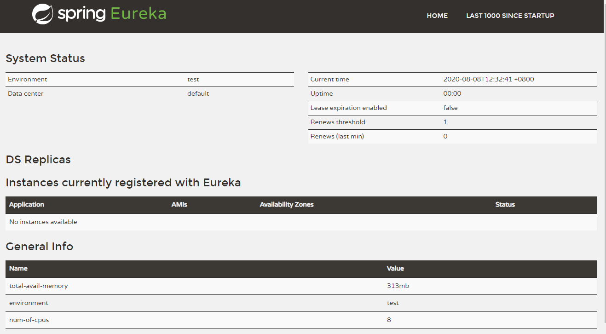

# SpringCloud

## 1、在IDEA中创建

1. 打开一个Maven项目

   在Maven仓库中找 Spring Cloud Dependencies

   - 版本的旧新查看版本的开口，字母越后越新，例：A ~ H，A是最早的版本，H是最新的版本。

   - | Spring Cloud             | Spring Boot                                    |
     | ------------------------ | ---------------------------------------------- |
     | Angel版本                | 兼容Spring Boot 1.2.x                          |
     | Brixton版本              | 兼容Spring Boot 1.3.x，也兼容Spring Boot 1.4.x |
     | Camden版本               | 兼容Spring Boot 1.4.x，也兼容Spring Boot 1.5.x |
     | Dalston版本、Edgware版本 | 兼容Spring Boot 1.5.x，不兼容Spring Boot 2.0.x |
     | Finchley版本             | 兼容Spring Boot 2.0.x，不兼容Spring Boot 1.5.x |
     | Greenwich版本            | 兼容Spring Boot 2.1.x                          |
     | Hoxton                   | 2.2.x                                          |

     - JDK 1.8 or later
     - Gradle 4+ or Maven 3.2+
     
    
     

导入对应的 SpringCloud
     
     ```xml
     <!-- https://mvnrepository.com/artifact/org.springframework.cloud/spring-cloud-dependencies -->
     <dependency>
         <groupId>org.springframework.cloud</groupId>
         <artifactId>spring-cloud-dependencies</artifactId>
         <version>Hoxton.SR1</version>
         <type>pom</type>
         <scope>import</scope>
     </dependency>
```
     
     还需导入对应的 SpringBoot
     
     ```xml
     <dependency>
         <groupId>org.springframework.boot</groupId>
         <artifactId>spring-boot-dependencies</artifactId>
         <version>2.2.8.RELEASE</version>
         <type>pom</type>
         <scope>import</scope>
     </dependency>
```

   在导入些其他的包，总的pom是这样的

   ```xml
   <?xml version="1.0" encoding="UTF-8"?>
   <project xmlns="http://maven.apache.org/POM/4.0.0"
            xmlns:xsi="http://www.w3.org/2001/XMLSchema-instance"
            xsi:schemaLocation="http://maven.apache.org/POM/4.0.0 http://maven.apache.org/xsd/maven-4.0.0.xsd">
       <modelVersion>4.0.0</modelVersion>
   
       <groupId>com.baven</groupId>
       <artifactId>springcloud</artifactId>
       <version>1.0-SNAPSHOT</version>
       <modules>
           <module>springcloud-api</module>
       </modules>
   
       <!--打包方式 pom-->
       <packaging>pom</packaging>
   
       <properties>
           <project.build.sourceEncoding>UTF-8</project.build.sourceEncoding>
           <maven.compiler.source>1.8</maven.compiler.source>
           <maven.compiler.target>1.8</maven.compiler.target>
           <junit.version>4.13</junit.version>
           <lombok.version>1.18.12</lombok.version>
           <log4j.version>1.2.17</log4j.version>
       </properties>
   
       <dependencyManagement>
           <dependencies>
               <!--springcloud的依赖-->
               <!-- https://mvnrepository.com/artifact/org.springframework.cloud/spring-cloud-dependencies -->
               <dependency>
                   <groupId>org.springframework.cloud</groupId>
                   <artifactId>spring-cloud-dependencies</artifactId>
                   <version>Hoxton.SR1</version>
                   <type>pom</type>
                   <scope>import</scope>
               </dependency>
               <dependency>
                   <groupId>org.springframework.boot</groupId>
                   <artifactId>spring-boot-dependencies</artifactId>
                   <version>2.2.8.RELEASE</version>
                   <type>pom</type>
                   <scope>import</scope>
               </dependency>
               <dependency>
                   <groupId>mysql</groupId>
                   <artifactId>mysql-connector-java</artifactId>
                   <version>8.0.21</version>
               </dependency>
               <dependency>
                   <groupId>com.alibaba</groupId>
                   <artifactId>druid</artifactId>
                   <version>1.1.23</version>
               </dependency>
               <dependency>
                   <groupId>org.mybatis.spring.boot</groupId>
                   <artifactId>mybatis-spring-boot-starter</artifactId>
                   <version>2.1.3</version>
               </dependency>
               <!--日志测试-->
               <dependency>
                   <groupId>junit</groupId>
                   <artifactId>junit</artifactId>
                   <version>${junit.version}</version>
               </dependency>
               <dependency>
                   <groupId>org.projectlombok</groupId>
                   <artifactId>lombok</artifactId>
                   <version>${lombok.version}</version>
               </dependency>
               <dependency>
                   <groupId>log4j</groupId>
                   <artifactId>log4j</artifactId>
                   <version>${log4j.version}</version>
               </dependency>
               <dependency>
                   <groupId>ch.qos.logback</groupId>
                   <artifactId>logback-core</artifactId>
                   <version>1.2.3</version>
               </dependency>
           </dependencies>
       </dependencyManagement>
   
   </project>
   ```

   dependencyManagement 父类pom，子类还是需要导入

热部署相对较慢 

spring-boot-devtools      --springframework下的

2. 创建子模板

   pom.xml

   ```xml
   <!--当前的Module自动需要的依赖，如果父依赖中已经配置了版本-->
   <dependencies>
       <dependency>
           <groupId>org.projectlombok</groupId>
           <artifactId>lombok</artifactId>
       </dependency>
   </dependencies>
   ```

   


实体类需要序列化，没有的话，传输会报错


restful

restTemplate    三参数--（ url , 实体：map, Class<T> responseType）

- getForEntity
- postForObject
- 等

意思就是从其他的服务器中获取数据

因为消费者只有实体、web，并没 T有服务Service，所以要去provider里取

目的是再次解耦


原本在provider中写好了些Controller的url

例：

- 在 provider 中获取所有学生信息是  localhost:8080/msg/list

- 然后在其他的电脑上创建consumer 项目，通过restTemplate可以对Controller再进行套层

  ```java
  private String final REST_HL = localhost:8080
  @GetMapping("/consumer/list")
  public List<Student> list(){
  	return restTemplate.getOfObject(REST_HL, List.class);
  }
  ```

  

## 练习：--例子可看springcloud项目

1. api									

   单单的实体类，通过pom，让其他的module也能获取到该实体

2. provider-8001

   连接数据库，实现mapper，service，controller一系列操作

3. consumer-80

   通过Rest Template，访问提供者

4. eureka-7001

   配置完成后，先启动7001，在启动8001完成，确认提供这能被注册上去

   注意，两者的包不相同，差个-server

5. 在provider中添加包actuator

   设置配置信息

6. 创建集群配置 7002、7003

   跟7001一样，只要把端口号改一下就可以了

   集群配置，在此之前要修改C:\Windows\System32\drivers\etc路径下的hosts文件

   - #127.0.0.1  eureka7001.com

   - #127.0.0.1  eureka7002.com

   - #127.0.0.1  eureka7003.com


## 5、Eureka服务注册与发现

### 5.1、什么是Eureka

- Netflix 在设计Eureka时，遵循的就是AP原则
- Eureka 是Netflix 的一个子模块，也是核心模块之一。Eureka是一个基于REST的服务，用于定位服务，以实现云端中间层服务发现和故障转移，服务注册与发现对于微服务来说是非常重要的，有了服务发现与注册，只需要使用服务的标识符，就可以访问到服务，而不是修改服务调用的配置文件了，功能类似于Dubbo的注册中心，比如ZooKeeper


### 5.2、原理讲解

- Eureka的基本架构
  - SpringCloud 封装了NetFlix公司开发的Eureka模块的实现服务注册和发现（对比ZooKeeper）
  - Eureka采用了 C-S 的架构设计，EurekaServer作为服务注册功能的服务器，他是服务注册中心
  - 而系统的其他微服务。使用Eureka的客户端连接到EurekaServer并维持心跳连接。这样系统的维护人员就和已通过Eureka Server来监控系统中的各个微服务是否正常运行，SpringCloud的一些其他模块（比如Zuul）就可以通过EurekaServer来发现系统中其他的微服务，并执行相关的逻辑；
  - 和Dubbo架构相比
  - Eureka 包含两个组件：**Eureka Server** 和 **Eureka Client** 。
  - Eureka Server 提供服务注册服务，各个节点启动后，会在EurekaServer中进行注册，这样Eureka Server中的服务注册表中将会圈出所有可能服务节点的信息，服务节点的信息可以在界面中直观的看到。
  - Eureka Client是一个Java客户端，用户简化EurekaServer的交互，客户端同时也具备一个内置的，使用轮询负载算法的负载均衡器。在用用启动后，将会向EurekaServer发送心跳（默认周期为30秒）。如果Eureka Server在多个心跳周期内没有接收到某个节点的心跳，EurekaServer将会从服务注册表中把这个服务节点移除掉（默认周期为90秒）。
  
  
  
- 三大角色

  - Eureka Server：提供服务的注册与发现
  - Service Provider：将自生服务注册到Eureka中，从而使消费方能够找到。
  - Service Consumer：服务消费方从Eureka中获取注册服务列表，从而找到消费服务。


1. 在Maven中找到Spring-cloud-starter-eureka

2. 找到Spring Cloud Starter Eureka Server包

   ```xml
   <!-- https://mvnrepository.com/artifact/org.springframework.cloud/spring-cloud-starter-eureka-server -->
   <dependency>
       <groupId>org.springframework.cloud</groupId>
       <artifactId>spring-cloud-starter-eureka-server</artifactId>
       <version>1.4.6.RELEASE</version>
   </dependency>
   ```

3. 包要最新的降一级（弹幕提示，新版本要导入谷歌的GSON依赖，换成NetFlix的eureka）

4. 编写配置文件

   ```yaml
   server:
     port: 7001
   
   eureka:
     instance:
       hostname: localhost           # Eureka服务段的实例名称
     client:
       register-with-eureka: false   # 表示是否像eureka注册中心注册自己
       fetch-registry: true          # fetch-registry如果false，则表示自己为注册中心
       service-url:                  # 修改默认的访问监控页面的地址，类似dubbo的监控地址
         defaultZone: http://${eureka.instance.hostname}:${server.port}/eureka/
   ```

5. 在启动器中添加注解

   ```java
   @SpringBootApplication
   @EnableEurekaServer			// 服务端的启动类，可以接收别人注册进来
   public class SpringcloudEureka_7001 {
       public static void main(String[] args) {
           SpringApplicaiton.run(SpringcloudEureka_7001.class, args);
       }
   }
   ```

6. 启动项目，访问localhost:7001便可到

   


**自我保护机制**

- 一句话总结：某时刻某一个微服务不可以用了，eureka不会立刻清理，依旧会对该微服务的信息进行保存。若是突然断网，eureka进行保护，当网络故障恢复后，eurekaServer节点会自动退出自我保护模式。
- 在Spring Cloud中，可以使用`eureka.server.enable-self-preservation = false`禁用自我保护模式【不推荐关闭】


### 5.5、8001服务发现Discovery

即使导入actuator

```xml
<dependency>
    <groupId>org.springframework.boot</groupId>
    <artifactId>spring-boot-starter-actuator</artifactId>
</dependency>
```

在controller中增加一个可供访问的接口就可一个

```java
// 注册进来的微服务，获取一些信息，在团队开发中用的多，目的是放别人知道
@GetMapping("/dept/discovery")
public Object discovery(){
    // 获取微服务列表的清单
    List<String> services = client.getServices();
    System.out.println("discovery ==> services:" + services);

    // 得到一个具体的微服务信息。获取实例，参数为微服务id
    List<ServiceInstance> instances = client.getInstances("springcloud-provider-dept");
    for (ServiceInstance instance : instances) {
        System.out.println(
            instance.getHost() + "\t" +
            instance.getPort() + "\t" +
            instance.getUri() + "\t" +
            instance.getServiceId()
        );
    }
    return this.client;
}
```


### Eureka集群


**CAP是什么?**

- C（Consistency）强一致性
- A（Availability）可用性
- P（Partitiontolerance）分区容错性

CAP的三进二：CA、AP、CP

==CAP理论的核心==

- 一个分布式系统不可能同时很好的满足一致性，可用性和分区容错性这三个需求
- 根据CAP原理，将NoSQL数据库分成满足CA原则，满足CP原则和满足AP原则三大类：
  - CA：单点集群，曼珠一致性，可用性的系统，通常可扩展性较差
  - CP：满足一致性，分区容错性的系统，通常性能不是特别高
  - AP：满足可用性，分区容错性的系统，通常可能对一致性要求低一点


**作为服务注册中心，Eureka不Zookeeper好在哪里？**

著迷的CAP理论指出，一个分布式系统不可能同时满足C、A、P。

由于分区容错性P在分布式系统中是必须要保证的，应粗我们只能在A和C之间进行权衡。

- Zookeeper保证的是CP
- Eureka保证的是AP


百度了解，为何

- Zookeeper保证的是CP
- Eureka保证的是AP


## 6、Ribbon

**Ribbon是什么？**

- Spring Cloud Ribbon是一个基于HTTP和TCP的客户端负载均衡工具，它基于Netflix Ribbon实现。
- Ribbon是Netflix发布的开源项目，主要功能是提供客户端的软件负载均衡算法，将NetFlix的中间层服务连接在一起。Ribbon的客户端组件提供一系列完整的配置项如：连接超时、重试等等。简单说，就是在配置文件中列出LoadBalancer（简称LB：负载均衡）后面所有的机器，Ribbon会自动的帮组你基于某种规则（如简单轮询，随机连接等等）去连接这些机器。我们也很容易使用Ribbon实现自定义的负载均衡算法。


**Ribbon能干什么？**

- LB -负载均衡（LoadBalance），在微服务或分布式集群中经常的一种应用。
- 负载均衡简单说就是将用户的请求平摊的分配到多个服务器上，从而达到系统和HA（高可用）
- 常见的负载均衡软件有Neinx，Lvs等等  Apache+Tomcat
- dubbo、SpringCloud中军给我们提供了负载均衡，**Spring Cloud的负载均衡算法可自定义**
- 负载均衡简单分类：
  - 集中式LB
    - 即在服务的消费方和提供方自建使用独立的LB设施，如Nginx，由该设施负责把访问请求通过某种策略转发至服务的提供方
  - 进程式LB
    - 将LB逻辑集成到消费方，消费方从服务注册中心获知有哪些地址可用，然后自己再从这些地址中选出一个合适的服务器。
    - Ribbon就属于进程内LB，它只是一个类库，集成于消费方进程，消费方通过他来获取到服务提供方的地址。


### 负载均衡步骤：

1. 在客户端80中集成

2. 导入包

   ```xml
   <!-- https://mvnrepository.com/artifact/org.springframework.cloud/spring-cloud-starter-ribbon -->
   <dependency>
       <groupId>org.springframework.cloud</groupId>
       <artifactId>spring-cloud-starter-ribbon</artifactId>
       <version>1.4.6.RELEASE</version>
   </dependency>
   <dependency>
       <groupId>org.springframework.cloud</groupId>
       <artifactId>spring-cloud-starter-eureka</artifactId>
       <version>1.4.6.RELEASE</version>
   </dependency>
   ```

3. 在ConfigBean配置文件中对RestTemplate添加注解

   ```java
   @Configuration
   public class ConfigBean {
       // 配置负载均衡,实现RestTemplate
       @Bean
       @LoadBalanced       // Ribbon 基于客户端实现，只需要加个注解就可以了
       public RestTemplate getRestTemplate(){
           return new RestTemplate();
       }
   }
   ```

4. 再在Controller中修改访问

   ```java
   // 因为写死了，在使用Ribbon的时候就不用写这个，而应该是一个变量，通过服务名来访问
   // 单机：private static final String RESt_URL_PREFIX = "http://localhost:8001";
   private static final String RESt_URL_PREFIX = "http://SPRINGCLOUD-PROVIDER-DEPT";
   ```

5. 这样就可以通过eureka注册中心中访问了

6. 但是只有一个提供方，我们看不出来负载均衡的效果，所以我们在创建两个数据库

   - 数据库中的内容与db01的内容一致
   - 创建db02、db03

7. 在IDEA中在创建两个提供方，复制Springcloud-provider-dept-8001内容

   - 只需要修改配置文件的端口号，数据库，默认描述信息
   - 注意：三个提供方的名字需要一致为前提

8. 创建完成后，启动服务

   进行测试得知，默认的负载均衡为轮询


### 自定义负载均衡算法

在消费方执行器所在的包的上一层创建一个新的包，专门存放我们需要的负载均衡算法。

我们在IRule中可以看到他的所有子类算法。

步骤：

1. 创建上述所在位子的包

2. 创建配置文件MyRule  （用注解）

   ```java
   @Configuration
   public class MyRule {
       
       @Bean
       public IRule myRule(){
           return new RandomRule();
       }
       
   }
   ```

3. 在启动类里添加@RibbonClient注解

   ```java
   @RibbonClient(name = "SPRINGCLOUD-PROVIDER-DEPT", configuration = MyRule.class);
   ```

4. 启动测试


5. 自定义测试


## 7、Feign负载均衡

**7.1、简介**

feign是声明式的web service客户端，他让微服务之间的调用变得更简单了，雷士controller调用service。SpringCloud集成了Ribbon和Eureka，可在使用Feign时提供负载均衡的http客户端


只需要创建一个接口，然后添加注解即可。


fiegn，主要是社区，大家都习惯面向接口编程。这个是很多开发人员的规范。调用微服务访问两种方法

1. 微服务名字【ribbon】
2. 接口和注解【feign】


**Feign能干什么？**

- Feigh旨在使编写Java Http客户端变得更容易
- 前面在使用Ribbon + RestTemplate时，利用RestTemplate对Http请求里封装处理，形成了一套模板化的调用方法。但是在实际开发中，由于对服务以来的调用可能不止一处，往往一个接口会被多出调用，所以通常都会针对每个微服务自行封装一些客户端类来包装这些以来服务的调用。所以，Feign在此基础上做了进一步封装，由他来帮助我们定义和实现依赖服务接口的定义，==在Feign的实现下，我们只需要创建一个接口并使用注解的方式来配置它（类似于以前Dao接口上标注Mapper注解，现在是一个微服务接口上标注一个Feign注解即可）==即可完成对微服务提供方的接口绑定，简化了使用SpringCloud Ribbon时，自动封装服务调用客户端的开发量。


**Feigh集成了Ribbon**

- 利用Ribbon维护了MicroServiceCloud-Dept的服务列表信息，并且通过轮询实现了客户端的负载均衡，而与Ribbon不同的是，通过Feign只需要定义服务绑定接口且以声明式的方法，优雅而且简单的实现了服务调用。


### 7.2、Feign使用步骤


## 8、Hystrix


