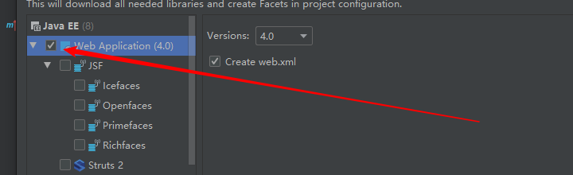

# SpringMVC -20.6.4

官网文档：https://docs.spring.io/spring/docs/5.2.6.RELEASE/spring-framework-reference/web.html#spring-web

打开有点慢的话，把5.2.6改成4.3.24，然后reference后的都删了，进入老版本的文档


**什么是SpringMVC？**

1. web开发的一个框架
2. 为spring的一个组成部分


**为什么要学习 SpringMVC 呢？**

1. 轻量级，简单易学
2. 高效，基于请求响应的MVC框架
3. 与Spring兼容性好，无缝结合
4. 约定优于配置
5. 功能强大：RESTful、数据验证、格式化、本地化、主题等
6. 简洁灵活


MVC：

- **MVC三层架构** ：模型(dao, service)  视图(jsp)  控制器(servlet)

- 是一种软件设计规范
- 是将业务逻辑、数据、显示分离的方法组织代码。
- MVC主要作用是降低了视图与业务逻辑间的双向耦合
- MVC不是一种设计模式，MVC是一种架构模式。当然，不同的MVC存在差异


MVVM：M	V	VM(ViewModel)：双向绑定


**最典型的MVC就是 JSP + servlet + JavaBean的模式**

MVC的执行流程：

1. 用户访问**视图层**
2. 向**控制层**发送请求
3. 调用**逻辑Bean**来实现功能
4. 用**数据Bean**存取
5. 逻辑Bean返回结果给控制层
6. 在将不同的响应给视图层


pojo：实体类  -用户名 密码 年龄 爱好 ....20多个

vo：是pojo的细分，视图实体 -只接受用户名密码


## 练习

- [ ] 1. 快速搭建一个最基础的SpringMVC框架
- [ ] 2. 将1改成注解模式，再使用RestFul风格获取表单传来的数据
- [ ] 3. 利用注解测试默认的提交方式


- [ ] 大练习，整合ssm
- [ ] 在整合中加入用户登入，并用ajax处理 

## 1、回顾Servlet

创建新的maven项目SpringMVC

1. 导入依赖

```xml
<dependencies>
    <dependency>
        <groupId>junit</groupId>
        <artifactId>junit</artifactId>
        <version>4.13</version>
        <scope>test</scope>
    </dependency>
    <dependency>
        <groupId>org.springframework</groupId>
        <artifactId>spring-webmvc</artifactId>
        <version>5.2.6.RELEASE</version>
    </dependency>
    <dependency>
        <groupId>javax.servlet</groupId>
        <artifactId>servlet-api</artifactId>
        <version>2.5</version>
    </dependency>
    <dependency>
        <groupId>javax.servlet.jsp</groupId>
        <artifactId>jsp-api</artifactId>
        <version>2.2</version>
    </dependency>
    <dependency>
        <groupId>javax.servlet</groupId>
        <artifactId>jstl</artifactId>
        <version>1.2</version>
    </dependency>
</dependencies>
```


2. 对子项目添加web框架


​		勾选即可



​		生成

​				

3. 创建HelloServlet

   ```java
   public class HelloServlet extends HttpServlet {
       @Override
       protected void doGet(HttpServletRequest req, HttpServletResponse resp) throws ServletException, IOException {
           // 1.获取前端数据
           String method = req.getParameter("method");
           if (method.equals("add")){
               req.getSession().setAttribute("msg", "执行了add方法");
           }
           if (method.equals("delete")){
               req.getSession().setAttribute("msg", "执行了delete方法");
           }
           // 2.调用业务层
           // 3.视图转发或者重定向
           req.getRequestDispatcher("/WEF-INF/jsp/test.jsp").forward(req, resp);
       }
   
       @Override
       protected void doPost(HttpServletRequest req, HttpServletResponse resp) throws ServletException, IOException {
           doGet(req, resp);
       }
   }
   ```

4. 在web中配置servlet（主要回顾，当然也可以用注解）

   ```xml
   <servlet>
       <servlet-name>hello</servlet-name>
       <servlet-class>com.baven.servlet.HelloServlet</servlet-class>
   </servlet>
   <servlet-mapping>
       <servlet-name>hello</servlet-name>
       <url-pattern>/hello</url-pattern>
   </servlet-mapping>
   ```

5. 配置Tomcat

   略


### 1.1、关于SpringMVC

Spring的web框架围绕DispatcherServlet【调度Servlet】设计。DispacherServlet的作用是将请求分发到不同的处理器。

SpringMVC框架与其他的MVC框架一样，**以请求为驱动，围绕一个中心Servlet分派请求及提供其他功能，DispatcherServlet是一个实际的Servlet（==它继承HttpServlet基类==）**。


## 2、快速搭建一个SpringMVC

1. 新建一个Moudle，添加web的支持

2. 确定导入了SpringMVC的依赖

3. 配置web.xml，注册DispatcherServlet

   ```xml
   <?xml version="1.0" encoding="UTF-8"?>
   <web-app xmlns="http://xmlns.jcp.org/xml/ns/javaee"
            xmlns:xsi="http://www.w3.org/2001/XMLSchema-instance"
            xsi:schemaLocation="http://xmlns.jcp.org/xml/ns/javaee http://xmlns.jcp.org/xml/ns/javaee/web-app_4_0.xsd"
            version="4.0">
   
       <!--1.注册DispatcherServlet-->
       <servlet>
           <servlet-name>springmvc</servlet-name>
           <servlet-class>org.springframework.web.servlet.DispatcherServlet</servlet-class>
           <!--关联一个springmvc的配置文件：【servlet-name】-servlet.xml-->
           <init-param>
               <param-name>contextConfigLocation</param-name>
               <param-value>classpath:springmvc-servlet.xml</param-value>
           </init-param>
           <load-on-startup>1</load-on-startup>
       </servlet>
   
       <!--/ 匹配所有的请求：（不包括.jsp）-->
       <!--/* 匹配所有的请求：（包括.jsp）-->
       <servlet-mapping>
           <servlet-name>springmvc</servlet-name>
           <url-pattern>/</url-pattern>
       </servlet-mapping>
   </web-app>
   ```

   以上是固定的

   

4. 编写SpringMVC的配置文件！名称：springmvc-servlet.xml ：[servletname]-servlet.xml 说明，这里的名称要求是官方的。

   ```xml
   就是个正常的spring配置文件
   ```

5. 处理 映射器

   ```xml
   <bean class="org.springframework.web.servlet.handler.BeanNameUrlHandlerMapping"/>
   ```

6. 处理 处理适配器

   ```xml
   <bean class="org.springframework.web.servlet.mvc.SimpleControllerHandlerAdapter"/>
   ```

7. 处理 视图解析器

   ```xml
   <bean class="org.springframework.web.servlet.view.InternalResourceViewResolver">
       <!--前缀-->
       <property name="prefix" value="/WEB-INF/jsp/"/>
       <!--后缀-->
       <property name="suffix" value=".jsp"/>
   </bean>
   ```

总的是这样

```xml
<?xml version="1.0" encoding="UTF-8"?>
<beans xmlns="http://www.springframework.org/schema/beans"
       xmlns:xsi="http://www.w3.org/2001/XMLSchema-instance"
       xsi:schemaLocation="http://www.springframework.org/schema/beans http://www.springframework.org/schema/beans/spring-beans.xsd">

    <!--5.添加 处理映射器-->
    <bean class="org.springframework.web.servlet.handler.BeanNameUrlHandlerMapping"/>
    <!--6.添加 处理适配器-->
    <bean class="org.springframework.web.servlet.mvc.SimpleControllerHandlerAdapter"/>
    <!--7.添加 视图解析器-->
    <bean class="org.springframework.web.servlet.view.InternalResourceViewResolver">
        <!--前缀-->
        <property name="prefix" value="/WEB-INF/jsp/"/>
        <!--后缀-->
        <property name="suffix" value=".jsp"/>
    </bean>

</beans>
```


8. 编写我们要操作业务Controller，要么实现Controller接口，要么增加注解：需要返回一个ModelAndView，用来装数据，封视图；

   ```java
   import org.springframework.web.servlet.mvc.Controller;
   
   // 注意：这里我们要导入的是Controller接口
   public class HelloController implements Controller {
       public ModelAndView handleRequest(HttpServletRequest request, HttpServletResponse response) throws Exception {
           // ModelAndView 模型和视图
           ModelAndView mv = new ModelAndView();
   
           // 封装对象，放在Model
           mv.addObject("msg","HelloSpringMVC!");
           // 封装要跳转的视图，放在View
           // 结合springmvc-servlet.xml的视图解析器，路径为：/WEB-INF/jsp/hello.jsp
           mv.setViewName("hello");
           return mv;
       }
   }
   ```

   缺点：一个控制器只能写一个接口，也就只能对应一个hello界面，缺复用

   

9. 将自己的类交给SpringIOC容器，注册bean

   ```xml
   <!--handler-->
   <bean id="/hello" class="com.baven.controller.HelloController"/>
   ```

   

10. 写要跳转的jsp页面，显示ModelandView存放的数据，以及我们正常的页面

    ```jsp
    <%@ page contentType="text/html;charset=UTF-8" language="java" %>
    <html>
    <head>
        <title>Title</title>
    </head>
    <body>
    
    ${msg}
    
    </body>
    </html>
    ```

11. 启动Tomcat


注意：出现404原因

1. 确认jar包是否都导入好
2. jar确认无误，显示无法输入，就在IDEA的项目发布中，添加lib依赖
3. 重启Tomcat
4. 终极问题：估计就只有我遇到过，以上方法都无法解决的话，那就重新下载个maven吧，估计你的maven库出问题了。


### 2.1、分析SpringMVC的执行流程

1. DispatcherServlet表示前端控制器，是整个SpringMVC的控制中心。用户发出请求，
   DispatchedServlet接收请求并拦截请求。

   我们假设请求的url为：http://localhost:8080/SpringMVC/hello

   如上url拆分成三部分：

   - http://localhost:8080 指的是服务器域名
   - SpringMVC 是指部署在服务器上的web站点
   - hello 表示控制器
   - 如上url表示为：请求位于服务器localhost:8080上的SpringMVC站点的hello控制器

2. HandlerMapping为处理器映射，DispatcherServlet调用它，HandlerMapping根据请求URL去查找Handler（处理器)

3. HandlerExecution表示具体的Handler，作用是根据URL查找控制器，如上URL
   被查找控制器为（hello)

4. HandlerExecution将解析后的信息传递给DispatcherServlet，如解析控制器等。

5. HanderlAdapter表示处理器适配器，其按照特定的规则去执行Handeler(hello请求)

6. Handler让具体的Controller执行

7. Controller将具体的执行信息返回给HanderAdapter，如ModelView（存的数据及要跳转的页面）

8. HandlerAdapter将视图逻辑名和模型传递给DispatcherServlet。（ModelView）

9. DispatcherServlet调用视图解析器（ViewResolver）来解析HandlerAdapter传递的逻辑视图名
   获取了Model的数据
   解析了View的视图名字
   拼接前缀后缀视图名字，找到对应的视图 /WEB-INF/jsp/hello.jsp
   将数据渲染到这个视图上

10. 视图解析器将解析的逻辑视图名传给DispatcherServlet

11. DispatcherServlet根据视图解析器解析的视图结果，调用具体的视图

12. 最终视图呈现给用户


其中虚线的才是我们需要做的事情

简化版本


### 2.2、使用注解开发

只需修改两次地方


1. 在springmvc-servlet.xml中增加头文件约束

   `context 和 mvc`	

```xml
<?xml version="1.0" encoding="UTF-8"?>
<beans xmlns="http://www.springframework.org/schema/beans"
       xmlns:xsi="http://www.w3.org/2001/XMLSchema-instance"
       xmlns:context="http://www.springframework.org/schema/context"
       xmlns:mvc="http://www.springframework.org/schema/mvc"
       xsi:schemaLocation="http://www.springframework.org/schema/beans http://www.springframework.org/schema/beans/spring-beans.xsd
        http://www.springframework.org/schema/context http://www.springframework.org/schema/context/spring-context.xsd
        http://www.springframework.org/schema/mvc http://www.springframework.org/schema/context/spring-mvc.xsd">
	
    <context:component-scan base-package="com.baven.controller"/>
    <mvc:default-servlet-handler/>
    <mvc:annotation-driven/>

</beans>
```

在springmvc-servlet中配置

1. spring注解扫描

   ```xml
   <!--spring中的扫描-->
   <context:component-scan base-package="com.baven.controller"/>
   ```

2. 资源过滤器

   ```xml
   <!--让Spring MVC 不处理静态资源-->
   <mvc:default-servlet-handler/>
   ```

3. 驱动器，自动配置两实例

   ```xml
   <!--
       支持mvc注解驱动
           在spring中一般采用@RequestMapping注解来完成映射关系，
           要使@RequestMapping注解生效，必须向上下文注册DefaultAnnotationHandlerMapping
           和一个AnnotationMethodHandlerAdapter实例，这两个实例分别在类级别和方法级别处理。
           而annotation-driver配置帮助我们自动完成上述两个实例的注入
       -->
   <mvc:annotation-driven/>
   ```

总共为

```xml
<?xml version="1.0" encoding="UTF-8"?>
<beans xmlns="http://www.springframework.org/schema/beans"
       xmlns:xsi="http://www.w3.org/2001/XMLSchema-instance"
       xmlns:context="http://www.springframework.org/schema/context"
       xmlns:mvc="http://www.springframework.org/schema/mvc"
       xsi:schemaLocation="http://www.springframework.org/schema/beans http://www.springframework.org/schema/beans/spring-beans.xsd
        http://www.springframework.org/schema/context http://www.springframework.org/schema/context/spring-context.xsd
        http://www.springframework.org/schema/mvc http://www.springframework.org/schema/context/spring-mvc.xsd">

    <context:component-scan base-package="com.baven.controller"/>
    <mvc:default-servlet-handler/>
    <mvc:annotation-driven/>

    <bean class="org.springframework.web.servlet.view.InternalResourceViewResolver">
        <property name="prefix" value="/WEB-INF/jsp/"/>
        <property name="suffix" value=".jsp"/>
    </bean>

</beans>
```

除了要扫描的包位子有变化，其他都是固定的。


2. 修改**控制器**，增加注解

```java
@Controller
public class HelloController {

    @RequestMapping("/hello")
    public String hello(Model model){

        //封装数据
        model.addAttribute("msg", "Hello,SpringMVC!");

        // 就是要跳转的页面名，会被视图解析器处理
        return "hello";
    }
}
```

也可以增加个父层

```java
@Controller
@RequestMapping("/h1")
// @RestController 整个类不会走视图解析器
public class HelloController {

    // 在类上添加@RequestMapping后的路径变为 localhost:8080/h1/hello
    @RequestMapping("/hello")
    // @ResponseBody  就不会走视图解析器，会直接返回一个字符串
    public String hello(Model model){

        //封装数据
        model.addAttribute("msg", "Hello,SpringMVC!");

        // 就是要跳转的页面名，会被视图解析器处理
        return "hello";
    }
}
```

- @Controller  代表这个类会被Spring接管
  - 被这个注解的类中的所有方法，如果返回值为String，并且有具体页面可以跳转，那么就会被视图解析器解析
  - **由此可以省略创建bean对象**
  
- @RequestMapping  注解用于映射url 到控制器或一个特定的处理程序方法。

- **@ResponseBody  方法不会走视图解析器，会直接返回一个字符串**

  @ResponseBody返回4种数据格式的数据

  - 返回一个键值对或者集合
  - 返回一个JSON格式的String字符串
  - 返回一个字符串
  - 返回一个类对象的数据

- **@RestController  整个类不会走视图解析器，都只返回字符串**

- Model 就是用来传数据的 

来自满林兄课程的两注解，好像  等下确定

- SesssionAtributes
- ModelAtribute

这样一来视图层的 hello.jsp 被**复用**


相关注解：

```
@Component		组件
@Service		service
@Controller		controller
@Repository		dao
```


## 3、使用RestFul风格

为什么要使用RestFul？

- 简洁：风格简单
- 安全：隐藏了程序里面的一些东西，比如参数等
- 高效：支持缓存


进行两数相加

- 没使用RestFul 之前

  ```java
  //原来的:http://localhost:8080/mvc/add?a=1&b=2
  
  @RequestMapping("/add")
  public String text01(int a, int b, Model model) {
      int res = a + b;
      model.addAttribute("msg","结果是:"+res);
      return "addPage";
  }
  ```

- 使用RestFul 后

  ```java
  //RestFul:http://localhost:8080/mvc/add/a/b    如a=1，b=2
  
  @RequestMapping("/add/{a}/{b}")
  public String text01(@PathVariable int a, @PathVariable int b, Model model) {
      int res = a + b;
      model.addAttribute("msg","结果是:"+res);
      return "addPage";
  }
  ```

  @PathVariable：路径变量，对变量添加这注解，就会自动识别路径里的变量

- 还可以使用指定的方式进行传送（地址请求栏默认都是HTTP GET）

  ```java
  // @RequestMapping(value = "/add/{a}/{name}",method = RequestMethod.GET)
  @GetMapping("/add/{a}/{name}")
  public String text01(@PathVariable int a, @PathVariable String name, Model model) {
      String res = name +a;
      model.addAttribute("msg","结果1是:"+res);
      return "addPage";
  }
  ```

  以上是将@RequestMapping改成@GetMapping


例子：

```jsp
<form action="/hello/name" method="post">
    <input type="text" name="name">
    <input type="submit">
</form>
```

```java
@Controller
public class HelloController {

    @PostMapping("/hello/{name}")
    public String getName1(@PathVariable @RequestParam("name") String name, Model model){
        model.addAttribute("username", "结果为1" + name);
        return "hello";
    }

}
```


```
@GetMapping
@PostMapping
@PutMapping
@DeleteMapping
@patchMapping
```


## 4、转发和重定向

在控制器中

1. 转发情况

- 有视图解析器，进行转发

```java
@Controller
public class HelloController {

    @RequestMapping("/hello")
    public String hello(Model model){
        model.addAttribute("msg", "Hello,SpringMVC!");
        return "hello";
    }
}
```

- 没有视图解析器，进行转发

```java
@Controller
public class HelloController {

    @RequestMapping("/hello")
    public String hello(Model model){
        model.addAttribute("msg", "Hello,SpringMVC!");
        return "/WEB-INF/jsp/hello.jsp";
        <!--或-->
        return "forward:/hello.jsp"
    }
}
```


2. 重定向情况

- 重定向是有没有视图解析器都要这么写

```java
@Controller
public class HelloController {

    @RequestMapping("/hello")
    public String hello(Model model){
        model.addAttribute("msg", "Hello,SpringMVC!");
        return "redirect:/hello.jsp";
        // return "redirect:hello.do" hello.do为另一个请求
    }
}
```


## 5、接收请求参数及数据回显

在之前的web中servlet接收前端传来的数据通过`request.getParameter("id");`获取

现在SpringMVC中就可以直接在控制器中接收


##### **1.提交的域名称和处理方法的参数名不一样。**

- 如：在/t1页面传参数name=baven，返回到hello页面输出就是baven

  ```java
  @GetMapping("/t1")
  public String test01(String name, Model model) {
      System.out.println("前端的参数为:"+name);
  
      model.addAttribute("msg",name);
  
      return "hello";
  }
  ```

  注意：如果输入的参数不同，如：name1=baven，控制台会输出null，且会继续跳转到hello。

  ​			这样不安全

- 对以上的参数增加注解，确保要执行这个控制器所传的参数要唯一确定。

  ```java
  @GetMapping("/t1")
  public String test01(@RequestParam("username")String name, Model model) {
      System.out.println("前端的参数为:"+name);
  
      model.addAttribute("msg",name);
      
      return "hello";
  }
  ```

  `@RequestParam()`与Mybatis中的`@Param`参数差不多，确保是以username=baven的方式输入。

  若以name=baven输入，就会出错

  

##### 2.也可以提交的一个对象

- 实体类

  ```java
  @Data
  @AllArgsConstructor
  @NoArgsConstructor
  public class User {
      private int id;
      private String name;
      private int age;
  }
  ```

要求前端传递的参数名和对象名必须一致，否则就是null

- 控制层

  http://localhost:8080/mvc/user/t2?name=baven&id=1&age=15

  直接用对象接收

  ```java
  //提交是一个对象
  @GetMapping("/t2")
  public String test02(User user) {
  
      System.out.println(user);
  
      return "hello";
  }
  ```

  **如果提交的表单没有age**，所以User类要有一个没有age的构造方法，否则会404

##### 3.将数据显示到前端

有三种方法

1. 通过ModelAndView

   ```java
   public class ControllerTest01 implements Controller {
       @Override
       public ModelAndView handleRequest(HttpServletRequest httpServletRequest, HttpServletResponse httpServletResponse) throws Exception {
           //返回一个模型视图对象
           ModelAndView mv = new ModelAndView();
           mv.addObject("msg","hello world");
           mv.setViewName("test");
           return mv;
       }
   }
   ```

2. 通过Model

   ```java
   @RequestMapping("/hello")
   public String hello(Model model) {
       //封装数据  向模式中添加msg与值，可以注解在JSP页面取出并渲染
       model.addAttribute("msg","Hello,SpringMVCAnnotation");
       return "hello"; 
   }
   ```

3. 通过ModelMap

   ```java
   @GetMapping("/t3")
   public String test3(@RequestParam("username") String name, ModelMap map) {
       //封装要显示到视图中的数据
       //相当于req.setAttribute("name",name);
       map.addAttribute("msg",name);
       return "hello";
   }
   ```


其中：Model 继承 ModelMap 

​			ModelMap 继承 LinkedHashMap


三种传输的对比

```
Model 			只有几个方法，适合用于存储数据，简化了新手对Model对象的操作和理解
ModelMap  		继承了LinkMap，除了实现自身的一些方法，有LinkeMap的方法和特性
ModelAndView  	可以在存储数据的同时，可以设置返回的逻辑视图，进行控制展示层的跳转(不用了)
```


## 6、前端乱码问题

解决方法：

1. 可能是请求方式问题，post请求修改为get请求

   ```html
   <form action="${pageContext.request.contextPath}/e/t1" method="get">
       <input type="text" name="username">
       <input type="submit" value="提交">
   </form>
   ```

2. 若以上解决不了，自建创建一个过滤器继承Filter

   ```java
   public class EncodingFilter implements Filter {
       @Override
       public void init(FilterConfig filterConfig) throws ServletException {
   
       }
   
       @Override
       public void doFilter(ServletRequest servletRequest, ServletResponse servletResponse, FilterChain chain) throws IOException, ServletException {
           // 转换成HttpServletRequest HttpServletResponse
           HttpServletRequest request = (HttpServletRequest) servletRequest;
           HttpServletResponse response = (HttpServletResponse) servletResponse;
           request.setCharacterEncoding("utf-8");
           response.setCharacterEncoding("utf-8");
           // 传下去，要不就停留在这里了
           chain.doFilter(request,response);
       }
   
       @Override
       public void destroy() {
   
       }
   }
   ```

   在web.xml中配置

   ```xml
   <filter>
       <filter-name>encoding</filter-name>
       <filter-class>com.lcy.filter.EncodingFilter</filter-class>
   </filter>
   <filter-mapping>
       <filter-name>encoding</filter-name>
       <url-pattern>/</url-pattern>
   </filter-mapping>
   ```

3. SpringMVC自带的过滤器

   ```xml
   <!--配置SpringMVC的乱码过滤 -->
   <filter>
       <filter-name>encoding</filter-name>
       <filter-class>org.springframework.web.filter.CharacterEncodingFilter</filter-class>
       <init-param>
           <param-name>encoding</param-name>
           <param-value>utf-8</param-value>
       </init-param>
   </filter>
   <filter-mapping>
       <filter-name>encoding</filter-name>
       <url-pattern>/*</url-pattern>
   </filter-mapping>
   ```

4. 终极解决方法，修改Tomcat配置文件：设置编码

   ```xml
   <Connector port="8080" protocol="HTTP/1.1"
              connectionTimeout="20000"
              redirectPort="8443" 
   		   URLEncoding="UTF-8"/>
   ```

   

## 7、JSON

### 7.1、json是什么？

- **一种轻量级的数据交换格式,提高网络传输效率，简洁和清晰的结构层次**
- 采用完全独立于编程语言的**文本格式**来存储和表示数据
- 易用人阅读和编写，同时也易于机器解析和生成，并有效的提升网络传输效率

**Josn 键值对**是用来保存 JavaScript 对象的一种方式，和 JavaScript 对象的写法也大同小异，键/值对组合中的键名写在前面并用双引号 “ ” 包裹，使用冒号：分隔，然后紧接着值。

`{"name":"baven","age":3,"sex":"man"}`

### 7.2、JSON 与 JavaScript

```html
<!DOCTYPE html>
<html lang="en">
<head>
    <meta charset="UTF-8">
    <title>Title</title>
    
    <script type="text/javascript">
        //编写一个JavaScript对象
        var user = {
            name:"baven",
            age:18,
            sex:"man"
        };

        //将js对象转换为JSON对象
        var json = JSON.stringify(user);
        console.log(json);
        // 字符串 {"name":"baven","age":3,"sex":"man"}

        //将JSON对象转换为JavaScript对象
        var obj = JSON.parse(json);
        console.log(obj);
    </script>

</head>
<body>
</body>
</html>
```


### 7.3、Controller返回 JSON 数据

#### 1.Jackson 应该是目前比较好的 json 解析工具

导入 jackson的 jar包

```xml
<dependency>
    <groupId>com.fasterxml.jackson.core</groupId>
    <artifactId>jackson-databind</artifactId>
    <version>2.10.2</version>
</dependency>
```

- 控制层

  ```java
  @Controller
  public class UserController {
  
      @RequestMapping("/j1")  //返回一个对象
      @ResponseBody  // 就不会走视图解析器，会直接返回一个字符串
      public String json1() throws JsonProcessingException {
          // jackson 中有个 ObjectMapper 类
      	ObjectMapper mapper = new ObjectMapper();
          
          //创建一个对象
          User user = new User("baven",3,"man");
  		String str = mapper.writeValueAsString(user);
          
          return str;
      }
  }
  ```

  

将 JSON 封装起来

- 封装前

  ```java
  @RestController  //整个类不会走视图解析器
  public class UserController {
  
      ObjectMapper mapper = new ObjectMapper();
  
      @RequestMapping("/j1")  //返回对象
      public String json1() throws JsonProcessingException {
          
          User user = new User("baven",3,"男");
          String str = mapper.writeValueAsString(user);
          return str;
      }
      
      @RequestMapping("/j2")  //返回集合
      public String json2() throws JsonProcessingException {
  
          ArrayList<User> userList = new ArrayList<>();
  
          User user1 = new User("baven1", 4, "男");
          User user2 = new User("baven2", 5, "男");
          User user3 = new User("baven3", 6, "男");
          User user4 = new User("baven4", 7, "男");
  
          userList.add(user1);
          userList.add(user2);
          userList.add(user3);
          userList.add(user4);
  
          String str = mapper.writeValueAsString(userList);
          return str;
      }
  
      @RequestMapping("/j3")  //返回时间对象
      public String json3() throws JsonProcessingException {
          // 默认使用这个，这是关闭时间戳的方式
  		// mapper.configure(SerializationFeature.WRITE_DATE_KEYS_AS_TIMESTAMPS,false);
          // 关闭后使用自己的格式
          // mapper.setDateFormat(sdf)
          
  		SimpleDateFormat sdf = new SimpleDateFormat("yyyy-MM-dd HH:mm:ss");
          Date date = new Date();
  
          //ObjectMapper，时间解析后的默认格式为：Timestamp时间戳
          return mapper.writeValueAsString(sdf.format(date));
          // 使用mapper的为 return mapper.writeValueAsString(date);
      }
  }
  ```

- 将 JSON 封装成工具类

  ```java
  public class JsonUtils {
      // 利用多态，提高效率
      public static String getJson(Object object){
          return getJson(object,"yyyy-MM-dd HH:mm:ss");
      }
  
      public static String getJson(Object object,String dateFormat) {
          ObjectMapper mapper = new ObjectMapper();
  
          //关闭时间戳的方式
          mapper.configure(SerializationFeature.WRITE_DATE_KEYS_AS_TIMESTAMPS,false);
          //自定义日期的格式
          Date date = new Date();
          SimpleDateFormat sdf = new SimpleDateFormat(dateFormat);
          mapper.setDateFormat(sdf);
          try {
              return mapper.writeValueAsString(object);
          } catch (JsonProcessingException e) {
              e.printStackTrace();
          }
          return null;
      }
  }
  ```

- 封装后使用工具类 JsonUtils

  ```java
  // 只需要在最后调用即可
  return JsonUtils.getJson(object);
  ```

  

#### 2.使用阿里的 FastJson

导入fastjson的 jar包

```xml
<!-- https://mvnrepository.com/artifact/com.alibaba/fastjson -->
<dependency>
    <groupId>com.alibaba</groupId>
    <artifactId>fastjson</artifactId>
    <version>1.2.68</version>
</dependency>
```

- 转换 JSON格式

  ```java
  @RequestMapping("/j4")
  public String json4() throws JsonProcessingException {
      ArrayList<User> userList = new ArrayList<>();
      User user1 = new User("baven1", 4, "男");
      User user2 = new User("baven2", 4, "男");
      User user3 = new User("baven3", 4, "男");
      User user4 = new User("baven4", 4, "男");
      userList.add(user1);
      userList.add(user2);
      userList.add(user3);
      userList.add(user4);
  
      System.out.println("=============java对象转JSON字符串=======");
      String str1 = JSON.toJSONString(userList);
      System.out.println("JSON.toJSONString(List)=====>"+str1);
      String str2 = JSON.toJSONString(user1);
      System.out.println("JSON.toJSONString(user1)=====>"+str2);
  
      System.out.println("=============JSON字符串转Java对象=======");
      User user = JSON.parseObject(str2, User.class);
      System.out.println("JSON.parseObject(str2, User.class)=====>"+user);
  
      System.out.println("===========Java对象转JSON对象=========");
      JSONObject jsonObject1 = (JSONObject) JSON.toJSON(user2);
      System.out.println("(JSONObject) JSON.toJSON(user2)==>"+jsonObject1.getString("name"));
  
      System.out.println("=========JSON对象转Java对象==========");
      User toJavaObject = JSON.toJavaObject(jsonObject1, User.class);
      System.out.println("JSON.toJavaObject(jsonObject1, User.class)====>"+toJavaObject);
  
      return str1;
  }
  ```

  

#### 3.优化代码

- **JSON乱码统一解决**

```xml
<!--Json处理乱码数据-->
<mvc:annotation-driven>
    <mvc:message-converters register-defaults="true">
        <bean class="org.springframework.http.converter.StringHttpMessageConverter">
            <constructor-arg value="UTF-8"/>
        </bean>
        <bean class="org.springframework.http.converter.json.MappingJackson2HttpMessageConverter">
            <property name="objectMapper">
                <bean class="org.springframework.http.converter.json.Jackson2ObjectMapperFactoryBean">
                    <property name="failOnEmptyBeans" value="false"/>
                </bean>
            </property>
        </bean>
    </mvc:message-converters>
</mvc:annotation-driven>
```

注意：不能有两个`<mvc:annotation-driven>`


##   8、Ajax技术

### 8.1、什么是Ajax

- **AJAX = Asynchronous JavaScript and XML （异步的 JavaScript 和XML）**

- AJAX是一种无需重新加载整个页面的情况下，能够更新部分网页的技术。

- **AJAX 不是一种新的编程语言，而是一种用于创建更好更快以及交互性更强的Web应用程序的技术**

  


### 2.Ajax使用

#### 2.1、示例1

- jsp页面

```jsp
<%@ page contentType="text/html;charset=UTF-8" language="java" %>
<html>
  <head>
    <title>$Title$</title>
    <script src="${pageContext.request.contextPath}/statics/js/jquery-3.4.0.js"></script>

    <script>
      function a() {
        $.post({
          url:"${pageContext.request.contextPath}/t2",
          data:{"name":$("#username").val()},
          success:function (data,status) {
            console.log("data="+data);
            console.log("status="+status);  //状态码
          }
        })
      }
    </script>

  </head>
  <body>
  <!--失去焦点的时候，发起一个请求到后台 -->
  用户名：<input type="text" id="username" οnblur="a()">
  </body>
</html>
```

$符号代表jquery的缩写。

onblur失去焦点事件

- 控制层

```java
@RestController
public class AjaxController {

    @RequestMapping("/t2")
    public void test2(String name, HttpServletResponse resp) throws IOException {
        System.out.println("接收了:"+name);
        if ("baven".equals(name)) {
            resp.getWriter().print("true");
        }else {
            resp.getWriter().print("false");
        }
    }
}
```


**jQuery.ajax( ... )**

```
url		:请求地址
type	:请求方式，GET、POST（1.9.0之后用method）
headers	:请求头
data	:要发送的数据
contentype:即将发送信息至服务器的内容编码类型
async	:是否异步
timeout	:设置请求超时时间（毫秒）
beforeSend：发送请求前执行的函数（全局）
complete:完成之后执行的回调函数（全局）
success	:成功之后执行的回调函数（全局）
···47分
```


#### 2.2、实例2

- jsp页面

```jsp
<%@ page contentType="text/html;charset=UTF-8" language="java" %>
<html>
<head>
    <title>Title</title>

    <script src="${pageContext.request.contextPath}/statics/js/jquery-3.4.0.js"></script>

    <script>
        $(function () {
            $("#btn").click(function () {
                /*
                其中 $.post(url, param[可以省略], success用函数传data数据)
                 */
                $.post("${pageContext.request.contextPath}/t3",function (data) {
                    console.log(data);
                    var html ="";
                    for (let i = 0; i < data.length; i++) {
                        html += "<tr>"+
                            "<td>"+data[i].name+"</td>"+
                            "<td>"+data[i].age+"</td>" +
                            "<td>"+data[i].sex+"</td>" +
                            "</tr>"
                    }
                    $("#content").html(html);
                })
            })
        });
    </script>

</head>
<body>

<input type="button" value="加载数据" id="btn">
<table>
    <tr>
        <td>name</td>
        <td>age</td>
        <td>sex</td>
    </tr>
    <tbody id="content">
    <%-- 数据:后台--%>
    </tbody>
</table>

</body>
</html>
```

 `var html ="";`的作用是到时候拼接好内容，再将html赋给`$("#content").html(html);`上。添加新节点。

- 控制层

```java
@RequestMapping("/t3")
public List<User> test3() {
    List<User> userList = new ArrayList<>();
    // 添加数据
    userList.add(new User("java",1,"男"));
    userList.add(new User("前端",1,"女"));
    userList.add(new User("运维",1,"男"));
    
    return userList;
}
```


#### 2.3、登入验证Ajax

- jsp

```jsp
<%@ page contentType="text/html;charset=UTF-8" language="java" %>
<html>
<head>
    <title>Title</title>
    <script src="${pageContext.request.contextPath}/statics/js/jquery-3.4.0.js"></script>

    <script>
        function a1() {
            $.ajax({
                url:"${pageContext.request.contextPath}/t5",
                data:{"username":$("#name").val()},
                success:function (data) {
                    if (data.toString()=="ok"){
                        $("#userInfo").css("color","green").html(data);
                    }else {
                        $("#userInfo").css("color","red").html(data);
                    }
                }
            })
        }
        function a2() {
            $.ajax({
                url: "${pageContext.request.contextPath}/t5",
                data: {"password":$("#pwd").val()},
                success:function (data) {
                    if (data.toString()=="ok"){
                        $("#pwdInfo").css("color","green").html(data);
                    }else {
                        $("#pwdInfo").css("color","red").html(data);
                    }
                }
            })
        }
    </script>

</head>
<body>
<p>
    用户名:<input type="text" id="name" onblur="a1()">
    <span id="userInfo"></span>
</p>
<p>
    密码：<input type="text" id="pwd" onblur="a2()">
    <span id="pwdInfo"></span>
</p>
</body>
</html>
```

` $("#userInfo").css("color","green").html(data);`是上方的缩写版本少写了`$("#userInfo").html(data);`


- 控制器

```java
@RequestMapping("/t5")
public String a4(@RequestParam(required = false,value = "username") String name,@RequestParam(required = false,value = "password") String pwd) {
    String msg = "";
    if (name != null) {
        if ("admin".equals(name)) {
            System.out.println(name);
            msg = "ok";
        }else {
            msg = "用户名有误";
        }
    }
    if (pwd != null) {
        if ("123456".equals(pwd)) {
            System.out.println(pwd);
            msg = "ok";
        }else {
            msg = "密码错误";
        }
    }
    return msg;
}
```


#### 2.4、Ajax从controller接收对象，输入到input标签

注意：对象传给Ajax时，要转成JSON，否则不好操作

Controller类

```java
	@RequestMapping("/accNumAjax")
    @ResponseBody
    public String accNumAjax(String accNum){
        System.out.println(accNum);
        String str = "";
        if (accNum != null){
            String regex = "\\d";
            if (accNum.matches(regex)) {
                Unit unit = unitService.getMsgAccNumAjax(accNum);
                Map<String, Object> map = new HashMap<>();
                ObjectMapper mapper = new ObjectMapper();
                map.put("unitAccName", unit.getUnitAccName());
                map.put("unitProp", unit.getUnitProp());
                map.put("perProp", unit.getPerProp());
                try {
                    str = mapper.writeValueAsString(map);
                } catch (JsonProcessingException e) {
                    System.out.println("JSON出错");
                }
                return str;
            }
        }
        return null;
    }
```

Ajax

```javascript
function accNumAjax() {
    $.post({
        url: "${pageContext.request.contextPath}/fund/accNumAjax",
        data:{"accNum":$("#accNum").val()},
        success:function (data) {
            console.log(data);
            var json = JSON.parse(data);
            $("#UnitName").val(json.unitAccName);
            $("#UProp").val(json.unitProp);
            $("#PProp").val(json.perProp);
        }
    })
}
```

输入到对应的input标签里


## 9、SpringMVC：拦截器

**过滤器和拦截器的区别：**拦截器是AOP思想的具体应用

- **过滤器**任何JavaWeb过程都可以使用

- url-pattern中配置了/*之后，**对所有要访问的资源进行拦截**

  

- **拦截器**是SpringMVC的工程才能使用

- 只会拦截访问的控制器方法，**jsp/html/css…是不会拦截的**


### 1、自定义拦截器

想要自定义一个拦截器，必须实现`HandlerInterceptor`接口

```java
public class MyInterceptor implements HandlerInterceptor {

    public boolean preHandle(HttpServletRequest request, HttpServletResponse response, Object handler) throws Exception {
        System.out.println("=====执行controller前拦截=====");
        return true;
    }

    public void postHandle(HttpServletRequest request, HttpServletResponse response, Object handler, ModelAndView modelAndView) throws Exception {
        System.out.println("=====处理controller后拦截=====");
    }

    public void afterCompletion(HttpServletRequest request, HttpServletResponse response, Object handler, Exception ex) throws Exception {
        System.out.println("=====在整个DispatcherServlet响应给视图层之前拦截=====");
    }
}
```

`Object handler`参数可以添加强转获取到控制器


再在Spring配置

```xml
<mvc:interceptors>多个拦截器的话就构成了拦截器栈 
    <mvc:interceptor>
        <mvc:mapping path="/**"/>拦截器出发格式
        <bean class="com.baven.config.MyInterceptor"/>拦截器类全名
    </mvc:interceptor>
</mvc:interceptors>
```

- `/**`：包括这个请求下的所有请求---`/admin/**`包括admin下的所有请求

  `/admin/user`、`/admin/user/name`、`/admin/pwd`都包括 ，所有路径

- `/`：只代表当前一个请求

- `/*`：当前请求下的一个，单层路径


控制器

```java
@Controller
public class TestController {

    @ResponseBody
    @GetMapping("/t1")
    public String test(){
        System.out.println("TestController==>test()执行了");
        return "OK";
    }

}
```


结果

```
=====执行前=====
TestController==>test()执行了
=====处理后=====
=====清理=====
```


小结：

- preHandle

  return true：执行下一个拦截器，放行

  return false：不执行下一个拦截器

- postHandle、afterCompletion用来当作拦截日志，所以可以不写。


### 2、登入验证拦截

- 控制层

  ```java
  @Controller
  @RequestMapping("/user")
  public class LoginController {
  
      @RequestMapping("/login")  //登陆
      public String login(HttpSession session, String username, String password) {
          //把用户信息存在session中
          session.setAttribute("userLoginInfo",username);
          return "main";
      }
  
      @RequestMapping("/main")
      public String main() {
          return "main";
      }
  
      @RequestMapping("/goLogin")
      public String login() {
          return "login";
      }
  
      @RequestMapping("/goOut")
      @ResponseBody
      public String out(HttpSession session, HttpServletResponse response) throws IOException {
          session.removeAttribute("userLoginInfo");
          response.sendRedirect("/mvc_06/");
          return "redirect:/user/index";
      }
  
  }
  ```

- 登入页面login.jsp

  ```jsp
  <%@ page contentType="text/html;charset=UTF-8" language="java" %>
  <html>
  <head>
      <title>登陆</title>
  </head>
  <body>
  
  <!--在Web-inf下面的所有页面资源，只能通过Controller，或者servlet访问 -->
  <h1>登陆页面</h1>
  <form action="${pageContext.request.contextPath}/user/login" method="post">
      用户名:<input type="text" name="username"/>
      密码:<input type="text" name="password"/>
      <input type="submit" value="提交">
  </form>
  
  </body>
  ```

- 初始页index.jsp

  ```jsp
  <body>
      <a href="${pageContext.request.contextPath}/user/goLogin">登陆页面</a>
  
      <a href="${pageContext.request.contextPath}/user/main">首页</a>
  </body>
  ```

- 首页 main.jsp

  ```jsp
  <body>
      <h1>首页</h1>
      <p>用户名:${userLoginInfo}</p>
      <a href="${pageContext.request.contextPath}/user/goOut">注销</a>
  </body>
  ```

- 拦截器

  ```java
  public class LoginInterceptor implements HandlerInterceptor {
  
      @Override
      public boolean preHandle(HttpServletRequest request, HttpServletResponse response, Object handler) throws Exception {
          HttpSession session = request.getSession();
  
          //登陆页面也会放行
          if (request.getRequestURI().contains("goLogin")) {
              return true;
          }
  
          if (request.getRequestURI().contains("login")) {
              return true;
          }
  
          //放行:判断什么情况下登陆
          if (session.getAttribute("userLoginInfo") != null) {
              return true;
          }
  
          //判断什么情况下是没有登陆的
          request.getRequestDispatcher("/web/WEB-INF/jsp/login.jsp").forward(request,response);
          return false;
      }
  }
  ```

- springmvc-servlet.xml配置

  ```xml
  <mvc:interceptors>
      <mvc:interceptor>
          <!--/user/**表示user下面的所有请求都会经过这个拦截器 -->
          <mvc:mapping path="/user/**"/>
          <bean class="com.lcy.config.LoginInterceptor"/>
      </mvc:interceptor>
  </mvc:interceptors>
  ```

  

## 10、SpringMVC：上传下载

### 1、文件上传

1. 设置了`enctype=“multipart/form-data”`，浏览器会采用二进制流的方式来处理表单数据。

   ```jsp
   <form action="${pageContext.request.contextPath}/upload" enctype="multipart/form-data" method="post">
       <input type="file" name="file">
       <input type="submit" value="upload">
   </form>
   ```

   

2. 导入jar包

   ```xml
   <!-- https://mvnrepository.com/artifact/commons-fileupload/commons-fileupload -->
   <dependency>
       <groupId>commons-fileupload</groupId>
       <artifactId>commons-fileupload</artifactId>
       <version>1.4</version>
   </dependency>
   
   <!-- https://mvnrepository.com/artifact/javax.servlet/javax.servlet-api -->
   <dependency>
       <groupId>javax.servlet</groupId>
       <artifactId>javax.servlet-api</artifactId>
       <version>4.0.1</version>
       <scope>provided</scope>
   </dependency>
   ```

   

3. 配置springmvc-servlet.xml（固定的），其**id必须为multipartResolver**

   ```xml
   <!--文件上传配置 -->
   <bean id="multipartResolver" class="org.springframework.web.multipart.commons.CommonsMultipartResolver">
       <!--请求编码的格式必须和jsp的pageEncoding属性一致，以便正确读取表单的内容，默认ISO-8859-1 -->
       <property name="defaultEncoding" value="utf-8"/>
       <!--上传文件大小上限,单位为字节(10485760=10M) -->
       <property name="maxUploadSize" value="10485760"/>
       <property name="maxInMemorySize" value="40960"/>
    </bean>
   ```


4. 控制层（其中有两种方法）

   ```java
   @RestController
   public class FileController {
   
       // 第一种
       // @RequestParam("file") 将name=file控件得到的文件封装成CommonsMultipartFile对象
       // 批量上传CommonsMultipartFile则为数组即可
       @RequestMapping("/upload")
       public String fileUpload1(@RequestParam("file") CommonsMultipartFile file,HttpServletRequest request) throws IOException {
   
           //获取文件名  file.getOriginalFilename()
           String uploadFileName = file.getOriginalFilename();
   
           //如果文件名为空，直接返回首页
           if ("".equals(uploadFileName)) {
               return "redirect:/index.jsp";
           }
           System.out.println("上传文件名:"+uploadFileName);
   
           //上传路径保存设置 UUID
           String path = request.getServletContext().getRealPath("/upload");
           //如果路径不在，创建一个
           File realPath = new File(path);
           if (!realPath.exists()) {
               realPath.mkdir();
           }
           System.out.println("上传文件保存地址:"+realPath);
   
           InputStream is = file.getInputStream();  //文件输出流
           FileOutputStream os = new FileOutputStream(new File(realPath, uploadFileName));//文件输出流
   
           //读取写出
           int len =0;
           byte[] buffer = new byte[1024];
           while ((len=is.read(buffer))!=-1){
               os.write(buffer,0,len);
               os.flush();
           }
           os.close();
           is.close();
           return "redirect:/index.jsp";
       }
   
       // 第二种
       @RequestMapping("/upload2")
       public String fileUpload2(@RequestParam("file") CommonsMultipartFile file,HttpServletRequest request) throws IOException {
           //上传路径保存设置
           String path = request.getServletContext().getRealPath("/upload");
           File realPath = new File(path);
           if (!realPath.exists()){
               realPath.mkdir();
           }
           //上传文件地址
           System.out.println("上传文件保存地址:"+realPath);
   
           //通过CommonsMultipartFile的方法直接写文件
           file.transferTo(new File(realPath+"/"+file.getOriginalFilename()));
   
           return "redirect:/index.jsp";
       }
   
   }
   ```

   


## 11、SpringMVC：转换器

前端输入的日期，在后端接收时会变成String，但是我们想要的Data。所以，可以用转换器帮我们自动转换。

共需要3步

1. 创建一个类实现`converter`

   ```java
   public class ToDate implements Converter<String, Date> {
       
       public Date convert(String s) {
           SimpleDateFormat simpleDateFormat = new SimpleDateFormat("yyyy-MM-dd");
           try {
               Date date = simpleDateFormat.parse(s);
               return date;
           } catch (ParseException e) {
               e.printStackTrace();
           }
           return null;
       }
       
   }
   ```

   `converter<S, T>`：S为**源数据类型**，T为**目标数据类型**

2. 创建Bean对象

   ```xml
   <bean id="conversion" class="org.springframework.context.support.ConversionServiceFactoryBean">
       <property name="converters">
           <list>
               <bean class="com.baven.config.ToDate"/>
           </list>
       </property>
   </bean>
   ```

   固定的class。

   converters：可以写多个转换器。

3. 对数据转换工厂Bean进行引入

   ```xml
   <mvc:annotation-driven conversion-service="conversion"/>
   ```
   
   注意：单独在添加上这句会与json的乱码处理起冲突
   
   解决：可直接将`conversion-service="conversion"`加进已存在的`<mvc:annotation-driven/>`
   
   

这样在前端传进一个日期，就会被转换器自动转换成Date日期。


**@InitBinder**

类需要继承`PropertyEditorSupport`

重写`setAsTest`方法

```java
public void setAsTest(){
    try{
        SimpleDateFormat simple = new SimpleDateFormat("yyyy-MM-dd");
        Date date = simple.parse(test);
        this.setValue(date);
    } .....
}
```


## 12、SpringMVC：异常处理

有三种不同的方法：

1. 创建实现`HandlerExceptionResolver`的类

     创建类实现`HandlerExceptionResolver`接口，重写`resolveException`方法，在方法中判断异常是否来自何处 `例：if(e instanceof MaxUploadSizeExceededException)`，成立就跳转到与之对应的页面

2. 在配置文件中创建Bean对象-- 简单异常映射解析器

     ```xml
     <bean class="org.springframework.web.servlet.handler.SimpleMappingExceptionResolver">
             <property name="defaultErrorView" value="默认异常显示.jsp"/>
             <property name="exceptionAttribute" value="异常发生，用哪种键来控制:ex"/>
             <property name="exceptionMappings">
                 <props>
                     <prop key="指定异常的类全名">
                         标记体里些跳转的页面.jsp
                     </prop>
                 </props>
             </property>
         </bean>
     ```

3. 用`ExceptionHandler`注解，标记方法

     ```java
     @ExceptionHandler
     public String/ModelAndView xxx(req/resp/session/ex/...){
         // 内容与第一个类类似
         ......
     }
     ```

     注：只针对controller，所以是局部异常处理

     


## 13、SpringMVC：国际化

基础：i18n，跟随网页设置默认语言进行语言的转化

Java国际化的基本原理：

- ResourceBundle类——读取国际化文件
- Locale类——存储语言和地域标识

文件的命名格式：basename_语言标识__国际或地域表示.properties

- basename：可以随意的起名，后面需要应用到


`<%@ taglib prefix="spring" uri="http://www.springframework.org/tags" %>   `


1. 国际化实现步骤：

- 首先在idea中确认File Encoding选择了utf-8
- 创建国际化的相关配置F
- 接着在配置文件中加上ResourceBundleMessageSource的bean对象

  - id固定为“messageSource”，属性basename为上方命名的配件的名字。

- 在Jsp使用`<spring:message code="键" text="默认值"/>`替换相应静态文本

注意：被配置了国际化文件的页面，当成了首页的话，需要在web.xml文件中配置ContextLoaderListener监听器，读入国际化文件。

- 还有占位符用的`welcome,{0} ; 欢迎你，{0}`
  - 在`<spring:message code="键" text="默认值"/>`text要换成`arguments`。
  
    即`<spring:message code="键" arguments="${requestScope.username}"/>`

​    

2. 若用按键  " 中文 | English " 这样进行切换的话

    在之前的配置文件中写这两个

    1. 在以上的基础添加一个全局拦截器，格式：

    ```xml
    <mvc:interceptors>
        <bean class="LocaleChangeInterceptor类"/>
    </mvc:interceptors>   
    ```

    2. 创建Session本地化解析器对象，格式：

    ```xml
    <bean id="localeResolver" class="SessionLocaleResolver"/>
    ```

    `id="localeResolver"`为固定值

    3. 给" 中文 | English "分别添加超链接

       `<a href="/xxxx?locale=zh_CN">中文</a> | <a href="/xxxx?locale=en_US">English</a>`

    4. 在controller中添加相应的url

       ```java
       @RequestMapping("/xxxx")
       public String XXXX(String locale){
           Locale lt;
           if("zh_CN".equals(locale)){
               lt = new Locale("zh", "CN");
           } else {
               lt = new Locale("en", "US");
           }
           session.setAtribute(SessionLocaleResolver.LOCAL_SESSION_ATTRIBUTE_NAME, lt);
           retrun "xxx.jsp";
       }
       ```

       

​	


