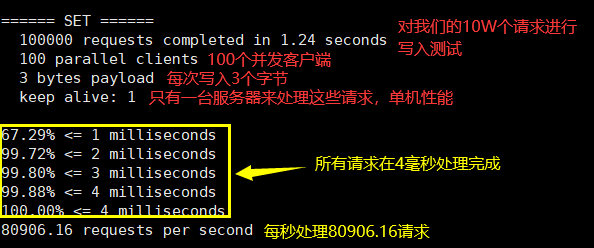
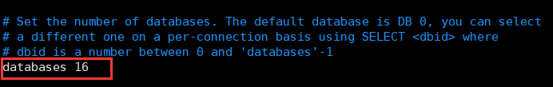
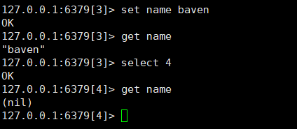
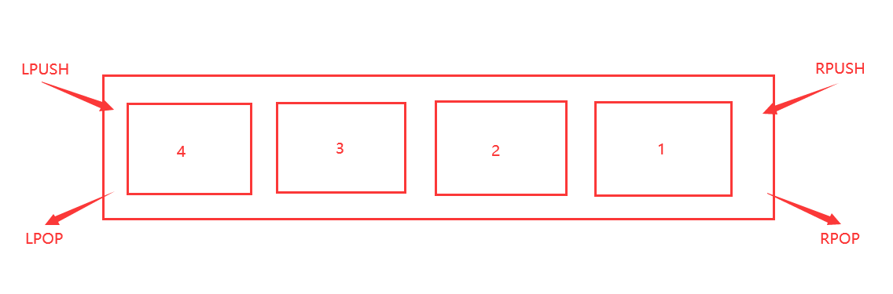
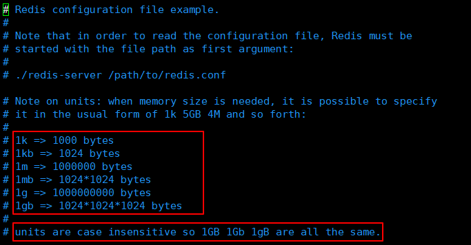
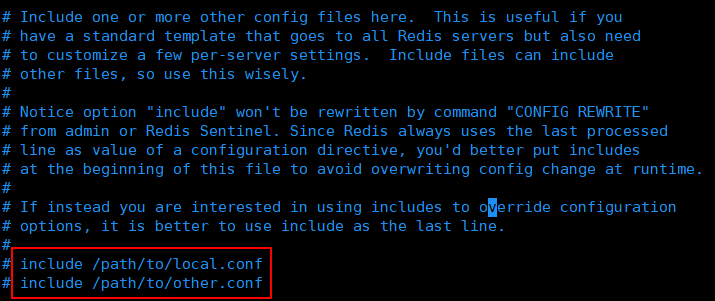

# Redis

读11W，写8W 

在 linux 系统中执行 cd /usr/local/bin 执行以下

1. redis-server myredisconfig/redis.conf
2. redis-cli -p 6379
3. ps -ef|grep redis


set name baven

get name

keys * 


## 测试性能

**redis-benchmark** 是一个压力测试工具！

官方自带的性能测试工具

redis-benchmark 命令参数

菜鸟教程：

|      |           |                                            |           |
| :--- | :-------- | :----------------------------------------- | :-------- |
| 序号 | 选项      | 描述                                       | 默认值    |
| 1    | **-h**    | 指定服务器主机名                           | 127.0.0.1 |
| 2    | **-p**    | 指定服务器端口                             | 6379      |
| 3    | **-s**    | 指定服务器 socket                          |           |
| 4    | **-c**    | 指定并发连接数                             | 50        |
| 5    | **-n**    | 指定请求数                                 | 10000     |
| 6    | **-d**    | 以字节的形式指定 SET/GET 值的数据大小      | 3         |
| 7    | **-k**    | 1=keep alive 0=reconnect                   | 1         |
| 8    | **-r**    | SET/GET/INCR 使用随机 key, SADD 使用随机值 |           |
| 9    | **-P**    | 通过管道传输 <numreq> 请求                 | 1         |
| 10   | **-q**    | 强制退出 redis。仅显示 query/sec 值        |           |
| 11   | **--csv** | 以 CSV 格式输出                            |           |
| 12   | **-l**    | 生成循环，永久执行测试                     |           |
| 13   | **-t**    | 仅运行以逗号分隔的测试命令列表。           |           |
| 14   | **-I**    | Idle 模式。仅打开 N 个 idle 连接并等待。   |           |

简单的测试：

100并发10W请求：

```bash
redis-benchmark -h localhost -p 6379 -c 100 -n 100000
```


在usr/local/bin 中执行，执行前确保redis开启

SET的情况

.


## 基础知识

redis默认有16个数据库，默认为0号

vim reids.conf

.

可以通过select进行切换

```bash
127.0.0.1:6379> select 3  	# 切换数据库
OK
127.0.0.1:6379[3]> dbsize	# 查看db大小
(integer) 0 
```

.

```bash
127.0.0.1:6379[3]> keys *
1) "name"	
```

清除当前所有数据库`flushdb`

```
127.0.0.1:6379[3]> flushdb
OK
127.0.0.1:6379[3]> keys *
(empty list or set)
```

清除全部数据库的内容`flushall`


**思考问什么redis是6379？**

只是女明星名字对应的九宫格按钮


> Redis 是单线程！

明白Redis是很快的，官方标识，Redis是基于内存操作，CPU不是Redis性能瓶颈，Redis的瓶颈是根据机器的内存和网络带宽，既然可以使用单线程来实现，就是用单线程了。

Redis 是C语言写的，官方提供的数据为10W+的QPS，完全不比同样是使用Memecache差

**Reids 为什么单线程还这么快？**

1. 误区1：高性能的服务器一定是多线程的
2. 误区2：多线程（CPU上下文会切换）一定比单线程效率高

了解CPU>内存>硬盘的速度要有所了解

核心：redis是将所有的数据全部放在内存中的，所以说使用单线程去操作效率就是最高的，多线程（CPU上下文会切换：耗时的操作！），对于内存系统来说，如果没有上下文切换，效率就是最高的。多次读写都是在一个CPU上的，在内存情况下，这个就是最佳的方案。


## 五大数据类型

> 官网文档

Redis 是一个开源（BSD许可）的，内存中的数据结构存储系统，它可以用作数据库、缓存和消息中间件。 它支持多种类型的数据结构，如 [字符串（strings）](http://www.redis.cn/topics/data-types-intro.html#strings)， [散列（hashes）](http://www.redis.cn/topics/data-types-intro.html#hashes)， [列表（lists）](http://www.redis.cn/topics/data-types-intro.html#lists)， [集合（sets）](http://www.redis.cn/topics/data-types-intro.html#sets)， [有序集合（sorted sets）](http://www.redis.cn/topics/data-types-intro.html#sorted-sets) 与范围查询， [bitmaps](http://www.redis.cn/topics/data-types-intro.html#bitmaps)， [hyperloglogs](http://www.redis.cn/topics/data-types-intro.html#hyperloglogs) 和 [地理空间（geospatial）](http://www.redis.cn/commands/geoadd.html) 索引半径查询。 Redis 内置了 [复制（replication）](http://www.redis.cn/topics/replication.html)，[LUA脚本（Lua scripting）](http://www.redis.cn/commands/eval.html)， [LRU驱动事件（LRU eviction）](http://www.redis.cn/topics/lru-cache.html)，[事务（transactions）](http://www.redis.cn/topics/transactions.html) 和不同级别的 [磁盘持久化（persistence）](http://www.redis.cn/topics/persistence.html)， 并通过 [Redis哨兵（Sentinel）](http://www.redis.cn/topics/sentinel.html)和自动 [分区（Cluster）](http://www.redis.cn/topics/cluster-tutorial.html)提供高可用性（high availability）。


> 我们现在讲解的所有命令，一定要全部记住。后面使用SpringBoot，Jedis，所有方法就是这些命令

### Reids-Key

标记废除`expire `

查看当前key的剩余时间`ttl name`

```bash
> EXPIRE name 10 	# 单位是秒，10秒后过期
```

判断是否存在`exist`

```bash
> EXIST name
(integer)1 			# 存在1，不存在0
```

移除key`del`

移动key`move`

```bash
> move name 2 		# 移动到db2
> del name			# 移除name
```

查看key的类型`type`


如果遇到不会的，可直接看官网的帮助文档


### String

`append`追加

`strlen`长度

自增`incr`

自减`decr`

```bash
> set views 0
> incr views 		# 为1
> decr views		# 为0
```

增加步长

`incrby`

`decrby`

```bash
> set views 0
> incrby views 10		# 为10
> decrby views 10		# 为0
```

---

字符串范围`getrange`

```bash
> GETRANGE key 0 3		# 获取范围0-3的字符
> GETRANGE key 0 -1		# 获取全部的值
```

替换`setrange`

```bash
> SETRANGE key 1 xx		# 从下标1开始替换
```

---

`setex`创建值，设置过期时间

`setnx`如果不存在就设置

---

批量设置

批量键值`mset`

批量取值`mget`

```bash
> MSET k1 v1 k2 v2 k3 v3
> MGET k1 k3
```

其中操作是原子型的

`msetnx`不存在就设置

```bash
> MSET k1 v1 k4 v4 		# 按道理来说因该是前面k1的创建失败，而k4创建成功。但是原子型原因，都不成功
```

---

设置对象

```bash
> set user:1 {name:baven, age:3}			# 设置一个user:1对象，值为json字符来保存一个对象。
```

另一种方式

```bash
> mset user:1:name baven user:1:age 3		# 这里的key是一个巧妙地设置： user:{id}:{filed}
```

```bash
127.0.0.1:6379> set user:1 {name:baven,age:3}
OK
127.0.0.1:6379> get user:1
"{name:baven,age:3}"
127.0.0.1:6379> mset user:1:name baven user:1:age 3
OK
127.0.0.1:6379> mget user:1:name user:1:age
1) "baven"
2) "3"
```

---

`getset`先get再set

```bash
127.0.0.1:6379> getset db redis
(nil)					# 因为之前没有db这样的键，所以返回的是空，然后把redis存进去
127.0.0.1:6379> get db
"redis"				
127.0.0.1:6379> getset db mongodb
"redis"					# 这次有这个键了，返回的是之前存进去的值，但是被设置成了mongodb
127.0.0.1:6379> get db
"mongodb"
```


### List

基本的数据类型，列表


在redis里面，可以当作栈、队列、阻塞队列使用

所有的list命令都是`l`开头的

`lpush`  和`lrang`

```bash
127.0.0.1:6379> LPUSH list one
(integer) 1
127.0.0.1:6379> LPUSH list two
(integer) 2
127.0.0.1:6379> LPUSH list three
(integer) 3
127.0.0.1:6379> LRANGE list 0 1
1) "three"
2) "two"				# 目前是栈的样子
```

`rpush`则是右边部插入



---

移除

`lpop`和`rpop`与上面同一个道理

```bash
> LPOP list				# 都是只弹出各边第一个
> RPOP list
```

`rpoplpush`右边的值移动到一个新的list中

```bash
> RPOPLPUSH list newlist# 将右边的值移动到了newlist中
```


`lrem`精确的移除指定的值

```bash
> LREM list 1 one		# 移除list中值为one的1个值
```

---

通过下标获取值

`lindex`

```bash 
> LINDEX list 2			# 获取下标为2的值
> LINDEX list -1		# 获取最后一个
```

---

`llen`获取list的长度

---

`ltrim`截取原链表中的

```bash
> LTRIM list 0 2		# 截取0到2的值。与lrange不同，lrang是不修改，ltrim是修改
```

---

`lset`在list存在且值存在为前提，更新替换指定下标的值，否则报错

```bash
> LSET list 1 two		# 替换下标为1的值，像update更新
```

---

`linsert`可在某值的前或后插入值

```bash
> LINSERT list before one start	# 在one之前添加start
> 			   after			# 	   之后
```


> 小结

- List是一个链表，before node after ,left ,right 都可以插入

- 如果key 不存在，创建新的链表
- 如果key存在，新增内容
- 如果移除了所有值，空链表，也代表不存在
- 在两边插入改动值，效率最高。中间元素，相对来说效率会低点

消息排队，消息队列，可变为栈或者队列


### Set

集合，无序且单一

都是`s`开头

`sadd` set集合中添加元素

`smembers`  查看指定set内的所有元素

`sismember` 判断某一个值是否在set中

```bash
127.0.0.1:6379> SADD myset hello
(integer) 1
127.0.0.1:6379> SADD myset world
(integer) 1
127.0.0.1:6379> SMEMBERS
(error) ERR wrong number of arguments for 'smembers' command
127.0.0.1:6379> SMEMBERS myset
1) "world"
2) "hello"
127.0.0.1:6379> SISMEMBER myset hello
(integer) 1
```


---

`scard` 获取set中的个数值

`srem` 移除set中的指定元素

```bash
> SREM myset hello
```


---

`srandmember` 随机获取set中的一值

```bash
> SRANDMEMBER myset 		# 获取随机1个值
> SRANDMEMBER myset 2		# 随机获取2个值
```

---

`spop` 随机移除 `SPOP myset`

`smove` 移动指定的值到新set中

```bash
> SMOVE myset newset "baven" 	# 把baven从myset中移动到newset中
```

---

`sdiff` 差集：A和B的差集：A减去AB的交集

`sinter` 交集

`sunion` 并集

```bash
> SDIFF set1 set2
```


共同关注，共同爱好


### Hash

想成map集合即可	即key-Map（k-v），map中还有kv

所有的以`h`开头


`hset` 存

`hget` 取

```bash
> HSET myhash name baven	# 后两就是跟map一样，k v
> HGET myhash name			# 返回baven
```

当然也有批量存取

`hmset`和`hmget`

---

`hgetall` 获取所有的值 `HGETALL myhash`

注：弹幕说有可能会阻塞

---

`hdel` 删除hash指定的key字段，对应的value值也就是没了。

```bash
> HDEL myhash name
```

`hlen` 获取长度值

`hexists` 判断hash中指定key是否存在 `HEXISTS myhash name`

---

只获得key或value

`hkeys ` 和 `hvals` 

---

`hincrby` 和 `hdecrby` 自增自减

```bash
> HINCRBY myhash age 5
```


应用：变更的数据 user name age ，尤其是用户信息，hash更适合对象的存储，String更适合字符串存储


### Zset

有序集合，在set的基础上增加了一个值

都是`z`


`zadd`

```bash
127.0.0.1:6379> zadd zset 1 one			# 数字在API中提示的是score
(integer) 1
127.0.0.1:6379> ZADD zset 2 two 3 three
(integer) 2
127.0.0.1:6379> ZRANGE zset 0 -1
1) "one"
2) "two"
3) "three"
```

---

`zrangebyscore` 指定键排序

```bash
> ZADD age 3 baven							# 以baven为键存了3
> ZADD age 2 maimai
> ZRANGEBYSCORE age -inf +inf 				# 年龄从负无穷到正无穷排
> ZRANGEBYSCORE age -inf +inf withscores 	# 附带值
```

---

`zrem` 指定移除

```bash
> ZREM age baven 						# 移除age中的baven
```

`zcard` 获取有序集合中的个数

`zcount` 获取有序集合中指定区间中的成员数量


存取班级成绩表，工资表排序，

普通消息：1，重要消息：2 	可以带权进行判断


剩下的官方文档查看吧


## 三种特殊数据类型

### geospatial 地理位置

朋友的定位，附近的人

Redis 的 Geo 在Redis3.2 版本就有了

相关命令：

- geoadd
- geodist
- geohash
- geopos
- georadius
- georadiusbymember

> geoadd

```bash
# geoadd 添加指定的位置
# 规则：两极是无法直接添加，且一般我们直接下载城市数据，直接通过java程序一次导入
127.0.0.1:6379> geoadd chain:city 116.40 39.90 beijing
(integer) 1
127.0.0.1:6379> geoadd chain:city 121.47 31.23 shanghai
(integer) 1
127.0.0.1:6379> geoadd chain:city 106.50 29.53 chongqi
(integer) 1
127.0.0.1:6379> geoadd chain:city 114.05 22.52 shenzheng
(integer) 1
127.0.0.1:6379> geoadd chain:city 120.16 30.24 hangzhou
(integer) 1
```

> geopos

获取地址信息

```bash
> GEOPOS chain:city beijing
```

> geodist

返回两个给定位置之间的距离

单位：

- m、km、mi（英里）、ft（英尺）

```bash
> geodist chain:city beijing shanghai		# 查看北京到上海的距离
"1067378.7564"								# m
```

> georadius

以给经的经纬度为中心，找出某一半径内的元素

找附近的人

```bash
> GEORADIUS china:city 110 30 100km							# 以100 30位置为中心，100km为半径查处结果
> GEORADIUS china:city 110 30 100km withdist				# 不仅显示名字，还显示距离
> GEORADIUS china:city 110 30 100km withcoord				# 显示名字，还有经纬度
> GEORADIUS china:city 110 30 100km withdist withcoord count 1	# 上下的结合然后限制显示1条数据
```


> georadiusbymember

以指定的键为中心，查周边的位子的数据

```bash
> GEORADIUSBYMEMBER china:city beijing 100km		# 以北京为中心，以100km为半径，查找圈内的数据。
```


> geohash

该命令将返回11个字符的Geohash字符串

```bash
# 将二位的经纬度转换为以为的字符串，如果两个字符串越接近，那么距离越近
> GEOHASH china:city beijing shanghai
```


原理：GEO 底层的实现原理其实就是 Zset

所以我们也可以用zset的方法来进行一些 查看、移除 的操作 `zrange` `zrem`


### hyperloglog

**什么是基数？**（两组集合中不重复的元素，可以接收误差）

简介：

- Redis 2.8.9 版本就更新了，是数据结构
- 基数统计的算法
- 优点：占用的内存是固定，2^64^不同的元素的基数，只需要12KB内存。如果要从内存的角度来比较的话，这个Hyperloglog首选。

**网页中的UV，一个人访问多次，还算一个人**

传统的方式，set 保存用户的id，然后可以统计 set 中元素数量作为标准判断。
这个方式如果保存大量的用户id，就会比较麻烦，我们的目的是为了计数，为不是保存用户id

0.81%错误率，统计UV任务，可以忽略不计。

`pfadd` 例 `PFADD mykey 1 2 3 4 5 6` 往mykey中添加数字或字母等

`pfcount` 例 `PFCOUNT mykey` 返回个数

`pfmerge` 例 `PFMERGE mykey2 mykey mykey1` mykey和mykey1合并到mykey2，**去重**

允许容错，那么一定可以使用 Hyperloglog


### bitmaps

**按位存储**

统计用户信息，活跃，不活跃，登入，未登入，打卡，365天打卡。

Bitmap 位图，数据结构，都是操作二进制来进行记录，就只有0 和1 两个状态

365 = 365 bit , 1字节 = 8bit，46个字节左右


打卡测试：`setbit` `getbit` `bitcount`

```bash
> SETBIT sign 0 1
> SETBIT sign 1 1				# 记录1，2天打卡信息

> GETBIT sign 1					# 获取1的键下的值
(integer) 1

> BITCOUNT sign 
(integer) 2						# 返回位1的总个数
```


## 事务

Redis不保证原子型

Redis 事务本质：一组命令的集合，一个事务的所有命令会被序列化，在事务执行过程中，会按照执行顺序执行。

一次性，顺序性，排他性，执行一系列的命令

```bash
---
set1
set2
set3
---
转换成：
------ 队列 set1 set2 set3  执行------
```

Redis事务没有隔离级别的概念

所有的命令在事物中，并没有直接被执行，只有发起执行命令的时候才会执行


redis的事务：

- 开启事务 `multi`
- 命令入队 
- 执行事务 `exec`

> 正常执行事务

```bash
127.0.0.1:6379> MULTI 			# 开启事务
OK
127.0.0.1:6379> set k1 v1		# 命令入队
QUEUED
127.0.0.1:6379> set k2 v2
QUEUED
127.0.0.1:6379> mget k1 k2
QUEUED
127.0.0.1:6379> EXEC			# 执行事务
1) OK
2) OK
3) 1) "v1"
   2) "v2"
```

> 放弃事务

命令输入一半，不想使用事务了用 `discard` ，放弃后，事务中的命令都不执行

> 编译型异常（代码有问题，命令有问题）

事务中所有的命令都不会执行

像是有 `getset age` 后面没有些参数的时候，就发生错误，都不执行 


> 运行时异常（ 1/0 ），如果事务队列中存在语法性问题

比如给字符串`incr age` 类似


> 监控 watch （面试常问）

悲观锁：

- 很悲观，认为什么时候都是出问题，所以无论做什么都会加锁synchronized

乐观锁：

- 很乐观，认为什么时候都不会出问题，所以不会上锁，更新数据的时候去判断一下，在此期间是否有人修改过这个数据
  1. 获得version
  2. 更新的时候比较 version 👇


> Redis 监控测试

事务成功后，监控也就取消了

```bash
> set money 100
> watch money				# 乐观锁
> multi						# 开启事务
```

- 这时候，其他进程来操作同一个redis，修改了money原本的数值。

- 那么上部分的时候检测到后，这个事务无论怎样都会失败。

- 在上方失败后，要进行`unwatch`解锁，再重新上锁
- 重新开启事务

注意：`discard`也能解锁


## Jedis

用Java开操作redis

> Jedis 是官方推荐的 Java 连接开发工作，使用 Java 操作Redis 中间件

测试：

1. 导入对应的依赖

   ```xml
   <!--jedis-->
   <dependency>
       <groupId>redis.clients</groupId>
       <artifactId>jedis</artifactId>
       <version>3.2.0</version>
   </dependency>
   <!--fastjson-->
   <dependency>
       <groupId>com.alibaba</groupId>
       <artifactId>fastjson</artifactId>
       <version>1.2.70</version>
   </dependency>
   </dependencies>
   ```

2. 编码测试

   - 连接数据库（win中打开 redis，之后在用代码连接）
   - 操作命令
   - 断开连接

   ```java
   public class TestPing {
       public static void main(String[] args) {
           // 1. new Jedis 对象
           Jedis jedis = new Jedis("127.0.0.1",6379);
           // jedis 里面所有命令就是我们之前学的
           System.out.println(jedis.ping());			// 输出pong
       }
   }
   ```


> 创建事务


## SpringBoot整合

说明：在SpringBoot2.X之后，原来使用的Jedis 被替换为 lettuce？

jedis：采用的直连，多个线程操作的话，是不安全，如果想要避免不安全，使用jedis pool连接池解决，BIO模式

lettuce：采用netty，实例可以在多个线程中进行共享，不存在线程不安全的情况，可以减少线程数据，像NIO模式


> 整合

源码分析

```java
@Bean
@ConditionalOnMissingBean(name = "redisTemplate") // 我们可以自己定义一个redisTemplate开替换这个默认的
public RedisTemplate<Object, Object> redisTemplate(RedisConnectionFactory redisConnectionFactory)
      throws UnknownHostException {
    // 默认的都是 RedisTemplate 没有过多的配置，redis 对象都是需要序列化
    // 两个泛型都是Object Object的类型，我们后面使用需要前置转换<String, Object>
    RedisTemplate<Object, Object> template = new RedisTemplate<>();
    template.setConnectionFactory(redisConnectionFactory);
    return template;
}

@Bean
@ConditionalOnMissingBean	// 由于String是redis中最常用的的类型，所以单独提出来一个bean
public StringRedisTemplate stringRedisTemplate(RedisConnectionFactory redisConnectionFactory)
      throws UnknownHostException {
    StringRedisTemplate template = new StringRedisTemplate();
    template.setConnectionFactory(redisConnectionFactory);
    return template;
}
```


>  整合测试

1. 导入依赖

   ```xml
   <dependency>
       <groupId>org.springframework.boot</groupId>
       <artifactId>spring-boot-starter-data-redis</artifactId>
   </dependency>
   ```

   

2. 配置连接

   ```properties
   spring.redis.host=127.0.0.1
   spring.redis.port=6379
   ```

3. 测试

   ```java
   @Test
   void contextLoads() {
   
       // opsForValue  操作字符串 类似String
       // opsForList   操作List 类似List
       // opsForSet    操作Set
       // opsForHash
       // opsForGeo
       // opsForZset
       // opsForHyperLogLog
   
       // 除了基本的操作，我们常用的方法都可以直接通过redisTemplate操作，比如事务和基本的CRUD
   
       // RedisConnection connection = redisTemplate.getConnectionFactory().getConnection();
       // connection.flushDb();
       // connection.flushAll();
   
       redisTemplate.opsForValue().set("mykey", "BavenTrain");
       redisTemplate.opsForValue().get("mykey");
   }
   ```


> 自定义 RedisTemplate

```java
// 这是固定模板，直接在企业中使用
@Bean
@ConditionalOnMissingBean(name = "redisTemplate")
public RedisTemplate<String, Object> redisTemplate(RedisConnectionFactory factory) throws UnknownHostException {
    // 我们为了自己开发方便，一般直接使用<String, Object>
    RedisTemplate<String, Object> template = new RedisTemplate<String, Object>();
    template.setConnectionFactory(factory);

    // 序列化配置
    Jackson2JsonRedisSerializer objectJackson2JsonRedisSerializer = new Jackson2JsonRedisSerializer(Object.class);
    ObjectMapper om = new ObjectMapper();
    om.setVisibility(PropertyAccessor.ALL, JsonAutoDetect.Visibility.ANY);
    om.enableDefaultTyping(ObjectMapper.DefaultTyping.NON_FINAL);
    objectJackson2JsonRedisSerializer.setObjectMapper(om);
    // String 的序列化
    StringRedisSerializer stringRedisSerializer = new StringRedisSerializer();

    // key 采用String的序列化
    template.setKeySerializer(stringRedisSerializer);
    // hash的key也采用String的序列化方式
    template.setHashKeySerializer(stringRedisSerializer);
    // value序列化采用jackson
    template.setValueSerializer(objectJackson2JsonRedisSerializer);
    // hash的value也是
    template.setHashValueSerializer(objectJackson2JsonRedisSerializer);

    template.afterPropertiesSet();
    return template;
}
```


> 单元测试

```java
@Test
public void test01() throws JsonProcessingException {
    // 真实对象一般都使用json来传递对象
    User user = new User("baven", 3);
    String jsonuser = new ObjectMapper().writeValueAsString(user);
    System.out.println(jsonuser);
    redisTemplate.opsForValue().set("user", jsonuser);

    System.out.println(redisTemplate.opsForValue().get("user"));
}
```


## RedisUtils工具类

```java
package com.baven.utils;

import org.springframework.data.redis.connection.DataType;
import org.springframework.data.redis.core.Cursor;
import org.springframework.data.redis.core.ScanOptions;
import org.springframework.data.redis.core.StringRedisTemplate;
import org.springframework.data.redis.core.ZSetOperations.TypedTuple;

import java.util.Collection;
import java.util.Date;
import java.util.List;
import java.util.Map;
import java.util.Map.Entry;
import java.util.Set;
import java.util.concurrent.TimeUnit;

/**
 * Redis工具类*/
public class RedisUtil {
    private StringRedisTemplate redisTemplate;

    public void setRedisTemplate(StringRedisTemplate redisTemplate) {
        this.redisTemplate = redisTemplate;
    }

    public StringRedisTemplate getRedisTemplate() {
        return this.redisTemplate;
    }

    /** -------------------key相关操作--------------------- */

    /**
     * 删除key
     * 
     * @param key
     */
    public void delete(String key) {
        redisTemplate.delete(key);
    }

    /**
     * 批量删除key
     * 
     * @param keys
     */
    public void delete(Collection<String> keys) {
        redisTemplate.delete(keys);
    }

    /**
     * 序列化key
     * 
     * @param key
     * @return
     */
    public byte[] dump(String key) {
        return redisTemplate.dump(key);
    }

    /**
     * 是否存在key
     * 
     * @param key
     * @return
     */
    public Boolean hasKey(String key) {
        return redisTemplate.hasKey(key);
    }

    /**
     * 设置过期时间
     * 
     * @param key
     * @param timeout
     * @param unit
     * @return
     */
    public Boolean expire(String key, long timeout, TimeUnit unit) {
        return redisTemplate.expire(key, timeout, unit);
    }

    /**
     * 设置过期时间
     * 
     * @param key
     * @param date
     * @return
     */
    public Boolean expireAt(String key, Date date) {
        return redisTemplate.expireAt(key, date);
    }

    /**
     * 查找匹配的key
     * 
     * @param pattern
     * @return
     */
    public Set<String> keys(String pattern) {
        return redisTemplate.keys(pattern);
    }

    /**
     * 将当前数据库的 key 移动到给定的数据库 db 当中
     * 
     * @param key
     * @param dbIndex
     * @return
     */
    public Boolean move(String key, int dbIndex) {
        return redisTemplate.move(key, dbIndex);
    }

    /**
     * 移除 key 的过期时间，key 将持久保持
     * 
     * @param key
     * @return
     */
    public Boolean persist(String key) {
        return redisTemplate.persist(key);
    }

    /**
     * 返回 key 的剩余的过期时间
     * 
     * @param key
     * @param unit
     * @return
     */
    public Long getExpire(String key, TimeUnit unit) {
        return redisTemplate.getExpire(key, unit);
    }

    /**
     * 返回 key 的剩余的过期时间
     * 
     * @param key
     * @return
     */
    public Long getExpire(String key) {
        return redisTemplate.getExpire(key);
    }

    /**
     * 从当前数据库中随机返回一个 key
     * 
     * @return
     */
    public String randomKey() {
        return redisTemplate.randomKey();
    }

    /**
     * 修改 key 的名称
     * 
     * @param oldKey
     * @param newKey
     */
    public void rename(String oldKey, String newKey) {
        redisTemplate.rename(oldKey, newKey);
    }

    /**
     * 仅当 newkey 不存在时，将 oldKey 改名为 newkey
     * 
     * @param oldKey
     * @param newKey
     * @return
     */
    public Boolean renameIfAbsent(String oldKey, String newKey) {
        return redisTemplate.renameIfAbsent(oldKey, newKey);
    }

    /**
     * 返回 key 所储存的值的类型
     * 
     * @param key
     * @return
     */
    public DataType type(String key) {
        return redisTemplate.type(key);
    }

    /** -------------------string相关操作--------------------- */

    /**
     * 设置指定 key 的值
     * @param key
     * @param value
     */
    public void set(String key, String value) {
        redisTemplate.opsForValue().set(key, value);
    }

    /**
     * 获取指定 key 的值
     * @param key
     * @return
     */
    public String get(String key) {
        return redisTemplate.opsForValue().get(key);
    }

    /**
     * 返回 key 中字符串值的子字符
     * @param key
     * @param start
     * @param end
     * @return
     */
    public String getRange(String key, long start, long end) {
        return redisTemplate.opsForValue().get(key, start, end);
    }

    /**
     * 将给定 key 的值设为 value ，并返回 key 的旧值(old value)
     * 
     * @param key
     * @param value
     * @return
     */
    public String getAndSet(String key, String value) {
        return redisTemplate.opsForValue().getAndSet(key, value);
    }

    /**
     * 对 key 所储存的字符串值，获取指定偏移量上的位(bit)
     * 
     * @param key
     * @param offset
     * @return
     */
    public Boolean getBit(String key, long offset) {
        return redisTemplate.opsForValue().getBit(key, offset);
    }

    /**
     * 批量获取
     * 
     * @param keys
     * @return
     */
    public List<String> multiGet(Collection<String> keys) {
        return redisTemplate.opsForValue().multiGet(keys);
    }

    /**
     * 设置ASCII码, 字符串'a'的ASCII码是97, 转为二进制是'01100001', 此方法是将二进制第offset位值变为value
     * 
     * @param key 位置
     * @param value
     *            值,true为1, false为0
     * @return
     */
    public boolean setBit(String key, long offset, boolean value) {
        return redisTemplate.opsForValue().setBit(key, offset, value);
    }

    /**
     * 将值 value 关联到 key ，并将 key 的过期时间设为 timeout
     * 
     * @param key
     * @param value
     * @param timeout
     *            过期时间
     * @param unit
     *            时间单位, 天:TimeUnit.DAYS 小时:TimeUnit.HOURS 分钟:TimeUnit.MINUTES
     *            秒:TimeUnit.SECONDS 毫秒:TimeUnit.MILLISECONDS
     */
    public void setEx(String key, String value, long timeout, TimeUnit unit) {
        redisTemplate.opsForValue().set(key, value, timeout, unit);
    }

    /**
     * 只有在 key 不存在时设置 key 的值
     * 
     * @param key
     * @param value
     * @return 之前已经存在返回false,不存在返回true
     */
    public boolean setIfAbsent(String key, String value) {
        return redisTemplate.opsForValue().setIfAbsent(key, value);
    }

    /**
     * 用 value 参数覆写给定 key 所储存的字符串值，从偏移量 offset 开始
     * 
     * @param key
     * @param value
     * @param offset
     *            从指定位置开始覆写
     */
    public void setRange(String key, String value, long offset) {
        redisTemplate.opsForValue().set(key, value, offset);
    }

    /**
     * 获取字符串的长度
     * 
     * @param key
     * @return
     */
    public Long size(String key) {
        return redisTemplate.opsForValue().size(key);
    }

    /**
     * 批量添加
     * 
     * @param maps
     */
    public void multiSet(Map<String, String> maps) {
        redisTemplate.opsForValue().multiSet(maps);
    }

    /**
     * 同时设置一个或多个 key-value 对，当且仅当所有给定 key 都不存在
     * 
     * @param maps
     * @return 之前已经存在返回false,不存在返回true
     */
    public boolean multiSetIfAbsent(Map<String, String> maps) {
        return redisTemplate.opsForValue().multiSetIfAbsent(maps);
    }

    /**
     * 增加(自增长), 负数则为自减
     * 
     * @param key
     * @return
     */
    public Long incrBy(String key, long increment) {
        return redisTemplate.opsForValue().increment(key, increment);
    }

    /**
     * 
     * @param key
     * @return
     */
    public Double incrByFloat(String key, double increment) {
        return redisTemplate.opsForValue().increment(key, increment);
    }

    /**
     * 追加到末尾
     * 
     * @param key
     * @param value
     * @return
     */
    public Integer append(String key, String value) {
        return redisTemplate.opsForValue().append(key, value);
    }

    /** -------------------hash相关操作------------------------- */

    /**
     * 获取存储在哈希表中指定字段的值
     * 
     * @param key
     * @param field
     * @return
     */
    public Object hGet(String key, String field) {
        return redisTemplate.opsForHash().get(key, field);
    }

    /**
     * 获取所有给定字段的值
     * 
     * @param key
     * @return
     */
    public Map<Object, Object> hGetAll(String key) {
        return redisTemplate.opsForHash().entries(key);
    }

    /**
     * 获取所有给定字段的值
     * 
     * @param key
     * @param fields
     * @return
     */
    public List<Object> hMultiGet(String key, Collection<Object> fields) {
        return redisTemplate.opsForHash().multiGet(key, fields);
    }

    public void hPut(String key, String hashKey, String value) {
        redisTemplate.opsForHash().put(key, hashKey, value);
    }

    public void hPutAll(String key, Map<String, String> maps) {
        redisTemplate.opsForHash().putAll(key, maps);
    }

    /**
     * 仅当hashKey不存在时才设置
     * 
     * @param key
     * @param hashKey
     * @param value
     * @return
     */
    public Boolean hPutIfAbsent(String key, String hashKey, String value) {
        return redisTemplate.opsForHash().putIfAbsent(key, hashKey, value);
    }

    /**
     * 删除一个或多个哈希表字段
     * 
     * @param key
     * @param fields
     * @return
     */
    public Long hDelete(String key, Object... fields) {
        return redisTemplate.opsForHash().delete(key, fields);
    }

    /**
     * 查看哈希表 key 中，指定的字段是否存在
     * 
     * @param key
     * @param field
     * @return
     */
    public boolean hExists(String key, String field) {
        return redisTemplate.opsForHash().hasKey(key, field);
    }

    /**
     * 为哈希表 key 中的指定字段的整数值加上增量 increment
     * 
     * @param key
     * @param field
     * @param increment
     * @return
     */
    public Long hIncrBy(String key, Object field, long increment) {
        return redisTemplate.opsForHash().increment(key, field, increment);
    }

    /**
     * 为哈希表 key 中的指定字段的整数值加上增量 increment
     * 
     * @param key
     * @param field
     * @param delta
     * @return
     */
    public Double hIncrByFloat(String key, Object field, double delta) {
        return redisTemplate.opsForHash().increment(key, field, delta);
    }

    /**
     * 获取所有哈希表中的字段
     * 
     * @param key
     * @return
     */
    public Set<Object> hKeys(String key) {
        return redisTemplate.opsForHash().keys(key);
    }

    /**
     * 获取哈希表中字段的数量
     * 
     * @param key
     * @return
     */
    public Long hSize(String key) {
        return redisTemplate.opsForHash().size(key);
    }

    /**
     * 获取哈希表中所有值
     * 
     * @param key
     * @return
     */
    public List<Object> hValues(String key) {
        return redisTemplate.opsForHash().values(key);
    }

    /**
     * 迭代哈希表中的键值对
     * 
     * @param key
     * @param options
     * @return
     */
    public Cursor<Entry<Object, Object>> hScan(String key, ScanOptions options) {
        return redisTemplate.opsForHash().scan(key, options);
    }

    /** ------------------------list相关操作---------------------------- */

    /**
     * 通过索引获取列表中的元素
     * 
     * @param key
     * @param index
     * @return
     */
    public String lIndex(String key, long index) {
        return redisTemplate.opsForList().index(key, index);
    }

    /**
     * 获取列表指定范围内的元素
     * 
     * @param key
     * @param start
     *            开始位置, 0是开始位置
     * @param end
     *            结束位置, -1返回所有
     * @return
     */
    public List<String> lRange(String key, long start, long end) {
        return redisTemplate.opsForList().range(key, start, end);
    }

    /**
     * 存储在list头部
     * 
     * @param key
     * @param value
     * @return
     */
    public Long lLeftPush(String key, String value) {
        return redisTemplate.opsForList().leftPush(key, value);
    }

    /**
     * 
     * @param key
     * @param value
     * @return
     */
    public Long lLeftPushAll(String key, String... value) {
        return redisTemplate.opsForList().leftPushAll(key, value);
    }

    /**
     * 
     * @param key
     * @param value
     * @return
     */
    public Long lLeftPushAll(String key, Collection<String> value) {
        return redisTemplate.opsForList().leftPushAll(key, value);
    }

    /**
     * 当list存在的时候才加入
     * 
     * @param key
     * @param value
     * @return
     */
    public Long lLeftPushIfPresent(String key, String value) {
        return redisTemplate.opsForList().leftPushIfPresent(key, value);
    }

    /**
     * 如果pivot存在,再pivot前面添加
     * 
     * @param key
     * @param pivot
     * @param value
     * @return
     */
    public Long lLeftPush(String key, String pivot, String value) {
        return redisTemplate.opsForList().leftPush(key, pivot, value);
    }

    /**
     * 
     * @param key
     * @param value
     * @return
     */
    public Long lRightPush(String key, String value) {
        return redisTemplate.opsForList().rightPush(key, value);
    }

    /**
     * 
     * @param key
     * @param value
     * @return
     */
    public Long lRightPushAll(String key, String... value) {
        return redisTemplate.opsForList().rightPushAll(key, value);
    }

    /**
     * 
     * @param key
     * @param value
     * @return
     */
    public Long lRightPushAll(String key, Collection<String> value) {
        return redisTemplate.opsForList().rightPushAll(key, value);
    }

    /**
     * 为已存在的列表添加值
     * 
     * @param key
     * @param value
     * @return
     */
    public Long lRightPushIfPresent(String key, String value) {
        return redisTemplate.opsForList().rightPushIfPresent(key, value);
    }

    /**
     * 在pivot元素的右边添加值
     * 
     * @param key
     * @param pivot
     * @param value
     * @return
     */
    public Long lRightPush(String key, String pivot, String value) {
        return redisTemplate.opsForList().rightPush(key, pivot, value);
    }

    /**
     * 通过索引设置列表元素的值
     * 
     * @param key
     * @param index
     *            位置
     * @param value
     */
    public void lSet(String key, long index, String value) {
        redisTemplate.opsForList().set(key, index, value);
    }

    /**
     * 移出并获取列表的第一个元素
     * 
     * @param key
     * @return 删除的元素
     */
    public String lLeftPop(String key) {
        return redisTemplate.opsForList().leftPop(key);
    }

    /**
     * 移出并获取列表的第一个元素， 如果列表没有元素会阻塞列表直到等待超时或发现可弹出元素为止
     * 
     * @param key
     * @param timeout
     *            等待时间
     * @param unit
     *            时间单位
     * @return
     */
    public String lBLeftPop(String key, long timeout, TimeUnit unit) {
        return redisTemplate.opsForList().leftPop(key, timeout, unit);
    }

    /**
     * 移除并获取列表最后一个元素
     * 
     * @param key
     * @return 删除的元素
     */
    public String lRightPop(String key) {
        return redisTemplate.opsForList().rightPop(key);
    }

    /**
     * 移出并获取列表的最后一个元素， 如果列表没有元素会阻塞列表直到等待超时或发现可弹出元素为止
     * 
     * @param key
     * @param timeout
     *            等待时间
     * @param unit
     *            时间单位
     * @return
     */
    public String lBRightPop(String key, long timeout, TimeUnit unit) {
        return redisTemplate.opsForList().rightPop(key, timeout, unit);
    }

    /**
     * 移除列表的最后一个元素，并将该元素添加到另一个列表并返回
     * 
     * @param sourceKey
     * @param destinationKey
     * @return
     */
    public String lRightPopAndLeftPush(String sourceKey, String destinationKey) {
        return redisTemplate.opsForList().rightPopAndLeftPush(sourceKey,
                destinationKey);
    }

    /**
     * 从列表中弹出一个值，将弹出的元素插入到另外一个列表中并返回它； 如果列表没有元素会阻塞列表直到等待超时或发现可弹出元素为止
     * 
     * @param sourceKey
     * @param destinationKey
     * @param timeout
     * @param unit
     * @return
     */
    public String lBRightPopAndLeftPush(String sourceKey, String destinationKey,
            long timeout, TimeUnit unit) {
        return redisTemplate.opsForList().rightPopAndLeftPush(sourceKey,
                destinationKey, timeout, unit);
    }

    /**
     * 删除集合中值等于value得元素
     * 
     * @param key
     * @param index
     *            index=0, 删除所有值等于value的元素; index>0, 从头部开始删除第一个值等于value的元素;
     *            index<0, 从尾部开始删除第一个值等于value的元素;
     * @param value
     * @return
     */
    public Long lRemove(String key, long index, String value) {
        return redisTemplate.opsForList().remove(key, index, value);
    }

    /**
     * 裁剪list
     * 
     * @param key
     * @param start
     * @param end
     */
    public void lTrim(String key, long start, long end) {
        redisTemplate.opsForList().trim(key, start, end);
    }

    /**
     * 获取列表长度
     * 
     * @param key
     * @return
     */
    public Long lLen(String key) {
        return redisTemplate.opsForList().size(key);
    }

    /** --------------------set相关操作-------------------------- */

    /**
     * set添加元素
     * 
     * @param key
     * @param values
     * @return
     */
    public Long sAdd(String key, String... values) {
        return redisTemplate.opsForSet().add(key, values);
    }

    /**
     * set移除元素
     * 
     * @param key
     * @param values
     * @return
     */
    public Long sRemove(String key, Object... values) {
        return redisTemplate.opsForSet().remove(key, values);
    }

    /**
     * 移除并返回集合的一个随机元素
     * 
     * @param key
     * @return
     */
    public String sPop(String key) {
        return redisTemplate.opsForSet().pop(key);
    }

    /**
     * 将元素value从一个集合移到另一个集合
     * 
     * @param key
     * @param value
     * @param destKey
     * @return
     */
    public Boolean sMove(String key, String value, String destKey) {
        return redisTemplate.opsForSet().move(key, value, destKey);
    }

    /**
     * 获取集合的大小
     * 
     * @param key
     * @return
     */
    public Long sSize(String key) {
        return redisTemplate.opsForSet().size(key);
    }

    /**
     * 判断集合是否包含value
     * 
     * @param key
     * @param value
     * @return
     */
    public Boolean sIsMember(String key, Object value) {
        return redisTemplate.opsForSet().isMember(key, value);
    }

    /**
     * 获取两个集合的交集
     * 
     * @param key
     * @param otherKey
     * @return
     */
    public Set<String> sIntersect(String key, String otherKey) {
        return redisTemplate.opsForSet().intersect(key, otherKey);
    }

    /**
     * 获取key集合与多个集合的交集
     * 
     * @param key
     * @param otherKeys
     * @return
     */
    public Set<String> sIntersect(String key, Collection<String> otherKeys) {
        return redisTemplate.opsForSet().intersect(key, otherKeys);
    }

    /**
     * key集合与otherKey集合的交集存储到destKey集合中
     * 
     * @param key
     * @param otherKey
     * @param destKey
     * @return
     */
    public Long sIntersectAndStore(String key, String otherKey, String destKey) {
        return redisTemplate.opsForSet().intersectAndStore(key, otherKey,
                destKey);
    }

    /**
     * key集合与多个集合的交集存储到destKey集合中
     * 
     * @param key
     * @param otherKeys
     * @param destKey
     * @return
     */
    public Long sIntersectAndStore(String key, Collection<String> otherKeys,
            String destKey) {
        return redisTemplate.opsForSet().intersectAndStore(key, otherKeys,
                destKey);
    }

    /**
     * 获取两个集合的并集
     * 
     * @param key
     * @param otherKeys
     * @return
     */
    public Set<String> sUnion(String key, String otherKeys) {
        return redisTemplate.opsForSet().union(key, otherKeys);
    }

    /**
     * 获取key集合与多个集合的并集
     * 
     * @param key
     * @param otherKeys
     * @return
     */
    public Set<String> sUnion(String key, Collection<String> otherKeys) {
        return redisTemplate.opsForSet().union(key, otherKeys);
    }

    /**
     * key集合与otherKey集合的并集存储到destKey中
     * 
     * @param key
     * @param otherKey
     * @param destKey
     * @return
     */
    public Long sUnionAndStore(String key, String otherKey, String destKey) {
        return redisTemplate.opsForSet().unionAndStore(key, otherKey, destKey);
    }

    /**
     * key集合与多个集合的并集存储到destKey中
     * 
     * @param key
     * @param otherKeys
     * @param destKey
     * @return
     */
    public Long sUnionAndStore(String key, Collection<String> otherKeys,
            String destKey) {
        return redisTemplate.opsForSet().unionAndStore(key, otherKeys, destKey);
    }

    /**
     * 获取两个集合的差集
     * 
     * @param key
     * @param otherKey
     * @return
     */
    public Set<String> sDifference(String key, String otherKey) {
        return redisTemplate.opsForSet().difference(key, otherKey);
    }

    /**
     * 获取key集合与多个集合的差集
     * 
     * @param key
     * @param otherKeys
     * @return
     */
    public Set<String> sDifference(String key, Collection<String> otherKeys) {
        return redisTemplate.opsForSet().difference(key, otherKeys);
    }

    /**
     * key集合与otherKey集合的差集存储到destKey中
     * 
     * @param key
     * @param otherKey
     * @param destKey
     * @return
     */
    public Long sDifference(String key, String otherKey, String destKey) {
        return redisTemplate.opsForSet().differenceAndStore(key, otherKey,
                destKey);
    }

    /**
     * key集合与多个集合的差集存储到destKey中
     * 
     * @param key
     * @param otherKeys
     * @param destKey
     * @return
     */
    public Long sDifference(String key, Collection<String> otherKeys,
            String destKey) {
        return redisTemplate.opsForSet().differenceAndStore(key, otherKeys,
                destKey);
    }

    /**
     * 获取集合所有元素
     * 
     * @param key
     * @return
     */
    public Set<String> setMembers(String key) {
        return redisTemplate.opsForSet().members(key);
    }

    /**
     * 随机获取集合中的一个元素
     * 
     * @param key
     * @return
     */
    public String sRandomMember(String key) {
        return redisTemplate.opsForSet().randomMember(key);
    }

    /**
     * 随机获取集合中count个元素
     * 
     * @param key
     * @param count
     * @return
     */
    public List<String> sRandomMembers(String key, long count) {
        return redisTemplate.opsForSet().randomMembers(key, count);
    }

    /**
     * 随机获取集合中count个元素并且去除重复的
     * 
     * @param key
     * @param count
     * @return
     */
    public Set<String> sDistinctRandomMembers(String key, long count) {
        return redisTemplate.opsForSet().distinctRandomMembers(key, count);
    }

    /**
     * 
     * @param key
     * @param options
     * @return
     */
    public Cursor<String> sScan(String key, ScanOptions options) {
        return redisTemplate.opsForSet().scan(key, options);
    }

    /**------------------zSet相关操作--------------------------------*/
    
    /**
     * 添加元素,有序集合是按照元素的score值由小到大排列
     * 
     * @param key
     * @param value
     * @param score
     * @return
     */
    public Boolean zAdd(String key, String value, double score) {
        return redisTemplate.opsForZSet().add(key, value, score);
    }

    /**
     * 
     * @param key
     * @param values
     * @return
     */
    public Long zAdd(String key, Set<TypedTuple<String>> values) {
        return redisTemplate.opsForZSet().add(key, values);
    }

    /**
     * 
     * @param key
     * @param values
     * @return
     */
    public Long zRemove(String key, Object... values) {
        return redisTemplate.opsForZSet().remove(key, values);
    }

    /**
     * 增加元素的score值，并返回增加后的值
     * 
     * @param key
     * @param value
     * @param delta
     * @return
     */
    public Double zIncrementScore(String key, String value, double delta) {
        return redisTemplate.opsForZSet().incrementScore(key, value, delta);
    }

    /**
     * 返回元素在集合的排名,有序集合是按照元素的score值由小到大排列
     * 
     * @param key
     * @param value
     * @return 0表示第一位
     */
    public Long zRank(String key, Object value) {
        return redisTemplate.opsForZSet().rank(key, value);
    }

    /**
     * 返回元素在集合的排名,按元素的score值由大到小排列
     * 
     * @param key
     * @param value
     * @return
     */
    public Long zReverseRank(String key, Object value) {
        return redisTemplate.opsForZSet().reverseRank(key, value);
    }

    /**
     * 获取集合的元素, 从小到大排序
     * 
     * @param key
     * @param start
     *            开始位置
     * @param end
     *            结束位置, -1查询所有
     * @return
     */
    public Set<String> zRange(String key, long start, long end) {
        return redisTemplate.opsForZSet().range(key, start, end);
    }

    /**
     * 获取集合元素, 并且把score值也获取
     * 
     * @param key
     * @param start
     * @param end
     * @return
     */
    public Set<TypedTuple<String>> zRangeWithScores(String key, long start,
            long end) {
        return redisTemplate.opsForZSet().rangeWithScores(key, start, end);
    }

    /**
     * 根据Score值查询集合元素
     * 
     * @param key
     * @param min
     *            最小值
     * @param max
     *            最大值
     * @return
     */
    public Set<String> zRangeByScore(String key, double min, double max) {
        return redisTemplate.opsForZSet().rangeByScore(key, min, max);
    }

    /**
     * 根据Score值查询集合元素, 从小到大排序
     * 
     * @param key
     * @param min
     *            最小值
     * @param max
     *            最大值
     * @return
     */
    public Set<TypedTuple<String>> zRangeByScoreWithScores(String key,
            double min, double max) {
        return redisTemplate.opsForZSet().rangeByScoreWithScores(key, min, max);
    }

    /**
     * 
     * @param key
     * @param min
     * @param max
     * @param start
     * @param end
     * @return
     */
    public Set<TypedTuple<String>> zRangeByScoreWithScores(String key,
            double min, double max, long start, long end) {
        return redisTemplate.opsForZSet().rangeByScoreWithScores(key, min, max,
                start, end);
    }

    /**
     * 获取集合的元素, 从大到小排序
     * 
     * @param key
     * @param start
     * @param end
     * @return
     */
    public Set<String> zReverseRange(String key, long start, long end) {
        return redisTemplate.opsForZSet().reverseRange(key, start, end);
    }

    /**
     * 获取集合的元素, 从大到小排序, 并返回score值
     * 
     * @param key
     * @param start
     * @param end
     * @return
     */
    public Set<TypedTuple<String>> zReverseRangeWithScores(String key,
            long start, long end) {
        return redisTemplate.opsForZSet().reverseRangeWithScores(key, start,
                end);
    }

    /**
     * 根据Score值查询集合元素, 从大到小排序
     * 
     * @param key
     * @param min
     * @param max
     * @return
     */
    public Set<String> zReverseRangeByScore(String key, double min,
            double max) {
        return redisTemplate.opsForZSet().reverseRangeByScore(key, min, max);
    }

    /**
     * 根据Score值查询集合元素, 从大到小排序
     * 
     * @param key
     * @param min
     * @param max
     * @return
     */
    public Set<TypedTuple<String>> zReverseRangeByScoreWithScores(
            String key, double min, double max) {
        return redisTemplate.opsForZSet().reverseRangeByScoreWithScores(key,
                min, max);
    }

    /**
     * 
     * @param key
     * @param min
     * @param max
     * @param start
     * @param end
     * @return
     */
    public Set<String> zReverseRangeByScore(String key, double min,
            double max, long start, long end) {
        return redisTemplate.opsForZSet().reverseRangeByScore(key, min, max,
                start, end);
    }

    /**
     * 根据score值获取集合元素数量
     * 
     * @param key
     * @param min
     * @param max
     * @return
     */
    public Long zCount(String key, double min, double max) {
        return redisTemplate.opsForZSet().count(key, min, max);
    }

    /**
     * 获取集合大小
     * 
     * @param key
     * @return
     */
    public Long zSize(String key) {
        return redisTemplate.opsForZSet().size(key);
    }

    /**
     * 获取集合大小
     * 
     * @param key
     * @return
     */
    public Long zZCard(String key) {
        return redisTemplate.opsForZSet().zCard(key);
    }

    /**
     * 获取集合中value元素的score值
     * 
     * @param key
     * @param value
     * @return
     */
    public Double zScore(String key, Object value) {
        return redisTemplate.opsForZSet().score(key, value);
    }

    /**
     * 移除指定索引位置的成员
     * 
     * @param key
     * @param start
     * @param end
     * @return
     */
    public Long zRemoveRange(String key, long start, long end) {
        return redisTemplate.opsForZSet().removeRange(key, start, end);
    }

    /**
     * 根据指定的score值的范围来移除成员
     * 
     * @param key
     * @param min
     * @param max
     * @return
     */
    public Long zRemoveRangeByScore(String key, double min, double max) {
        return redisTemplate.opsForZSet().removeRangeByScore(key, min, max);
    }

    /**
     * 获取key和otherKey的并集并存储在destKey中
     * 
     * @param key
     * @param otherKey
     * @param destKey
     * @return
     */
    public Long zUnionAndStore(String key, String otherKey, String destKey) {
        return redisTemplate.opsForZSet().unionAndStore(key, otherKey, destKey);
    }

    /**
     * 
     * @param key
     * @param otherKeys
     * @param destKey
     * @return
     */
    public Long zUnionAndStore(String key, Collection<String> otherKeys,
            String destKey) {
        return redisTemplate.opsForZSet()
                .unionAndStore(key, otherKeys, destKey);
    }

    /**
     * 交集
     * 
     * @param key
     * @param otherKey
     * @param destKey
     * @return
     */
    public Long zIntersectAndStore(String key, String otherKey,
            String destKey) {
        return redisTemplate.opsForZSet().intersectAndStore(key, otherKey,
                destKey);
    }

    /**
     * 交集
     * 
     * @param key
     * @param otherKeys
     * @param destKey
     * @return
     */
    public Long zIntersectAndStore(String key, Collection<String> otherKeys,
            String destKey) {
        return redisTemplate.opsForZSet().intersectAndStore(key, otherKeys,
                destKey);
    }

    /**
     * 
     * @param key
     * @param options
     * @return
     */
    public Cursor<TypedTuple<String>> zScan(String key, ScanOptions options) {
        return redisTemplate.opsForZSet().scan(key, options);
    }
}
```


## Redis.config详解

> 单位

.

1. 配置文件， unit单位 对大小写不敏感。

> 包含

.

就好比学习的Spring，improt


> 网络

```bash
bind 127.0.0.1			# 绑定的ip
protected-mode yes		# 保护模式
port 6379				# 端口设置
```

> 通用 GENERAL

```bash
daemonize yes			# 默认为no需要手动设置为yes

pidfile /var/run/redis_6379.pid # 如果以后台的方式运行，我们就需要指定一个pid文件。

# 日志
# Specify the server verbosity level.
# This can be one of:
# debug (a lot of information, useful for development/testing)
# verbose (many rarely useful info, but not a mess like the debug level)
# notice (moderately verbose, what you want in production probably)
# warning (only very important / critical messages are logged)
loglevel notice

logfile ""				# 日志的文件位置名
databases 16			# 数据库的数量，默认为16
always-show-logo yes	# 是否总是显示log

```

> 快照 SNAPSHOTTING 

持久化，在规定的时间内，执行了多少次操作，则会持久化到文件 .rdb .aof

redis 是内存数据库，如果没有持久化，那么数据断电即失

```bash
# 如果900s内，如果至少有一个1 key进行了，我们及时进行持久化操作
save 900 1
# 如果300s内，如果至少有一个10 key进行了，我们及时进行持久化操作
save 300 10
# 如果60s内，如果至少有一个10000 key进行了，我们及时进行持久化操作
save 60 10000
# 但我们之后学习持久化，会自己定义这个测试


stop-writes-on-bgsave-error yes		# 持久化如果出错，是否还需要继续工作
rdbcompression yes					# 是否压缩 rdb 文件，需要消耗cpu资源
rdbchecksum yes						# 保存 rdb文件的时候，进行错误检查校验
dir ./								# rdb 文件保存的目录
```


> REPLICATION 复制，在主从复制的时候讲解

找到` replicaof <masterip><masterport>`


> 安全 SECURITY

```bash
requirepass foobared				# 可在这设置 redis 密码

# 或者命令
> config get requirepass			# 获取密码
> config set requirepass "123123"  	# 设置密码
> auth 123123						# 使用密码进行登入
```


> 限制 CLIENTS

```bash
maxclients 10000					# 设置最大客户端数
```


> 内存管理 MEMORY MANAGEMENT

```bash
maxmemory <bytes> 					# redis 配置最大内存的内存容量
maxmemory-policy noeviction			# 内存到达上限之后的处理策略
# 六种策略
# volatile-lru：只对设置了过期时间的key进行LRU（默认值） 
# allkeys-lru ： 删除lru算法的key   
# volatile-random：随机删除即将过期key   
# allkeys-random：随机删除   
# volatile-ttl ： 删除即将过期的   
# noeviction ： 永不过期，返回错误
```


> APPEND ONLY MODE 模式  aof配置

```bash
appendonly no						# 默认是不开启aof模式的，默认使用rdb方式持久化，大部分所有的情况下，rdb完全够用
appendfilename "appendonly.aof"		# 持久化的文件的名字

# appendfsync always				# 每次修改都会 sync，消耗性能
appendfsync everysec				# 每秒执行一次 sync，可能会丢失这1s的数据
# appendfsync no					# 不执行 sync，这个时候操作系统自己同步数据，速度最快
```


## Redis持久化

Redis 是内存数据库，如果不降内存中的数据库状态保存到磁盘，那么一旦服务器进程退出，服务器中的数据库状态也会消失。所以 Redis 提供了持久化功能


### RDB（ Reids DataBase ）

> 什么是RDB

在指定的时间间隔内将内存中的数据集快照写入磁盘，也就是行话讲的Snapshot快照，它恢复时是将快照文件直接读到内存里。

Redis会单独创建（ fork ）一个子进程来进行持久化，会将数据写入到一个临时文件中，待持久化过程都结束了，在用这个临时文件替换上次持久化好的文件。整个过程中，主进程是不进行任何IO操作。这就确保了极高的性能。如果需要进行大规模数据的恢复，且对于数据恢复的完整性不是非常敏感，那RDB方式要比AOF方式更加高效。RDB的缺点是最后一次持久化后的数据可能丢失。默认的就是RDB，一般情况下不需要修改。

==rdb保存的文件是 dump.rdb==


> 触发机制

1. save的规则满足的情况下，会自动触发rdb规则

   ```bash
   # 如果900s内，如果至少有一个1 key进行了，我们及时进行持久化操作
   save 900 1
   # 如果300s内，如果至少有一个10 key进行了，我们及时进行持久化操作
   save 300 10
   # 如果60s内，如果至少有一个10000 key进行了，我们及时进行持久化操作
   save 60 10000
   ```

2. 执行 flushall 命令，也会触发rdb规则

3. 退出redis，也会产生

备份就自动生成一个dump.rdb

> 如何恢复rdb文件

1. 只需要将rdb文件放在redis启动目录就可以，redis启动的时候会自动检查dump.rdb 恢复启动的数据

2. 查看需要存在的位置

   ```bash
   127.0.0.1:6379> config get dir
   1) "dir"
   2) "/usr/local/bin"				 	# 如果在这个目录下存在 dump.rdb 文件，启动就会自动恢复其中的数据
   ```

其实几乎默认的配置就够用了，但是还是需要继续学习。

优点：

- 适合大规模的数据恢复
- 对数据的完整性要求不高

缺点：

- 需要一定的时间间隔进程操作，如果redis意外宕机了，最后一次的修改数据就没有了
- fork 进程的时候，会占用一定内存空间


### AOF（ Append Only File ）

将我们的所有命令都记录下来，像history，恢复的时候就把这个文件全部再执行一遍


以日志的形式来记录每个写操作，将Redis执行过的所有指令记录下来（读操作不记录），只需追加文件但不可以修改文件，redis启动之初会读取该文件重新构建数据，换言之，redis重启的话就根据日志文件的内容将写指令从前到后执行一次已完成数据的恢复工作。

==Aof保存的是 Appendonly.aof文件==

> append

在配置文件APPEND ONLY MODE中可进行配置，可往上查看。

只需要将 appendonly 改为 yes 就开启 aof 了。

如果这个 aof 文件有错误，那么这时候 redis 就启动不起来了，我们需要修复这个aof文件

redis 给我们提供了一个工具，`redis-check-aof --fix`

```BASH
> redis-check-aof --fix appendonly.aof		# 修理文件
```


优点：

- 每一次修改都同步，文件完整性都会更加好
- 每秒同步一次，可能会丢失一秒数据
- 从不同步，效率最高

缺点：

- 相对于数据文件来说，aof远远大于 rdb，修复速度也比 rdb慢
- Aof 运行效率也要比rdb 慢，所以我们redis默认的配置就是rdb持久化


> 重写机制

在配置文件中可以看到，如果 aof 文件大于 64m，那么就会fork 一个新的进程来讲我们的文件进行重写

```bash
auto-aof-rewrite-percentage 100
auto-aof-rewrite-min-size 64mb
```


**扩展：**

1. RDB 持久化方式能够在指定的时间间隔内对你的数据进行快照存储
2. AOF 持久化方式记录每次对服务器些的操作，当服务器重启的时候会再重新执行这些命令来恢复原始的数据，AOF命令已Redis 协议追加保存每次写的操作到文件末尾，Redis 还能对AOF 文件进行后台重写，是的AOF文件的体积不至于过大。
3. ==只做缓存，如果只希望自己的数据在服务器运行的时候存在，也可以不是用任何持久化==
4. 同时开启两种持久化方式
   - redis重启的时候会优先载入AOF文件来恢复原始的数据，应为在通常情况下AOF文件保存的数据集要比RDB文件保存的数据集要完整。
   - RED 的数据不实时，同时使用两者服务器重启也只找AOF文件，那为何不只使用AOF呢？个人认为RDB更佳合适用于备份数据库（AOF在不断变化不好备份），快速重启，而且不会有AOF可能潜在的Bug，留着作为一个万一手段。
5. 性能建议
   - 因为RDB文件只用作后备用途，建议只在Slave上持久化RDB文件，而且只要15分备份一次就够了，只保留 save 900 1 这条规则。
   - 如果Enable AOF，好处实在最恶劣情况下也只会丢失不超过过两秒数据，启动脚本较简单只load自己的AOF文件就可以了，代价一是带来了持续的IO，二是AOF rewrite 的最后讲rewrite 过程中产生的新数据写到新文件造成的阻塞几乎是不可避免的。只要硬盘许可，应该尽量减少 AOF rewrite 的频率，AOF重写的基础大小默认值64M太小了，可以设置到5G以上，默认超过原大小100%大小重写可以改到适当的数值。
   - 如果不Enable AOF，仅靠 Master-Slave Repllcation 实现高可用性也可以，能省掉一大笔IO，也减少了rewrite时带来的系统波动。代价是如果Master/Slave 同时倒掉，会丢失十分钟的数据，启动脚本也要比较两个 Master/Slave 中的 RDB 文件，载入较新的那个，微博就是这个架构。


## Redis发布订阅

（pub/sub）是一种==消息通信模式==：发送者（pub）发送信息，订阅者（sub）接收信息。

Redis 客户端可以订阅任意数量的频道。

订阅/发布消息图：

1、消息发送者，2、频道，3、消息订阅者


> 命令

| 序号 | 命令及描述                                                   |
| :--- | :----------------------------------------------------------- |
| 1    | PSUBSCRIBE pattern [pattern ...\]订阅一个或多个符合给定模式的频道。 |
| 2    | PUBSUB subcommand [argument [argument ...\]]查看订阅与发布系统状态。 |
| 3    | PUBLISH channel message将信息发送到指定的频道。              |
| 4    | PUNSUBSCRIBE [pattern [pattern ...\]] 退订所有给定模式的频道。 |
| 5    | SUBSCRIBE channel [channel ...\] 订阅给定的一个或多个频道的信息。 |
| 6    | UNSUBSCRIBE [channel [channel ...\]] 指退订给定的频道。      |


## Redis主从复制

一个主人三个服从

主从复制，是指将一台Redis服务器的数据，复制到其他的Redis服务器。前者称为主节点（mster/leader），后者称为从节点（slave/follower）；==数据的复制是单向的，只能由主节点到从节点==。Master以写为主，Slave以读为主。

==默认情况下，每台Redis服务器都是住节点==；且一个主节点可以有多个从节点（或没有从节点），但一个从节点只能有一个主节点。

主从复制的作用主要包括：

1. 数据冗余：主从复制是想了数据的热备份，是持久化之外的一种数据冗余方式。
2. 故障恢复：当主节点出现问题时，可以由从节点提供服务，实现快速的故障恢复；实现上是一种服务的冗余。
3. 负载均衡：在主从复制的基础上，配合读写分离，可以由主节点提供写服务，由从节点提供读服务（即写Reids数据时应用连接主节点，读Reids数据时应用连接从节点），分担服务器负载；尤其是在写少读多的场景下，通过多个从节点分担读负载，可以大大提高Reids服务器的并发量。
4. 高可用（集群）基石：除了上述作用以外，主从复制还是哨兵和集群能够实施的基础，因此说主从复制是Reids高可用的基础。


一般来说，要将Reids运行于工程项目中，只是用一台Redis是万万不能的，原因如下：

1. 从结构上，单个Reids服务器会发生单点故障，并且一台服务器需要处理所有的请求负载，压力较大；
2. 从容量上，单个Reids服务器内存容量有限，就算一台Redis服务器内存容量为256G，也不能将所有内存用作Reids存储内存，一般来说，==单台Redis最大使用内存不应该超过20G==，有超过就立马切换成集群。

电商网站上的商品，一般都是一次上传，无数次浏览的，说专业点就是“读多写少”；


主从复制，读写分离！80%的情况下都是在进行都读操作，减缓服务器的压力，架构中经常用。最少一主二从。

只要在公司中，主从复制就是必须要使用的，因为在真实的项目中不可能单机使用Reids。


### 环境配置

只配置从库，不用配置主库，Redis默认本身就是一个主库。

可进入到redis通过命令查看到

```bash
> info replication			# 查看当前库的信息
```

然后进行测试环境：

1. 将myconfig文件下的redis.conf文件复制三份改名redis79.conf、redis80.conf、redis81.conf
2. pid
3. 修改文件中的端口以及logfile “对应端口”
4. dbfilename dump6381.rdb

### 一主二从

==每一台默认都是主机==，开始配置

一般情况下，只用配置从机就好了，认老大

一主（79）二从（80，81）

```bash
> SLAVEOF 127.0.0.1 6379	 	# 认127.0.0.1下的端口6379
```

然后在查看

```bash
> info replication			# 查看当前库的信息
```

就可以看多出来的信息

但这样的命令配置是暂时的，真实的从主配置应该在配置文件中配置，将永久

在配置文件中找到` replicaof <masterip><masterport>`即可，再次打开查看也还是从


>  细节

主机可以写，从机不能写只能读。图中也说明，主机专门负责写入，从机负责读

主机中的所有信息和数据，都会自动被从机保存，从机能读到主机的信息。但在从机输入信息，会出错.

所以主节点崩了，那么从节点中还有信息

测试：

- 主机断开丽娜姐，从机依旧连接到主机的，但是没有写操作，这个时候，主机如果回来了，从机依旧可以直接获取到主机写信息。
- 如果是从机掉线，那么再次登入就成了主机，就无法在从原主机上获取数据。如果再次通过命令连接，就会再次从主机更新数据。

> 复制原理

Slave 启动成功连接到 master 后会发送一个sync命令

Master 接到命令，启动后台的存盘进程，同时收集所有接收到的用于修改数据集命令，在后台进程执行后毕业之后，master将传送整个数据文件到slave，并完成一次完全同步。

全量复制：而slave服务在接收到数据库文件数据后，将其存盘并加载到内存中。

增量复制：Master继续将新的所有收集到的修改命令一次传给slave，完成同步，但是只要是重新连接master，一次完全同步（全量复制）将被自动执行


> 多层链路

上一个Master链接下一个Slave

这时候也可以完成我们的主从复制

如果其中一个老大宕机了，那么在中间的从机可以通过命令`Slaveof no one` 将自己设置为老大主机


## 哨兵模式

（自动选老大）

谋权篡位自动版，能够后台监控主机是否故障，如果故障了根据投票数==自动将从库装为主库==

哨兵模式是一种特殊的模式，首先Reids提供了哨兵的命令，哨兵是一个独立的进程，作为进程，他会独立运行。其原理是**哨兵通过发送命令，等待Redis服务器响应，从而监控运行的多个Redis实例。**


## Redis缓存穿透和雪崩


