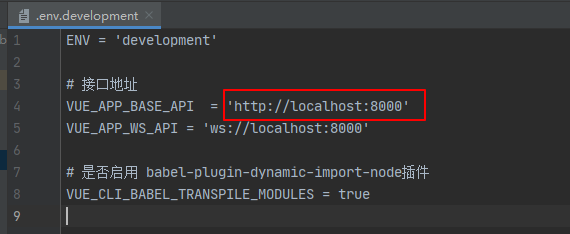

## 1、下载开源项目

cmd位置到下载地方，使用git clone 下载项目。

下载完成，先不要着急运行。

**观察：**

1. 项目用了哪些技术（Springboot，Vue，Redis，...）
2. 是否有数据库
3. 你的环境是否配置了项目使用的技术（java，Maven，npm，nodejs，redis，.....）

## 2、运行起来是第一步

1. 创建对应的数据库，执行sql
2. 前端npm install 然后在 npm run dev
3. 后端项目--导入跑起来

只要发现Swagger，那么跑起来的第一步就是先进入Swagger-ui页面，应为这里里面都是接口

进而查看配置文件，门口人端口，有哪些配置，需要改为自己的项目和环境地址。

前端就是安装依赖，启动测试运行，看接口是否正常。

## 3、前后端分离项目固定套路

1. 从前端开始分析。打开控制台，点一个接口，分析调用关系

2. 前后端端口调用不一致，前端8013  后端8000

   - 封装了接口请求  ajax   axios  ，利用request封装

   - 在前端找到配置

     在前端文件中找到`.env.development`文件，打开可发现里面配置对应后端地址8000

     

   - 前后端分离项目的重点：找到接口的调用关系

   - Springboot提供服务，前端调用接口数据，Vue负责渲染页面

   - 通过抓取前端的请求，找到后端对应的接口

   - Controller--Service--Dao 一套下去

   - 现在从前到后可以进行分析了，但是如何渲染到视图上的呢？

     - Vue标准套路

   - 如果现在自己的项目或者要学习一个模块，将这个模块独立抽取出来即可。用删除法

